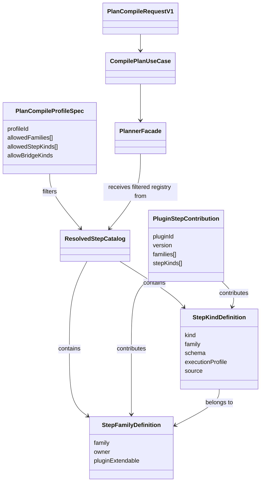
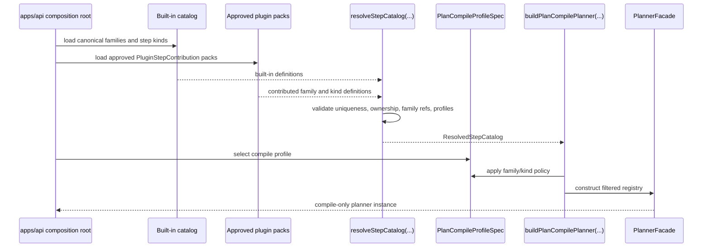
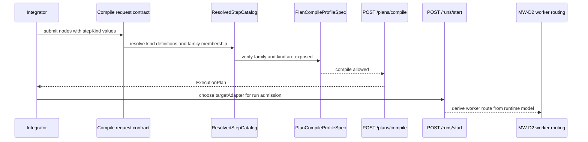
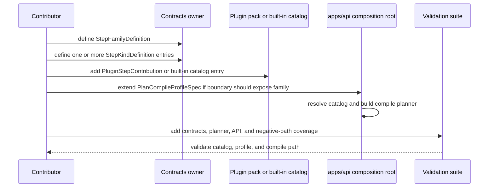

# Plan Compile Catalog Extension Technical Manual

## Purpose

This manual defines the target-state technical model for extending the plan
compile boundary with new step families, new step kinds, and plugin-backed
catalog contributions.
This guide uses `plan compile` as the active ubiquitous language for the
compile-only boundary. Older `MW-D1` proposal and review artifacts may still
say `external compile`; treat that as historical wording, not the active
ownership model.

Temporal is the only implemented workflow provider. A future provider requires
an ADR, a real adapter, capability conformance, production composition, and
documentation evidence before it can become an active `targetAdapter`.

Use this guide when the change affects any of the following:

- the canonical family taxonomy
- the canonical step-kind catalog
- the plan compile profile
- plugin-owned step-family or step-kind contributions

This guide complements
[How To Add A New StepKind](how-to-add-step-kind-20260406.md). That guide
remains the focused protocol for adding a new kind. This manual explains the
broader family and catalog model that the new kind must fit into.

For C4, DDD, ports, roots, aggregates, and target compile-path architecture,
use
[Plan Compile Target Architecture Technical Manual](plan-compile-target-architecture-technical-manual-20260417.md).

## Governing sources

- `AGENTS.md`
- `docs/guides/ai-work-protocol.md`
- `docs/adr/ADR-0034-bounded-context-boundaries-and-communication-rules.md`
- `docs/adr/ADR-0035-planner-public-contract-evolution-protocol.md`
- `docs/planning/proposals/mandatory/runtime-and-contracts/mw-d1-external-plan-definition-sdk-api-plan-20260417.md`
- `docs/guides/how-to-add-step-kind-20260406.md`

## Target-state note

This is a target-state manual for `MW-D1`.

Parts of the catalog and plugin model are still a design target rather than
fully shipped code. Treat this document as the canonical extension design for
new family work. Do not treat it as proof that every mechanism described here
already exists in production code.

## Design goals

- fail closed for unknown families and step kinds
- group step kinds by explicit family instead of naming convention
- keep one contract authority for plan compile
- allow plugin contribution without allowing arbitrary runtime-local strings
- keep schemas, validators, and handlers in code, not in free-form JSON

## Canonical objects

| Object                   | Responsibility                                                             | Proposed owner                                        | Must not become                                             |
| ------------------------ | -------------------------------------------------------------------------- | ----------------------------------------------------- | ----------------------------------------------------------- |
| `StepFamilyDefinition`   | declare canonical family identity, owner, and extension policy             | `@dvt/contracts` or approved plugin contribution pack | an implicit naming convention                               |
| `StepKindDefinition`     | declare canonical step kind, family, schema, and execution profile         | `@dvt/contracts` or approved plugin contribution pack | a route-local `kind -> schema` map                          |
| `PluginStepContribution` | contribute plugin-owned families and step kinds through one typed contract | plugin package using the shared contribution contract | a second contract authority or dynamic runtime escape hatch |
| `ResolvedStepCatalog`    | represent the merged, validated catalog used by compile composition        | `apps/api` composition root                           | an ad hoc mutable registry                                  |
| `PlanCompileProfileSpec` | declare which families and kinds one compile boundary exposes              | `apps/api` composition root                           | free-form JSON with embedded schemas or handlers            |
| `CompilePlanUseCase`     | orchestrate compile-only behavior once the planner is built                | `apps/api` application layer                          | a config-driven behavior script                             |

## Ownership line

| Concern                     | Form                     | Owner                             | Rule                                                        |
| --------------------------- | ------------------------ | --------------------------------- | ----------------------------------------------------------- |
| request and response shape  | contract                 | `@dvt/contracts`                  | caller-visible semantics live here                          |
| compile-only orchestration  | code                     | `apps/api` application service    | behavior stays in code                                      |
| family and kind definitions | governed catalog entries | contracts or approved plugin pack | definitions stay typed and reviewable                       |
| boundary selection policy   | typed profile spec       | `apps/api` composition root       | policy is typed configuration, not transport logic          |
| deploy-time enablement      | config                   | environment or host config        | config may choose predeclared profiles or plugin packs only |

## Semantic axes

Multi-workflow design stays coherent only if these decisions remain separate.

| Axis            | Meaning                                  | Decided by                            | Example                                                  | Must not be confused with |
| --------------- | ---------------------------------------- | ------------------------------------- | -------------------------------------------------------- | ------------------------- |
| `stepKind`      | semantic meaning of one node             | graph contract plus canonical catalog | `DBT_MODEL`, `LOAD_OBJECT_FILE_TO_POSTGRES`, `SPARK_JOB` | runtime provider          |
| `family`        | taxonomy grouping for step kinds         | canonical catalog                     | `dbt`, `object_file_load`, `spark`                       | handler implementation    |
| `targetAdapter` | runtime provider selected for start-run  | run admission contract                | `temporal`                                               | node semantics            |
| `workerRoute`   | deployment or task-queue destination     | runtime routing model                 | `dbt-worker`, `spark-worker`                             | compile policy            |
| `pluginPack`    | source of contributed families and kinds | approved plugin contribution pack     | `acme-spark-plugin`                                      | contract authority        |

Working rule:

- use `stepKind` to say what the node is
- use `family` to group related kinds
- use `targetAdapter` to say where the run is orchestrated
- use `workerRoute` later to say where the step is executed

`workerRoute` belongs to `MW-D2`, not to the compile contract.

## Object relationship diagram



## Sequence: resolve the compile catalog



## Sequence: semantic decisions across compile and run



This is the key distinction:

- compile determines whether the graph is accepted as a definition
- start-run determines which runtime provider is selected
- runtime routing later determines which worker image or task queue executes the step

## Sequence: add a new family



## Extension protocol

### 1. Decide the extension type

Choose one path first:

- new step kind in an existing family
- new family with one or more new step kinds
- plugin-owned contribution to an existing or new family
- compile profile change only, with no new family or kind

Do not start by editing route code or inline allowlists.

### 2. Define or select the family

For an existing family:

- reference the canonical `family` id explicitly from the new kind

For a new family:

- create one `StepFamilyDefinition`
- declare owner, description, and whether plugin extension is allowed
- keep the family id stable and reviewable

Every step kind must belong to exactly one family.

### 3. Define the step kinds

For each new kind:

- create one `StepKindDefinition`
- reference the owning family explicitly
- attach schema validation
- attach execution profile metadata
- declare whether the source is built-in or plugin-contributed

Do not infer family membership from naming.

### 4. Package the contribution

For built-ins:

- place the family and kind definitions in the canonical built-in catalog

For plugin-owned contributions:

- publish one typed `PluginStepContribution`
- keep the contribution pack declarative
- expose family and kind definitions through the shared contract shape

Do not let plugins register arbitrary runtime strings outside the contribution
contract.

### 5. Resolve the catalog in composition

The application composition root must:

- load the built-in catalog
- load approved plugin contribution packs
- resolve them into one `ResolvedStepCatalog`
- reject duplicate families, duplicate kinds, orphan kinds, or incomplete
  execution profiles

The resolved catalog is the only catalog the plan compile planner may use.

### 6. Extend the compile profile

If the plan compile boundary should expose the new family or kind:

- update `PlanCompileProfileSpec`
- prefer family-level selection when the whole family is intended
- use kind-level selection only when the boundary intentionally exposes a subset

The compile profile is the policy seam. The route and use case must not carry
raw policy literals.

Implementation rule:

- build the compile planner registry from `allowedStepKinds` only
- do not compose plan compile with `createDefaultStepTypeRegistry(...)`
  because that re-introduces unrelated built-in kinds into the boundary

### 7. Add validation and negative paths

Required coverage:

- family reference is valid
- duplicate family id rejects
- duplicate step kind rejects
- orphan kind rejects
- unsupported adapter profile rejects
- compile profile cannot expose unknown family or kind
- compile route still rejects legacy ingress fields

### 8. Update documentation and planning

When the slice changes active planning posture:

- update the relevant proposal or closeout
- update the linked lane YAML task entry
- regenerate planning-derived views
- sync docs indexes

## What may live in configuration

Allowed in typed configuration:

- profile id selection
- allowed family ids
- allowed step kind ids
- enablement of already-approved plugin packs

Not allowed in free-form configuration:

- schema definitions
- step handlers
- planner behavior semantics
- arbitrary new family ids or step kinds
- route-owned allowlists

Put differently:

- contracts define shape
- code defines behavior
- typed profile specs define boundary policy
- config may only enable or disable predeclared policy artifacts

## Observability extension rule

`PlannerObservabilitySchema` is extension-friendly (`catchall`).

Compile envelope mapping therefore must preserve custom observability keys and
must not reduce payloads to only `tags` and `extra`.

## Illustrative typed profile example

Illustrative shape:

```ts
const planCompileProfile: PlanCompileProfileSpec = {
  profileId: 'plan-compile-v1',
  allowedFamilies: ['object_file_load', 'spark'],
  allowedStepKinds: ['LOAD_OBJECT_FILE_TO_POSTGRES', 'SPARK_JOB'],
  allowBridgeKinds: false,
};
```

This is acceptable because it selects from the resolved catalog.

This would not be acceptable if it attempted to embed schema objects, handler
functions, or arbitrary unreviewed family ids directly from free-form config.

## Worked example: distinguish object-file loading from `SPARK_JOB`

- `LOAD_OBJECT_FILE_TO_POSTGRES` and `SPARK_JOB` are different `stepKind`
  values.
- They belong to the `object_file_load` and `spark` families.
- Either kind may still run through the same `targetAdapter`, such as
  `temporal`.
- The worker image or queue may still differ later, which is a routing concern
  owned by `MW-D2`.

So the semantic split is:

- `stepKind` says what the node means
- `family` groups that meaning
- `targetAdapter` says which runtime provider orchestrates the run
- runtime routing says where the step is executed operationally

## Worked example: add a `spark` family

1. Define `StepFamilyDefinition { family: "spark", ... }`.
2. Define `StepKindDefinition` entries such as `SPARK_JOB`.
3. Attach schema and execution profile for `SPARK_JOB`.
4. Add the family and kind through either the built-in catalog or one approved
   `PluginStepContribution`.
5. Extend `PlanCompileProfileSpec` if `/plans/compile` should expose the
   new family.
6. Add contracts, planner, and API negative-path tests.
7. Update planning docs and the closeout for the slice that introduced `spark`.

## Validation baseline

- `pnpm docs:sync`
- `pnpm exec markdownlint-cli2 "docs/guides/plan-compile-catalog-extension-technical-manual-20260417.md" --ignore-path .markdownlintignore --config .markdownlint-cli2.jsonc`
- `pnpm --filter @dvt/contracts test`
- `pnpm --filter @dvt/planner test`
- `pnpm --filter dvt-api test`
- `pnpm verify:prepush`

## Rules

- Do not create route-local or adapter-local step-kind allowlists.
- Do not infer family from step-kind naming.
- Do not use free-form JSON as the authority for schemas or handlers.
- Do not let a plugin bypass the canonical catalog model.
- Do not expose a new family on the plan compile boundary without an
  explicit profile update.
