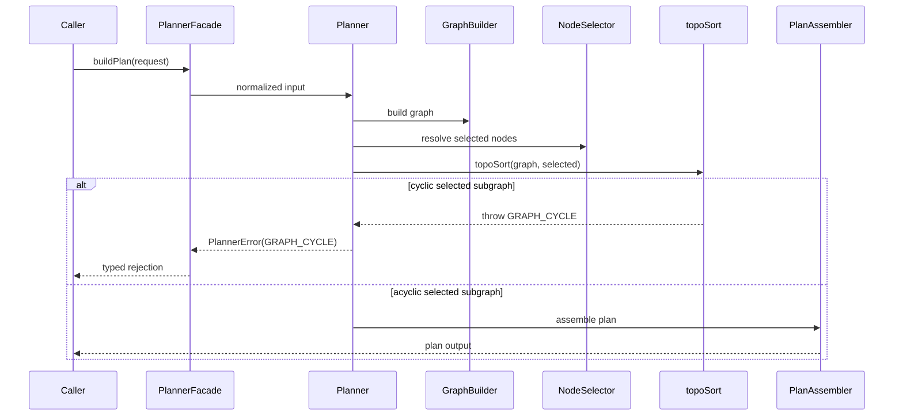
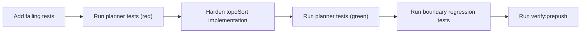

---
title: Planner cycle detection technical manual
status: Draft
owner: Planning Domain / Architecture / Docs
last_reviewed: 2026-04-04
---

# Planner Cycle Detection Technical Manual

## Purpose

Define the technical contract and implementation baseline for `AR-A9`:
deterministic fail-closed rejection on cyclic selected subgraphs using
`PlannerErrorCode.GRAPH_CYCLE`.

## Governing sources

- `AGENTS.md`
- `docs/guides/ai-work-protocol.md`
- `docs/planning/state/agent-lane-a.yaml`
- `docs/planning/reviews/architecture-and-governance/20260402-deep-architectural-review-principal-architect.md`

## Current boundary

- Public boundary: `PlannerFacade`
- Domain orchestrator: `Planner`
- Cycle authority point: `topoSort(...)`
- Canonical cycle code: `PlannerErrorCode.GRAPH_CYCLE`

## Class responsibilities

| Class/module    | Responsibility                                                                    |
| --------------- | --------------------------------------------------------------------------------- |
| `PlannerFacade` | Application boundary; input source normalization and delegation to planner domain |
| `Planner`       | Domain orchestration pipeline                                                     |
| `GraphBuilder`  | Node/dependency validation and adjacency build                                    |
| `NodeSelector`  | Effective selected subgraph expansion                                             |
| `topoSort`      | Deterministic topological ordering and cycle rejection                            |
| `PlanAssembler` | Canonical plan + hash assembly                                                    |

## Procedure



## Invariants

- `INV-A9-01`: cycle rejection code remains `GRAPH_CYCLE`.
- `INV-A9-02`: cycle check is executed on selected subgraph, not full graph by
  default.
- `INV-A9-03`: same input must produce same pass/fail outcome.
- `INV-A9-04`: no boundary API change in `PlannerFacade` for this slice.

## Negative tests (mandatory)

- two-node cycle selected -> reject `GRAPH_CYCLE`
- self-cycle selected -> reject `GRAPH_CYCLE`
- multiple disconnected cycles selected -> reject `GRAPH_CYCLE`
- disconnected graph with one selected cyclic component -> reject `GRAPH_CYCLE`
- partial selection avoiding cyclic component -> success

## TDD sequence



## Validation baseline

```bash
pnpm --filter @dvt/planner build
pnpm --filter @dvt/planner test
pnpm --filter @dvt/contracts build
pnpm verify:prepush
```

## Related docs

- `docs/guides/planner-cycle-detection-user-manual-20260404.md`
- `docs/planning/proposals/superseded/runtime-and-contracts/ar-a9-planner-cycle-fail-closed-plan-20260404.md`
- `docs/planning/closeouts/20260404-ar-a9-planner-cycle-fail-closed-closeout.md`
