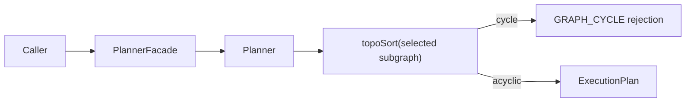

---
title: Planner cycle detection user manual
status: Draft
owner: Planning Domain / Docs
last_reviewed: 2026-04-04
---

# Planner Cycle Detection User Manual

## Audience

This guide is for API callers and integrators who submit planner inputs and
need predictable behavior when dependency cycles exist.

## What changed in AR-A9

The planner now explicitly treats cycles as a fail-closed condition on the
selected subgraph and returns the canonical typed error:

- `PlannerErrorCode.GRAPH_CYCLE`

The public contract does not introduce a new error code name.

## Operational behavior

- If selected nodes form a cycle, plan build is rejected.
- If the graph has a cyclic component outside the selected subgraph, and the
  selected subgraph is acyclic, planning is allowed.
- The failure is deterministic for the same input.

## Flow

## Common caller scenarios

### Scenario 1: selected subgraph is cyclic

Result: request fails with `GRAPH_CYCLE`.

### Scenario 2: only non-cyclic branch selected

Result: request succeeds and returns plan output.

### Scenario 3: self-cycle node selected

Result: request fails with `GRAPH_CYCLE`.

## Caller checklist

1. Ensure dependencies form a DAG for the selected run scope.
2. Use selection to isolate executable acyclic branches when needed.
3. Handle `GRAPH_CYCLE` as a user-fixable planning input error.

## Related docs

- `docs/guides/planner-cycle-detection-technical-manual-20260404.md`
- `docs/planning/proposals/superseded/runtime-and-contracts/ar-a9-planner-cycle-fail-closed-plan-20260404.md`
- `docs/architecture/components/planner/index.md`
