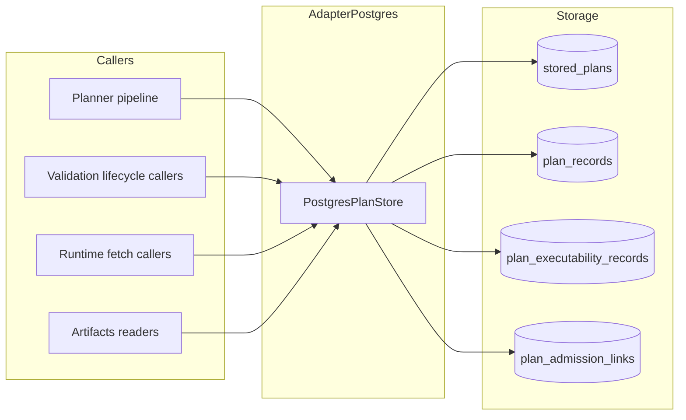
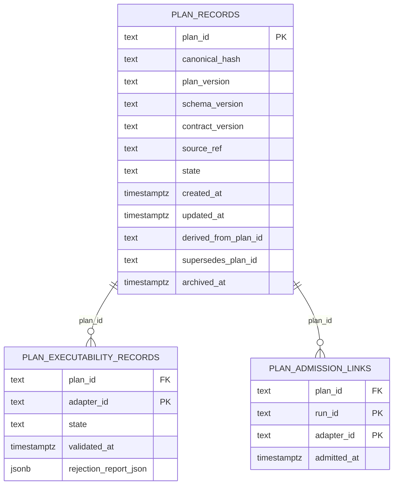
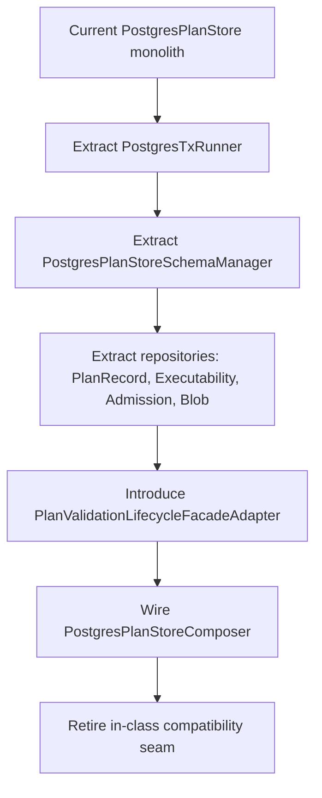

# PostgresPlanStore Technical Manual

## Purpose

This manual describes the current technical behavior of
`packages/@dvt/adapter-postgres/src/PostgresPlanStore.ts`, the active
invariants, and the remaining architectural gaps to close.

## Governing sources

- `AGENTS.md`
- `docs/adr/ADR-0034-bounded-context-boundaries-and-communication-rules.md`
- `docs/adr/ADR-0039-hexagonal-port-hardening-and-solid-remediation.md`
- `docs/adr/ADR-0043-plan-record-plan-store-and-artifacts-ownership.md`
- `docs/planning/reviews/architecture-and-governance/20260403-postgres-plan-store-srp-remediation-target.md`
- `docs/planning/reviews/architecture-and-governance/20260403-s08-postgres-plan-store-hard-qa-review.md`

## Runtime role

`PostgresPlanStore` currently implements four ports:

- `IPlanValidationLifecycleStore`
- `IPlanFetcher`
- `IPlanStoreWriter`
- `IPlanStoreReader`



## Current data model



## Write and transition behavior

### `storePlan(buildResult)`

1. Persists canonical and executable content in `stored_plans` with
   `PENDING_VALIDATION`.
2. Validates idempotent replay via `assertStoredPlanMatchesRequest`.
3. Upserts `plan_records` with guarded immutable equality checks.

### `markValid(planRef)` and `markInvalid(planRef, report)`

1. Enforce transition from `PENDING_VALIDATION` only.
2. Update `stored_plans`.
3. Do not write implicit adapter executability side effects.
   Adapter-scoped executability is recorded explicitly via
   `recordExecutability`.

### `markSuperseded(planId, supersededByPlanId)`

1. Rejects self-supersession.
2. Moves superseded row to `SUPERSEDED` only when currently `ACTIVE`.
3. Requires the superseder row to exist and be `ACTIVE`.
4. Writes lineage on superseder (`supersedes_plan_id = superseded plan`).

### `archivePlan(planId, archivedAtIso)`

- Sets `state=ARCHIVED`, `archived_at`, and updates timestamp.
- Rejects unknown plan id with `PLAN_RECORD_NOT_FOUND`.

## Read integrity behavior

- `getPlanRecordByRef(planRef)` enforces metadata match (`uri`, `planVersion`,
  `schemaVersion`) and throws `PLAN_REF_MISMATCH` on drift.
- `toPlanExecutabilityRecord` is strict:
  - `VALID` without `validated_at` throws.
  - `INVALID` without `validated_at` or `rejection_report_json` throws.
  - No fabricated fallback records are emitted.

## Known open architectural gaps

1. Lineage FK integrity remains partially soft:
   `derived_from_plan_id` and `supersedes_plan_id` are not FK-constrained.
2. Class decomposition target (schema manager, repositories, lifecycle facade,
   composer, tx runner split) is not complete.
3. Integration-heavy test paths still rely on `DVT_PG_INTEGRATION=1`.

## Validation and diagnostics

Recommended local validation for this slice:

```bash
pnpm --filter @dvt/adapter-postgres test
pnpm --filter @dvt/adapter-postgres build
pnpm verify:prepush
```

If validating integration-only scenarios, set:

```bash
$env:DVT_PG_INTEGRATION='1'
pnpm --filter @dvt/adapter-postgres test
```

## Target decomposition roadmap


