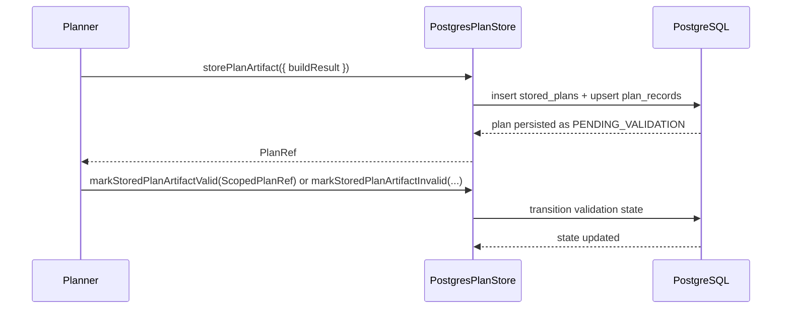
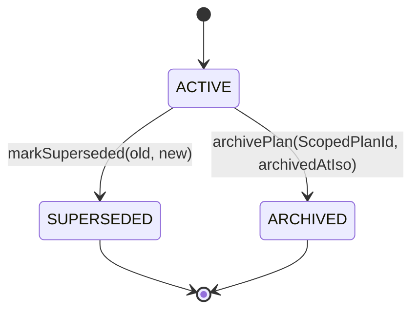
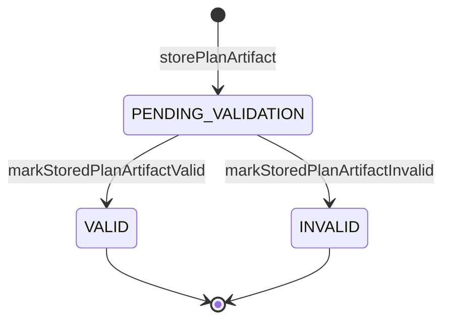

# PostgresPlanStore User Manual

## Who this is for

This guide is for developers and operators who need to use or verify the
Postgres-backed plan store behavior in day-to-day work.

## What the component provides

- Persist plan artifacts (`storePlanArtifact`)
- Transition validation state (`markStoredPlanArtifactValid`,
  `markStoredPlanArtifactInvalid`)
- Persist artifacts-domain records (`createPlanRecord`, `recordExecutability`,
  `markAdmitted`, `markSuperseded`, `archivePlan`)
- Read artifacts-domain records (`getPlanRecord`, `getPlanRecordByRef`,
  `listExecutabilityByAdapter`, `getAdmissionLinks`, `getSupersession`)
- Fetch executable bytes (`fetchStoredPlanArtifact`,
  `fetchStoredPlanArtifactForValidation`)

## Typical usage flow



## Operational commands

Initialize schema and compatibility backfill:

```bash
await store.migrate()
```

Close pool when done:

```bash
await store.close()
```

Run local checks before pushing:

```bash
pnpm --filter @dvt/adapter-postgres test -- PostgresPlanStore.invariants.unit.test.ts
pnpm --filter @dvt/adapter-postgres test
pnpm --filter @dvt/adapter-postgres build
pnpm verify:prepush
```

Run integration-focused tests:

```bash
$env:DVT_PG_INTEGRATION='1'
pnpm --filter @dvt/adapter-postgres test
```

## Error semantics you should expect

- `PLAN_STORE_CONFLICT:*` when idempotent `storePlanArtifact` replay does not match
  existing stored payload.
- `PLAN_RECORD_ALREADY_EXISTS:*` when `createPlanRecord` is called for an
  existing `planId`.
- `PLAN_REF_MISMATCH:*` when `getPlanRecordByRef` metadata does not align with
  persisted record.
- `PLAN_EXECUTABILITY_ROW_INVALID:*` when persisted executability rows violate
  state-required fields.
- `PLAN_RECORD_SUPERSEDER_NOT_ACTIVE_OR_NOT_FOUND:*` when superseder target is
  missing or non-active.

## Behavior reference by state



Validation lifecycle in `stored_plans`:



## Current limitations to keep in mind

1. No open S08 architectural limitations remain; `DVT_PG_INTEGRATION=1` is now
   only for optional real-DB conformance tests.

## Safe usage checklist

1. Run `migrate()` before first write in a new environment.
2. Treat `PLAN_*_MISMATCH` and `PLAN_*_CONFLICT` errors as data-integrity
   signals, not transient noise.
3. Use `getPlanRecordByRef` when you need metadata integrity checks, not just
   id lookup.
4. Keep integration tests enabled in CI for supersession and no-happy-path
   invariants.
