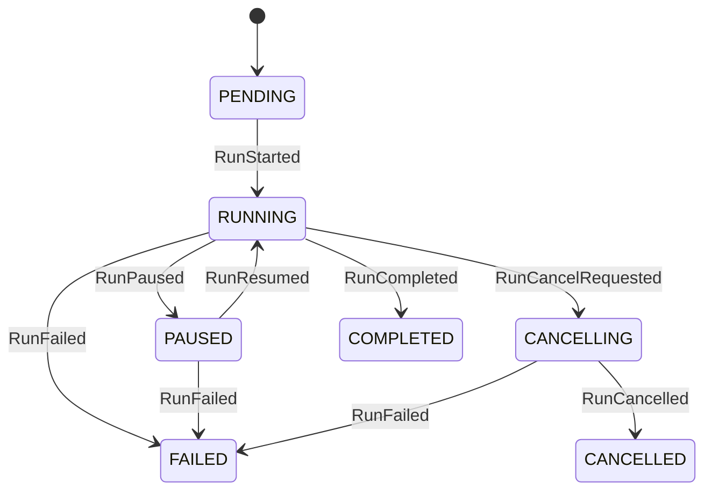
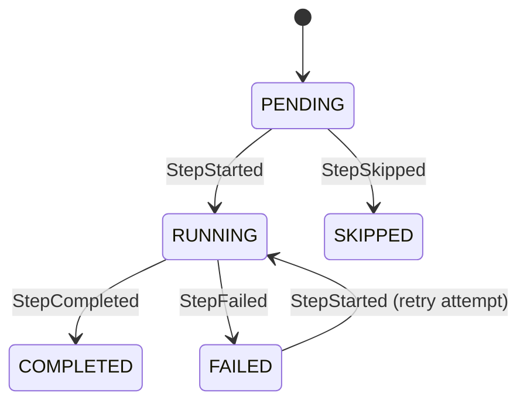
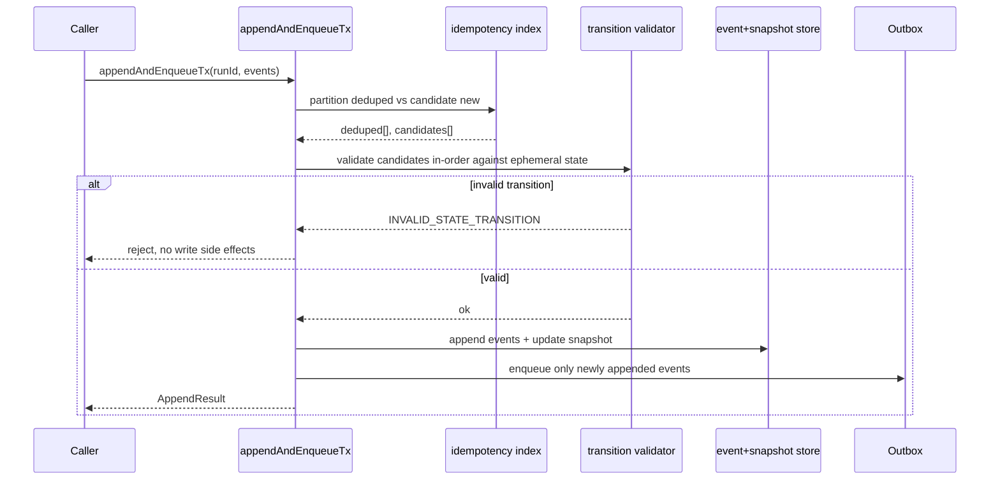

# Run-status write-boundary technical manual

## Purpose

Define the canonical transition rules enforced at event append boundary so
invalid sequences are rejected before persistence.

## Scope

Applies to all `appendAndEnqueueTx` implementations:

- `InMemoryRunStateStore`
- `InMemoryTxStore`
- `PostgresRunStateCoordinator` append path (through event repository + snapshot)

## Run-level model

Note: `CANCELLING` is a derived substatus (`cancelling=true`), not a persisted
`WorkflowSnapshot.status` value.

Write-boundary rejection rules:

- `RunPaused` only valid from `RUNNING`.
- `RunResumed` only valid from `PAUSED`.
- `RunCancelled` only valid when run is in cancellation-intent state.
- terminal states (`COMPLETED`, `FAILED`, `CANCELLED`) reject mutating events.

### Signal pre-check guard

For signal-derived lifecycle events (`PAUSE`/`RESUME`), runtime performs a
transition pre-check against current snapshot/event history before calling the
provider adapter signal endpoint. This prevents external side effects when the
transition is already illegal (`INVALID_STATE_TRANSITION` fail-fast).

## Step-attempt model

Write-boundary rejection rules:

- `StepCompleted` only valid from `RUNNING`.
- `StepFailed` only valid from `RUNNING`.
- `StepSkipped` only valid from `PENDING`.
- terminal step states (`COMPLETED`, `SKIPPED`) reject subsequent step events.

## Append pipeline

## TDD strategy

1. add red tests for illegal transitions in `@dvt/run-domain`.
2. add red tests in in-memory store append invariants.
3. add red integration tests in adapter-postgres append path.
4. implement minimal logic to pass all red tests.
5. keep regression coverage for dedupe replay behavior.
