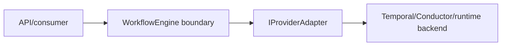

# WorkflowEngine user manual v1

## Audience

This guide is for operators, integrators, and API consumers who need to run
workflows through the engine boundary without reading engine internals.

## What the engine does vs what adapters do

Engine responsibilities:

- validates lifecycle admission rules
- enforces DVT execution semantics and tenant boundaries
- orchestrates lifecycle commands (`startRun`, `cancelRun`, `signal`)
- reads deterministic status from persisted execution state
- optionally enriches status with provider data

Adapter responsibilities:

- execute calls against provider runtimes
- map provider runtime details to engine contracts
- expose runtime capabilities to admission checks

## Core boundary objects

### `PlanRef`

`PlanRef` is the execution identity reference to an immutable plan artifact.
The engine and adapter use it to bind execution to plan identity (id, version,
hash, and URI).

### `runExecutionContextRef`

`runExecutionContextRef` is a run-scoped immutable reference to execution
context needed for one run (for example, plugin-related artifact refs). It is
validated on the start-run admission path and must align with tenant/project/
environment, plan identity, and target adapter.

## Lifecycle operations

### `startRun`

What caller provides:

- `PlanRef`
- run context (`tenantId`, `projectId`, `environmentId`, `runId`,
  `targetAdapter`, optional `runExecutionContextRef`)

What DVT owns:

- admission policy checks
- intent-log crash consistency
- provider dispatch orchestration
- bootstrap state/event persistence

### `getRunStatus`

Returns deterministic status from persisted state (snapshot/events). It does
not require provider status calls.

### `cancelRun`

Validates access and forwards cancellation to the selected provider adapter
through engine policy and timeout controls.

### `signal`

Validates access and forwards a typed signal to provider adapter. The engine may
persist signal request or audit facts, but realized lifecycle events remain
runtime-owned.

## Communication model with provider runtimes

Engine does not execute provider-specific SDK logic directly. It communicates
through `IProviderAdapter`, so runtime coupling remains behind adapter ports.

## Why a run can be valid but still rejected

A run can pass contract shape checks and still be rejected at admission due to
runtime constraints:

- adapter not registered for target provider
- capability mismatch with `RunExecutionPolicy.requiresCapabilities`
- `runExecutionContextRef` provenance mismatch
- access policy denial
- rate-limit policy rejection

## Deterministic vs intentionally non-deterministic behavior

Deterministic:

- event-sourced status reconstruction
- lifecycle invariants
- scheduler release-order contract for ready steps

Intentionally non-deterministic:

- worker claim winner under concurrency
- wall-clock timing differences for independent runnable steps

The invariant is outcome equivalence under valid claim variance, not fixed
worker affinity.

## Common failure modes and troubleshooting

1. `adapter not registered`
   - check provider adapter wiring in composition root
2. `capability mismatch`
   - compare plan required capabilities with adapter-reported capabilities
3. `run_execution_context rejection`
   - validate `runExecutionContextRef` alignment with context and plan identity
4. `tenant access denied`
   - verify caller scope and policy source
5. `signal not implemented`
   - check adapter signal support and engine signal mapping policy
6. `status divergence concern`
   - compare deterministic `getRunStatus` and enriched `enrichRunStatus` outputs

## Operational checks

Recommended checks before blaming runtime:

1. verify composition-root adapter map
2. verify state and intent store connectivity
3. verify run context and `PlanRef` identity fields
4. verify `runExecutionContextRef` resolver wiring if used
5. verify provider runtime reachability and timeouts

## Related documents

- `docs/architecture/engine/workflow-engine-subsystem-context.md`
- `docs/architecture/engine/workflow-engine-target-architecture.v1.md`
- `docs/architecture/engine/contracts/engine/SchedulerReleaseAndClaimSemantics.v1.md`
