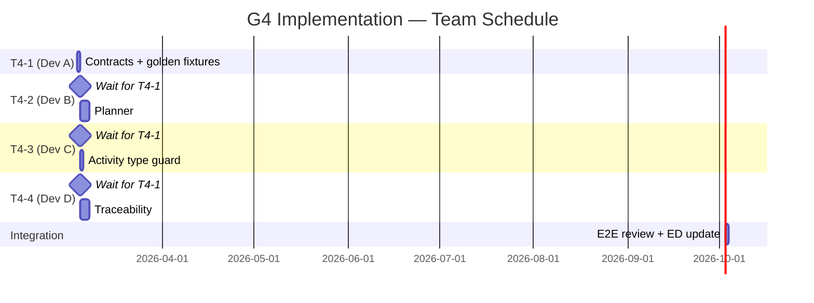

# G4 — compiledCodeRef: Task Specification for Development Team

**Status**: Ready for development
**Date**: 2026-03-04
**PM**: Project Lead
**ADR**: [ADR-0032](../docs/adr/ADR-0032-compiledcoderef-ownership.md)
**Feature branch**: `feat/g4-compiled-code-ref`

---

## Executive summary

Add a content-addressable reference (`compiledCodeRef`) to the `StepStarted` event payload that points to the compiled SQL blob in object storage (S3/MinIO). This enables the traceability service to construct `SqlJobFacet` for OpenLineage/Marquez.

**What is NOT changing**: the run execution path, the event log schema version, existing event types, Postgres tables. This is an additive, optional field — zero breaking changes.

---

## Dependency and sequencing



**Rule**: T4-2, T4-3, T4-4 start from the `feat/g4-compiled-code-ref` branch **after T4-1 is merged into it** (not into `main` — use the feature branch). Each developer works in their own package directory and there are zero file conflicts.

---

## Codebase context (read before starting)

| Concept              | Location                                                                     |
| -------------------- | ---------------------------------------------------------------------------- |
| Event contracts      | `packages/@dvt/contracts/src/engine/IRunStateStore.v1.ts`                    |
| Planner entry point  | `packages/@dvt/planner/src/domain/Planner.ts` — `buildPlan()`                |
| Step factory         | `packages/@dvt/planner/src/domain/stepFactory/dbtStepFactory.ts`             |
| Planner types        | `packages/@dvt/planner/src/domain/types.ts` — `ExecutionStepV2`, `GraphNode` |
| Activity             | `packages/@dvt/adapter-temporal/src/activities/stepActivities.ts`            |
| Traceability service | `packages/@dvt/traceability-service/src/service.ts`                          |

**Critical constraint for T4-2**: `Planner.buildPlan()` is a **pure deterministic function** (same input → same `planId` across runtimes). It MUST NOT contain I/O. The compiled code enrichment MUST be implemented as a separate post-step called **after** `buildPlan()` returns.

---

## T4-1 — `@dvt/contracts` — CompiledCodeRef type + golden fixtures

**Owner**: Dev A
**Estimated effort**: ~4h
**Branches off**: `main`
**All other tasks depend on this**

### Context

`IRunStateStore.v1.ts` already defines `EventInput.payload` as `Record<string, unknown>`. We are adding a new exported interface `CompiledCodeRef` that other packages will import as a type.

### Subtasks

#### ST-1.1 — Add `CompiledCodeRef` interface

**File**: `packages/@dvt/contracts/src/engine/IRunStateStore.v1.ts`

Add after the existing type exports (do not change any existing types):

```typescript
/**
 * Content-addressable reference to a compiled SQL artifact stored in object storage.
 * Attached to StepStarted.payload for DBT_MODEL and DBT_TEST step kinds.
 *
 * Design: ADR-0032 — Option A (reference in StepStarted.payload)
 * Pattern: Content-Addressable Storage (CAS) with SHA-256 as key.
 *
 * INV-CCREF-001: sha256 MUST be the SHA-256 hex digest of the blob at storageUri.
 * INV-CCREF-003: Field is OPTIONAL. Absent = not an error. Consumers must fail-open.
 * INV-CCREF-006: Event log stores ONLY this reference, never the SQL text.
 * INV-CCREF-007: file:// is ONLY valid in local dev; prohibited in NODE_ENV=production.
 */
export interface CompiledCodeRef {
  /** SHA-256 hex digest of the compiled SQL bytes (content-addressable key). */
  sha256: string;
  /** Object storage URI: s3://<bucket>/<key> | gs://<bucket>/<key> | file://<path> (dev only) */
  storageUri: string;
  /** Size of the compiled SQL blob in bytes. */
  sizeBytes: number;
  /** Character encoding. MUST be 'utf-8'. Default: 'utf-8'. */
  encoding?: 'utf-8';
}
```

#### ST-1.2 — Export `CompiledCodeRef` from package index

**File**: `packages/@dvt/contracts/src/index.ts` (or wherever the package re-exports)

Verify that `CompiledCodeRef` is reachable via `import type { CompiledCodeRef } from '@dvt/contracts'`. If the package index doesn't re-export from `IRunStateStore.v1.ts`, add the re-export.

#### ST-1.3 — Golden fixture: `StepStarted` WITH `compiledCodeRef`

**File**: `packages/@dvt/contracts/test/contracts/StepStarted-with-compiledCodeRef.golden.json` (create)

```json
{
  "eventId": "evt-test-001",
  "eventType": "StepStarted",
  "runId": "run-test-001",
  "stepId": "model.my_project.orders",
  "tenantId": "tenant-test",
  "projectId": "proj-test",
  "environmentId": "env-test",
  "planId": "plan-abc123",
  "planVersion": "1.0.0",
  "engineAttemptId": 1,
  "logicalAttemptId": 1,
  "idempotencyKey": "idem-001",
  "emittedAt": "2026-03-04T10:00:00.000Z",
  "payload": {
    "compiledCodeRef": {
      "sha256": "e3b0c44298fc1c149afbf4c8996fb92427ae41e4649b934ca495991b7852b855",
      "storageUri": "s3://dvt-compiled-sql/tenant-test/e3b0c44298fc1c149afbf4c8996fb92427ae41e4649b934ca495991b7852b855",
      "sizeBytes": 1024,
      "encoding": "utf-8"
    }
  }
}
```

#### ST-1.4 — Golden fixture: `StepStarted` WITHOUT `compiledCodeRef`

**File**: `packages/@dvt/contracts/test/contracts/StepStarted-without-compiledCodeRef.golden.json` (create)

Same shape as ST-1.3 but `payload` is `{}` or omitted. Documents that absence is valid.

#### ST-1.5 — Verify build passes

```bash
pnpm --filter @dvt/contracts build
pnpm --filter @dvt/contracts test
```

### Definition of Done — T4-1

- [ ] `CompiledCodeRef` interface is in `IRunStateStore.v1.ts` with all 4 fields and JSDoc referencing ADR-0032 invariants
- [ ] `CompiledCodeRef` is importable via `import type { CompiledCodeRef } from '@dvt/contracts'`
- [ ] Both golden fixtures exist and are valid JSON
- [ ] `pnpm --filter @dvt/contracts build` exits 0
- [ ] `pnpm --filter @dvt/contracts test` exits 0 (or `--passWithNoTests`)
- [ ] `tsc --noEmit` clean (no TS errors introduced)
- [ ] PR opened against `feat/g4-compiled-code-ref`, not `main`
- [ ] PR description references ADR-0032 and lists the 3 files changed

---

## T4-2 — `@dvt/planner` — Compiled code enrichment step

**Owner**: Dev B
**Estimated effort**: ~3 days
**Branches off**: `feat/g4-compiled-code-ref` (after T4-1 merged)
**New npm dependency**: `@aws-sdk/client-s3` (add to `packages/@dvt/planner/package.json`)

### Context

`Planner.buildPlan()` is pure and deterministic — it MUST remain so. The compiled code attachment is implemented as a **separate enrichment function** that runs after `buildPlan()`. The caller (CLI, orchestrator, or test harness) is responsible for calling both in sequence.

The `dbtStepFactory` currently sets `stepTypeConfig` from `policyConfig`. The enrichment function will merge `compiledCodeRef` into `stepTypeConfig` for steps that have `compiled_code` in the run results.

The planner does NOT currently read `run_results.json`. The compiled code map must be provided as input to the enrichment function.

### Subtasks

#### ST-2.1 — `ICompiledCodeStorage` port

**File**: `packages/@dvt/planner/src/ports/ICompiledCodeStorage.ts` (create)

```typescript
/**
 * Write-side port for compiled SQL blob storage.
 * Design: ADR-0032 §5.2 — hexagonal port, swapped via DI.
 *
 * Implementations:
 *  - S3CompiledCodeStorage (production)
 *  - MinioCompiledCodeStorage (CI)
 *  - FileSystemCompiledCodeStorage (local dev — file:// URIs)
 *  - InMemoryCompiledCodeStorage (unit tests)
 *  - NoopCompiledCodeStorage (tests that don't verify upload)
 */
export interface ICompiledCodeStorage {
  /**
   * Upload compiled SQL blob. Returns the canonical storageUri.
   * MUST be idempotent: uploading the same sha256 twice MUST be safe (PUT with same key).
   * MUST NOT throw if the blob already exists.
   */
  upload(sha256: string, content: Buffer): Promise<string /* storageUri */>;
}
```

#### ST-2.2 — SHA-256 utility

**File**: `packages/@dvt/planner/src/compiledCode/sha256.ts` (create)

```typescript
import { createHash } from 'node:crypto';

/** Computes SHA-256 hex digest of a Buffer. No external dependency. */
export function computeSha256(content: Buffer): string {
  return createHash('sha256').update(content).digest('hex');
}
```

#### ST-2.3 — `ICompiledCodeStorage` implementations

**Files to create**:

- `packages/@dvt/planner/src/compiledCode/adapters/S3CompiledCodeStorage.ts`
  - Uses `@aws-sdk/client-s3` `PutObjectCommand`
  - Object key = `sha256` (content-addressable, dedup automatic)
  - Returns `s3://<bucket>/<sha256>`
  - Startup guard: if `storageUri` scheme would be `file://`, throw if `NODE_ENV === 'production'` (INV-CCREF-007)

- `packages/@dvt/planner/src/compiledCode/adapters/MinioCompiledCodeStorage.ts`
  - Same as S3 but with `endpoint` and `forcePathStyle: true` from config
  - Returns `s3://<bucket>/<sha256>` (same scheme — MinIO is S3-compatible)

- `packages/@dvt/planner/src/compiledCode/adapters/FileSystemCompiledCodeStorage.ts`
  - Uses `node:fs/promises` `writeFile`
  - Validates `NODE_ENV !== 'production'` at construction — throws `Error('file:// storage is prohibited in production')` if violated (INV-CCREF-007)
  - Returns `file://<dir>/<sha256>`

- `packages/@dvt/planner/src/compiledCode/adapters/InMemoryCompiledCodeStorage.ts`
  - `Map<string, Buffer>` — for unit tests, no I/O
  - Returns `mem://<sha256>`
  - Export the backing `Map` so `InMemoryCompiledCodeReader` in T4-4 can share it

- `packages/@dvt/planner/src/compiledCode/adapters/NoopCompiledCodeStorage.ts`
  - `upload()` resolves immediately with `noop://<sha256>`
  - For tests that don't care about upload behaviour

#### ST-2.4 — `attachCompiledCodeRefs()` enrichment function

**File**: `packages/@dvt/planner/src/compiledCode/attachCompiledCodeRefs.ts` (create)

This is the main function. It takes a built plan and a map of `nodeId → compiled_code` (from `run_results.json`) and enriches each step's `stepTypeConfig` with a `compiledCodeRef`.

```typescript
import type { ExecutionPlanV2 } from '../domain/types.js';
import type { ICompiledCodeStorage } from '../ports/ICompiledCodeStorage.js';
import type { CompiledCodeRef } from '@dvt/contracts';
import { computeSha256 } from './sha256.js';

export interface AttachCompiledCodeRefsOptions {
  /** Map of stepId/nodeId → compiled SQL string (from run_results.json). */
  compiledCodeByNodeId: ReadonlyMap<string, string>;
  storage: ICompiledCodeStorage;
  /**
   * Per-invocation dedup cache: sha256 → storageUri.
   * Pass a new Map() per buildPlan invocation.
   * Same SQL in multiple steps uploads only once.
   */
  uploadCache?: Map<string, string>;
}

/**
 * Enriches ExecutionPlan steps with compiledCodeRef references.
 *
 * MUST be called AFTER Planner.buildPlan() — this function performs I/O
 * and MUST NOT be called inside the deterministic buildPlan() context.
 *
 * Steps without a matching entry in compiledCodeByNodeId are left unchanged.
 * Upload failures are caught and logged — the step is left without compiledCodeRef (fail-open).
 *
 * Returns a new plan object (does not mutate the input plan).
 */
export async function attachCompiledCodeRefs(
  plan: ExecutionPlanV2,
  options: AttachCompiledCodeRefsOptions
): Promise<ExecutionPlanV2>;
```

**Implementation notes**:

- Upload all steps in parallel (use `Promise.all` or `p-map` with concurrency=10)
- Use `uploadCache` (defaulting to a new `Map` if not provided) to skip re-uploads for identical sha256
- On upload error: log `dvt.planner.compiled_code_upload_failed_total` metric, omit `compiledCodeRef` for that step (do NOT throw — fail-open)
- Return a new `ExecutionPlanV2` with updated `steps` array (pure function on the output, no mutation of original)

#### ST-2.5 — Unit tests

**Files**:

- `packages/@dvt/planner/test/compiledCode/sha256.test.ts`
  - Same SQL string → same sha256 (deterministic)
  - Empty string → known sha256
- `packages/@dvt/planner/test/compiledCode/attachCompiledCodeRefs.test.ts`
  - With `InMemoryCompiledCodeStorage`:
    - Step with `compiled_code` → `stepTypeConfig.compiledCodeRef` populated
    - Step without `compiled_code` → `stepTypeConfig.compiledCodeRef` absent, no upload called
    - Two steps with identical SQL → only 1 upload call (cache test — verify `storage.upload` called once)
    - Upload throws → step has no `compiledCodeRef`, function does not throw
- `packages/@dvt/planner/test/compiledCode/FileSystemCompiledCodeStorage.test.ts`
  - `NODE_ENV=production` at construction → throws immediately
- `packages/@dvt/planner/test/compiledCode/InMemoryCompiledCodeStorage.test.ts`
  - Upload + retrieve roundtrip

### Definition of Done — T4-2

- [ ] `ICompiledCodeStorage` port exists at `src/ports/ICompiledCodeStorage.ts`
- [ ] All 5 implementations exist: S3, MinIO, FileSystem, InMemory, Noop
- [ ] `FileSystemCompiledCodeStorage` throws at construction when `NODE_ENV=production`
- [ ] `attachCompiledCodeRefs()` function exists and is exported from `src/index.ts`
- [ ] `buildPlan()` in `Planner.ts` is NOT modified — remains pure/deterministic
- [ ] Steps with `compiled_code` get `stepTypeConfig.compiledCodeRef` populated
- [ ] Steps without `compiled_code` get no upload call and no field
- [ ] Two steps with identical SQL → 1 upload (upload cache works)
- [ ] Upload failure → step omitted (no throw) + metric label emitted
- [ ] All unit tests pass using `InMemoryCompiledCodeStorage` (no real S3 calls)
- [ ] `pnpm --filter @dvt/planner test` exits 0
- [ ] `tsc --noEmit` clean
- [ ] `@aws-sdk/client-s3` added to `packages/@dvt/planner/package.json`

---

## T4-3 — `@dvt/adapter-temporal` — Activity propagates compiledCodeRef

**Owner**: Dev C
**Estimated effort**: ~4–6h
**Branches off**: `feat/g4-compiled-code-ref` (after T4-1 merged)
**New npm dependencies**: none

### Context

`stepActivities.ts` already has a `StepInput` with `step: ExecutionPlan['steps'][number]` and `ctx`. The `step.stepTypeConfig` is `Record<string, unknown>` — it may contain `compiledCodeRef` if T4-2 ran the enrichment.

The activity must:

1. Extract `compiledCodeRef` from `step.stepTypeConfig` using a type guard (never throw if absent/malformed)
2. Propagate it to `StepStarted.payload`

### Subtasks

#### ST-3.1 — Type guard utility

**File**: `packages/@dvt/adapter-temporal/src/compiledCode/typeGuard.ts` (create)

```typescript
import type { CompiledCodeRef } from '@dvt/contracts';

/**
 * Safely extracts CompiledCodeRef from an opaque stepTypeConfig.
 * Returns undefined if field is absent, null, or malformed.
 * MUST NOT throw under any input — fail-open by design (INV-CCREF-003).
 */
export function extractCompiledCodeRef(
  stepTypeConfig: Record<string, unknown>
): CompiledCodeRef | undefined {
  const ref = stepTypeConfig['compiledCodeRef'];
  if (ref === null || typeof ref !== 'object') return undefined;
  const r = ref as Record<string, unknown>;
  if (
    typeof r['sha256'] !== 'string' ||
    typeof r['storageUri'] !== 'string' ||
    typeof r['sizeBytes'] !== 'number'
  ) {
    return undefined;
  }
  return {
    sha256: r['sha256'] as string,
    storageUri: r['storageUri'] as string,
    sizeBytes: r['sizeBytes'] as number,
    ...(r['encoding'] === 'utf-8' ? { encoding: 'utf-8' as const } : {}),
  };
}
```

#### ST-3.2 — Modify `stepActivities.ts` to propagate compiledCodeRef

**File**: `packages/@dvt/adapter-temporal/src/activities/stepActivities.ts`

In the function that emits `StepStarted` (find the event emission call), add:

```typescript
import { extractCompiledCodeRef } from '../compiledCode/typeGuard.js';

// Inside the step execution, before emitting StepStarted:
const compiledCodeRef = extractCompiledCodeRef(step.stepTypeConfig ?? {});

// When building the StepStarted payload:
const payload: Record<string, unknown> = {
  // ... existing payload fields ...
  ...(compiledCodeRef !== undefined ? { compiledCodeRef } : {}),
};
```

Do NOT add `compiledCodeRef: undefined` to the payload — use the spread with conditional to omit the key when absent.

#### ST-3.3 — Unit tests

**File**: `packages/@dvt/adapter-temporal/test/compiledCode/typeGuard.test.ts` (create)

4 test cases (all must pass, none may throw):

| Input                                                             | Expected output                  |
| ----------------------------------------------------------------- | -------------------------------- |
| Valid `{ sha256: "abc", storageUri: "s3://...", sizeBytes: 100 }` | Returns `CompiledCodeRef` object |
| `compiledCodeRef` key absent from `stepTypeConfig`                | Returns `undefined`              |
| `sha256` is a number instead of string                            | Returns `undefined`              |
| `sizeBytes` is a string instead of number                         | Returns `undefined`              |
| `compiledCodeRef` is `null`                                       | Returns `undefined`              |

**File**: `packages/@dvt/adapter-temporal/test/stepActivities.compiledCodeRef.test.ts` (create)

- `StepStarted` event has `payload.compiledCodeRef` when `stepTypeConfig` contains a valid ref
- `StepStarted` event payload does NOT have key `compiledCodeRef` when `stepTypeConfig` lacks it (key must be absent, not `undefined`)

### Definition of Done — T4-3

- [ ] `extractCompiledCodeRef()` function exists at `src/compiledCode/typeGuard.ts`
- [ ] `stepActivities.ts` propagates `compiledCodeRef` to `StepStarted.payload` when present
- [ ] `stepActivities.ts` does NOT add `compiledCodeRef` key to payload when absent
- [ ] `extractCompiledCodeRef` never throws for any input (including `null`, `undefined`, empty object, wrong types)
- [ ] All 4 type guard test cases pass
- [ ] `StepStarted` emission test passes (with and without compiledCodeRef)
- [ ] `pnpm --filter @dvt/adapter-temporal test` exits 0
- [ ] `tsc --noEmit` clean
- [ ] No new npm dependencies added

---

## T4-4 — `@dvt/traceability-service` — LRU cache + SqlJobFacet builder

**Owner**: Dev D
**Estimated effort**: ~3 days
**Branches off**: `feat/g4-compiled-code-ref` (after T4-1 merged)
**New npm dependencies**: `lru-cache`, `p-retry`, `@aws-sdk/client-s3`

### Context

`packages/@dvt/traceability-service/src/service.ts` currently processes ADR files and lineage metadata. We are adding the capability to construct `SqlJobFacet` when processing `StepStarted` events that contain `compiledCodeRef`.

The traceability service must:

1. Implement `ICompiledCodeReader` port
2. Wrap it in an LRU cache with retry
3. Build `SqlJobFacet` when mapping `StepStarted → OL RunEvent`
4. Fail-open (produce OL without facet) when ref is absent or blob unresolvable

### Subtasks

#### ST-4.1 — `ICompiledCodeReader` port

**File**: `packages/@dvt/traceability-service/src/ports/ICompiledCodeReader.ts` (create)

```typescript
/**
 * Read-side port for compiled SQL blob storage.
 * Design: ADR-0032 §5.4 — hexagonal port, swapped via DI.
 *
 * Implementations:
 *  - S3CompiledCodeReader (production/CI)
 *  - InMemoryCompiledCodeReader (unit tests — shares Map with InMemoryCompiledCodeStorage from T4-2)
 */
export interface ICompiledCodeReader {
  /**
   * Fetch compiled SQL from object storage.
   * Returns null on ANY failure (network, not found, timeout) — fail-open.
   * MUST NOT throw. Caller treats null as "produce OL without SqlJobFacet".
   */
  get(storageUri: string): Promise<string | null>;
}
```

#### ST-4.2 — `ICompiledCodeReader` implementations

**Files to create**:

- `packages/@dvt/traceability-service/src/compiledCode/adapters/S3CompiledCodeReader.ts`
  - Uses `@aws-sdk/client-s3` `GetObjectCommand`
  - Parses `s3://bucket/key` from `storageUri`
  - Reads response body as UTF-8 string
  - Returns `null` on any error (not found, timeout, auth failure)

- `packages/@dvt/traceability-service/src/compiledCode/adapters/InMemoryCompiledCodeReader.ts`
  - Constructor takes `Map<string, Buffer>` (the same map exported by `InMemoryCompiledCodeStorage` in T4-2)
  - Key = sha256 (extracted from the `storageUri` — last segment of path)
  - Returns buffer as UTF-8 string, or `null` if not found

#### ST-4.3 — LRU cache with retry wrapper

**File**: `packages/@dvt/traceability-service/src/compiledCode/CompiledCodeCache.ts` (create)

```typescript
import { LRUCache } from 'lru-cache';
import pRetry from 'p-retry';
import type { ICompiledCodeReader } from '../ports/ICompiledCodeReader.js';

export interface CompiledCodeCacheOptions {
  reader: ICompiledCodeReader;
  /** Default: process.env.COMPILED_CODE_CACHE_TTL_MS ?? 86_400_000 (24h) */
  ttlMs?: number;
  /** Default: process.env.COMPILED_CODE_CACHE_MAX_ENTRIES ?? 512 */
  maxEntries?: number;
}

/**
 * LRU cache wrapping ICompiledCodeReader with exponential retry.
 *
 * Cache key: storageUri (full string)
 * TTL: configurable, default 24h
 * Max entries: configurable, default 512
 * Retry: 3 attempts, exponential backoff 100ms → 400ms → 1600ms (factor 4)
 * Fail-open: returns null after all retries exhausted
 */
export class CompiledCodeCache {
  private readonly cache: LRUCache<string, string>;
  private readonly reader: ICompiledCodeReader;

  constructor(options: CompiledCodeCacheOptions) {
    /* ... */
  }

  async get(storageUri: string): Promise<string | null> {
    const cached = this.cache.get(storageUri);
    if (cached !== undefined) return cached;

    try {
      const result = await pRetry(
        () =>
          this.reader.get(storageUri).then((v) => {
            if (v === null) throw new Error('null result');
            return v;
          }),
        { retries: 3, minTimeout: 100, factor: 4 }
      );
      this.cache.set(storageUri, result);
      return result;
    } catch {
      return null; // fail-open
    }
  }
}
```

#### ST-4.4 — `SqlJobFacet` builder

**File**: `packages/@dvt/traceability-service/src/facets/SqlJobFacet.ts` (create)

```typescript
import type { CompiledCodeRef } from '@dvt/contracts';
import type { CompiledCodeCache } from '../compiledCode/CompiledCodeCache.js';

/** OpenLineage SqlJobFacet 1-0-0 shape */
export interface SqlJobFacet {
  _producer: string;
  _schemaURL: 'https://openlineage.io/spec/facets/1-0-0/SqlJobFacet.json';
  query: string;
}

/**
 * Builds SqlJobFacet from a compiledCodeRef.
 * Returns undefined if ref is absent, blob does not resolve, or resolution fails.
 * MUST NOT throw — fail-open (INV-CCREF-003).
 */
export async function buildSqlJobFacet(
  compiledCodeRef: CompiledCodeRef | undefined,
  cache: CompiledCodeCache,
  producer: string = 'dvt-traceability-service'
): Promise<SqlJobFacet | undefined> {
  if (!compiledCodeRef) return undefined;
  const sql = await cache.get(compiledCodeRef.storageUri);
  if (!sql) {
    // record metric: dvt.traceability.blob_resolution_failed_total
    return undefined;
  }
  return {
    _producer: producer,
    _schemaURL: 'https://openlineage.io/spec/facets/1-0-0/SqlJobFacet.json',
    query: sql,
  };
}
```

#### ST-4.5 — Integrate into `service.ts`

**File**: `packages/@dvt/traceability-service/src/service.ts` (modify)

In the function that maps `StepStarted` events to OL `RunEvent`:

```typescript
// Read compiledCodeRef from StepStarted.payload (type guard — same pattern as T4-3)
const compiledCodeRef = extractCompiledCodeRefFromPayload(event.payload);

// Build SqlJobFacet (fail-open — never throws)
const sqlJobFacet = await buildSqlJobFacet(compiledCodeRef, cache);

// Attach to OL job facets only if defined
const jobFacets = {
  ...(sqlJobFacet ? { sql: sqlJobFacet } : {}),
  // ... other existing facets
};
```

Add a type guard for reading from `StepStarted.payload` (similar to T4-3 but on the consumer side — extract `compiledCodeRef` from `payload: Record<string, unknown>`).

#### ST-4.6 — Unit tests

**Files**:

- `packages/@dvt/traceability-service/test/facets/SqlJobFacet.test.ts`
  - `compiledCodeRef` present + blob resolves → `SqlJobFacet` returned with correct `query`
  - `compiledCodeRef` absent (`undefined`) → returns `undefined`
  - `cache.get()` returns `null` → returns `undefined` (fail-open)
  - `buildSqlJobFacet` never throws for any input

- `packages/@dvt/traceability-service/test/compiledCode/CompiledCodeCache.test.ts`
  - First call for a `storageUri` → hits reader
  - Second call for same `storageUri` → returns cached value (reader NOT called again)
  - Reader returns `null` after retries → `cache.get()` returns `null`

#### ST-4.7 — Integration tests (MinIO)

**File**: `packages/@dvt/traceability-service/test/integration/compiledCodeRef.integration.test.ts` (create)

Requires `docker-compose.test.yml` with MinIO (see ST-4.8). Guard with `if (!process.env['DVT_MINIO_INTEGRATION'])` skip.

7 scenarios (from ADR-0032 §5.5):

| ID       | Scenario                                                          | Expected                                |
| -------- | ----------------------------------------------------------------- | --------------------------------------- |
| T-INT-01 | Happy path: planner uploads → traceability resolves → SqlJobFacet | `SqlJobFacet.query === uploadedSQL`     |
| T-INT-02 | Storage down at plan time → no compiledCodeRef → OL without facet | `sqlJobFacet === undefined`             |
| T-INT-03 | Blob deleted post-upload → resolution fails → OL without facet    | `sqlJobFacet === undefined` (fail-open) |
| T-INT-04 | `file://` blocked in prod (NODE_ENV=production)                   | Constructor throws                      |
| T-INT-05 | 50 distinct SQL steps → all uploaded in parallel → wall time < 2s | Timing assertion                        |
| T-INT-06 | 10 identical SQL steps → only 1 upload call                       | Mock count assertion                    |
| T-INT-07 | MinIO with 500ms delay → planner completes, metric emitted        | Does not throw                          |

#### ST-4.8 — MinIO docker-compose

**File**: `infra/docker/docker-compose.test.yml` (create or extend)

```yaml
services:
  minio-test:
    image: minio/minio:latest
    command: server /data --console-address ":9001"
    environment:
      MINIO_ROOT_USER: minioadmin
      MINIO_ROOT_PASSWORD: minioadmin
    ports:
      - '9000:9000'
      - '9001:9001'
    healthcheck:
      test: ['CMD', 'mc', 'ready', 'local']
      interval: 5s
      timeout: 5s
      retries: 5
```

### Definition of Done — T4-4

- [ ] `ICompiledCodeReader` port at `src/ports/ICompiledCodeReader.ts`
- [ ] `S3CompiledCodeReader` implementation (using `@aws-sdk/client-s3`)
- [ ] `InMemoryCompiledCodeReader` implementation (shares `Map` with T4-2's `InMemoryCompiledCodeStorage`)
- [ ] `CompiledCodeCache` with LRU (`lru-cache`) + `p-retry` (3x, factor=4, base=100ms)
- [ ] `COMPILED_CODE_CACHE_TTL_MS` env var controls TTL (default 86400000)
- [ ] `COMPILED_CODE_CACHE_MAX_ENTRIES` env var controls max entries (default 512)
- [ ] `buildSqlJobFacet()` never throws
- [ ] `service.ts` emits OL with `SqlJobFacet` when compiledCodeRef present and resolves
- [ ] `service.ts` emits OL without `SqlJobFacet` when absent or unresolvable
- [ ] Metric `dvt.traceability.blob_resolution_failed_total` recorded on resolution failure
- [ ] LRU cache unit test: 2nd call for same URI does not hit reader
- [ ] All unit tests pass without MinIO
- [ ] Integration tests pass with `DVT_MINIO_INTEGRATION=1`
- [ ] `pnpm --filter @dvt/traceability-service test` exits 0
- [ ] `tsc --noEmit` clean
- [ ] `lru-cache`, `p-retry`, `@aws-sdk/client-s3` added to `package.json`

---

## Overall G4 — Definition of Done

The following checklist is reviewed by the tech lead before merging `feat/g4-compiled-code-ref` into `main`:

### Code quality

- [ ] `pnpm -r test` exits 0 across all 4 packages
- [ ] `tsc --noEmit` clean in all 4 packages
- [ ] No `any` types introduced without explicit justification comment
- [ ] Fail-open verified in unit tests for both planner (upload failure) and traceability-service (blob resolution failure)
- [ ] `extractCompiledCodeRef` type guard never throws — verified by test with null/malformed inputs

### Architecture

- [ ] `Planner.buildPlan()` remains pure and deterministic — NO I/O inside it
- [ ] `attachCompiledCodeRefs()` is called AFTER `buildPlan()`, not inside it
- [ ] `compiledCodeRef` travels in `stepTypeConfig` (opaque field) — NOT as a typed first-class field in `ExecutionPlan`
- [ ] `file://` URIs rejected at construction of `FileSystemCompiledCodeStorage` in `NODE_ENV=production`

### Contracts

- [ ] `CompiledCodeRef` exported from `@dvt/contracts`
- [ ] Both golden fixtures committed (with and without `compiledCodeRef`)
- [ ] `StepStarted.payload.compiledCodeRef` key is **absent** (not `undefined`) when not present

### Evidence doc

- [ ] `docs/evidence/ED-20260304-compiledcoderef-ownership.md` updated with:
  - [ ] Real PR number
  - [ ] Actual test file paths (replace all `[TEST PATHS PENDING]`)
  - [ ] Status changed from `Draft` to `Final`

### Follow-up (post-merge, not blocking)

- [ ] GitHub issue opened: "G4 follow-up: promote `compiledCodeRef` to typed field in `ExecutionPlan.v1.ts`" — label: `tech-debt`, `g4-followup`

---

## Technical constraints summary

| Constraint                                                                         | Source                        | Who it affects             |
| ---------------------------------------------------------------------------------- | ----------------------------- | -------------------------- |
| `Planner.buildPlan()` MUST remain pure (no I/O)                                    | Planner determinism guarantee | Dev B (T4-2)               |
| `compiledCodeRef` key MUST be absent (not `undefined`) in payload when not present | JSON serialization semantics  | Dev C (T4-3)               |
| `extractCompiledCodeRef` MUST NOT throw                                            | INV-CCREF-003 fail-open       | Dev C (T4-3), Dev D (T4-4) |
| `file://` MUST be rejected in production                                           | INV-CCREF-007                 | Dev B (T4-2)               |
| Metric labels MUST NOT include the full `storageUri` key                           | PII/security                  | Dev D (T4-4)               |
| `buildSqlJobFacet()` MUST NOT throw                                                | INV-CCREF-003 fail-open       | Dev D (T4-4)               |
| Upload failures MUST be logged as metric, not thrown                               | Fail-open on write path       | Dev B (T4-2)               |

---

## Questions and escalation

If you encounter an ambiguity not covered here, check in this order:

1. [ADR-0032](../docs/adr/ADR-0032-compiledcoderef-ownership.md) — full decision context
2. [GAP_EXECUTION_PLANS.md — G4](GAP_EXECUTION_PLANS.md#g4--compiledcoderef-ownership) — original task outline
3. Ping the tech lead on the `#g4-compiledcoderef` channel

Do NOT unilaterally relax any `INV-CCREF-*` invariant — these require an ADR amendment.

Resumen para el equipo
Hallazgo crítico (inspección del código real)
El Planner.buildPlan() es puro y determinístico — la misma entrada produce el mismo planId en Node/Bun/Deno. Esto impone una restricción que el plan original no capturaba: el upload a S3 no puede ocurrir dentro de buildPlan(). Dev B debe implementar una función separada attachCompiledCodeRefs(plan, runResultsMap, storage) que se llama después de buildPlan().

Las 4 tareas
Tarea Dev Paquete Esfuerzo Archivos clave
T4-1 Dev A @dvt/contracts ~4h IRunStateStore.v1.ts + 2 golden fixtures
T4-2 Dev B @dvt/planner ~3d ICompiledCodeStorage (5 impl) + attachCompiledCodeRefs() + tests
T4-3 Dev C @dvt/adapter-temporal ~4–6h typeGuard.ts + modificación de stepActivities.ts
T4-4 Dev D @dvt/traceability-service ~3d ICompiledCodeReader + LRU + SqlJobFacet.ts + 7 integration tests
DoD global (tech lead verifica antes del merge)
pnpm -r test verde en los 4 paquetes
Planner.buildPlan() sin I/O — verificado en review
Fail-open verificado en tests para ambas direcciones
compiledCodeRef ausente (no undefined) cuando no hay SQL
Evidence Doc actualizada con PR real + paths de tests reales
