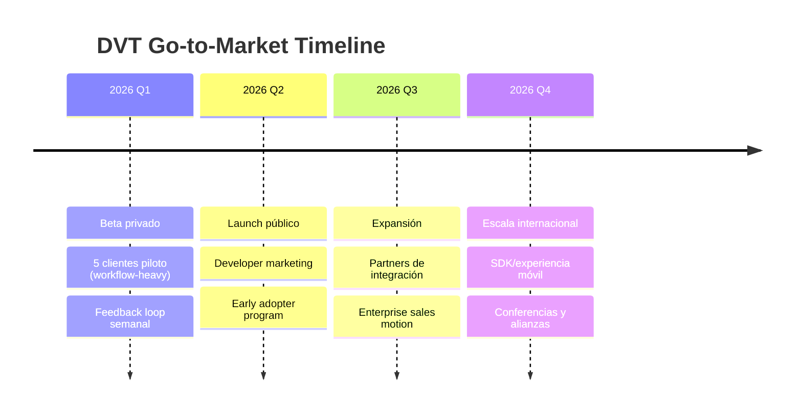

# Go-to-Market Plan (DVT)

<!--
Status: canonical
Last-updated: 2026-02-21
Owner: dunay2
-->

## Fases de lanzamiento

## Canales de adquisición

> Nota: los valores financieros detallados (inversión, CAC, ROI) se gestionan en documentación privada.

| Canal        | Conversión esperada | Escalabilidad | Prioridad |
| ------------ | ------------------- | ------------- | --------- |
| SEO/Content  | Media               | Alta          | P1        |
| Webinars     | Media-Alta          | Media         | P1        |
| White papers | Baja-Media          | Baja          | P2        |
| Sales team   | Alta                | Media         | P0        |
| Partners     | Alta                | Alta          | P0        |
| Events       | Alta                | Baja          | P2        |
| LinkedIn Ads | Media               | Alta          | P1        |
| Google Ads   | Media               | Alta          | P1        |
| Retargeting  | Media-Alta          | Media         | P1        |

## OKRs 2026

| Trimestre | Objective              | Key Results                                              | Status         |
| --------- | ---------------------- | -------------------------------------------------------- | -------------- |
| Q1        | Cerrar MVP técnico     | 5 pilotos · test coverage >80% · API <200ms              | 🟡 En progreso |
| Q2        | Tracción inicial       | 20 clientes · 15% mejora en lead-time operativo · NPS 40 | ⚪ No iniciado |
| Q3        | Escalamiento           | 10k ejecuciones/día · 3 regiones · 5 cuentas enterprise  | ⚪ No iniciado |
| Q4        | Innovación de producto | 95% precisión en predicción operativa · mobile SDK beta  | ⚪ No iniciado |
