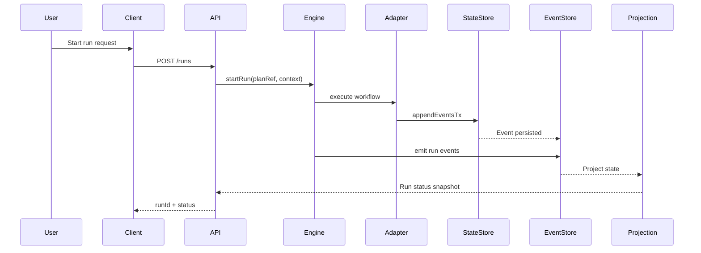

# Product Operations Appendix (DVT)

## Glosario técnico extendido

| Término         | Definición                                                    | Contexto             |
| --------------- | ------------------------------------------------------------- | -------------------- |
| A\*             | Algoritmo de búsqueda heurística para encontrar camino óptimo | Optimización de DAGs |
| CQRS            | Patrón que separa operaciones de lectura y escritura          | Arquitectura backend |
| Event Sourcing  | Persistencia basada en eventos en lugar de estado actual      | Trazabilidad         |
| GeoJSON         | Formato para codificar estructuras de datos geográficos       | Mapas                |
| MBTiles         | Especificación para almacenar tiles de mapa                   | Cache mapping        |
| PostGIS         | Extensión espacial para PostgreSQL                            | Base de datos        |
| WebSocket       | Protocolo de comunicación bidireccional en tiempo real        | Live updates         |
| Run Replay      | Reejecución determinista del stream de eventos                | Confiabilidad        |
| Idempotency Key | Clave para deduplicar escritura/eventos                       | Consistencia         |
| Pareto Front    | Conjunto de soluciones óptimas no dominadas                   | Multi-objetivo       |

## Referencias y documentación

### Documentación técnica

- [Temporal.io Documentation](https://docs.temporal.io/)
- [MapLibre GL JS Docs](https://maplibre.org/maplibre-gl-js/docs/)
- [Fastify Reference](https://fastify.dev/)
- [Next.js Documentation](https://nextjs.org/docs)
- [PostGIS Manual](https://postgis.net/documentation/)
- [OpenAPI Specification](https://spec.openapis.org/oas/latest.html)

### APIs/servicios de terceros

- Temporal Cloud API
- OpenTelemetry Collector
- PostgreSQL managed service
- Internal IdP (OIDC/SAML)

### Estándares

- OpenAPI 3.1
- OAuth 2.1 / OIDC
- SOC 2 controls baseline
- ISO 27001 control families

## Diagramas

### Flujo de ejecución de plan



### Arquitectura por capas

1. API Gateway (Fastify)
2. Engine Core (contratos + semántica)
3. Adapter Layer (Temporal, Conductor futuro)
4. State + Outbox + Projector
5. Observabilidad y seguridad

## Guía rápida

1. Seleccionar plan en dashboard (`Plans`).
2. Revisar versión/capacidades del plan.
3. Lanzar ejecución (`Start run`).
4. Definir contexto de ejecución (tenant, actor, flags).
5. Monitorear estado por snapshot y eventos.
6. Aplicar señales operativas (`PAUSE`/`CANCEL`/`RETRY_RUN`).
7. Auditar resultado final y exportar trazabilidad.

## API quick start

```bash
# Autenticación
curl -X POST https://api.dvt.io/v1/auth/login \
  -H "Content-Type: application/json" \
  -d '{"email":"user@airline.com","apiKey":"your_key"}'

# Crear ejecución
curl -X POST https://api.dvt.io/v1/runs \
  -H "Authorization: Bearer YOUR_TOKEN" \
  -H "Content-Type: application/json" \
  -d '{
    "planRef": {
      "planId": "plan-demo",
      "version": "1.0.0"
    },
    "context": {
      "tenantId": "tenant-acme",
      "actorId": "ops-user-01"
    }
  }'

# Señal operativa
curl -X POST https://api.dvt.io/v1/runs/RUN_ID/signals \
  -H "Authorization: Bearer YOUR_TOKEN" \
  -H "Content-Type: application/json" \
  -d '{
    "type": "PAUSE",
    "reason": "manual-ops-window"
  }'
```

## Contingencia

### Escenarios DR

| Escenario              | RTO  | RPO   | Estrategia             | Responsable |
| ---------------------- | ---- | ----- | ---------------------- | ----------- |
| Data center failure    | 4h   | 15min | Multi-AZ failover      | DevOps      |
| Database corruption    | 2h   | 5min  | Point-in-time recovery | DBA         |
| API service down       | 5min | -     | Auto-scaling + LB      | DevOps      |
| Third-party API outage | 1h   | -     | Cache + fallback       | Backend     |
| Security breach        | 1h   | -     | Isolation + audit      | Security    |

### Runbook de incidentes

```yaml
incident_response:
  severity_1:
    description: 'Critical outage affecting multiple customers'
    response_time: '5min'
    communication: 'Status page + email + slack'
    escalation: 'CTO + VP Engineering'
    steps:
      - 'Identify affected services'
      - 'Isolate issue (rollback / failover)'
      - 'Communicate to customers'
      - 'Root cause analysis'
      - 'Post-mortem within 24h'
```
