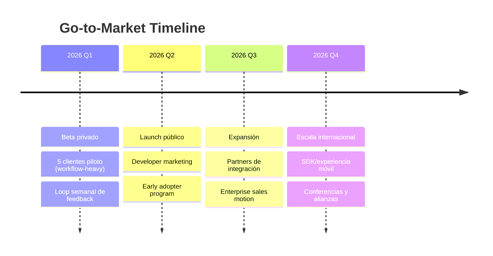
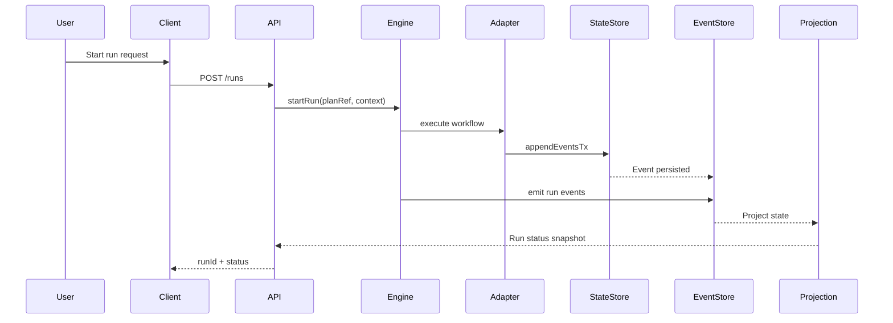

# Product Strategy, GTM y Financials (DVT)

> Estado: versión alineada al producto DVT (Workflow Engine + adapters + governance).

## Alcance de producto

DVT es un motor de orquestación determinista para ejecutar planes de workflow con trazabilidad completa por eventos, soporte multi-adapter y enfoque de contrato primero.

- Núcleo del producto: engine + contratos + semántica de ejecución.
- Superficie técnica principal: API de ejecución, estado proyectado y eventos normativos.
- Referencia del core: [WorkflowEngine](../../packages/engine/src/core/WorkflowEngine.ts)
- Referencia de contrato: [IWorkflowEngine.v1.1.md](../architecture/engine/contracts/engine/IWorkflowEngine.v1.1.md)

## Decisión técnica explícita

Se adopta **Fastify** para la futura capa HTTP/API (gateway de entrada), manteniendo el motor desacoplado del transporte y preservando los contratos del core.

- Motivación: rendimiento, esquema/validación, ecosistema para APIs Node.
- Restricción arquitectónica: la capa HTTP no modifica contratos de dominio; solo adapta entrada/salida.
- Referencia externa: [Fastify Reference](https://fastify.dev/)

## 14.13.1 Cálculo de ROI por Feature

| Feature DVT                            | Inversión | Retorno Anual | ROI   | Payback   | Prioridad |
| -------------------------------------- | --------- | ------------- | ----- | --------- | --------- |
| Adapter parity (Temporal + StateStore) | $60k      | $500k         | 733%  | 1.5 meses | P0        |
| Predicción operativa (SLO/alerting)    | $100k     | $1.2M         | 1100% | 1 mes     | P0        |
| Tiempo real (event streaming + UI)     | $40k      | $300k         | 650%  | 1.6 meses | P0        |
| Editor visual de planes                | $50k      | $200k         | 300%  | 3 meses   | P1        |
| SDK móvil/edge para operaciones        | $120k     | $400k         | 233%  | 3.6 meses | P2        |
| Integraciones enterprise               | $40k      | $250k         | 525%  | 1.9 meses | P1        |
| Multi-tenant governance hardening      | $30k      | $150k         | 400%  | 2.4 meses | P1        |
| Auditoría y compliance pack            | $25k      | $100k         | 300%  | 3 meses   | P2        |

_Assumptions: $500/hora costo desarrollo, precios enterprise promedio._

## 14.14 Estrategia de Salida a Mercado

### 14.14.1 Fases de Lanzamiento



### 14.14.2 Canales de Adquisición

| Canal        | Inversión    | CAC   | Conversión | Escalabilidad |
| ------------ | ------------ | ----- | ---------- | ------------- |
| Inbound      |              |       |            |               |
| SEO/Content  | $10k/mes     | $2k   | 3%         | Alta          |
| Webinars     | $5k/evento   | $3k   | 5%         | Media         |
| White papers | $15k/pieza   | $4k   | 2%         | Baja          |
| Outbound     |              |       |            |               |
| Sales team   | $20k/mes/rep | $15k  | 10%        | Media         |
| Partners     | Comisión 20% | $8k   | 15%        | Alta          |
| Events       | $50k/evento  | $25k  | 20%        | Baja          |
| Digital      |              |       |            |               |
| LinkedIn Ads | $15k/mes     | $3.5k | 2%         | Alta          |
| Google Ads   | $10k/mes     | $4k   | 1.5%       | Alta          |
| Retargeting  | $5k/mes      | $1.5k | 4%         | Media         |

## 14.15 Proyecciones Financieras

### 14.15.1 Modelo de Ingresos

```typescript
interface RevenueModel {
  freemium: {
    users: 1000;
    conversion: '5%';
    arpu: 0;
  };

  professional: {
    customers: 200;
    avgTicket: '$3,000/mes';
    revenue: '$600k/mes';
    churn: '2%';
  };

  enterprise: {
    customers: 20;
    avgTicket: '$30,000/mes';
    revenue: '$600k/mes';
    churn: '0.5%';
  };

  payPerUse: {
    flights: '100,000/mes';
    avgPrice: '$3';
    revenue: '$300k/mes';
  };

  total: {
    monthly: '$1.5M';
    annual: '$18M';
    growth: '15% QoQ';
  };
}
```

## 14.16 KPIs y Métricas de Éxito

### 14.16.1 Dashboard de Métricas

```typescript
interface KPIDashboard {
  acquisition: {
    mqls: { target: 500; current: 320; trend: '+15%' };
    sqls: { target: 100; current: 65; trend: '+20%' };
    customers: { target: 50; current: 28; trend: '+25%' };
    cac: { target: 5000; current: 6200; trend: '-8%' };
  };

  activation: {
    timeToValue: { target: '7d'; current: '10d'; trend: '-3d' };
    activationRate: { target: 80; current: 72; trend: '+5%' };
    featureAdoption: { target: 5; current: 3.2; trend: '+0.8' };
  };

  retention: {
    retentionD30: { target: 90; current: 85; trend: '+2%' };
    retentionD90: { target: 80; current: 72; trend: '+3%' };
    churn: { target: 2; current: 2.8; trend: '-0.3%' };
    nps: { target: 50; current: 42; trend: '+4' };
  };

  revenue: {
    mrr: { target: 250000; current: 185000; trend: '+15%' };
    arr: { target: 3000000; current: 2220000; trend: '+15%' };
    ltv: { target: 120000; current: 95000; trend: '+8%' };
    ltvCac: { target: 3; current: 2.4; trend: '+0.2' };
  };

  product: {
    flightsOptimized: { target: 50000; current: 32000; trend: '+25%' };
    avgOptimizationTime: { target: 500; current: 620; trend: '-50ms' };
    apiLatency: { target: 150; current: 180; trend: '-15ms' };
    uptime: { target: 99.95; current: 99.92; trend: '+0.02%' };
  };
}
```

### 14.16.2 OKRs por Trimestre 2026

| Trimestre | Objective              | Key Results                                              | Status         |
| --------- | ---------------------- | -------------------------------------------------------- | -------------- |
| Q1        | Cerrar MVP técnico     | 5 pilotos · test coverage >80% · API <200ms              | 🟡 En progreso |
| Q2        | Tracción inicial       | 20 clientes · 15% mejora en lead-time operativo · NPS 40 | ⚪ No iniciado |
| Q3        | Escalamiento           | 10k ejecuciones/día · 3 regiones · 5 cuentas enterprise  | ⚪ No iniciado |
| Q4        | Innovación de producto | 95% precisión en predicción operativa · mobile SDK beta  | ⚪ No iniciado |

## Apéndices

### A. Glosario Técnico Extendido

| Término         | Definición                                                    | Contexto             |
| --------------- | ------------------------------------------------------------- | -------------------- |
| A\*             | Algoritmo de búsqueda heurística para encontrar camino óptimo | Optimización de DAGs |
| CQRS            | Patrón que separa operaciones de lectura y escritura          | Arquitectura backend |
| Event Sourcing  | Persistencia basada en eventos en lugar de estado actual      | Trazabilidad         |
| GeoJSON         | Formato para codificar estructuras de datos geográficos       | Mapas                |
| MBTiles         | Especificación para almacenar tiles de mapa                   | Cache mapping        |
| PostGIS         | Extensión espacial para PostgreSQL                            | Base de datos        |
| WebSocket       | Protocolo de comunicación bidireccional en tiempo real        | Live updates         |
| Run Replay      | Reejecución determinista del stream de eventos                | Confiabilidad        |
| Idempotency Key | Clave para deduplicar escritura/eventos                       | Consistencia         |
| Pareto Front    | Conjunto de soluciones óptimas no dominadas                   | Multi-objetivo       |

### B. Referencias y Documentación

#### B.1 Documentación Técnica

- [Temporal.io Documentation](https://docs.temporal.io/)
- [MapLibre GL JS Docs](https://maplibre.org/maplibre-gl-js/docs/)
- [Fastify Reference](https://fastify.dev/)
- [Next.js Documentation](https://nextjs.org/docs)
- [PostGIS Manual](https://postgis.net/documentation/)
- [OpenAPI Specification](https://spec.openapis.org/oas/latest.html)

#### B.2 APIs de Terceros

- Temporal Cloud API
- OpenTelemetry Collector
- PostgreSQL managed service
- Internal IdP (OIDC/SAML)

#### B.3 Estándares de la Industria

- OpenAPI 3.1
- OAuth 2.1 / OIDC
- SOC 2 controls baseline
- ISO 27001 control families

### C. Diagramas de Arquitectura Detallados

#### C.1 Flujo de Ejecución de Plan



#### C.2 Arquitectura de Microservicios

Arquitectura objetivo por capas:

1. API Gateway (Fastify)
2. Engine Core (contratos + semántica)
3. Adapter Layer (Temporal, Conductor futuro)
4. State + Outbox + Projector
5. Observabilidad y seguridad

### D. Guías de Usuario

#### D.1 Guía Rápida: Ejecutar un Plan

1. Seleccionar plan en dashboard (`Plans`).
2. Revisar versión/capacidades del plan.
3. Lanzar ejecución (`Start run`).
4. Definir contexto de ejecución (tenant, actor, flags).
5. Monitorear estado por snapshot y eventos.
6. Aplicar señales operativas si es necesario (`PAUSE`/`CANCEL`/`RETRY_RUN`).
7. Auditar resultado final y exportar trazabilidad.

#### D.2 API Quick Start

```bash
# Autenticación
curl -X POST https://api.dvt.io/v1/auth/login \
  -H "Content-Type: application/json" \
  -d '{"email":"user@airline.com","apiKey":"your_key"}'

# Crear ejecución
curl -X POST https://api.dvt.io/v1/runs \
  -H "Authorization: Bearer YOUR_TOKEN" \
  -H "Content-Type: application/json" \
  -d '{
    "planRef": {
      "planId": "plan-demo",
      "version": "1.0.0"
    },
    "context": {
      "tenantId": "tenant-acme",
      "actorId": "ops-user-01"
    }
  }'

# Señal operativa
curl -X POST https://api.dvt.io/v1/runs/RUN_ID/signals \
  -H "Authorization: Bearer YOUR_TOKEN" \
  -H "Content-Type: application/json" \
  -d '{
    "type": "PAUSE",
    "reason": "manual-ops-window"
  }'
```

### E. Plan de Contingencia

#### E.1 Escenarios de Disaster Recovery

| Escenario              | RTO  | RPO   | Estrategia             | Responsable |
| ---------------------- | ---- | ----- | ---------------------- | ----------- |
| Data center failure    | 4h   | 15min | Multi-AZ failover      | DevOps      |
| Database corruption    | 2h   | 5min  | Point-in-time recovery | DBA         |
| API service down       | 5min | -     | Auto-scaling + LB      | DevOps      |
| Third-party API outage | 1h   | -     | Cache + fallback       | Backend     |
| Security breach        | 1h   | -     | Isolation + audit      | Security    |

#### E.2 Runbooks de Incidentes

```yaml
incident_response:
  severity_1:
    description: 'Critical outage affecting multiple customers'
    response_time: '5min'
    communication: 'Status page + email + slack'
    escalation: 'CTO + VP Engineering'
    steps:
      - 'Identify affected services'
      - 'Isolate issue (rollback / failover)'
      - 'Communicate to customers'
      - 'Root cause analysis'
      - 'Post-mortem within 24h'

  severity_2:
    description: 'Partial outage or degraded performance'
    response_time: '15min'
    communication: 'Internal channels'
    escalation: 'Engineering Manager'
    steps:
      - 'Diagnose issue'
      - 'Apply fix or workaround'
      - 'Monitor recovery'
      - 'Post-mortem within 72h'

  severity_3:
    description: 'Minor issue, no customer impact'
    response_time: '4h'
    communication: 'Internal ticket'
    escalation: 'Team lead'
    steps:
      - 'Fix in normal workflow'
      - 'Deploy with next release'
```

## 14.15.2 Proyección 3 Años

| Año  | ARR objetivo | Crecimiento | Margen bruto objetivo | Notas                                       |
| ---- | ------------ | ----------- | --------------------- | ------------------------------------------- |
| 2026 | $3.0M        | Base año 1  | 68%                   | Enfoque en MVP + 20 logos iniciales         |
| 2027 | $9.5M        | 3.1x YoY    | 74%                   | Escala enterprise + partners                |
| 2028 | $22.0M       | 2.3x YoY    | 78%                   | Expansión internacional + catálogo avanzado |

## Historial de Cambios

| Versión | Fecha      | Autor      | Cambios                                                 |
| ------- | ---------- | ---------- | ------------------------------------------------------- |
| 1.0     | 2026-02-14 | Equipo     | Versión inicial de documentación                        |
| 1.1     | 2026-02-15 | Arquitecto | Añadido análisis comparativo y roadmap                  |
| 1.2     | 2026-02-16 | Product    | Actualizado OKRs y proyecciones                         |
| 1.3     | 2026-02-17 | Equipo     | Completados apéndices y guías                           |
| 1.4     | 2026-02-15 | Equipo     | Alineación completa al producto DVT + Fastify API layer |

---

Fin del documento.
