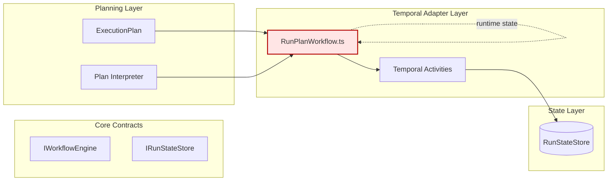
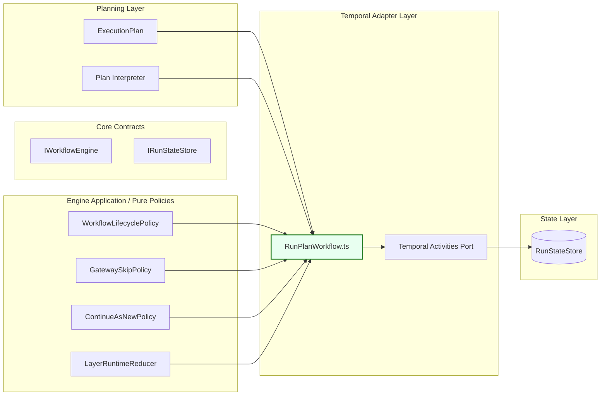

# RunPlanWorkflow — Refactor Analysis (DVT+)

## Governing Sources

- AGENTS.md
- ADR-0001: Temporal Integration Test Policy
- ADR-0003: Execution Model
- 20260315-run-plan-workflow-architecture-review.md

---

## Refactor Points Extracted

### 1. Extraer políticas de dominio del workflow a módulos puros

- Políticas de ciclo de vida, skip/gateway, continue-as-new, reducción de estado.

### 2. Reducir duplicación de estado en memoria

- Mantener solo lo necesario para orquestación.

### 3. Reemplazar emitEvent genérico por puertos tipados para eventos

- Usar actividades específicas: emitRunStarted, emitRunCompleted, etc.

### 4. Centralizar la emisión de eventos de ciclo de vida

- Crear un módulo puro para transiciones de ciclo de vida.

### 5. Extraer lógica de skip/gateway a un módulo engine-agnóstico

- GatewaySkipPolicy.

### 6. Documentar diferencia entre statusQuery y persisted state

- Aclarar en comentarios y docs.

### 7. Mejorar fidelidad del payload de fallos

- Incluir mensaje de error y clasificación retriable.

### 8. Renombrar métricas ambiguas

- currentStepIndex → completedStepCount/progressCursor.

### 9. Dividir el workflow en archivos colaborativos

- Evitar God File, usar layout modular.

---

## Módulos Propuestos

- workflowLifecyclePolicy.ts
- gatewaySkipPolicy.ts
- continueAsNewPolicy.ts
- layerRuntimeReducer.ts
- workflowSignals.ts
- workflowEventBuilders.ts
- workflowTypes.ts
- workflowHelpers.ts
- layerExecutionLoop.ts

---

## Diagrama Mermaid — Placement Actual



---

## Diagrama Mermaid — Placement Target



---

## Layout Modular Propuesto

```text
packages/@dvt/adapter-temporal/src/
  workflows/
    RunPlanWorkflow.ts
    workflowTypes.ts
    workflowSignals.ts
    workflowEventBuilders.ts
    workflowLifecyclePolicy.ts
    layerExecutionLoop.ts
    layerRuntimeReducer.ts
    gatewaySkipPolicy.ts
    continueAsNewPolicy.ts
    workflowHelpers.ts
  activities/
    TemporalWorkflowActivities.ts
    emitRunLifecycleEvent.ts
    executeWorkflowStep.ts
    fetchExecutionPlan.ts
```

---

## Notas

- El workflow debe ser un orquestador determinista, no el root de dominio.
- Las políticas deben ser engine-agnósticas y colaborativas.
- Los diagramas Mermaid muestran el placement actual y el target tras refactor.
- El layout modular facilita la mantenibilidad y alineamiento DVT+.
