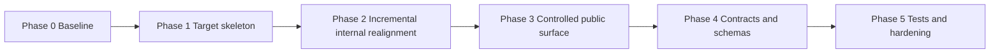

# Engine Migration Plan: Current Gap To Target Blueprint v0.6

## 1. Context

The current state of [`@dvt/engine`](../../packages/@dvt/engine/package.json)
does not fully match the target module shape described in the historical
blueprint snapshot
[`DVT_Blueprint_v0.6_MASTER.md`](../archive/historical-blueprints/DVT_Blueprint_v0.6_MASTER.md).

The goal of this plan is to migrate in phases without moving files too early and without breaking the public surface, CI, or tests.

## 2. Gap Analysis

### 2.1 Expected target structure

According to the blueprint, a standard module should move toward this layout:

- `docs/`
- `schemas/` for envelopes, commands, and events
- `src/{generated,domain,application,ports,adapters,composition}`
- `test/{unit,contract,integration}`
- `cli/src/{smoke,validate-schemas,codegen}`

### 2.2 Current structure observed in engine

[`packages/@dvt/engine/src`](../../packages/@dvt/engine/src/index.ts) currently contains a mixed layout:

- `core/`
- `state/`
- `security/`
- `outbox/`
- `utils/`
- `metrics/`
- `workers/`
- `contracts/`
- `application/`
- `adapters/`
- `ports/`

Main misalignments:

1. `domain/` and `composition/` do not exist as explicit top-level areas.
2. Runtime code and contracts are mixed inside the engine package while [`@dvt/contracts`](../../packages/@dvt/contracts/index.ts) already exists.
3. The root barrel in [`src/index.ts`](../../packages/@dvt/engine/src/index.ts) is too wide and exports internals together with stable APIs.
4. Engine-specific `schemas/` and `cli/` areas do not exist yet.
5. Tests are not normalized to `unit`, `contract`, and `integration`.

## 3. Migration Principles

1. No breaking changes during the first phases.
2. Use a strangler pattern: create the target layout first, then redirect gradually.
3. Preserve import compatibility through transition barrels and deprecation wrappers.
4. Keep CI green after each phase with a simple rollback path.
5. Keep PRs small and single-purpose.

## 4. Phase Strategy

### Phase 0: Baseline and non-break guarantees

- Freeze the current public surface in [`src/index.ts`](../../packages/@dvt/engine/src/index.ts).
- Inventory exports consumed by other packages.
- Define a compatibility matrix for import paths.

Output: a public API snapshot plus acceptance criteria per phase.

### Phase 1: Create the target skeleton

Create documented directories without moving logic yet:

- `src/domain/`
- `src/composition/`
- `src/generated/`
- `schemas/{envelope,commands,events}`
- `cli/src/`

Only the structure and folder-level docs are created in this phase.

### Phase 2: Incremental internal realignment

- Map `core/*` and domain semantics into `domain/*`.
- Keep compatibility wrappers in the old locations, with re-exports from the new paths.
- Move technical wiring into `composition/*`.
- Keep `application/*` focused on use cases instead of infrastructure details.

Rule: every move ships with a compatibility re-export and tests.

### Phase 3: Controlled public surface

- Define the minimum stable public API in [`src/index.ts`](../../packages/@dvt/engine/src/index.ts).
- Mark legacy exports as deprecated in JSDoc.
- Stop exporting internal stubs and adapters from the root when they are not stable API.

### Phase 4: Contracts and schemas

- Decide the permanent boundary between [`@dvt/contracts`](../../packages/@dvt/contracts/index.ts) and engine-local contracts.
- Migrate runtime contracts into the canonical contracts package when appropriate.
- Add or normalize `schemas/` plus validation tooling.

### Phase 5: Tests and hardening

- Normalize tests into `test/unit`, `test/contract`, and `test/integration`.
- Add boundary and layering checks.
- Remove legacy deprecations in a final controlled phase.

## 5. Risks And Mitigations

1. Internal import breakage  
   Mitigation: add transition re-exports and run a global search before each move.

2. Ambiguous ownership of contracts  
   Mitigation: write a dedicated ADR before Phase 4.

3. PRs becoming too large  
   Mitigation: split by submodule and by layer.

4. Determinism regressions  
   Mitigation: run the current suites plus determinism checks on every phase.

## 6. Immediate Executable Backlog

- [ ] Create the target skeleton in engine: `domain`, `composition`, `generated`, `schemas`, and `cli`.
- [ ] Add short ownership and purpose docs for each new directory.
- [ ] Define the allowed public exports in the root barrel.
- [ ] Implement the first pilot migration: `core/WorkflowEngine` -> `domain/workflow` with a legacy wrapper.
- [ ] Run tests, type-check, and lint after the pilot move.
- [ ] Repeat the pattern with `core/SnapshotProjector`.
- [ ] Propose the ADR that settles ownership between engine-local contracts and `@dvt/contracts`.

## 7. Acceptance Criteria

1. A phased roadmap exists with zero-downtime import compatibility.
2. Each phase can ship in an independent PR.
3. No big-bang refactor is required.
4. Compatibility with current consumers is preserved.
