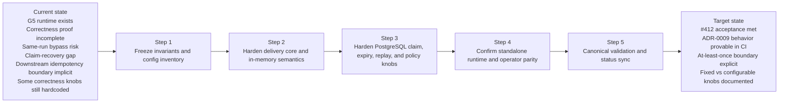

# G5 / US-G5.3 Correctness Hardening Plan

Execution plan for GitHub issue `#412`:
`US-G5.3 Harden correctness for retries, crash-window redelivery, and ordering tests`.

- Gap: `G5 - Outbox worker independiente`
- Parent epic: `#409`
- Declared blocker in issue body: `#410`
- Current status source: [`GAP_EXECUTION_PLANS.md`](GAP_EXECUTION_PLANS.md)
- Canonical gap plan: [`G5-OUTBOX-WORKER-CONSOLIDATED-PLAN.md`](G5-OUTBOX-WORKER-CONSOLIDATED-PLAN.md)
- Normative ordering baseline: [`ADR-0009_Outbox_Ordering.md`](../../adr/ADR-0009_Outbox_Ordering.md)

## Working Rule

This document is the execution contract for `#412`.

While `#412` is in progress:

1. implementation work follows this step order;
2. if scope changes, this file is updated first;
3. closure is not claimed until the step DoDs and validation matrix below are met.

## Objective

Close the correctness-hardening slice of `G5` without widening scope beyond the
current outbox runtime and storage model already accepted by the repository.

The concrete target is to make the outbox failure model explicit and provable in
CI for:

- at-least-once delivery,
- crash-window redelivery,
- strict per-`runId` ordering,
- strict stream blocking on failure or DLQ,
- standalone single-owner runtime parity.

## Root Problem

The repository already has meaningful `G5` coverage, but `#412` is not only a
"more tests" task.

Current code inspection shows a real correctness gap:

- `ack failure -> redelivery` exists implicitly in `OutboxWorker`, but is not
  proven explicitly in tests;
- same-`runId` head-of-line blocking is not enforced strongly enough at the
  storage/claim boundary;
- DLQ/replay identifier preservation is only partially proven;
- the standalone runtime does not yet have an explicit regression proving that
  later events from the same `runId` do not bypass an earlier failed one.

That means the repo can claim the runtime exists, but it cannot yet defend
`ADR-0009` correctness at the level required by `PR-3` of `G5`.

## Additional Gaps From Architecture Review

The architecture review for this plan identified four gaps that MUST stay
visible while `#412` is executed:

1. Downstream idempotency boundary is not explicit enough.
   - This task proves at-least-once relay semantics at the worker boundary.
   - This task does **not** claim exactly-once end-to-end delivery.
   - The current downstream consumer contract MUST remain compatible with
     duplicate delivery in the crash window.
2. Stale-claim recovery is not yet part of the formal correctness story.
   - PostgreSQL already treats stale `claimed_at` rows as expired after five
     minutes.
   - `#412` should treat claim-expiry recovery as a correctness path, not only
     as an operational footnote.
3. DLQ strict-mode needs explicit operational guardrails.
   - Blocking a per-`runId` stream is correct per `ADR-0009`, but operators must
     also be able to detect, triage, and replay that state intentionally.
4. Replay metadata preservation should be defined at envelope level, not only as
   `runSeq + idempotencyKey`.
   - At minimum, replay must preserve the original event envelope fields already
     present in the payload that matter for downstream dedupe, diagnostics, and
     traceability.
5. Some correctness knobs remain hardcoded in code instead of being explicitly
   configured or deliberately documented as fixed policy.
   - This task should inventory them and decide which ones are:
     - acceptable fixed policy for this phase;
     - configurable runtime defaults;
     - technical debt that must not remain implicit.

## CTO Direction Notes

This plan also carries explicit CTO-level concerns raised during review.

They are not optional commentary; they are decision constraints for this slice:

1. Product quality matters more than local green tests.
   - The slice must improve correctness in a way that reduces real duplicate,
     replay, and blocked-stream risk for downstream consumers.
2. Money and operational cost matter.
   - Query hardening, blocked-stream behavior, and replay policy must not create
     an invisible DB or on-call cost profile.
3. The closeout must not over-claim.
   - This slice proves at-least-once correctness and ordered blocking semantics.
   - It does not claim end-to-end exactly-once delivery.
4. Architectural debt must stay visible while execution continues.
   - Correctness work in `#412` must not hide coupling debt or create a second
     long-lived worker implementation with unclear ownership.

## Structural Decoupling Note

Module decoupling is a live concern and is now a recorded direction for this
workstream.

Two separate but related decoupling concerns exist:

1. `G5` local decoupling concern:
   - the engine-local outbox worker and the standalone runtime must not drift
     into two independent implementations;
   - acceptable end state remains the one already described in the G5 guide:
     extract a reusable core or leave the engine-local worker as a thin wrapper.
2. broader repository coupling concern:
   - structural coupling such as `G9` (`StepTypeRegistry + typed stepTypeConfig`)
     was out of scope for `#412` and was tracked separately at the repository level;
   - `#412` must not pretend to close that broader coupling problem.

Working rule:

- use `#412` to improve correctness without adding new coupling;
- do not widen `#412` into a full package extraction;
- record any coupling touched by the slice so the post-`#412` follow-up is
  concrete rather than implicit.

## Governing Invariants

The implementation and tests for `#412` MUST preserve the following:

1. Ordering key is `runId`; ordering attribute is `runSeq`.
2. Events for the same `runId` publish in strictly increasing `runSeq`.
3. A failed event does not allow a later event from the same `runId` to bypass it.
4. At-least-once delivery is explicit; duplicates in the crash window are acknowledged.
5. DLQ blocks the per-run stream until replay.
6. Replay from DLQ preserves original event-envelope identity fields, including
   `eventId`, `runSeq`, `idempotencyKey`, and the existing payload envelope.
7. Claim expiry recovers stalled rows without allowing same-`runId` bypass.
8. Single-owner standalone runtime preserves current semantics; this task does not
   introduce multi-worker scale-out.
9. This task does not claim exactly-once downstream delivery; downstream consumers
   remain responsible for idempotent handling of duplicates.
10. Correctness-sensitive operational knobs are either configurable or explicitly
    documented as fixed policy; they must not remain accidental constants.

## Explicit Non-Goals

The following claims are intentionally out of scope for `#412` and MUST NOT be
implied by implementation or closeout language:

- exactly-once end-to-end delivery;
- multi-worker correctness;
- new subscriber abstraction families;
- new outbox schema generalization;
- automatic DLQ replay without operator intent.
- broad repository-wide coupling cleanup beyond the local G5 scope.

The following topic is in scope only to the extent needed for correctness
transparency, not for broad platform redesign:

- classify and document hardcoded outbox constants that affect retries, claims,
  and blocked-stream recovery.
- record local outbox-module coupling touched by the slice so it does not remain
  hidden after correctness work lands.

## Selected Approach

The chosen approach is to harden the existing seams, not redesign the platform.

Selected implementation direction:

- keep the current `OutboxWorker` + `IOutboxStorage` model;
- strengthen `listPending()` semantics so only the eligible head-of-line record
  per `runId` is claimable;
- keep DLQ in strict stream-integrity mode;
- make the downstream idempotency boundary explicit instead of implying
  exactly-once semantics the current runtime cannot prove;
- treat stale-claim recovery as part of correctness for the PostgreSQL path;
- tie DLQ blocking to observability and operator replay discipline already
  documented in the runbook;
- inventory current outbox constants and separate:
  - already-configurable runtime defaults;
  - hardcoded correctness knobs that need explicit treatment;
- allow the worker to continue draining eligible follow-on work without opening
  a new storage contract;
- prove the behavior with tests at engine, runtime, and PostgreSQL levels.

Rejected alternatives:

1. Add tests only.
   - Rejected because inspection already found a real behavior gap.
2. Introduce a new storage contract such as `releaseClaims()` or a new claim API.
   - Rejected because it widens `G5.3` into a platform redesign.
3. Jump directly to multi-worker strategy.
   - Rejected because `G5.5` owns that scope, not `#412`.

## Scope

### In Scope

- `packages/@dvt/delivery/src/application/OutboxWorker.ts`
- `packages/@dvt/delivery/src/testing/InMemoryOutboxStorage.ts`
- `packages/@dvt/delivery/test/OutboxWorker.test.ts`
- `apps/outbox-worker/test/runtime/OutboxWorkerRuntime.test.ts`
- `packages/@dvt/adapter-postgres/src/PostgresStateStoreAdapter.ts`
- `packages/@dvt/adapter-postgres/test/smoke.test.ts`
- `apps/outbox-worker/src/plugins/env.ts`
- `apps/outbox-worker/README.md`
- `docs/architecture/engine/adapters/state-store/postgres/StateStoreAdapter.md`
- `docs/runbooks/outbox-worker-g5.md`

### Out Of Scope

- multi-worker concurrency strategy from `ADR-0009` section 2
- shard routing / scale-out
- canary cutover and rollback wiring
- new outbox schema family
- subscriber registry or generic side-effect taxonomy

## Roadmap

| Step | Name                                                   | Purpose                                                                                                         | Exit signal                                                                                                                                                                                                                 |
| ---- | ------------------------------------------------------ | --------------------------------------------------------------------------------------------------------------- | --------------------------------------------------------------------------------------------------------------------------------------------------------------------------------------------------------------------------- |
| 1    | Freeze expected behavior in tests and config inventory | Make the acceptance model explicit before or alongside implementation changes                                   | Tests and acceptance text exist for ack failure, same-run no-bypass, stale-claim recovery targets, replay envelope preservation, runtime parity, and hardcoded-knob inventory                                               |
| 2    | Enforce head-of-line semantics in engine storage/core  | Remove same-run bypass while keeping bounded draining behavior                                                  | Engine tests prove failed same-run events block later same-run events                                                                                                                                                       |
| 3    | Enforce strict stream integrity in PostgreSQL          | Make the real storage adapter obey the same semantics as the in-memory baseline                                 | PostgreSQL smoke coverage proves claim gating, claim-expiry recovery, DLQ blocking, replay envelope preservation, and explicit treatment of correctness knobs                                                               |
| 4    | Confirm standalone runtime and operator semantics      | Prove the host/runtime path still matches single-owner expectations and exposes blocked-stream behavior clearly | Runtime test proves no same-run bypass under the standalone loop, runtime defaults remain explicit, and docs/ops language stays aligned with strict-mode behavior                                                           |
| 5    | Run canonical validation and sync status               | Turn the implementation into repository evidence                                                                | Canonical commands run, docs/status are updated, the downstream idempotency boundary remains explicit in closeout, fixed-vs-configurable knobs are documented honestly, and local coupling touched by the slice is recorded |

## Step Plan With Definition Of Done

### Step 1 - Freeze correctness cases in tests

Goal:
Make `#412` acceptance concrete and readable in the regression suite.

Definition of Done:

- [ ] `OutboxWorker` tests explicitly prove `publish success + markDelivered failure -> redelivery`
- [ ] `OutboxWorker` tests explicitly prove `same runId` no-bypass behavior
- [ ] acceptance language makes the at-least-once / duplicate-delivery boundary explicit
- [ ] the plan or supporting docs classify current knobs into:
  - configurable runtime defaults already present,
  - fixed policy values accepted for this phase,
  - hardcoded correctness values that require explicit action
- [ ] PostgreSQL smoke coverage target includes stale-claim recovery and replay envelope preservation
- [ ] Standalone runtime test proves single-owner host preserves same-run ordering
- [ ] Test names and assertions explain the failure model without hand-waving

### Step 2 - Enforce strict per-run head-of-line behavior in core

Goal:
Ensure failed or gated records block only their own `runId` stream while still
allowing eligible work from other runs to proceed.

Definition of Done:

- [ ] in-memory storage exposes only the eligible head-of-line record for a `runId`
- [ ] a failed record with backoff blocks later same-run records
- [ ] a DLQ record blocks later same-run records until replay
- [ ] `OutboxWorker.tick()` remains bounded by `batchSize`
- [ ] the worker can continue draining other eligible runs in the same tick
- [ ] no code or test wording implies exactly-once delivery at the worker boundary
- [ ] engine-side hardcoded constants affecting correctness are either parameterized or explicitly documented as fixed policy

### Step 3 - Enforce the same semantics in PostgreSQL

Goal:
Make the real claim/query path match the invariants already required by
`ADR-0009`.

Definition of Done:

- [ ] `listPending()` in PostgreSQL only claims the earliest pending record per `runId`
- [ ] PostgreSQL outbox does not expose later same-run records while a prior one is pending, retriable, or dead-lettered
- [ ] stale claims can expire and be reclaimed without breaking same-run ordering
- [ ] replay from DLQ restores the original `eventId`
- [ ] replay from DLQ restores the original `runSeq`
- [ ] replay from DLQ restores the original `idempotencyKey`
- [ ] replay from DLQ preserves the original event payload envelope already stored in outbox
- [ ] any supporting index or query change stays within the current adapter model
- [ ] PostgreSQL-specific fixed values such as claim-expiry window and retry scheduling are either configurable or explicitly documented as accepted policy

### Step 4 - Confirm standalone runtime parity

Goal:
Prove that the standalone outbox runtime keeps the intended single-owner
semantics after the storage/core hardening.

Definition of Done:

- [ ] runtime test demonstrates that a failed event does not let `runSeq + 1` publish first
- [ ] runtime test still permits later recovery and ordered drain
- [ ] no runtime-only policy is introduced that diverges from worker/storage semantics
- [ ] runtime and runbook language make DLQ/retry blocking visible to operators without implying hidden auto-recovery
- [ ] runtime defaults exposed through `env` remain documented and distinct from lower-level fixed policy constants

### Step 5 - Validate and sync repository state

Goal:
Leave `#412` with executable evidence, not just local confidence.

Definition of Done:

- [ ] `pnpm --filter @dvt/delivery test` passes
- [ ] `pnpm --filter dvt-outbox-worker test` passes
- [ ] `pnpm --filter dvt-outbox-worker typecheck` passes
- [ ] `pnpm --filter dvt-outbox-worker build` passes
- [ ] `pnpm test:adapter-postgres` is executed and its pass/skip state is reported honestly
- [ ] any affected planning/status docs are updated to match the shipped behavior
- [ ] any affected storage/runbook docs are updated to match shipped claim-expiry, DLQ, and replay semantics
- [ ] closeout language states clearly that this slice proves at-least-once correctness, not end-to-end exactly-once
- [ ] closeout language states which knobs are configurable today and which remain fixed policy after this slice
- [ ] closeout language states whether the slice increased, reduced, or left unchanged local outbox-module coupling

## Mermaid Execution Map

## Validation Matrix

- `pnpm --filter @dvt/delivery test`
- `pnpm --filter dvt-outbox-worker test`
- `pnpm --filter dvt-outbox-worker typecheck`
- `pnpm --filter dvt-outbox-worker build`
- `pnpm test:adapter-postgres`

## Risks And Guardrails

1. Risk: query hardening in PostgreSQL reduces throughput.
   - Guardrail: keep the change inside current schema/index model; do not redesign claims.
2. Risk: tests prove behavior only for in-memory code paths.
   - Guardrail: keep PostgreSQL smoke coverage in scope for the same invariants.
3. Risk: fix drifts into `G5.5` multi-worker strategy.
   - Guardrail: this task only hardens single-owner correctness and strict per-run sequencing.
4. Risk: closeout language accidentally over-claims exactly-once delivery.
   - Guardrail: make the downstream idempotency boundary explicit in tests, docs, and final evidence.
5. Risk: strict DLQ mode blocks a stream without actionable operator guidance.
   - Guardrail: keep runbook and monitor semantics aligned with blocking/replay behavior.
6. Risk: hardcoded correctness knobs drift silently from ADRs, docs, or operational needs.
   - Guardrail: inventory and classify them during this slice; parameterize or document them explicitly.
7. Risk: correctness work leaves two diverging worker implementations or hides coupling debt under passing tests.
   - Guardrail: record coupling impact explicitly and keep the extract-vs-wrapper direction visible.

## Current Knob Inventory (Initial)

This inventory is intentionally narrow and only tracks knobs relevant to `#412`.

### Already configurable runtime defaults

- worker poll interval via `DVT_OUTBOX_WORKER_POLL_INTERVAL_MS`
- worker batch size via `DVT_OUTBOX_WORKER_BATCH_SIZE`
- runtime error backoff via `DVT_OUTBOX_WORKER_ERROR_BACKOFF_MS`
- runtime stop-on-error via `DVT_OUTBOX_WORKER_STOP_ON_ERROR`
- HTTP target timeout via `DVT_OUTBOX_HTTP_TIMEOUT_MS`

These are defaults, not hidden constants, because the runtime already exposes
them through env parsing and tests.

### Hardcoded correctness-sensitive values requiring explicit treatment

- `MAX_OUTBOX_ATTEMPTS = 10` in engine/adapter code
- stale claim expiry window of `5 minutes` in PostgreSQL claim query
- retry scheduling curve based on exponential backoff with base `1s` and cap `60s`

For this slice, each of these values must end in one of two states:

1. explicitly documented as accepted fixed policy for the current phase; or
2. made configurable without widening `G5.3` into a redesign.

### ADR alignment note

`ADR-0009` currently says "N retries = 5 (default)" as an implementation-level
default, while the code currently uses `10`.

`#412` must not leave that mismatch implicit.
The slice should either:

- align code and docs on the chosen value, or
- state the mismatch as a visible follow-up instead of silently carrying it.

## Post-#412 Decoupling Follow-up (Recorded, Not Closed Here)

This plan records the following follow-up direction so it is not lost during
correctness execution:

1. For `G5` runtime ownership:
   - converge on one owned outbox-worker core;
   - avoid long-lived duplication between engine-local and standalone runtime paths;
   - prefer extraction of proven reusable logic or an engine-local thin wrapper.
2. For broader architectural coupling:
   - keep repository-level typed `stepTypeConfig` governance visible; this was
     subsequently closed as `G9` in current governance;
   - do not relabel `#412` as if it solved that debt.

## Closeout Condition For This Plan

This plan is complete only when:

1. all five step DoDs are satisfied;
2. canonical validations have been executed and reported;
3. no new debt, stub, or hidden rule downgrade was introduced;
4. repository status docs still tell the truth about what remains open in `G5`.
