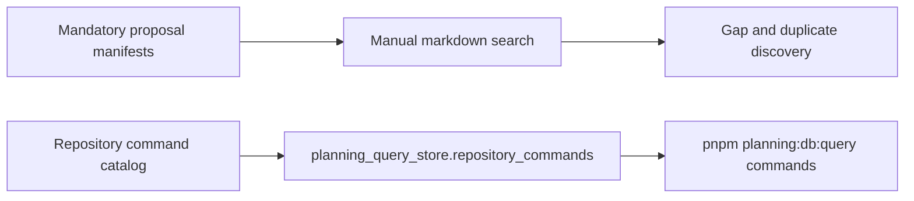
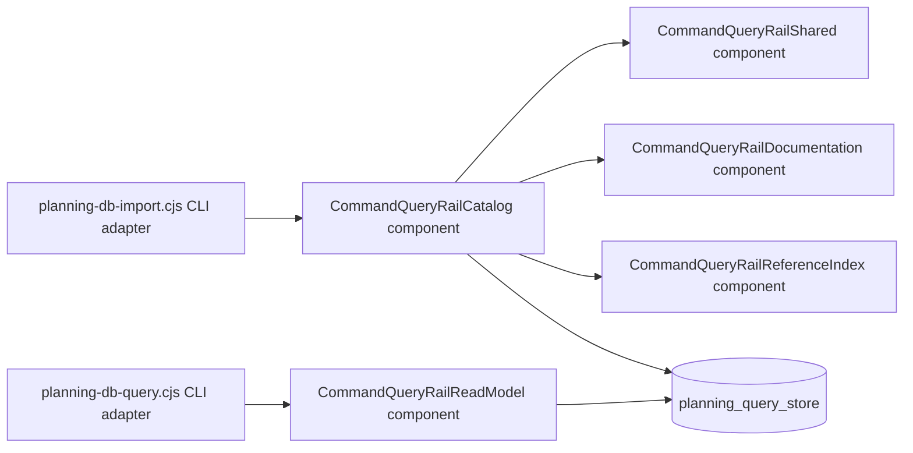

# Command/Query Rail Catalog DB-First Plan

> **For agentic workers:** REQUIRED SUB-SKILL: Use the repository AI work
> protocol to execute this plan task-by-task. Steps use checkbox syntax for
> tracking.

**Goal:** move product command/query rail catalogs into the planning DB query
store so gaps, implementation refs, and duplicates are operator-queryable.

**Architecture:** feature-mechanization manifests stay the governed source for
declared feature rails. `planning:db:import` also indexes explicit Markdown
command/query tables, tracked source references, and governance `cqRails`
metadata into `planning_query_store.command_query_rails`, while
`planning:db:query command-query-rails` reads the DB view instead of reparsing
Markdown.

**Tech Stack:** CommonJS planning DB import/query scripts, local Postgres
planning query store, Markdown feature-mechanization manifests, and Node test
runner suites.

---

## Governing Sources

- `AGENTS.md`
- `docs/planning/status/governance-document-rule-inventory.md`
- `docs/guides/ai-work-protocol.md`
- `docs/planning/status/db-surface-inventory.md`
- `docs/architecture/command-query-rail-governance.md`
- `docs/architecture/fowler-opportunity-planning-governance.md`
- `docs/adr/adr-0055-planning-db-canonical-operational-source.md`

## Current State



The repository command catalog is already DB-indexed, but product command/query
rails remain embedded in feature-mechanization Markdown. Operators can validate
manifests, but cannot query all declared product rails, find missing
implementation refs, or identify duplicate rail names through the DB.

## Target State

```mermaid
flowchart LR
  Manifest[feature-mechanization commandQueryRails] --> Import[pnpm planning:db:import]
  Symbols[symbols[].cqRails] --> Import
  Docs[Markdown command/query tables] --> Import
  Source[Tracked source-code refs] --> Import
  Governance[Governance cqRails refs] --> Import
  Import --> RailTable[planning_query_store.command_query_rails]
  RailTable --> RailView[planning_query_store.command_query_rail_query]
  RailView --> Query[pnpm planning:db:query command-query-rails]
  RailView --> Intent[pnpm planning:db:query creation-intent --intent]
  Query --> Gap[--gaps true]
  Query --> Duplicate[--duplicates true]
  Intent --> Reuse[Existing rail reuse guidance]
  Intent --> Register[Register rail before creating]
```

The DB stores rail declarations, implementation refs, and documentation refs.
The view computes `is_gap`, `implementation_ref_count`,
`documentation_ref_count`, `duplicate_count`, and `is_duplicate`, so local
commands and CI checks do not need to reparse Markdown to inspect the catalog.
Documentation refs are discovery evidence only; a gap closes only through
`implementation_refs` or a non-missing status backed by implementation evidence.
AI pre-create checks read the same DB view through
`pnpm planning:db:query creation-intent --intent "<creation intent>"`. That
query returns reuse guidance when a matching rail already exists and returns an
explicit register-before-creating row when no matching rail is found.

## Feature Mechanization

```feature-mechanization
version: 1
featureId: GD-CQ-RAIL-CATALOG-DB-FIRST-20260602
mechanizationStatus: implemented
noHumanDecisionsRemaining: true
implementationPlan: docs/planning/proposals/mandatory/governance-and-docs/command-query-rail-catalog-db-first-plan-20260602.md
componentGuides:
  - docs/planning/proposals/mandatory/governance-and-docs/command-query-rail-catalog-db-first-plan-20260602.md
userStories:
  - As an operator, I can query product command/query rails from the planning DB and filter gaps.
  - As an architect, I can identify duplicate product rail names by type from one DB view.
  - As an AI agent, I can ask "I want to create X" and receive existing rail reuse guidance before creating anything.
governingSources:
  - AGENTS.md
  - docs/planning/status/governance-document-rule-inventory.md
  - docs/guides/ai-work-protocol.md
  - docs/planning/status/db-surface-inventory.md
  - docs/architecture/command-query-rail-governance.md
  - docs/architecture/fowler-opportunity-planning-governance.md
  - docs/adr/adr-0055-planning-db-canonical-operational-source.md
allowedImplementationSurfaces:
  - docs/planning/proposals/mandatory/governance-and-docs/command-query-rail-catalog-db-first-plan-20260602.md
  - docs/planning/status/db-surface-inventory.md
  - docs/guides/testing-and-ci-capabilities.md
  - docs/.manifest.json
  - docs/**/index.md
  - scripts/planning-db-import.cjs
  - scripts/planning-db-import.test.cjs
  - scripts/planning-db-query.cjs
  - scripts/planning-db-query.test.cjs
  - scripts/planning-db-migrate.test.cjs
  - scripts/planning-db-surface-inventory-check.cjs
  - tools/planning-db/migrations/053_command_query_rail_catalog.sql
  - tools/planning-db/migrations/054_command_query_rail_catalog_source_refs.sql
forbiddenImplementationSurfaces:
  - apps/**
  - packages/**
  - specs/contracts/**
commandQueryRails:
  - name: ImportCommandQueryRailCatalog
    type: command
    dddOwner: CommandQueryRailCatalog
  - name: QueryCommandQueryRailCatalog
    type: query
    dddOwner: CommandQueryRailCatalogReadModel
  - name: AssessCreationIntentQuery
    type: query
    dddOwner: CommandQueryRailCatalogReadModel
  - name: InventoryDbGovernanceSurface
    type: query
    dddOwner: DbGovernanceSurfaceInventory
domainObjects:
  - name: CommandQueryRailCatalog
    type: imported catalog
    owner: Architecture / Docs / Delivery
  - name: CommandQueryRailCatalogReadModel
    type: read model
    owner: Architecture / Docs / Delivery
  - name: CommandQueryRailDuplicate
    type: quality finding
    owner: Architecture / Docs / Delivery
  - name: CommandQueryRailGap
    type: quality finding
    owner: Architecture / Docs / Delivery
  - name: CreationIntentAssessment
    type: pre-create read model
    owner: Architecture / Docs / Delivery
  - name: DbGovernanceSurfaceInventory
    type: governance surface inventory read model
    owner: Architecture / Docs / Delivery
fowlerSignals:
  - Duplicate Semantics from rail names declared in multiple manifests without one queryable catalog.
  - Hidden Authority when implementation refs remain embedded in docs instead of DB rows.
  - Parallel Model between repository command catalog and product command/query rail catalogs.
architectureGuards:
  - node --test scripts/planning-db-import.test.cjs scripts/planning-db-query.test.cjs scripts/planning-db-migrate.test.cjs
  - pnpm planning:db:inventory:check
  - pnpm docs:feature-mechanization:implementation
cypressFlows:
  - N/A - DB governance query rail only
completionGate:
  - pnpm governance:refresh
  - pnpm planning:db:inventory:check
  - node --test scripts/planning-db-import.test.cjs scripts/planning-db-query.test.cjs scripts/planning-db-migrate.test.cjs
  - pnpm planning:db:query creation-intent --intent "I want to create QueryCommandQueryRailCatalog" --limit 5
  - pnpm verify:prepush
redGreenCycles:
  - id: command-query-rail-catalog-snapshot
    redTest: node --test scripts/planning-db-import.test.cjs scripts/planning-db-query.test.cjs scripts/planning-db-migrate.test.cjs
    expectedFailure: buildCommandQueryRailSnapshot is not a function and command-query-rails is an unknown query.
    patchSurfaces:
      - scripts/planning-db-import.cjs
      - scripts/planning-db-query.cjs
      - tools/planning-db/migrations/053_command_query_rail_catalog.sql
    greenTest: node --test scripts/planning-db-import.test.cjs scripts/planning-db-query.test.cjs scripts/planning-db-migrate.test.cjs
  - id: creation-intent-preflight-query
    redTest: node --test scripts/planning-db-query.test.cjs
    expectedFailure: creation-intent is an unknown planning DB query and its builder/reader are missing.
    patchSurfaces:
      - scripts/planning-db-query.cjs
      - scripts/planning-db-query.test.cjs
    greenTest: node --test scripts/planning-db-query.test.cjs
symbols:
  - name: requiredSurfaces
    path: scripts/planning-db-surface-inventory-check.cjs
    dddOwner: DbGovernanceSurfaceInventory
    cqRails: [InventoryDbGovernanceSurface]
    fowlerSignals: [Hidden Authority]
    architectureGuard: node --test scripts/planning-db-surface-inventory-check.test.cjs
    cypressCoverage: N/A - DB governance inventory check
    unitTests:
      - scripts/planning-db-surface-inventory-check.test.cjs
  - name: validateInventory
    path: scripts/planning-db-surface-inventory-check.cjs
    dddOwner: DbGovernanceSurfaceInventory
    cqRails: [InventoryDbGovernanceSurface]
    fowlerSignals: [Hidden Authority]
    architectureGuard: node --test scripts/planning-db-surface-inventory-check.test.cjs
    cypressCoverage: N/A - DB governance inventory check
    unitTests:
      - scripts/planning-db-surface-inventory-check.test.cjs
  - name: generatedSourceFixture
    path: scripts/planning-db-import.test.cjs
    dddOwner: CommandQueryRailCatalog
    cqRails: [ImportCommandQueryRailCatalog]
    fowlerSignals: [Hidden Authority]
    architectureGuard: node --test scripts/planning-db-import.test.cjs
    cypressCoverage: N/A - import test fixture helper
    unitTests:
      - scripts/planning-db-import.test.cjs
  - name: minimalGovernanceGeneratedInputs
    path: scripts/planning-db-import.test.cjs
    dddOwner: CommandQueryRailCatalog
    cqRails: [ImportCommandQueryRailCatalog]
    fowlerSignals: [Hidden Authority]
    architectureGuard: node --test scripts/planning-db-import.test.cjs
    cypressCoverage: N/A - import test fixture helper
    unitTests:
      - scripts/planning-db-import.test.cjs
  - name: listTrackedFeatureMechanizationDocuments
    path: scripts/planning-db-import.cjs
    dddOwner: CommandQueryRailCatalog
    cqRails: [ImportCommandQueryRailCatalog]
    fowlerSignals: [Hidden Authority]
    architectureGuard: node --test scripts/planning-db-import.test.cjs
    cypressCoverage: N/A - DB import helper
    unitTests:
      - scripts/planning-db-import.test.cjs
  - name: normalizeRailName
    path: scripts/planning-db-import.cjs
    dddOwner: CommandQueryRailCatalog
    cqRails: [ImportCommandQueryRailCatalog]
    fowlerSignals: [Duplicate Semantics]
    architectureGuard: node --test scripts/planning-db-import.test.cjs
    cypressCoverage: N/A - normalization helper
    unitTests:
      - scripts/planning-db-import.test.cjs
  - name: normalizeRailStatus
    path: scripts/planning-db-import.cjs
    dddOwner: CommandQueryRailCatalog
    cqRails: [ImportCommandQueryRailCatalog]
    fowlerSignals: [Hidden Authority]
    architectureGuard: node --test scripts/planning-db-import.test.cjs
    cypressCoverage: N/A - normalization helper
    unitTests:
      - scripts/planning-db-import.test.cjs
  - name: isCommandQueryRailGap
    path: scripts/planning-db-import.cjs
    dddOwner: CommandQueryRailGap
    cqRails: [ImportCommandQueryRailCatalog]
    fowlerSignals: [Hidden Authority]
    architectureGuard: node --test scripts/planning-db-import.test.cjs
    cypressCoverage: N/A - DB import helper
    unitTests:
      - scripts/planning-db-import.test.cjs
  - name: normalizeFeatureMechanizationDocument
    path: scripts/planning-db-import.cjs
    dddOwner: CommandQueryRailCatalog
    cqRails: [ImportCommandQueryRailCatalog]
    fowlerSignals: [Hidden Authority]
    architectureGuard: node --test scripts/planning-db-import.test.cjs
    cypressCoverage: N/A - DB import helper
    unitTests:
      - scripts/planning-db-import.test.cjs
  - name: symbolReferencesForRail
    path: scripts/planning-db-import.cjs
    dddOwner: CommandQueryRailCatalog
    cqRails: [ImportCommandQueryRailCatalog]
    fowlerSignals: [Hidden Authority]
    architectureGuard: node --test scripts/planning-db-import.test.cjs
    cypressCoverage: N/A - DB import helper
    unitTests:
      - scripts/planning-db-import.test.cjs
  - name: extractDocumentedRailRows
    path: scripts/planning-db-import.cjs
    dddOwner: CommandQueryRailCatalog
    cqRails: [ImportCommandQueryRailCatalog]
    fowlerSignals: [Hidden Authority]
    architectureGuard: node --test scripts/planning-db-import.test.cjs
    cypressCoverage: N/A - documentation import helper
    unitTests:
      - scripts/planning-db-import.test.cjs
  - name: cleanRailNameCandidate
    path: scripts/planning-db-import.cjs
    dddOwner: CommandQueryRailCatalog
    cqRails: [ImportCommandQueryRailCatalog]
    fowlerSignals: [Hidden Authority]
    architectureGuard: node --test scripts/planning-db-import.test.cjs
    cypressCoverage: N/A - rail parsing helper
    unitTests:
      - scripts/planning-db-import.test.cjs
  - name: isSpecificCommandQueryRailName
    path: scripts/planning-db-import.cjs
    dddOwner: CommandQueryRailCatalog
    cqRails: [ImportCommandQueryRailCatalog]
    fowlerSignals: [Hidden Authority]
    architectureGuard: node --test scripts/planning-db-import.test.cjs
    cypressCoverage: N/A - rail parsing helper
    unitTests:
      - scripts/planning-db-import.test.cjs
  - name: extractSpecificRailNamesFromText
    path: scripts/planning-db-import.cjs
    dddOwner: CommandQueryRailCatalog
    cqRails: [ImportCommandQueryRailCatalog]
    fowlerSignals: [Hidden Authority]
    architectureGuard: node --test scripts/planning-db-import.test.cjs
    cypressCoverage: N/A - rail parsing helper
    unitTests:
      - scripts/planning-db-import.test.cjs
  - name: inferRailTypeFromName
    path: scripts/planning-db-import.cjs
    dddOwner: CommandQueryRailCatalog
    cqRails: [ImportCommandQueryRailCatalog]
    fowlerSignals: [Hidden Authority]
    architectureGuard: node --test scripts/planning-db-import.test.cjs
    cypressCoverage: N/A - rail parsing helper
    unitTests:
      - scripts/planning-db-import.test.cjs
  - name: normalizeDocumentedRailStatus
    path: scripts/planning-db-import.cjs
    dddOwner: CommandQueryRailCatalog
    cqRails: [ImportCommandQueryRailCatalog]
    fowlerSignals: [Hidden Authority]
    architectureGuard: node --test scripts/planning-db-import.test.cjs
    cypressCoverage: N/A - documentation import helper
    unitTests:
      - scripts/planning-db-import.test.cjs
  - name: splitMarkdownTableRow
    path: scripts/planning-db-import.cjs
    dddOwner: CommandQueryRailCatalog
    cqRails: [ImportCommandQueryRailCatalog]
    fowlerSignals: [Hidden Authority]
    architectureGuard: node --test scripts/planning-db-import.test.cjs
    cypressCoverage: N/A - documentation import helper
    unitTests:
      - scripts/planning-db-import.test.cjs
  - name: documentedRailStatusFromCells
    path: scripts/planning-db-import.cjs
    dddOwner: CommandQueryRailCatalog
    cqRails: [ImportCommandQueryRailCatalog]
    fowlerSignals: [Hidden Authority]
    architectureGuard: node --test scripts/planning-db-import.test.cjs
    cypressCoverage: N/A - documentation import helper
    unitTests:
      - scripts/planning-db-import.test.cjs
  - name: normalizedMarkdownHeader
    path: scripts/planning-db-import.cjs
    dddOwner: CommandQueryRailCatalog
    cqRails: [ImportCommandQueryRailCatalog]
    fowlerSignals: [Hidden Authority]
    architectureGuard: node --test scripts/planning-db-import.test.cjs
    cypressCoverage: N/A - documentation import helper
    unitTests:
      - scripts/planning-db-import.test.cjs
  - name: isDocumentedRailTableHeader
    path: scripts/planning-db-import.cjs
    dddOwner: CommandQueryRailCatalog
    cqRails: [ImportCommandQueryRailCatalog]
    fowlerSignals: [Hidden Authority]
    architectureGuard: node --test scripts/planning-db-import.test.cjs
    cypressCoverage: N/A - documentation import helper
    unitTests:
      - scripts/planning-db-import.test.cjs
  - name: cellByHeader
    path: scripts/planning-db-import.cjs
    dddOwner: CommandQueryRailCatalog
    cqRails: [ImportCommandQueryRailCatalog]
    fowlerSignals: [Hidden Authority]
    architectureGuard: node --test scripts/planning-db-import.test.cjs
    cypressCoverage: N/A - documentation import helper
    unitTests:
      - scripts/planning-db-import.test.cjs
  - name: documentedRailStatusFromHeader
    path: scripts/planning-db-import.cjs
    dddOwner: CommandQueryRailCatalog
    cqRails: [ImportCommandQueryRailCatalog]
    fowlerSignals: [Hidden Authority]
    architectureGuard: node --test scripts/planning-db-import.test.cjs
    cypressCoverage: N/A - documentation import helper
    unitTests:
      - scripts/planning-db-import.test.cjs
  - name: documentedRailOwnerFromCells
    path: scripts/planning-db-import.cjs
    dddOwner: CommandQueryRailCatalog
    cqRails: [ImportCommandQueryRailCatalog]
    fowlerSignals: [Hidden Authority]
    architectureGuard: node --test scripts/planning-db-import.test.cjs
    cypressCoverage: N/A - documentation import helper
    unitTests:
      - scripts/planning-db-import.test.cjs
  - name: dedupeCommandQueryRefs
    path: scripts/planning-db-import.cjs
    dddOwner: CommandQueryRailCatalog
    cqRails: [ImportCommandQueryRailCatalog]
    fowlerSignals: [Duplicate Semantics]
    architectureGuard: node --test scripts/planning-db-import.test.cjs
    cypressCoverage: N/A - ref indexing helper
    unitTests:
      - scripts/planning-db-import.test.cjs
  - name: railNameAppearsInSource
    path: scripts/planning-db-import.cjs
    dddOwner: CommandQueryRailCatalog
    cqRails: [ImportCommandQueryRailCatalog]
    fowlerSignals: [Hidden Authority]
    architectureGuard: node --test scripts/planning-db-import.test.cjs
    cypressCoverage: N/A - ref indexing helper
    unitTests:
      - scripts/planning-db-import.test.cjs
  - name: collectSourceImplementationRefs
    path: scripts/planning-db-import.cjs
    dddOwner: CommandQueryRailCatalog
    cqRails: [ImportCommandQueryRailCatalog]
    fowlerSignals: [Hidden Authority]
    architectureGuard: node --test scripts/planning-db-import.test.cjs
    cypressCoverage: N/A - source-code scan helper
    unitTests:
      - scripts/planning-db-import.test.cjs
  - name: collectDocumentationRefs
    path: scripts/planning-db-import.cjs
    dddOwner: CommandQueryRailCatalog
    cqRails: [ImportCommandQueryRailCatalog]
    fowlerSignals: [Hidden Authority]
    architectureGuard: node --test scripts/planning-db-import.test.cjs
    cypressCoverage: N/A - documentation scan helper
    unitTests:
      - scripts/planning-db-import.test.cjs
  - name: collectGovernanceImplementationRefs
    path: scripts/planning-db-import.cjs
    dddOwner: CommandQueryRailCatalog
    cqRails: [ImportCommandQueryRailCatalog]
    fowlerSignals: [Hidden Authority]
    architectureGuard: node --test scripts/planning-db-import.test.cjs
    cypressCoverage: N/A - governance cqRails scan helper
    unitTests:
      - scripts/planning-db-import.test.cjs
  - name: railIndexKeys
    path: scripts/planning-db-import.cjs
    dddOwner: CommandQueryRailCatalog
    cqRails: [ImportCommandQueryRailCatalog]
    fowlerSignals: [Hidden Authority]
    architectureGuard: node --test scripts/planning-db-import.test.cjs
    cypressCoverage: N/A - ref indexing helper
    unitTests:
      - scripts/planning-db-import.test.cjs
  - name: refsFromIndex
    path: scripts/planning-db-import.cjs
    dddOwner: CommandQueryRailCatalog
    cqRails: [ImportCommandQueryRailCatalog]
    fowlerSignals: [Hidden Authority]
    architectureGuard: node --test scripts/planning-db-import.test.cjs
    cypressCoverage: N/A - ref indexing helper
    unitTests:
      - scripts/planning-db-import.test.cjs
  - name: addRailRefToIndex
    path: scripts/planning-db-import.cjs
    dddOwner: CommandQueryRailCatalog
    cqRails: [ImportCommandQueryRailCatalog]
    fowlerSignals: [Hidden Authority]
    architectureGuard: node --test scripts/planning-db-import.test.cjs
    cypressCoverage: N/A - ref indexing helper
    unitTests:
      - scripts/planning-db-import.test.cjs
  - name: sourceRailCandidateTokens
    path: scripts/planning-db-import.cjs
    dddOwner: CommandQueryRailCatalog
    cqRails: [ImportCommandQueryRailCatalog]
    fowlerSignals: [Hidden Authority]
    architectureGuard: node --test scripts/planning-db-import.test.cjs
    cypressCoverage: N/A - source-code scan helper
    unitTests:
      - scripts/planning-db-import.test.cjs
  - name: buildRailNameLookup
    path: scripts/planning-db-import.cjs
    dddOwner: CommandQueryRailCatalog
    cqRails: [ImportCommandQueryRailCatalog]
    fowlerSignals: [Duplicate Semantics]
    architectureGuard: node --test scripts/planning-db-import.test.cjs
    cypressCoverage: N/A - ref indexing helper
    unitTests:
      - scripts/planning-db-import.test.cjs
  - name: buildSourceImplementationRefIndex
    path: scripts/planning-db-import.cjs
    dddOwner: CommandQueryRailCatalog
    cqRails: [ImportCommandQueryRailCatalog]
    fowlerSignals: [Hidden Authority]
    architectureGuard: node --test scripts/planning-db-import.test.cjs
    cypressCoverage: N/A - source-code scan helper
    unitTests:
      - scripts/planning-db-import.test.cjs
  - name: buildDocumentationRefIndex
    path: scripts/planning-db-import.cjs
    dddOwner: CommandQueryRailCatalog
    cqRails: [ImportCommandQueryRailCatalog]
    fowlerSignals: [Hidden Authority]
    architectureGuard: node --test scripts/planning-db-import.test.cjs
    cypressCoverage: N/A - documentation scan helper
    unitTests:
      - scripts/planning-db-import.test.cjs
  - name: buildGovernanceImplementationRefIndex
    path: scripts/planning-db-import.cjs
    dddOwner: CommandQueryRailCatalog
    cqRails: [ImportCommandQueryRailCatalog]
    fowlerSignals: [Hidden Authority]
    architectureGuard: node --test scripts/planning-db-import.test.cjs
    cypressCoverage: N/A - governance cqRails scan helper
    unitTests:
      - scripts/planning-db-import.test.cjs
  - name: attachCommandQueryRailRefs
    path: scripts/planning-db-import.cjs
    dddOwner: CommandQueryRailCatalog
    cqRails: [ImportCommandQueryRailCatalog]
    fowlerSignals: [Parallel Model]
    architectureGuard: node --test scripts/planning-db-import.test.cjs
    cypressCoverage: N/A - DB import helper
    unitTests:
      - scripts/planning-db-import.test.cjs
  - name: listTrackedCommandQuerySourceFiles
    path: scripts/planning-db-import.cjs
    dddOwner: CommandQueryRailCatalog
    cqRails: [ImportCommandQueryRailCatalog]
    fowlerSignals: [Hidden Authority]
    architectureGuard: node --test scripts/planning-db-import.test.cjs
    cypressCoverage: N/A - source-code scan helper
    unitTests:
      - scripts/planning-db-import.test.cjs
  - name: readTrackedFileSources
    path: scripts/planning-db-import.cjs
    dddOwner: CommandQueryRailCatalog
    cqRails: [ImportCommandQueryRailCatalog]
    fowlerSignals: [Hidden Authority]
    architectureGuard: node --test scripts/planning-db-import.test.cjs
    cypressCoverage: N/A - source-code scan helper
    unitTests:
      - scripts/planning-db-import.test.cjs
  - name: buildCommandQueryRailSnapshot
    path: scripts/planning-db-import.cjs
    dddOwner: CommandQueryRailCatalog
    cqRails: [ImportCommandQueryRailCatalog]
    fowlerSignals: [Parallel Model]
    architectureGuard: node --test scripts/planning-db-import.test.cjs
    cypressCoverage: N/A - DB import helper
    unitTests:
      - scripts/planning-db-import.test.cjs
  - name: insertCommandQueryRailSnapshot
    path: scripts/planning-db-import.cjs
    dddOwner: CommandQueryRailCatalog
    cqRails: [ImportCommandQueryRailCatalog]
    fowlerSignals: [Parallel Model]
    architectureGuard: node --test scripts/planning-db-import.test.cjs
    cypressCoverage: N/A - DB import helper
    unitTests:
      - scripts/planning-db-import.test.cjs
  - name: parseBooleanFilter
    path: scripts/planning-db-query.cjs
    dddOwner: CommandQueryRailCatalogReadModel
    cqRails: [QueryCommandQueryRailCatalog]
    fowlerSignals: [Hidden Authority]
    architectureGuard: node --test scripts/planning-db-query.test.cjs
    cypressCoverage: N/A - CLI parser helper
    unitTests:
      - scripts/planning-db-query.test.cjs
  - name: creationIntentStopWords
    path: scripts/planning-db-query.cjs
    dddOwner: CreationIntentAssessment
    cqRails: [AssessCreationIntentQuery]
    fowlerSignals: [Hidden Authority]
    architectureGuard: node --test scripts/planning-db-query.test.cjs
    cypressCoverage: N/A - CLI parser helper
    unitTests:
      - scripts/planning-db-query.test.cjs
  - name: normalizeCreationIntentForSearch
    path: scripts/planning-db-query.cjs
    dddOwner: CreationIntentAssessment
    cqRails: [AssessCreationIntentQuery]
    fowlerSignals: [Hidden Authority]
    architectureGuard: node --test scripts/planning-db-query.test.cjs
    cypressCoverage: N/A - CLI parser helper
    unitTests:
      - scripts/planning-db-query.test.cjs
  - name: creationIntentTokens
    path: scripts/planning-db-query.cjs
    dddOwner: CreationIntentAssessment
    cqRails: [AssessCreationIntentQuery]
    fowlerSignals: [Hidden Authority]
    architectureGuard: node --test scripts/planning-db-query.test.cjs
    cypressCoverage: N/A - CLI parser helper
    unitTests:
      - scripts/planning-db-query.test.cjs
  - name: buildCommandQueryRailRows
    path: scripts/planning-db-query.cjs
    dddOwner: CommandQueryRailCatalogReadModel
    cqRails: [QueryCommandQueryRailCatalog]
    fowlerSignals: [Duplicate Semantics]
    architectureGuard: node --test scripts/planning-db-query.test.cjs
    cypressCoverage: N/A - CLI formatter helper
    unitTests:
      - scripts/planning-db-query.test.cjs
  - name: commandQueryRailImplementationLabel
    path: scripts/planning-db-query.cjs
    dddOwner: CommandQueryRailCatalogReadModel
    cqRails: [QueryCommandQueryRailCatalog, AssessCreationIntentQuery]
    fowlerSignals: [Hidden Authority]
    architectureGuard: node --test scripts/planning-db-query.test.cjs
    cypressCoverage: N/A - CLI formatter helper
    unitTests:
      - scripts/planning-db-query.test.cjs
  - name: creationIntentAction
    path: scripts/planning-db-query.cjs
    dddOwner: CreationIntentAssessment
    cqRails: [AssessCreationIntentQuery]
    fowlerSignals: [Duplicate Semantics]
    architectureGuard: node --test scripts/planning-db-query.test.cjs
    cypressCoverage: N/A - CLI formatter helper
    unitTests:
      - scripts/planning-db-query.test.cjs
  - name: buildCreationIntentRows
    path: scripts/planning-db-query.cjs
    dddOwner: CreationIntentAssessment
    cqRails: [AssessCreationIntentQuery]
    fowlerSignals: [Duplicate Semantics]
    architectureGuard: node --test scripts/planning-db-query.test.cjs
    cypressCoverage: N/A - CLI formatter helper
    unitTests:
      - scripts/planning-db-query.test.cjs
  - name: appendBooleanFilter
    path: scripts/planning-db-query.cjs
    dddOwner: CommandQueryRailCatalogReadModel
    cqRails: [QueryCommandQueryRailCatalog]
    fowlerSignals: [Hidden Authority]
    architectureGuard: node --test scripts/planning-db-query.test.cjs
    cypressCoverage: N/A - SQL filter helper
    unitTests:
      - scripts/planning-db-query.test.cjs
  - name: commandQueryRailSelect
    path: scripts/planning-db-query.cjs
    dddOwner: CommandQueryRailCatalogReadModel
    cqRails: [QueryCommandQueryRailCatalog]
    fowlerSignals: [Parallel Model]
    architectureGuard: node --test scripts/planning-db-query.test.cjs
    cypressCoverage: N/A - SQL select helper
    unitTests:
      - scripts/planning-db-query.test.cjs
  - name: readCommandQueryRailRows
    path: scripts/planning-db-query.cjs
    dddOwner: CommandQueryRailCatalogReadModel
    cqRails: [QueryCommandQueryRailCatalog]
    fowlerSignals: [Duplicate Semantics]
    architectureGuard: node --test scripts/planning-db-query.test.cjs
    cypressCoverage: N/A - DB query helper
    unitTests:
      - scripts/planning-db-query.test.cjs
  - name: readCreationIntentRows
    path: scripts/planning-db-query.cjs
    dddOwner: CreationIntentAssessment
    cqRails: [AssessCreationIntentQuery]
    fowlerSignals: [Duplicate Semantics]
    architectureGuard: node --test scripts/planning-db-query.test.cjs
    cypressCoverage: N/A - DB query helper
    unitTests:
      - scripts/planning-db-query.test.cjs
```

## Closeout Checks

- [x] Add failing tests for the import snapshot, DB migration, and CLI query.
- [x] Add `planning_query_store.command_query_rails` and
      `command_query_rail_query`.
- [x] Import `commandQueryRails` and `symbols[].cqRails` into DB rows.
- [x] Expose `pnpm planning:db:query command-query-rails`.
- [ ] Run governance refresh and pre-push validation before PR.

## Fowler Componentization Follow-Up

The initial DB-first slice intentionally proved the catalog behavior through
the existing planning DB import and query commands. The implementation then
left too much command/query rail parsing, indexing, and AI pre-create read-model
logic inside the large CLI scripts. That is responsibility overload: the CLI
entrypoints own argument parsing and orchestration, while the command/query rail
catalog owns rail normalization, documentation discovery, implementation
reference indexing, and read-model formatting.



| scenario                                                    | opportunity             | Fowler pattern                     | DDD owner                                                      | command/query rail                                          | implementation surfaces                                                                                                                                                                                                                                               | unit or package test                              | architecture test                                | user-flow test              | out of scope                                  |
| ----------------------------------------------------------- | ----------------------- | ---------------------------------- | -------------------------------------------------------------- | ----------------------------------------------------------- | --------------------------------------------------------------------------------------------------------------------------------------------------------------------------------------------------------------------------------------------------------------------- | ------------------------------------------------- | ------------------------------------------------ | --------------------------- | --------------------------------------------- |
| Planning DB import indexes command/query rail catalog rows. | Responsibility overload | Extract Service / Policy Object    | `CommandQueryRailCatalog`                                      | `ImportCommandQueryRailCatalog`                             | `scripts/planning-db/command-query-rail-catalog.cjs`, `scripts/planning-db/command-query-rail-shared.cjs`, `scripts/planning-db/command-query-rail-documentation.cjs`, `scripts/planning-db/command-query-rail-reference-index.cjs`, `scripts/planning-db-import.cjs` | `node --test scripts/planning-db-import.test.cjs` | `pnpm docs:feature-mechanization:implementation` | N/A - DB governance command | Splitting unrelated planning DB import areas. |
| Planning DB query exposes rail and creation-intent rows.    | Responsibility overload | Presentation Model / Query Service | `CommandQueryRailCatalogReadModel`, `CreationIntentAssessment` | `QueryCommandQueryRailCatalog`, `AssessCreationIntentQuery` | `scripts/planning-db/queries/command-query-rail-query.cjs`, `scripts/planning-db-query.cjs`                                                                                                                                                                           | `node --test scripts/planning-db-query.test.cjs`  | `pnpm docs:feature-mechanization:implementation` | N/A - DB governance query   | Changing SQL schema or query names.           |

```feature-mechanization
version: 1
featureId: GD-CQ-RAIL-CATALOG-COMPONENTIZATION-20260602
mechanizationStatus: implemented
noHumanDecisionsRemaining: true
implementationPlan: docs/planning/proposals/mandatory/governance-and-docs/command-query-rail-catalog-db-first-plan-20260602.md
componentGuides:
  - docs/planning/proposals/mandatory/governance-and-docs/command-query-rail-catalog-db-first-plan-20260602.md
userStories:
  - As an operator, I get the same command/query rail catalog output while the CLI entrypoints stay thin.
  - As an AI agent, I can rely on a named component for creation-intent preflight instead of ad-hoc script-local helpers.
governingSources:
  - AGENTS.md
  - docs/planning/status/governance-document-rule-inventory.md
  - docs/guides/ai-work-protocol.md
  - docs/architecture/command-query-rail-governance.md
  - docs/architecture/fowler-opportunity-planning-governance.md
  - docs/adr/adr-0055-planning-db-canonical-operational-source.md
allowedImplementationSurfaces:
  - docs/planning/proposals/mandatory/governance-and-docs/command-query-rail-catalog-db-first-plan-20260602.md
  - scripts/planning-db/command-query-rail-catalog.cjs
  - scripts/planning-db/command-query-rail-shared.cjs
  - scripts/planning-db/command-query-rail-documentation.cjs
  - scripts/planning-db/command-query-rail-reference-index.cjs
  - scripts/planning-db/queries/command-query-rail-query.cjs
  - scripts/planning-db-import.cjs
  - scripts/planning-db-import.test.cjs
  - scripts/planning-db-query.cjs
  - scripts/planning-db-query.test.cjs
forbiddenImplementationSurfaces:
  - apps/**
  - packages/**
  - specs/contracts/**
  - tools/planning-db/migrations/**
commandQueryRails:
  - name: ImportCommandQueryRailCatalog
    type: command
    dddOwner: CommandQueryRailCatalog
  - name: QueryCommandQueryRailCatalog
    type: query
    dddOwner: CommandQueryRailCatalogReadModel
  - name: AssessCreationIntentQuery
    type: query
    dddOwner: CreationIntentAssessment
domainObjects:
  - name: CommandQueryRailCatalog
    type: service component
    owner: Architecture / Docs / Delivery
  - name: CommandQueryRailShared
    type: value-normalization component
    owner: Architecture / Docs / Delivery
  - name: CommandQueryRailDocumentation
    type: documentation parser component
    owner: Architecture / Docs / Delivery
  - name: CommandQueryRailReferenceIndex
    type: reference-index component
    owner: Architecture / Docs / Delivery
  - name: CommandQueryRailCatalogReadModel
    type: read-model component
    owner: Architecture / Docs / Delivery
  - name: CreationIntentAssessment
    type: pre-create read model
    owner: Architecture / Docs / Delivery
fowlerSignals:
  - Responsibility Overload in planning DB CLI scripts.
  - Duplicate Semantics when catalog formatting and query scoring live as script-local helpers.
architectureGuards:
  - node --test scripts/planning-db-import.test.cjs scripts/planning-db-query.test.cjs
  - pnpm docs:feature-mechanization:implementation
cypressFlows:
  - N/A - DB governance query rail only
completionGate:
  - pnpm governance:refresh
  - node --test scripts/planning-db-import.test.cjs scripts/planning-db-query.test.cjs
  - pnpm docs:feature-mechanization:implementation
  - pnpm verify:prepush
redGreenCycles:
  - id: command-query-rail-components
    redTest: node --test scripts/planning-db-import.test.cjs scripts/planning-db-query.test.cjs
    expectedFailure: component module imports under scripts/planning-db are missing.
    patchSurfaces:
      - scripts/planning-db/command-query-rail-catalog.cjs
      - scripts/planning-db/command-query-rail-shared.cjs
      - scripts/planning-db/command-query-rail-documentation.cjs
      - scripts/planning-db/command-query-rail-reference-index.cjs
      - scripts/planning-db/queries/command-query-rail-query.cjs
      - scripts/planning-db-import.cjs
      - scripts/planning-db-query.cjs
    greenTest: node --test scripts/planning-db-import.test.cjs scripts/planning-db-query.test.cjs
symbols:
  - name: createCommandQueryRailCatalogComponent
    path: scripts/planning-db/command-query-rail-catalog.cjs
    dddOwner: CommandQueryRailCatalog
    cqRails: [ImportCommandQueryRailCatalog]
    fowlerSignals: [Responsibility Overload]
    architectureGuard: node --test scripts/planning-db-import.test.cjs
    cypressCoverage: N/A - DB import component
    unitTests:
      - scripts/planning-db-import.test.cjs
  - name: createCommandQueryRailSharedComponent
    path: scripts/planning-db/command-query-rail-shared.cjs
    dddOwner: CommandQueryRailShared
    cqRails: [ImportCommandQueryRailCatalog]
    fowlerSignals: [Responsibility Overload]
    architectureGuard: node --test scripts/planning-db-import.test.cjs
    cypressCoverage: N/A - DB import component
    unitTests:
      - scripts/planning-db-import.test.cjs
  - name: createCommandQueryRailDocumentationComponent
    path: scripts/planning-db/command-query-rail-documentation.cjs
    dddOwner: CommandQueryRailDocumentation
    cqRails: [ImportCommandQueryRailCatalog]
    fowlerSignals: [Responsibility Overload]
    architectureGuard: node --test scripts/planning-db-import.test.cjs
    cypressCoverage: N/A - DB import component
    unitTests:
      - scripts/planning-db-import.test.cjs
  - name: createCommandQueryRailReferenceIndexComponent
    path: scripts/planning-db/command-query-rail-reference-index.cjs
    dddOwner: CommandQueryRailReferenceIndex
    cqRails: [ImportCommandQueryRailCatalog]
    fowlerSignals: [Responsibility Overload]
    architectureGuard: node --test scripts/planning-db-import.test.cjs
    cypressCoverage: N/A - DB import component
    unitTests:
      - scripts/planning-db-import.test.cjs
  - name: createCommandQueryRailReadModelComponent
    path: scripts/planning-db/queries/command-query-rail-query.cjs
    dddOwner: CommandQueryRailCatalogReadModel
    cqRails: [QueryCommandQueryRailCatalog, AssessCreationIntentQuery]
    fowlerSignals: [Responsibility Overload]
    architectureGuard: node --test scripts/planning-db-query.test.cjs
    cypressCoverage: N/A - DB query component
    unitTests:
      - scripts/planning-db-query.test.cjs
```
