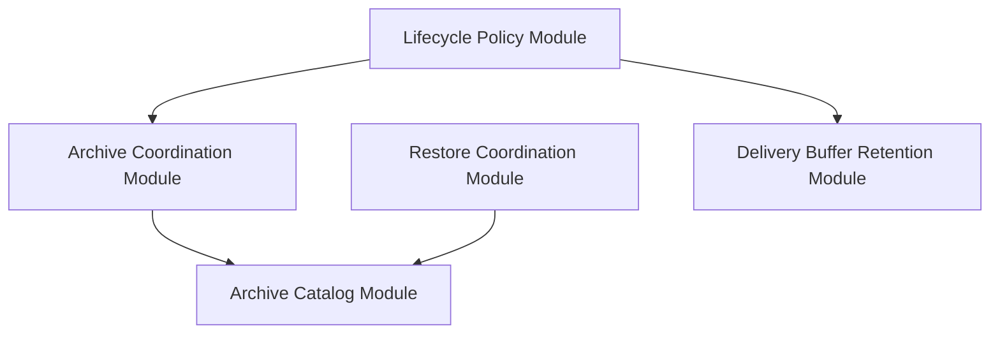
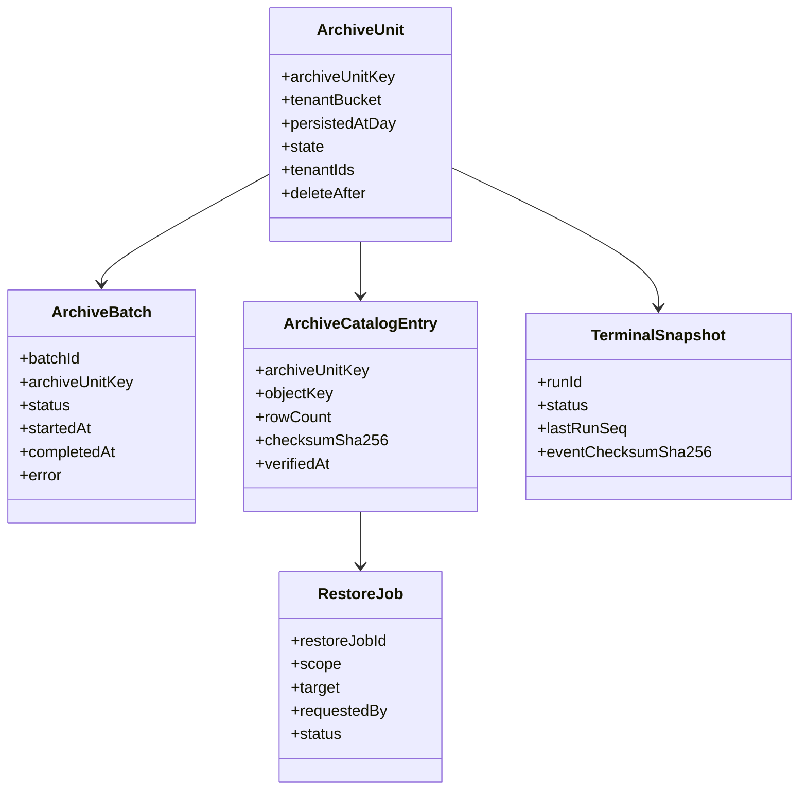
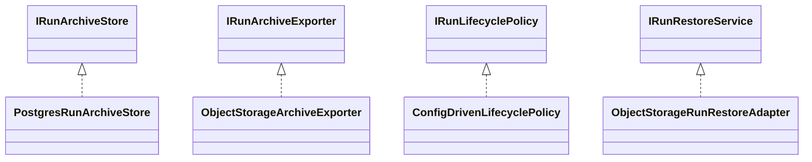

# Gap 5 Domain Design Companion

## Purpose

Describe Gap 5 in DDD, SOLID, OOP, and hexagonal terms, with emphasis on
decoupled modules and domain ownership.

## Bounded Context Position

Gap 5 belongs to the `State` context with operational ties to `Delivery`.

It must not be owned by:

- `Execution` core, because archival is not run semantics
- `Planner`, because archival is not plan generation
- `API`, because API is composition and transport

## Domain Modules

## Ubiquitous Language

- `Archive Unit`: lifecycle unit keyed by `tenant_bucket + persisted_at_day`
- `Archive Batch`: auditable export attempt
- `Archive Catalog Entry`: pointer plus integrity metadata for one cold object
- `Terminal Snapshot`: warm-tier derived status record for one terminal run
- `Restore Job`: auditable recovery action from cold storage

## Domain Class Design

## Ports And Adapters

## SOLID Mapping

- SRP:
  - archive coordination, restore, and buffer retention are separate modules
- OCP:
  - exporters and restore adapters vary behind ports
- ISP:
  - archive, restore, and policy ports stay split
- DIP:
  - coordinators depend on ports, not concrete storage

## Anti-Patterns To Avoid

- engine importing object-storage clients
- one giant lifecycle service doing archive, delete, restore, and buffer purge
- making warm tier a second historical event store
- encoding provider-specific archive logic into domain policy
