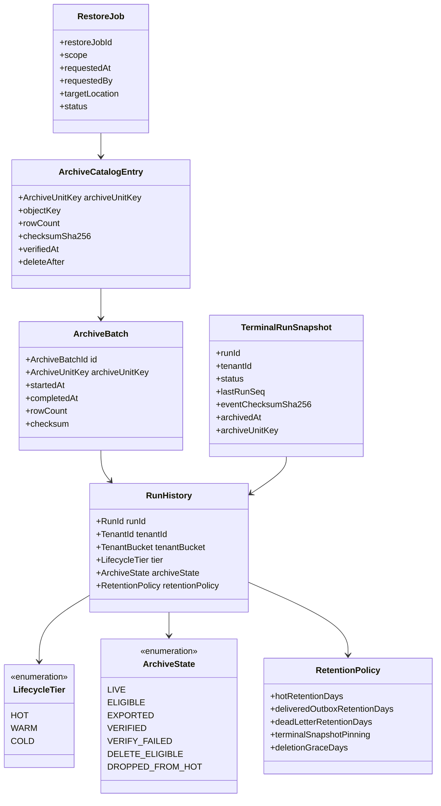
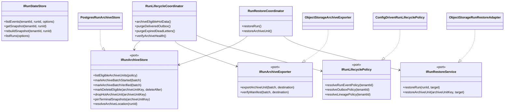
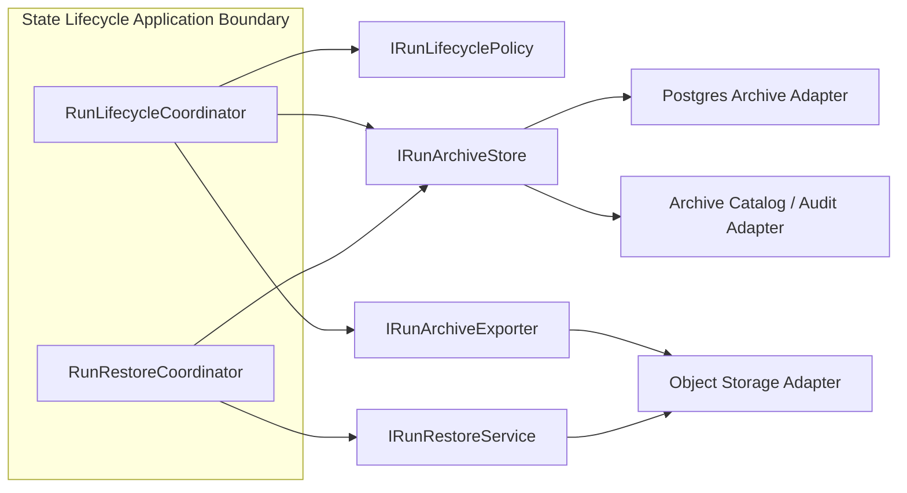
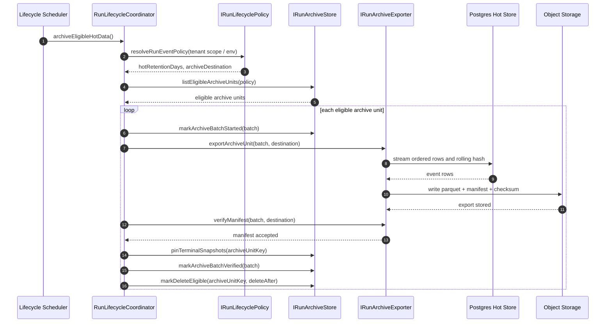
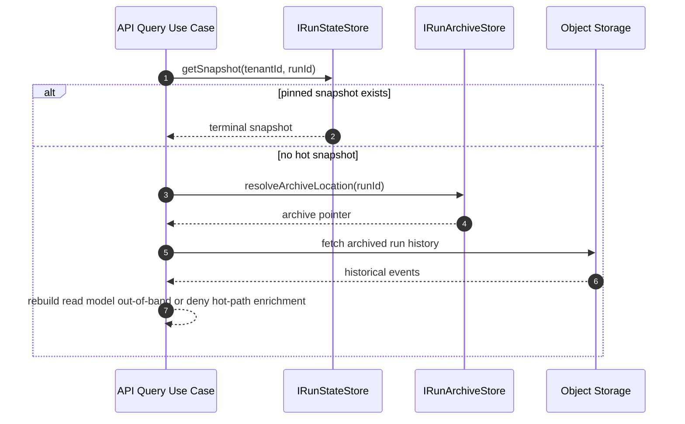
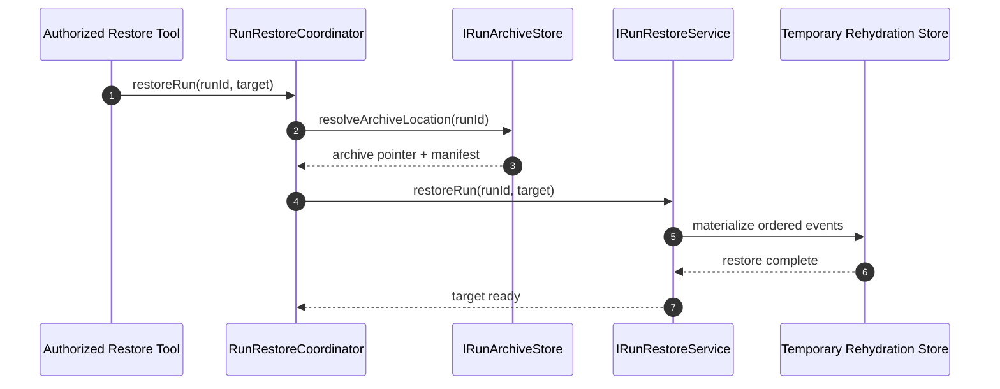
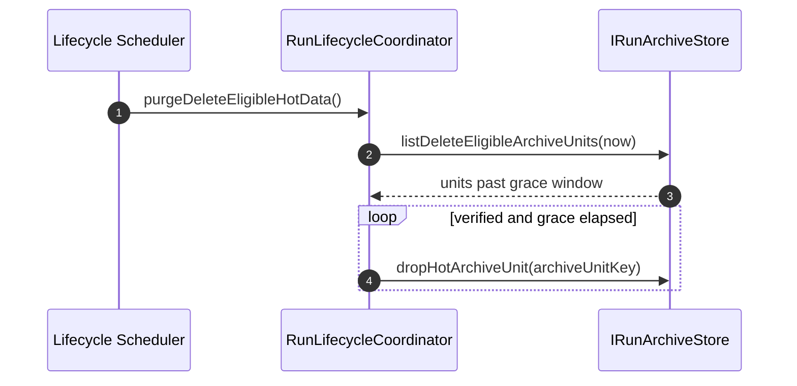

# Gap 5 Event Lifecycle And Archival Design

## Purpose

Define the target design for Gap 5: an event lifecycle model for DVT that adds
retention, archival, redaction, and operational hygiene without violating the
repo's current architectural rules:

- SOLID and object-oriented responsibility boundaries
- CQRS read/write separation
- hexagonal architecture
- event-sourcing immutability from [ADR-0004](../../adr/ADR-0004-event-sourcing-strategy.md)
- tenant isolation from [ADR-0031](../../adr/ADR-0031-adapter-tenant-isolation.md)

This document is a proposal, not an implementation commit.

## Machine Coordination Header

```yaml
parent_plan: gap-5-event-lifecycle-and-archival-design-20260319
delivery_split: true
planned_pr_count: 4
planned_prs:
  - id: G5-PR1
    doc: gap-5-pr1-minimal-usable-archival-20260319.md
    status: proposed
  - id: G5-PR2
    doc: gap-5-pr2-deferred-deletion-and-restore-20260319.md
    status: proposed
  - id: G5-PR3
    doc: gap-5-pr3-delivery-buffer-retention-20260319.md
    status: proposed
  - id: G5-PR4
    doc: gap-5-pr4-redaction-adr-follow-up-20260319.md
    status: proposed
accessory_docs:
  - docs/guides/gap-5-operator-guide-20260319.md
  - docs/guides/gap-5-user-reference-20260319.md
  - docs/runbooks/gap-5-archive-operations-runbook-20260319.md
  - docs/planning/proposals/gap-5-domain-design-companion-20260319.md
  - docs/planning/proposals/gap-5-sequence-and-module-design-20260319.md
```

## Delivery Split

This proposal is intentionally split into **4 PRs**.

The reason is operational, not conceptual:

- one PR for minimum viable archival
- one PR for delete-after-grace plus restore
- one PR for outbox and dead-letter retention
- one PR for regulated-erasure follow-up

The principal document remains the architecture-of-record for Gap 5.
Each PR document is a machine-readable execution slice derived from this
proposal.

## Accessory Documentation Set

This proposal is accompanied by these supporting documents:

- [Gap 5 Operator Guide](../../guides/gap-5-operator-guide-20260319.md)
- [Gap 5 User Reference](../../guides/gap-5-user-reference-20260319.md)
- [Gap 5 Archive Operations Runbook](../../runbooks/gap-5-archive-operations-runbook-20260319.md)
- [Gap 5 Domain Design Companion](gap-5-domain-design-companion-20260319.md)
- [Gap 5 Sequence And Module Design](gap-5-sequence-and-module-design-20260319.md)

## Executive Summary

The target design is:

- keep `run_events` as the authoritative append-only write log
- add an explicit lifecycle service outside the engine domain
- split storage into `hot`, `warm`, and `cold` tiers
- define `warm` narrowly as terminal snapshots plus archive catalog metadata
- preserve replayability by archiving full event history, not compacting it away
- pin terminal snapshots for fast operational reads
- give outbox and dead-letter tables their own retention policies because they
  are delivery buffers, not domain history
- defer redaction implementation out of the archival MVP, but reserve the
  interfaces and audit model needed for a later ADR-backed design

The core design choice is simple:

**DVT should archive domain history, not compact it.**

That is the only design that remains consistent with
[reference-architecture.md](../../architecture/reference-architecture.md),
[ADR-0004](../../adr/ADR-0004-event-sourcing-strategy.md),
and the current Postgres adapter structure in
[PostgresStateStoreAdapter.ts](../../../packages/@dvt/adapter-postgres/src/PostgresStateStoreAdapter.ts).

## Problem Statement

Today DVT has:

- `run_events`
- `run_snapshots`
- `outbox`
- `outbox_dead_letter`
- `lineage_outbox`
- `lineage_dead_letter`

but it does not have:

- a lifecycle owner for long-term state
- a partitioning and archival policy for `run_events`
- a terminal snapshot retention policy
- a clean purge policy for delivery buffers
- a redaction contract for regulated erasure
- an operational distinction between authoritative history and disposable
  delivery state

This is acceptable only while data volume is still modest. It stops being
acceptable as soon as run volume, tenant count, and retention windows become
material.

## Review-Driven Corrections

This revision tightens several points that were too loose in the first draft:

- `warm` is now explicitly limited to terminal snapshots and archive catalog
  rows, not partial historical event storage.
- partitioning is now defined around `tenant_bucket + time`, not time alone.
- retention policy is resolved per tenant, with a global default only as a
  fallback.
- redaction is treated as a deferred but designed-for concern, not as an
  under-specified archival subfeature.
- restore and rehydration are first-class operational flows.
- verification is split into export-time manifest hashing and asynchronous
  integrity validation.
- physical deletion of hot partitions is delayed behind a grace window.
- `tenant_bucket` now has a defined derivation rule and explicit trade-offs.
- redaction-specific storage changes are deferred until PR4 and its ADR.

## Governing Sources

### Repo governance

- [AGENTS.md](../../../AGENTS.md)
- [Governance Document And Rule Inventory](../status/governance-document-rule-inventory.md)
- [Reference Architecture](../../architecture/reference-architecture.md)
- [Current Status](../../architecture/system-delivery-status.md)
- [ADR-0004 Event Sourcing Strategy](../../adr/ADR-0004-event-sourcing-strategy.md)
- [ADR-0008 Signal Idempotency Key Derivation](../../adr/ADR-0008_Signal_Idempotency.md)
- [ADR-0031 Storage Adapter Tenant Isolation Strategy](../../adr/ADR-0031-adapter-tenant-isolation.md)
- [DVT+ Top 5 Architectural Gaps](../dvt-top-5-gaps-corrected-20260319.md)
- [Prioritized Gap Register](../../reviews/prioritized-gaps-20260319.md)

### Code surfaces used as current-state anchors

- [IRunStateStore.ts](../../../packages/@dvt/engine/src/ports/IRunStateStore.ts)
- [PostgresStateStoreAdapter.ts](../../../packages/@dvt/adapter-postgres/src/PostgresStateStoreAdapter.ts)
- [PostgresSchemaManager.ts](../../../packages/@dvt/adapter-postgres/src/PostgresSchemaManager.ts)
- [001_init.sql](../../../packages/@dvt/adapter-postgres/migrations/001_init.sql)
- [004_run_snapshots_and_status_index.sql](../../../packages/@dvt/adapter-postgres/migrations/004_run_snapshots_and_status_index.sql)
- [005_lineage_outbox.sql](../../../packages/@dvt/adapter-postgres/migrations/005_lineage_outbox.sql)

### Mature-system comparison sources

- Temporal official change log:
  [Workflow History Export is now generally available](https://temporal.io/change-log/workflow-history-export)
- Confluent official docs:
  [Tiered Storage in Confluent Platform](https://docs.confluent.io/platform/current/clusters/tiered-storage.html)
- Airflow official docs:
  [Best Practices - Metadata DB maintenance](https://airflow.apache.org/docs/apache-airflow/3.1.7/best-practices.html)
- Kurrent/EventStoreDB official docs:
  [Event streams](https://docs.kurrent.io/server/v24.10/features/streams)
  and [Scavenging](https://docs.kurrent.io/server/v23.10/operations/scavenge.html)
- `pg_partman` official docs:
  [pg_partman](https://pgxn.org/dist/pg_partman/5.1.0/doc/pg_partman.html)
- Debezium official docs:
  [Outbox Event Router](https://debezium.io/documentation/reference/2.6/transformations/outbox-event-router.html)
- Marten official docs:
  [Archiving Event Streams](https://martendb.io/events/archiving)
- Eventuous official docs:
  [Event Store Persistence](https://eventuous.dev/docs/persistence/event-store/)
- Axon Framework official docs:
  [Events Infrastructure](https://docs.axoniq.io/axon-framework-reference/development/events/infrastructure/)

## Design Drivers

1. Preserve event-sourced authority.
2. Keep CQRS explicit: write history is not the same thing as read acceleration.
3. Keep tenant isolation explicit in every lifecycle operation.
4. Avoid coupling the engine to storage maintenance concerns.
5. Make retention and archival deterministic and auditable.
6. Keep recovery, replay, and forensics possible after hot data ages out.
7. Keep GDPR-style erasure explicit, narrow, and separately audited.

## Non-Goals

This proposal does not:

- redefine engine lifecycle semantics
- compact domain history into a single replacement record
- move DVT authority to the provider runtime
- turn snapshots into the canonical write model
- solve analytics product requirements in full
- propose a UI for archive browsing

## Architectural Position

### Why this is not an engine concern

`WorkflowEngine` owns run semantics. It does not own:

- cold storage
- retention windows
- archive job scheduling
- dead-letter expiration
- storage-tier migration

Those are infrastructure and state-lifecycle responsibilities.

Putting them into the engine would violate hexagonal separation because the
domain core would start reasoning about:

- S3 or GCS buckets
- export formats
- archive verification jobs
- storage TTLs
- partition drop operations

That logic belongs behind ports in the state and delivery boundary.

### Target ownership

- `@dvt/engine`
  - remains owner of run semantics and event production
- `@dvt/state-store` plus `@dvt/adapter-postgres`
  - remain owners of authoritative persistence APIs
- `@dvt/delivery`
  - remains owner of outbox and lineage delivery runtime concerns
- new lifecycle concern
  - should live as a state-owned application service, not inside engine core

Recommended future package shape:

```text
packages/@dvt/state-store/
  src/lifecycle/
    IRunArchiveStore.ts
    IRunLifecyclePolicy.ts
    IRunArchiveExporter.ts
    RunLifecycleCoordinator.ts
    RunRestoreCoordinator.ts
```

That may later split into a dedicated package, but it should begin as a
state-owned boundary because it is governed by the event store lifecycle.

## Target Domain Model



### Domain meaning

- `RunHistory` is not a new runtime aggregate. It is the lifecycle view of the
  already persisted event history of a run.
- `LifecycleTier` is a value object describing where authoritative or derived
  material currently lives.
- `ArchiveState` tracks operational lifecycle, not domain status.
- `RetentionPolicy` is configuration interpreted by lifecycle services.
- `ArchiveBatch` is the auditable unit of archival work.
- `ArchiveCatalogEntry` is the durable pointer to the cold object and its
  integrity material.
- `TerminalRunSnapshot` is the whole purpose of `warm`: fast old-run reads
  without keeping historical events in PostgreSQL.
- `RestoreJob` is the auditable unit of recovery from cold storage.

### Terminal snapshot lifecycle

Terminal snapshots are not generated lazily during random old-run reads.

Rule:

1. run reaches a terminal state in hot storage
2. archive unit becomes eligible
3. before the unit is marked `VERIFIED`, the lifecycle flow writes or refreshes
   the terminal snapshot from the hot ordered event stream
4. the snapshot stores:
   - terminal status
   - `lastRunSeq`
   - archive unit key
   - checksum of the event set used to derive it

Non-terminal runs are not eligible for cold archival by default. If that ever
changes, it must be introduced explicitly in a later ADR because it changes the
recovery and replay story.

## Target Class Design



## Hexagonal Boundary



## CQRS Interpretation

### Write side

Authoritative write-side data:

- `run_events`
- `run_metadata`

Write-side invariants:

- append-only event history
- monotonic `run_seq`
- unique `(run_id, idempotency_key)`
- tenant-scoped access

### Read side

Derived read-side data:

- `run_snapshots`
- list/status projections
- archive indexes
- audit views over archived partitions

Read-side lifecycle data may be rebuilt or repinned. Domain history may not be
normally rewritten.

### Delivery side

Not authoritative run history:

- `outbox`
- `outbox_dead_letter`
- `lineage_outbox`
- `lineage_dead_letter`

These are disposable operational buffers. Their lifecycle policy must be
shorter and stricter than event-history lifecycle.

## Capacity Assumptions

This proposal should not be read as storage-agnostic theory. It is based on a
working sizing model that can be tuned later:

| Assumption                     | Working value | Why it matters                          |
| ------------------------------ | ------------- | --------------------------------------- |
| runs per day                   | 10,000        | drives archive cadence                  |
| average events per run         | 100           | drives `run_events` growth              |
| average payload size per event | 2-4 KB        | drives partition sizing and export time |
| hot retention                  | 90 days       | drives hot PostgreSQL footprint         |
| delivered outbox retention     | 7 days        | drives buffer cleanup size              |
| dead-letter retention          | 30 days       | drives operational remediation window   |

Under that model:

- daily event volume is roughly `1,000,000` events
- raw daily `run_events` data is roughly `2-4 GB` before indexes and WAL
- monthly partitions become large quickly, so the default unit should be
  **daily**, not monthly

If real payloads are materially larger, the design should keep the model and
change the archive unit size before implementation.

### Tier model

| Tier | Authority                                  | Physical home                                           | Primary use                             | Default policy                              |
| ---- | ------------------------------------------ | ------------------------------------------------------- | --------------------------------------- | ------------------------------------------- |
| Hot  | Authoritative                              | PostgreSQL active archive units                         | execution, replay, operator reads       | active and recently closed runs             |
| Warm | Derived only                               | PostgreSQL terminal snapshot table plus archive catalog | fast status reads for old terminal runs | terminal snapshot plus archive pointer only |
| Cold | Authoritative copy for long-term retention | object storage in columnar export                       | compliance, forensics, analytics        | full historical event export                |

### Key rule

Cold storage is still an authoritative copy of run history.

That means:

- hot data may age out of PostgreSQL
- but full event history must remain reconstructable from archive plus pinned
  metadata

### Recommended physical shape

#### Hot

- partition `run_events` by `tenant_bucket` and `persisted_at_day`
- preserve tenant field on every row
- keep `run_metadata`
- keep `run_snapshots`
- keep active outbox and DLQ tables

#### Warm

- keep only pinned terminal snapshots
- keep only archive catalog rows and batch audit rows
- keep audit rows for archive batches and redaction requests

Warm does **not** keep partial event history, analytic projections, or reduced
event copies. That would create an ambiguous fourth storage role inside
PostgreSQL and blur authority.

#### Cold

- object storage export by archive unit
- immutable objects
- checksummed export manifest
- queryable externally for audit and analytics

Recommended archive object layout:

```text
archive/
  tenant_bucket=<bucket>/
    tenant_id=<tenant>/
      year=2026/
        month=03/
          day=19/
            archive_unit=tb07_2026_03_19/
              events.parquet
              manifest.json
              checksum.sha256
```

### Archive unit and tenant isolation

The archive unit is the real physical lifecycle boundary:

`archive_unit = (tenant_bucket, persisted_at_day)`

This is stricter than "time partition only" and avoids forcing all tenants into
the same retention fate.

Why `tenant_bucket` instead of literal `tenant_id` partitioning:

- direct `tenant_id` partitions may explode partition count for many tenants
- hash buckets preserve isolation at the lifecycle unit while keeping partition
  count operationally bounded
- tenant-specific retention remains possible because each archive unit records
  the set of tenants it contains, and no unit is dropped until all contained
  tenants are eligible under policy

### `tenant_bucket` definition

`tenant_bucket` is not conceptual glue. It must be deterministic and explicit.

Proposed derivation:

```text
tenant_bucket = crc32(tenant_id) % archive_bucket_count
```

Rules:

- `archive_bucket_count` is environment-configurable
- production default should be high enough to reduce mixed-retention contention
- bucket derivation is stable for a given tenant while the configuration is
  unchanged

Trade-off:

- a shared bucket means effective deletion date for one tenant can be delayed by
  another tenant in the same archive unit

Mitigation:

- choose a sufficiently high bucket count
- record actual tenant set per archive unit in the catalog
- compute delete date as the maximum required retention date across tenants in
  that unit

Rebalancing:

- not part of PR1
- if needed later, it is a migration operation, not an online rule change
- rebalancing requires writing new archive units and updating the catalog, never
  silently reinterpreting old bucket assignments

### Retention resolution order

Retention policy is resolved in this order:

1. per-tenant override
2. per-environment default
3. global default

No archive or deletion operation should assume a single global retention rule.

## Sequence Diagrams

### 1. Nightly archive of eligible hot archive units



### 2. Read path for an old terminal run



### 3. Restore path for a cold run



### 4. Deferred delete after grace window



## SOLID / OOP / CQRS / Hexagonal Mapping

### SOLID

- `RunLifecycleCoordinator`
  - single responsibility: orchestrate lifecycle work, not engine semantics
- `IRunArchiveExporter`
  - open/closed: new exporters can target S3, GCS, Azure without touching the
    coordinator
- `IRunLifecyclePolicy`
  - interface segregation: retention policy is separate from storage access
- dependency inversion
  - coordinator depends on ports, not on Postgres or S3 details

### OOP

This design stays object-oriented in the useful sense:

- explicit domain nouns (`ArchiveBatch`, `RetentionPolicy`, `ArchiveCatalogEntry`)
- explicit responsibilities
- narrow methods per service
- no procedural script that mixes policy, IO, and audit in one place

### CQRS

- write authority remains in event append flow
- read acceleration remains in snapshots and archive catalogs
- archive export is lifecycle orchestration over authoritative write data
- snapshot pinning is a read-model concern

### Hexagonal

- no object storage calls from engine core
- no Postgres partition management inside `WorkflowEngine`
- lifecycle decisions are application services over state ports
- adapters implement export, redaction storage, and partition operations

## Verification, Restore, And Safety Model

### Verification model

Verification should not rely on a second full-table reread in the critical path.

The proposal is:

1. export reads rows ordered by `run_seq`
2. exporter computes a rolling hash while streaming rows
3. exporter writes `manifest.json` with:
   - archive unit key
   - tenant set
   - row count
   - min and max `run_seq`
   - rolling hash
   - export timestamp
4. asynchronous verifier validates:
   - object exists
   - row count matches manifest
   - checksum matches expected value
5. only then is the archive unit marked `VERIFIED`

This keeps the archive path bounded while still giving a strong integrity
contract.

State model:

- `LIVE`: still fully hot
- `ELIGIBLE`: selected for export
- `EXPORTED`: object and manifest written
- `VERIFY_FAILED`: verification did not pass
- `VERIFIED`: integrity checks passed
- `DELETE_ELIGIBLE`: grace window started
- `DROPPED_FROM_HOT`: hot copy removed

Operational rule:

- verification SLA target: less than `24h` from `EXPORTED`
- `VERIFY_FAILED` requires alerting and manual/operator follow-up if retries
  keep failing
- units in `VERIFY_FAILED` are never auto-deleted

### Ordering and replay consistency

Archive is only acceptable if replay semantics survive the move to cold
storage.

Required rules:

- exporter streams rows ordered by `run_seq ASC`
- manifest records `min_run_seq`, `max_run_seq`, and row count
- verifier rejects an archive unit if it detects duplicate or missing sequence
  ranges
- restore and rebuild must use the same ordering rule as hot replay

This keeps archival aligned with
[ADR-0004](../../adr/ADR-0004-event-sourcing-strategy.md) and avoids turning
"archived" into "non-replayable."

### Restore model

Restoration is intentionally explicit and exceptional.

Supported restore scopes:

- one run into a temporary rehydration table
- one archive unit into a temporary schema
- one archive unit back into hot storage only for admin recovery

Restoration is not part of the normal API hot path.

Authorization and safety rules:

- restore is admin-only
- every restore request is audited with requester identity and reason
- default restore target is a temporary schema
- hot rehydrate is exceptional and requires explicit operator intent
- restore workers must throttle concurrency to avoid object-storage and database
  pressure

Conflict rule:

- a restore request must not overwrite an already-live hot run implicitly
- if the run already exists in hot storage, restore goes to a temporary target
  unless an explicit admin override path is chosen

### Deferred deletion safety

`VERIFIED` is not the same as "safe to delete immediately."

The proposed safety sequence is:

1. export
2. verify
3. mark delete-eligible
4. wait grace window, default `7` days
5. only then drop the hot archive unit

This avoids turning one export bug into permanent data loss.

## Recommended Lifecycle Policies

These are proposed defaults, not hard-coded constants:

| Surface                               | Proposed default          | Rationale                                                                                |
| ------------------------------------- | ------------------------- | ---------------------------------------------------------------------------------------- |
| `run_events` hot retention            | 90 days                   | enough for replay, incident triage, and late operator inspection                         |
| terminal snapshots                    | keep while archive exists | hot operational reads stay fast                                                          |
| delivered outbox rows                 | 7 days                    | enough for short operational debugging, without retaining transient buffers for too long |
| outbox dead letters                   | 30 days                   | enough for remediation and incident follow-up without long-lived operational clutter     |
| lineage delivered rows                | short retention           | delivery buffer, not core history                                                        |
| lineage dead letters                  | 30 days                   | aligns lineage remediation with delivery remediation                                     |
| deletion grace after verified archive | 7 days                    | protects against silent export bugs and operator error                                   |

### Buffer purge eligibility rules

Outbox and dead-letter retention must be machine-checkable, not inferred by
operators.

Proposed eligibility:

- delivered outbox row:
  - `delivered_at IS NOT NULL`
  - older than configured retention window
- outbox dead-letter row:
  - older than configured retention window
  - and not protected by an explicit investigation hold, if such a hold exists
- lineage delivered row:
  - delivered or terminally acknowledged by its owning flow
- lineage dead-letter row:
  - older than configured retention window
  - and not under investigation hold

If investigation holds are implemented later, purge must honor them.

### Important distinction

Retention on hot PostgreSQL is not the same as destruction of history.

For `run_events`, hot retention means:

- export
- verify
- pin snapshot
- drop hot archive unit after the grace window

For outbox and dead letters, retention may mean physical deletion because those
tables are operational buffers.

## Comparison With Mature Systems

### Confluent / Kafka tiered storage

Confluent tiered storage keeps a local hot set and offloads older data to object
storage. Their docs distinguish between:

- local hot retention via `confluent.tier.local.hotset.ms`
- full retention via `retention.ms`
- object storage as part of the lifecycle, not an afterthought

That is directly relevant for DVT.

What DVT should borrow:

- separate hot-local retention from total retention
- keep object storage lifecycle under the system's own policy
- verify that storage-bucket policy does not silently fight application policy

What DVT should not borrow literally:

- Kafka-style compaction semantics for domain history

DVT events are workflow-domain facts, not topic segments designed for
broker-level compaction rules.

### Temporal workflow history export

Temporal Cloud now supports export of closed workflow histories to object
storage. That is a strong precedent for the architectural direction:

- keep active execution fast
- move closed histories to cheaper durable storage
- preserve auditability and compliance

What DVT should borrow:

- closed-history export as a first-class lifecycle capability
- archive as the long-term compliance and audit target

What DVT should keep different:

- DVT owns the semantic event model, not the provider
- DVT snapshots and state-store rules remain first-class repository concerns

Temporal is the provider runtime, not the source of truth for DVT semantics.

### Airflow metadata cleanup

Airflow recommends metadata DB maintenance and offers `airflow db clean`.

This is useful as an operational comparison, but it is not the right semantic
model for DVT.

Why:

- Airflow metadata DB is orchestration metadata
- DVT `run_events` is the authoritative event-sourced ledger

So DVT should copy the maintenance discipline, not the deletion philosophy.

### EventStoreDB / Kurrent

EventStoreDB is the clearest warning sign here.

Their docs make two things explicit:

- streams are append-only event history
- scavenging is destructive and should be treated with care

That aligns strongly with DVT's own rules.

What DVT should borrow:

- event history is not casually mutable
- deletion/redaction paths must be explicit and auditable
- lifecycle cleanup and historical truth are separate concerns

What DVT should avoid:

- normalizing destructive scavenging as the ordinary lifecycle path for domain
  history

## Proven-System And OSS Reuse Matrix

| Capability in DVT                             | Mature-system precedent                           | Reusable OSS or product                                                 | What we should do                                                             |
| --------------------------------------------- | ------------------------------------------------- | ----------------------------------------------------------------------- | ----------------------------------------------------------------------------- |
| append-only authoritative event history       | EventStoreDB / Kurrent streams                    | EventStoreDB, Marten, Eventuous                                         | keep DVT event authority and borrow design discipline, not vendor semantics   |
| hot plus cold history lifecycle               | Temporal history export, Confluent tiered storage | object storage plus exporter code, `pg_partman` for partition lifecycle | implement custom lifecycle orchestration on top of proven storage patterns    |
| partition maintenance and retention mechanics | PostgreSQL partition maintenance practice         | `pg_partman`                                                            | reuse for partition creation, detach, and retention maintenance where it fits |
| event stream archiving over PostgreSQL        | Marten hot/cold archiving                         | Marten as reference only                                                | use as architectural precedent, not as a direct runtime dependency            |
| abstract event store behind ports             | Axon and Eventuous                                | Axon, Eventuous as reference                                            | keep ports and adapters in DVT state boundary                                 |
| delivery buffer publication pattern           | Debezium outbox pattern                           | Debezium Outbox Event Router                                            | reuse only for delivery-buffer thinking, not for `run_events` authority       |
| history deletion safety                       | EventStoreDB scavenge caution                     | EventStoreDB docs as warning, not library reuse                         | keep delete-after-grace and explicit operator recovery                        |

### Matrix reading rule

This matrix does **not** mean DVT should adopt a single external framework for
Gap 5.

It means:

- the architectural direction is validated by mature systems
- selected mechanics may be reused
- the composition of policy, archive catalog, terminal snapshots, restore, and
  per-tenant retention remains DVT-specific

## Normative ADR Closure

This proposal is now complemented by these normative ADRs:

- [ADR-0037 - Run Event Lifecycle Archival, Verification, and Restore Model](../../adr/ADR-0037-run-event-lifecycle-archival-verification-and-restore-model.md)
- [ADR-0038 - Delivery Buffer Retention and Purge Policy](../../adr/ADR-0038-delivery-buffer-retention-and-purge-policy.md)

They convert the architecture direction into repository-governing decisions.

## Rational

### Why archive instead of compact

Because DVT is already committed to event sourcing.

If DVT compacted terminal runs into one replacement row:

- replay would be broken
- historical diagnosis would be weaker
- auditability would become conditional
- provider replacement and contract verification would lose evidence

That would contradict [ADR-0004](../../adr/ADR-0004-event-sourcing-strategy.md).

### Why pin terminal snapshots

Because old runs are read mostly for status, not for replay.

Pinned terminal snapshots give:

- cheap API reads
- fast UI and operator experience
- lower demand on hot event scans

without pretending that the snapshot is the authority.

### Why isolate outbox lifecycle from event lifecycle

Because outbox is delivery machinery.

Once a record is delivered and the authoritative domain event remains preserved,
the outbox row has served its purpose.

Applying domain-history rules to outbox would waste storage.
Applying outbox-deletion rules to domain history would break auditability.

### Why redaction is not in the archival MVP

Because retention and erasure are different things.

Retention answers:

- how long do we keep hot or warm copies?

Redaction answers:

- what do we do when law or policy requires removal or masking of sensitive
  fields?

Treating redaction as "just archive expiration" is not sufficient for regulated
systems.

This proposal therefore narrows the MVP:

- archival MVP: yes
- restore MVP: yes
- retention and purge MVP: yes
- redaction implementation MVP: no

What is included now is only the architectural reservation:

- PR1 to PR3 do not force a redaction-specific schema shape
- PR4 must start with its own ADR before introducing storage fields or tables
- any generic audit columns added earlier must remain generic enough not to
  pre-decide the eventual redaction mechanism

That is safer than pretending the archival design already solves regulated
erasure, or prematurely freezing the wrong schema.

## Proposed Interfaces

Illustrative shape only:

```ts
export interface RunEventRetentionPolicy {
  readonly hotRetentionDays: number;
  readonly archiveFormat: 'parquet';
  readonly archiveDestination: 's3' | 'gcs';
  readonly pinTerminalSnapshots: boolean;
  readonly deletionGraceDays: number;
}

export interface IRunArchiveStore {
  listEligibleArchiveUnits(policy: RunEventRetentionPolicy): Promise<
    readonly {
      archiveUnitKey: string;
      tenantBucket: string;
      tenantIds: readonly string[];
      minPersistedAtIso: string;
      maxPersistedAtIso: string;
      estimatedRowCount: number;
    }[]
  >;
  pinTerminalSnapshots(archiveUnitKey: string): Promise<number>;
  markArchiveBatchStarted(batch: ArchiveBatch): Promise<void>;
  markArchiveBatchVerified(batchId: string, checksum: string, rowCount: number): Promise<void>;
  markDeleteEligible(archiveUnitKey: string, deleteAfterIso: string): Promise<void>;
  dropHotArchiveUnit(archiveUnitKey: string): Promise<void>;
  resolveArchiveLocation(runId: string): Promise<ArchiveCatalogEntry | null>;
}

export interface IRunArchiveExporter {
  exportArchiveUnit(batch: ArchiveBatch): Promise<{
    objectKey: string;
    checksumSha256: string;
    rowCount: number;
  }>;
  verifyManifest(batchId: string): Promise<void>;
}

export interface IRunRestoreService {
  restoreRun(runId: string, target: 'temp_schema' | 'hot_rehydrate'): Promise<void>;
  restoreArchiveUnit(
    archiveUnitKey: string,
    target: 'temp_schema' | 'hot_rehydrate'
  ): Promise<void>;
}
```

## Delivery Slices

The first draft had too many slices with too little deployable value. The
revised sequence is:

### Slice 1: minimal usable archival

- tenant-bucket plus daily archive-unit schema
- archive catalog tables
- object-storage exporter
- manifest generation
- asynchronous verifier
- terminal snapshot pinning
- mark-delete-eligible, but do not drop yet
- metrics and logs from day one

This slice must already archive real data and make PostgreSQL pressure visible.

### Slice 2: deferred deletion and restore

- grace-window delete worker
- restore tool for one run and one archive unit
- operational safeguards and leadership/locking

This slice makes the system operationally credible.

### Slice 3: delivery buffer retention

- delivered outbox purge
- outbox dead-letter purge
- lineage outbox and lineage dead-letter purge
- dashboards and alerts for backlog and purge health

### Slice 4: redaction ADR and follow-up implementation

- ADR for regulated erasure
- audit model
- chosen redaction mechanism
- compatibility story for archived objects

Redaction is intentionally not bundled into Slice 1.

## Planned PR Breakdown

| PR ID    | Secondary doc                                                                                              | Scope                                                                                | Why it stands alone                              |
| -------- | ---------------------------------------------------------------------------------------------------------- | ------------------------------------------------------------------------------------ | ------------------------------------------------ |
| `G5-PR1` | [gap-5-pr1-minimal-usable-archival-20260319.md](gap-5-pr1-minimal-usable-archival-20260319.md)             | archive unit schema, exporter, catalog, verifier, terminal snapshot pinning, metrics | first usable archival release                    |
| `G5-PR2` | [gap-5-pr2-deferred-deletion-and-restore-20260319.md](gap-5-pr2-deferred-deletion-and-restore-20260319.md) | grace delete worker, restore tooling, leader/fencing model                           | makes archival safe and operable                 |
| `G5-PR3` | [gap-5-pr3-delivery-buffer-retention-20260319.md](gap-5-pr3-delivery-buffer-retention-20260319.md)         | outbox and dead-letter purge, lineage buffer cleanup, metrics and alerts             | separate lifecycle for non-authoritative buffers |
| `G5-PR4` | [gap-5-pr4-redaction-adr-follow-up-20260319.md](gap-5-pr4-redaction-adr-follow-up-20260319.md)             | ADR-backed redaction model, audit, archive compatibility                             | legally sensitive and architecturally separate   |

## Risks And Open Questions

1. Whether `tenant_bucket` cardinality should be fixed globally or environment
   specific.
2. Whether archived-event reads should ever surface in the product API, or stay
   admin-only.
3. Whether asynchronous verification should use full checksum, block sampling,
   or both for very large archive units.
4. Which legal requirements force physical rewrite of archived files for
   redaction, versus projection-level masking only.
5. Whether warm terminal snapshots should stay in the same PostgreSQL schema or
   move to a dedicated archival-read schema later.

## Availability And Operations

The lifecycle coordinator must not be a single-shot cron script with hidden
state.

Minimum operational requirements:

- coordinator work is idempotent
- one leader at a time, using database-backed leadership or equivalent fencing
- archive batch state persisted in catalog tables
- failed archive units can be retried without re-exporting successful ones
- metrics emitted from the first slice

Concrete leadership default:

- one row in a lifecycle leadership table
- optimistic lease with heartbeat timestamp
- lease timeout promotes a new leader
- all destructive operations re-check ownership before execution

Minimum metric set:

- `dvt.archive.units_eligible_total`
- `dvt.archive.units_exported_total`
- `dvt.archive.units_verified_total`
- `dvt.archive.units_delete_eligible_total`
- `dvt.archive.units_deleted_total`
- `dvt.archive.export_duration_ms`
- `dvt.archive.restore_duration_ms`
- `dvt.archive.export_failures_total`
- `dvt.archive.verify_failures_total`
- `dvt.outbox.retained_rows`
- `dvt.dead_letter.retained_rows`

Minimum log dimensions:

- `archiveUnitKey`
- `tenantBucket`
- `tenantCount`
- `rowCount`
- `batchId`
- `objectKey`

## Migration And Backfill

This plan must not assume an empty production database.

Initial migration requirements:

1. create archive-unit schema and catalog without downtime
2. repartition or backfill existing `run_events` into the new archive-unit model
3. identify already-old hot data that is immediately archive-eligible
4. archive that backlog in controlled batches
5. only then enable steady-state lifecycle scheduling

Backfill must be:

- resumable
- rate-limited
- observable
- safe under concurrent normal write traffic

## Load, Failure, And Chaos Validation

No PR in Gap 5 should be considered complete without operational validation.

Minimum validation themes:

- export throughput at the working sizing model
- verification lag under normal and degraded object-storage latency
- coordinator failover during export
- restore under throttled object-storage access
- corrupted manifest detection
- object-storage write failure mid-export
- repeated verifier failure and operator escalation path

Each implementation PR should include:

- load assumptions used
- exact validation command or harness
- pass/fail outcome

## Idempotency And Historical Completeness

Archived events must preserve all fields required for:

- replay
- historical reasoning
- audit
- future verification of idempotency-derived behavior

That includes keeping identifiers and sequencing fields intact in cold storage,
not exporting a reduced record shape that drops semantically relevant fields.

## Recommendation

Approve the architecture in this order:

1. accept "archive, do not compact" as the non-negotiable rule
2. define lifecycle ownership outside engine core
3. define separate policies for `run_events`, snapshots, outbox, and dead
   letters
4. define the redaction contract before enterprise data scale arrives
5. implement partitioning before Phase 3 data volume makes it painful

## Decision Summary

If we optimize for architectural cleanliness and long-term operability, the
design to build is:

- event-sourced authority stays in `run_events`
- hot PostgreSQL is finite
- cold archive is authoritative and immutable
- warm snapshots are derived and pinned
- outbox and DLQ are operational buffers with independent TTL
- redaction is a dedicated audited workflow

That is the design most consistent with SOLID, OOP, CQRS, hexagonal
architecture, and the repo's accepted ADRs.

## PR Resolution Table

| PR ID    | Secondary doc                                         | Planned status | Actual PR | Resolution | Notes                      |
| -------- | ----------------------------------------------------- | -------------- | --------- | ---------- | -------------------------- |
| `G5-PR1` | `gap-5-pr1-minimal-usable-archival-20260319.md`       | proposed       | pending   | open       | minimum viable archival    |
| `G5-PR2` | `gap-5-pr2-deferred-deletion-and-restore-20260319.md` | proposed       | pending   | open       | restore plus safe delete   |
| `G5-PR3` | `gap-5-pr3-delivery-buffer-retention-20260319.md`     | proposed       | pending   | open       | delivery-buffer lifecycle  |
| `G5-PR4` | `gap-5-pr4-redaction-adr-follow-up-20260319.md`       | proposed       | pending   | open       | deferred regulated erasure |
