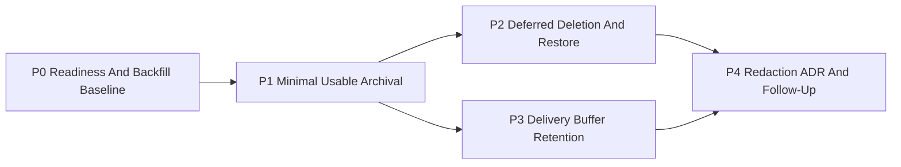

# Gap 5 Executive Delivery Roadmap

## Purpose

Provide the execution roadmap for Gap 5 in one page.

This is not a replacement for the design proposal or the ADRs. It is the
delivery view that answers:

- what ships first
- what depends on what
- which decisions govern each step
- which files or modules are expected to move in each step
- what must be true before the next step starts

## Scope Classification

- planning surface: subsystem roadmap
- parent design:
  [Gap 5 Event Lifecycle And Archival Design](../proposals/gap-5-event-lifecycle-and-archival-design-20260319.md)
- governing ADRs:
  - [ADR-0037 - Run Event Lifecycle Archival, Verification, and Restore Model](../../adr/ADR-0037-run-event-lifecycle-archival-verification-and-restore-model.md)
  - [ADR-0038 - Delivery Buffer Retention and Purge Policy](../../adr/ADR-0038-delivery-buffer-retention-and-purge-policy.md)

## Executive Summary

Gap 5 should be executed in **5 phases**:

1. readiness and backfill baseline
2. minimal usable archival
3. deferred deletion and restore
4. delivery-buffer retention
5. redaction ADR and follow-up implementation

The critical path is:

`baseline -> archival -> safe delete/restore -> buffer retention -> redaction`

## Delivery Graph

## Phase Table

| Phase | Primary outcome                                              | Planned PR anchor | Depends on | Exit gate                                             |
| ----- | ------------------------------------------------------------ | ----------------- | ---------- | ----------------------------------------------------- |
| `P0`  | readiness, sizing, migration posture, observability baseline | roadmap only      | none       | implementation can start without guessing             |
| `P1`  | export and verify archive units, pin terminal snapshots      | `G5-PR1`          | `P0`       | real archival works without deleting hot data         |
| `P2`  | grace delete, restore, leadership/fencing                    | `G5-PR2`          | `P1`       | archival becomes operationally safe                   |
| `P3`  | delivery-buffer lifecycle cleanup                            | `G5-PR3`          | `P1`       | non-authoritative buffers stop accumulating unchecked |
| `P4`  | regulated-erasure decision and implementation path           | `G5-PR4`          | `P2`, `P3` | redaction is governed without breaking archival model |

## Phase 0: Readiness And Backfill Baseline

### Purpose

Remove ambiguity before changing persistence mechanics.

### Related decisions

- [ADR-0004 - Event Sourcing Strategy](../../adr/ADR-0004-event-sourcing-strategy.md)
- [ADR-0008 - Signal Idempotency Key Derivation](../../adr/ADR-0008_Signal_Idempotency.md)
- [ADR-0031 - Storage Adapter Tenant Isolation Strategy](../../adr/ADR-0031-adapter-tenant-isolation.md)
- [ADR-0037 - Run Event Lifecycle Archival, Verification, and Restore Model](../../adr/ADR-0037-run-event-lifecycle-archival-verification-and-restore-model.md)

### Related planning documents

- [Gap 5 Event Lifecycle And Archival Design](../proposals/gap-5-event-lifecycle-and-archival-design-20260319.md)
- [Gap 5 User Reference](../../guides/gap-5-user-reference-20260319.md)
- [Gap 5 Domain Design Companion](../proposals/gap-5-domain-design-companion-20260319.md)

### Expected files and modules

- [PostgresStateStoreAdapter.ts](f:/segundodvt/dvt/packages/@dvt/adapter-postgres/src/PostgresStateStoreAdapter.ts)
- [PostgresSchemaManager.ts](f:/segundodvt/dvt/packages/@dvt/adapter-postgres/src/PostgresSchemaManager.ts)
- [001_init.sql](f:/segundodvt/dvt/packages/@dvt/adapter-postgres/migrations/001_init.sql)
- [004_run_snapshots_and_status_index.sql](f:/segundodvt/dvt/packages/@dvt/adapter-postgres/migrations/004_run_snapshots_and_status_index.sql)
- [005_lineage_outbox.sql](f:/segundodvt/dvt/packages/@dvt/adapter-postgres/migrations/005_lineage_outbox.sql)
- future migration files under `packages/@dvt/adapter-postgres/migrations/`

### Deliverables

- final archive-unit cardinality decision for `tenant_bucket`
- migration/backfill approach for existing `run_events`
- minimum metrics and logging dimensions confirmed
- baseline sizing assumptions confirmed or updated

### Exit criteria

- no open ambiguity on archive-unit derivation
- no open ambiguity on terminal snapshot lifecycle
- no open ambiguity on initial migration/backfill posture

## Phase 1: Minimal Usable Archival

### Purpose

Ship the first real archival slice without deleting hot data yet.

### Related decisions

- [ADR-0037 - Run Event Lifecycle Archival, Verification, and Restore Model](../../adr/ADR-0037-run-event-lifecycle-archival-verification-and-restore-model.md)

### Related planning documents

- [Gap 5 PR1 Minimal Usable Archival](../proposals/gap-5-pr1-minimal-usable-archival-20260319.md)
- [Gap 5 Sequence And Module Design](../proposals/gap-5-sequence-and-module-design-20260319.md)

### Expected files and modules

- [PostgresStateStoreAdapter.ts](f:/segundodvt/dvt/packages/@dvt/adapter-postgres/src/PostgresStateStoreAdapter.ts)
- [PostgresSchemaManager.ts](f:/segundodvt/dvt/packages/@dvt/adapter-postgres/src/PostgresSchemaManager.ts)
- `packages/@dvt/adapter-postgres/migrations/*gap5*.sql`
- `packages/@dvt/state-store/src/lifecycle/*`
- future archive exporter adapter under state/storage integration
- terminal snapshot read/write surfaces in state-store and adapter-postgres

### Deliverables

- archive catalog tables
- archive batch tracking
- object-storage export
- manifest generation
- async verification
- terminal snapshot pinning
- metrics and structured logs

### Exit criteria

- one archive unit can be exported and verified
- terminal runs remain queryable through warm snapshots
- no hot archive unit is deleted in this phase

## Phase 2: Deferred Deletion And Restore

### Purpose

Make archival safe and operationally credible.

### Related decisions

- [ADR-0037 - Run Event Lifecycle Archival, Verification, and Restore Model](../../adr/ADR-0037-run-event-lifecycle-archival-verification-and-restore-model.md)

### Related planning documents

- [Gap 5 PR2 Deferred Deletion And Restore](../proposals/gap-5-pr2-deferred-deletion-and-restore-20260319.md)
- [Gap 5 Archive Operations Runbook](../../runbooks/gap-5-archive-operations-runbook-20260319.md)

### Expected files and modules

- lifecycle coordinator and restore coordinator under `packages/@dvt/state-store/src/lifecycle/*`
- adapter-postgres lifecycle catalog and delete worker surfaces
- restore adapter implementation against object storage
- admin or operator tooling entrypoints for restore commands

### Deliverables

- delete-after-grace worker
- restore one run
- restore one archive unit
- leadership/fencing
- retry and resume semantics

### Exit criteria

- verified units age into delete-eligible safely
- restore works into temporary targets
- destructive operations are fenced and auditable

## Phase 3: Delivery Buffer Retention

### Purpose

Clean up non-authoritative delivery buffers with explicit lifecycle rules.

### Related decisions

- [ADR-0038 - Delivery Buffer Retention and Purge Policy](../../adr/ADR-0038-delivery-buffer-retention-and-purge-policy.md)
- [ADR-0033 - Outbox Worker Sharding And Fencing Model](../../adr/ADR-0033-outbox-worker-sharding-and-fencing-model.md)
- [ADR-0009 - Outbox Publication Ordering Guarantees](../../adr/ADR-0009_Outbox_Ordering.md)

### Related planning documents

- [Gap 5 PR3 Delivery Buffer Retention](../proposals/gap-5-pr3-delivery-buffer-retention-20260319.md)

### Expected files and modules

- [005_lineage_outbox.sql](f:/segundodvt/dvt/packages/@dvt/adapter-postgres/migrations/005_lineage_outbox.sql)
- outbox and lineage cleanup migrations under `packages/@dvt/adapter-postgres/migrations/`
- outbox worker or delivery-maintenance services under `apps/outbox-worker/` and delivery-owned packages
- retention policy configuration surfaces

### Deliverables

- delivered outbox purge
- dead-letter purge
- lineage buffer purge
- purge metrics and alerts

### Exit criteria

- retained delivery buffers are policy-bounded
- purge jobs are repeatable and observable
- cleanup never touches authoritative run history

## Phase 4: Redaction ADR And Follow-Up

### Purpose

Handle regulated erasure without corrupting the archival model.

### Related decisions

- [ADR-0037 - Run Event Lifecycle Archival, Verification, and Restore Model](../../adr/ADR-0037-run-event-lifecycle-archival-verification-and-restore-model.md)
- future redaction ADR created from [Gap 5 PR4 Redaction ADR And Follow-Up](../proposals/gap-5-pr4-redaction-adr-follow-up-20260319.md)

### Related planning documents

- [Gap 5 PR4 Redaction ADR And Follow-Up](../proposals/gap-5-pr4-redaction-adr-follow-up-20260319.md)

### Expected files and modules

- future ADR under `docs/adr/`
- future audit and redaction storage surfaces under state-store and adapter-postgres
- archive catalog compatibility fields only after ADR acceptance

### Deliverables

- accepted redaction ADR
- audit model
- implementation choice for hot and cold data
- compatibility rules for archived objects

### Exit criteria

- the repository has one explicit redaction model
- archival and restore semantics remain coherent after redaction decision

## Risks By Phase

| Phase | Main risk                                                                    | Mitigation                                                         |
| ----- | ---------------------------------------------------------------------------- | ------------------------------------------------------------------ |
| `P0`  | starting implementation with unresolved partitioning or backfill assumptions | freeze archive-unit and migration posture first                    |
| `P1`  | export works but verification or snapshot consistency is weak                | make manifest, checksum, and terminal snapshot invariants explicit |
| `P2`  | one export bug causes irreversible loss                                      | enforce grace delete and restore before aggressive cleanup         |
| `P3`  | buffers are purged too early or not at all                                   | machine-checkable eligibility and metrics                          |
| `P4`  | legal erasure model contradicts archival assumptions                         | require ADR before schema-level commitment                         |

## Acceptance Rule For The Full Roadmap

Gap 5 should be considered substantively complete only when:

- `P1` through `P3` are implemented and validated
- `P4` has an accepted ADR, even if rollout is staged
- user/operator guidance remains aligned with the shipped behavior

## Related

- [Roadmap Of Record](index.md)
- [Gap 5 Event Lifecycle And Archival Design](../proposals/gap-5-event-lifecycle-and-archival-design-20260319.md)
- [Gap 5 User Reference](../../guides/gap-5-user-reference-20260319.md)
