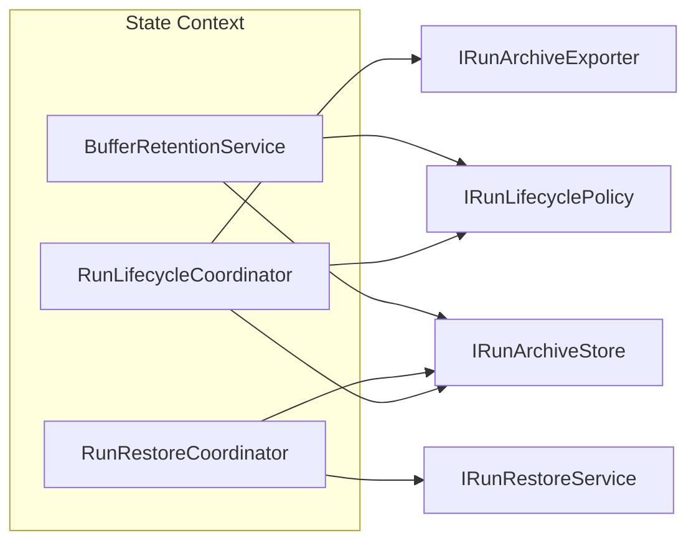
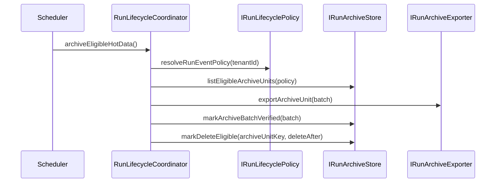
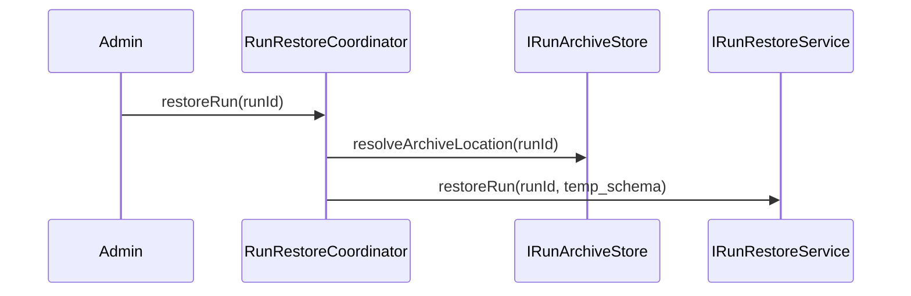
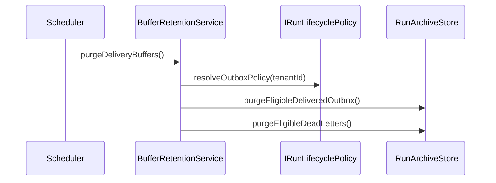

# Gap 5 Sequence And Module Design

## Purpose

Capture the dynamic flows and module boundaries for Gap 5 in a way that is
reviewable independently from the main proposal.

## Module Boundary View

## Export Sequence

## Restore Sequence

## Delivery Buffer Cleanup Sequence

## PR Mapping

| PR       | Modules primarily touched                                   |
| -------- | ----------------------------------------------------------- |
| `G5-PR1` | archive coordination, exporter, catalog, terminal snapshots |
| `G5-PR2` | restore coordination, delete-after-grace, leadership        |
| `G5-PR3` | buffer retention                                            |
| `G5-PR4` | redaction follow-up                                         |
