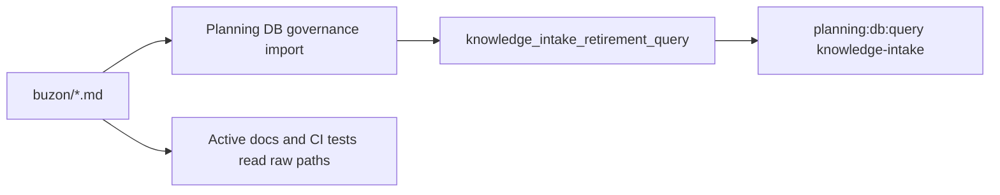
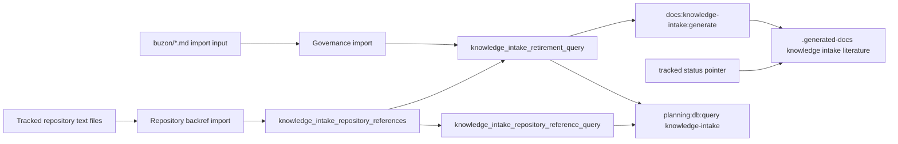

# Knowledge Intake Generated Literature Plan

## Problem Summary

The repository still keeps Fowler analysis intake as raw Markdown under
`buzon/`. The Planning DB now classifies those files through
`knowledge_intake_retirement_query`, but operators and AI agents still need a
single regenerated reading surface before the raw files can be retired.

## Root Cause

The current shape is a Fowler `Large Class` smell expressed as a directory:
many unrelated analysis files carry decision hints, action items, references,
and status clues without a single read model. Keeping both raw intake files and
Planning DB rows as active reading surfaces makes every agent decide which one
is authoritative.

## Selected Option

Generate the literature view from the DB retirement read model into the ignored
local docs tree:

```bash
pnpm docs:knowledge-intake:generate
pnpm docs:knowledge-intake:check
```

The tracked status document remains only a stable navigation pointer, following
the existing `generated-code-state` pattern. The generated output is written to
`.generated-docs/planning/status/generated-knowledge-intake-literature.md` and
must be regenerated from `planning_query_store.knowledge_intake_retirement_query`.

## Current-State Flow



## Target Flow For This Slice



## Fowler Opportunity Matrix

<!-- markdownlint-disable MD060 -->

| Scenario                                         | Opportunity         | Fowler pattern                  | DDD owner                             | Command/query rail                  | Implementation surfaces                                                 | Tests                                                                                                                     | Out of scope                                   |
| ------------------------------------------------ | ------------------- | ------------------------------- | ------------------------------------- | ----------------------------------- | ----------------------------------------------------------------------- | ------------------------------------------------------------------------------------------------------------------------- | ---------------------------------------------- |
| Agents need one regenerated reading surface      | Duplicate semantics | Published Language / Read Model | `KnowledgeIntakeLiteratureProjection` | `GenerateKnowledgeIntakeLiterature` | Generator script, package scripts, generated-doc policy, status pointer | `node --test scripts/generate-knowledge-intake-literature.test.cjs`                                                       | Deleting raw intake files                      |
| Raw analysis files behave like active canon      | Hidden authority    | Repository + Projection         | `KnowledgeIntakeRetirementReadModel`  | `ListKnowledgeIntakeRetirement`     | DB surface inventory, component guide                                   | `node --test scripts/planning-db-surface-inventory-check.test.cjs`                                                        | Rewriting every existing docs reference        |
| Non-knowledge files still reference raw intake   | Hidden authority    | Repository + Projection         | `KnowledgeIntakeRetirementReadModel`  | `ListKnowledgeIntakeRetirement`     | Planning DB import, migration, repository-reference query               | `node --test scripts/planning-db-query.test.cjs scripts/planning-db-import.test.cjs scripts/planning-db-migrate.test.cjs` | Query-time grep as authority                   |
| Governance refresh must reproduce the literature | Documentation drift | Single Writer                   | CI governance refresh orchestration   | `GenerateKnowledgeIntakeLiterature` | `scripts/governance-refresh.cjs`, generated-doc policy                  | `node --test scripts/governance-refresh.test.cjs scripts/check-generated-docs-policy.test.cjs`                            | Adding the generator to every lightweight gate |

<!-- markdownlint-enable MD060 -->

## Feature Mechanization

```feature-mechanization
version: 1
featureId: KNOWLEDGE-INTAKE-GENERATED-LITERATURE-20260604
mechanizationStatus: implemented
noHumanDecisionsRemaining: true
implementationPlan: docs/planning/proposals/mandatory/governance-and-docs/knowledge-intake-generated-literature-plan-20260604.md
componentGuides:
  - docs/architecture/components/ci-governance/knowledge-intake-retirement-component.md
userStories:
  - docs/architecture/components/ci-governance/knowledge-intake-retirement-component.md
governingSources:
  - AGENTS.md
  - docs/planning/status/governance-document-rule-inventory.md
  - docs/guides/ai-work-protocol.md
  - docs/architecture/command-query-rail-governance.md
  - docs/architecture/fowler-opportunity-planning-governance.md
  - docs/planning/proposals/mandatory/governance-and-docs/knowledge-intake-dbfirst-retirement-plan-20260604.md
allowedImplementationSurfaces:
  - docs/.manifest.json
  - docs/generated-docs-policy.json
  - docs/architecture/components/ci-governance/knowledge-intake-retirement-component.md
  - docs/architecture/components/ci-governance/index.md
  - docs/**/index.md
  - docs/planning/closeouts/20260604-knowledge-intake-generated-literature-closeout.md
  - docs/planning/proposals/mandatory/governance-and-docs/knowledge-intake-generated-literature-plan-20260604.md
  - docs/planning/status/db-surface-inventory.md
  - docs/planning/status/generated-knowledge-intake-literature.md
  - docs/planning/status/governance-document-rule-inventory.md
  - docs/planning/status/system-governance-*
  - package.json
  - scripts/check-generated-docs-policy.cjs
  - scripts/check-generated-docs-policy.test.cjs
  - scripts/generate-knowledge-intake-literature.cjs
  - scripts/generate-knowledge-intake-literature.test.cjs
  - scripts/governance-refresh.cjs
  - scripts/governance-refresh.test.cjs
  - scripts/planning-db-import.cjs
  - scripts/planning-db-import.test.cjs
  - scripts/planning-db-migrate.test.cjs
  - scripts/planning-db-query.test.cjs
  - scripts/planning-db-surface-inventory-check.cjs
  - scripts/planning-db-surface-inventory-check.test.cjs
  - scripts/planning-db/queries/knowledge-intake-retirement-query.cjs
  - tools/planning-db/migrations/063_knowledge_intake_repository_backrefs.sql
forbiddenImplementationSurfaces:
  - buzon/**
  - apps/**
  - packages/**
commandQueryRails:
  - name: GenerateKnowledgeIntakeLiterature
    type: command
    dddOwner: KnowledgeIntakeLiteratureProjection
    status: implemented
  - name: ListKnowledgeIntakeRetirement
    type: query
    dddOwner: KnowledgeIntakeRetirementReadModel
    status: implemented
domainObjects:
  - name: KnowledgeIntakeLiteratureProjection
    type: generated local projection
    owner: scripts
  - name: KnowledgeIntakeRetirementReadModel
    type: query-store read model
    owner: scripts/planning-db
fowlerSignals:
  - Duplicate semantics
  - Hidden authority
  - Documentation drift
architectureGuards:
  - node --test scripts/generate-knowledge-intake-literature.test.cjs scripts/governance-refresh.test.cjs scripts/check-generated-docs-policy.test.cjs scripts/planning-db-surface-inventory-check.test.cjs
cypressFlows:
  - N/A - local Planning DB governance projection only; no browser runtime behavior changes.
completionGate:
  - node --test scripts/generate-knowledge-intake-literature.test.cjs scripts/governance-refresh.test.cjs scripts/check-generated-docs-policy.test.cjs scripts/planning-db-surface-inventory-check.test.cjs
  - pnpm planning:db:import -- --governance-only
  - pnpm docs:knowledge-intake:generate
  - pnpm docs:knowledge-intake:check
  - pnpm docs:sync
  - pnpm docs:gov:manifest:check
  - pnpm docs:gov:generated-policy
  - pnpm docs:feature-mechanization -- --feature KNOWLEDGE-INTAKE-GENERATED-LITERATURE-20260604
  - pnpm docs:feature-mechanization:implementation
  - pnpm governance:refresh
  - pnpm verify:prepush
redGreenCycles:
  - id: generated-literature-renderer
    redTest: node --test scripts/generate-knowledge-intake-literature.test.cjs
    expectedFailure: Generator module does not exist and no deterministic literature renderer is exported.
    patchSurfaces:
      - scripts/generate-knowledge-intake-literature.cjs
      - scripts/generate-knowledge-intake-literature.test.cjs
    greenTest: node --test scripts/generate-knowledge-intake-literature.test.cjs
  - id: generated-literature-policy
    redTest: node --test scripts/check-generated-docs-policy.test.cjs
    expectedFailure: Generated-doc policy does not recognize knowledge-intake DB-backed artifacts.
    patchSurfaces:
      - docs/generated-docs-policy.json
      - scripts/check-generated-docs-policy.cjs
      - scripts/check-generated-docs-policy.test.cjs
    greenTest: node --test scripts/check-generated-docs-policy.test.cjs
  - id: generated-literature-refresh
    redTest: node --test scripts/governance-refresh.test.cjs
    expectedFailure: Governance refresh does not regenerate the DB-backed knowledge-intake literature.
    patchSurfaces:
      - scripts/governance-refresh.cjs
      - scripts/governance-refresh.test.cjs
      - package.json
    greenTest: node --test scripts/governance-refresh.test.cjs
  - id: generated-literature-surface-inventory
    redTest: node --test scripts/planning-db-surface-inventory-check.test.cjs
    expectedFailure: DB surface inventory does not declare the generated knowledge-intake literature surface.
    patchSurfaces:
      - docs/planning/status/db-surface-inventory.md
      - scripts/planning-db-surface-inventory-check.cjs
      - scripts/planning-db-surface-inventory-check.test.cjs
    greenTest: node --test scripts/planning-db-surface-inventory-check.test.cjs
symbols:
  - name: repositoryReferenceTextFilePattern
    path: scripts/planning-db-import.cjs
    dddOwner: KnowledgeIntakeRetirementReadModel
    cqRails: [ListKnowledgeIntakeRetirement]
    fowlerSignals: [Repository]
    architectureGuard: node --test scripts/planning-db-import.test.cjs
    cypressCoverage: N/A - Planning DB governance import.
    unitTests: [node --test scripts/planning-db-import.test.cjs]
  - name: buzonReferencePattern
    path: scripts/planning-db-import.cjs
    dddOwner: KnowledgeIntakeRetirementReadModel
    cqRails: [ListKnowledgeIntakeRetirement]
    fowlerSignals: [Hidden authority]
    architectureGuard: node --test scripts/planning-db-import.test.cjs
    cypressCoverage: N/A - Planning DB governance import.
    unitTests: [node --test scripts/planning-db-import.test.cjs]
  - name: readTrackedRepositoryTextDocuments
    path: scripts/planning-db-import.cjs
    dddOwner: KnowledgeIntakeRetirementReadModel
    cqRails: [ListKnowledgeIntakeRetirement]
    fowlerSignals: [Repository]
    architectureGuard: node --test scripts/planning-db-import.test.cjs
    cypressCoverage: N/A - Planning DB governance import.
    unitTests: [node --test scripts/planning-db-import.test.cjs]
  - name: buildKnowledgeIntakeRepositoryReferenceSnapshot
    path: scripts/planning-db-import.cjs
    dddOwner: KnowledgeIntakeRetirementReadModel
    cqRails: [ListKnowledgeIntakeRetirement]
    fowlerSignals: [Hidden authority, Repository]
    architectureGuard: node --test scripts/planning-db-import.test.cjs scripts/planning-db-query.test.cjs
    cypressCoverage: N/A - Planning DB governance import.
    unitTests: [node --test scripts/planning-db-import.test.cjs scripts/planning-db-query.test.cjs]
  - name: insertKnowledgeIntakeRepositoryReferences
    path: scripts/planning-db-import.cjs
    dddOwner: KnowledgeIntakeRetirementReadModel
    cqRails: [ListKnowledgeIntakeRetirement]
    fowlerSignals: [Single Writer]
    architectureGuard: node --test scripts/planning-db-import.test.cjs scripts/planning-db-migrate.test.cjs
    cypressCoverage: N/A - Planning DB governance import.
    unitTests: [node --test scripts/planning-db-import.test.cjs scripts/planning-db-migrate.test.cjs]
  - name: renderKnowledgeIntakeLiterature
    path: scripts/generate-knowledge-intake-literature.cjs
    dddOwner: KnowledgeIntakeLiteratureProjection
    cqRails: [GenerateKnowledgeIntakeLiterature]
    fowlerSignals: [Duplicate semantics]
    architectureGuard: node --test scripts/generate-knowledge-intake-literature.test.cjs
    cypressCoverage: N/A - DB-backed local docs projection.
    unitTests: [node --test scripts/generate-knowledge-intake-literature.test.cjs]
  - name: buildKnowledgeIntakeLiteratureSummary
    path: scripts/generate-knowledge-intake-literature.cjs
    dddOwner: KnowledgeIntakeLiteratureProjection
    cqRails: [GenerateKnowledgeIntakeLiterature]
    fowlerSignals: [Published Language]
    architectureGuard: node --test scripts/generate-knowledge-intake-literature.test.cjs
    cypressCoverage: N/A - DB-backed local docs projection.
    unitTests: [node --test scripts/generate-knowledge-intake-literature.test.cjs]
  - name: buildKnowledgeIntakeLiteratureSelect
    path: scripts/generate-knowledge-intake-literature.cjs
    dddOwner: KnowledgeIntakeLiteratureProjection
    cqRails: [GenerateKnowledgeIntakeLiterature, ListKnowledgeIntakeRetirement]
    fowlerSignals: [Hidden authority]
    architectureGuard: node --test scripts/generate-knowledge-intake-literature.test.cjs
    cypressCoverage: N/A - DB-backed local docs projection.
    unitTests: [node --test scripts/generate-knowledge-intake-literature.test.cjs]
  - name: runKnowledgeIntakeLiteratureGenerator
    path: scripts/generate-knowledge-intake-literature.cjs
    dddOwner: KnowledgeIntakeLiteratureProjection
    cqRails: [GenerateKnowledgeIntakeLiterature]
    fowlerSignals: [Documentation drift]
    architectureGuard: node --test scripts/generate-knowledge-intake-literature.test.cjs scripts/governance-refresh.test.cjs
    cypressCoverage: N/A - DB-backed local docs projection.
    unitTests: [node --test scripts/generate-knowledge-intake-literature.test.cjs]
  - name: databaseUrl
    path: scripts/generate-knowledge-intake-literature.cjs
    dddOwner: KnowledgeIntakeLiteratureProjection
    cqRails: [GenerateKnowledgeIntakeLiterature]
    fowlerSignals: [Repository]
    architectureGuard: node --test scripts/generate-knowledge-intake-literature.test.cjs
    cypressCoverage: N/A - local CLI helper.
    unitTests: [node --test scripts/generate-knowledge-intake-literature.test.cjs]
  - name: defaultOutputPath
    path: scripts/generate-knowledge-intake-literature.cjs
    dddOwner: KnowledgeIntakeLiteratureProjection
    cqRails: [GenerateKnowledgeIntakeLiterature]
    fowlerSignals: [Single Writer]
    architectureGuard: node --test scripts/generate-knowledge-intake-literature.test.cjs
    cypressCoverage: N/A - local generated artifact path.
    unitTests: [node --test scripts/generate-knowledge-intake-literature.test.cjs]
  - name: fs
    path: scripts/generate-knowledge-intake-literature.cjs
    dddOwner: KnowledgeIntakeLiteratureProjection
    cqRails: [GenerateKnowledgeIntakeLiterature]
    fowlerSignals: [Repository]
    architectureGuard: node --test scripts/generate-knowledge-intake-literature.test.cjs
    cypressCoverage: N/A - local filesystem adapter.
    unitTests: [node --test scripts/generate-knowledge-intake-literature.test.cjs]
  - name: path
    path: scripts/generate-knowledge-intake-literature.cjs
    dddOwner: KnowledgeIntakeLiteratureProjection
    cqRails: [GenerateKnowledgeIntakeLiterature]
    fowlerSignals: [Repository]
    architectureGuard: node --test scripts/generate-knowledge-intake-literature.test.cjs
    cypressCoverage: N/A - local path helper.
    unitTests: [node --test scripts/generate-knowledge-intake-literature.test.cjs]
  - name: repoRoot
    path: scripts/generate-knowledge-intake-literature.cjs
    dddOwner: KnowledgeIntakeLiteratureProjection
    cqRails: [GenerateKnowledgeIntakeLiterature]
    fowlerSignals: [Repository]
    architectureGuard: node --test scripts/generate-knowledge-intake-literature.test.cjs
    cypressCoverage: N/A - local path helper.
    unitTests: [node --test scripts/generate-knowledge-intake-literature.test.cjs]
  - name: sourceView
    path: scripts/generate-knowledge-intake-literature.cjs
    dddOwner: KnowledgeIntakeLiteratureProjection
    cqRails: [GenerateKnowledgeIntakeLiterature, ListKnowledgeIntakeRetirement]
    fowlerSignals: [Hidden authority]
    architectureGuard: node --test scripts/generate-knowledge-intake-literature.test.cjs
    cypressCoverage: N/A - DB view binding.
    unitTests: [node --test scripts/generate-knowledge-intake-literature.test.cjs]
  - name: stateOrder
    path: scripts/generate-knowledge-intake-literature.cjs
    dddOwner: KnowledgeIntakeLiteratureProjection
    cqRails: [GenerateKnowledgeIntakeLiterature]
    fowlerSignals: [Published Language]
    architectureGuard: node --test scripts/generate-knowledge-intake-literature.test.cjs
    cypressCoverage: N/A - deterministic renderer constant.
    unitTests: [node --test scripts/generate-knowledge-intake-literature.test.cjs]
  - name: stateTitles
    path: scripts/generate-knowledge-intake-literature.cjs
    dddOwner: KnowledgeIntakeLiteratureProjection
    cqRails: [GenerateKnowledgeIntakeLiterature]
    fowlerSignals: [Published Language]
    architectureGuard: node --test scripts/generate-knowledge-intake-literature.test.cjs
    cypressCoverage: N/A - deterministic renderer constant.
    unitTests: [node --test scripts/generate-knowledge-intake-literature.test.cjs]
  - name: toPosix
    path: scripts/generate-knowledge-intake-literature.cjs
    dddOwner: KnowledgeIntakeLiteratureProjection
    cqRails: [GenerateKnowledgeIntakeLiterature]
    fowlerSignals: [Repository]
    architectureGuard: node --test scripts/generate-knowledge-intake-literature.test.cjs
    cypressCoverage: N/A - local path helper.
    unitTests: [node --test scripts/generate-knowledge-intake-literature.test.cjs]
  - name: relFromRepo
    path: scripts/generate-knowledge-intake-literature.cjs
    dddOwner: KnowledgeIntakeLiteratureProjection
    cqRails: [GenerateKnowledgeIntakeLiterature]
    fowlerSignals: [Repository]
    architectureGuard: node --test scripts/generate-knowledge-intake-literature.test.cjs
    cypressCoverage: N/A - local path helper.
    unitTests: [node --test scripts/generate-knowledge-intake-literature.test.cjs]
  - name: numericCount
    path: scripts/generate-knowledge-intake-literature.cjs
    dddOwner: KnowledgeIntakeLiteratureProjection
    cqRails: [GenerateKnowledgeIntakeLiterature]
    fowlerSignals: [Published Language]
    architectureGuard: node --test scripts/generate-knowledge-intake-literature.test.cjs
    cypressCoverage: N/A - renderer normalization helper.
    unitTests: [node --test scripts/generate-knowledge-intake-literature.test.cjs]
  - name: textValue
    path: scripts/generate-knowledge-intake-literature.cjs
    dddOwner: KnowledgeIntakeLiteratureProjection
    cqRails: [GenerateKnowledgeIntakeLiterature]
    fowlerSignals: [Published Language]
    architectureGuard: node --test scripts/generate-knowledge-intake-literature.test.cjs
    cypressCoverage: N/A - renderer normalization helper.
    unitTests: [node --test scripts/generate-knowledge-intake-literature.test.cjs]
  - name: markdownCell
    path: scripts/generate-knowledge-intake-literature.cjs
    dddOwner: KnowledgeIntakeLiteratureProjection
    cqRails: [GenerateKnowledgeIntakeLiterature]
    fowlerSignals: [Published Language]
    architectureGuard: node --test scripts/generate-knowledge-intake-literature.test.cjs
    cypressCoverage: N/A - renderer helper.
    unitTests: [node --test scripts/generate-knowledge-intake-literature.test.cjs]
  - name: markdownTable
    path: scripts/generate-knowledge-intake-literature.cjs
    dddOwner: KnowledgeIntakeLiteratureProjection
    cqRails: [GenerateKnowledgeIntakeLiterature]
    fowlerSignals: [Published Language]
    architectureGuard: node --test scripts/generate-knowledge-intake-literature.test.cjs
    cypressCoverage: N/A - renderer helper.
    unitTests: [node --test scripts/generate-knowledge-intake-literature.test.cjs]
  - name: stateRank
    path: scripts/generate-knowledge-intake-literature.cjs
    dddOwner: KnowledgeIntakeLiteratureProjection
    cqRails: [GenerateKnowledgeIntakeLiterature]
    fowlerSignals: [Published Language]
    architectureGuard: node --test scripts/generate-knowledge-intake-literature.test.cjs
    cypressCoverage: N/A - deterministic renderer helper.
    unitTests: [node --test scripts/generate-knowledge-intake-literature.test.cjs]
  - name: normalizeKnowledgeIntakeRow
    path: scripts/generate-knowledge-intake-literature.cjs
    dddOwner: KnowledgeIntakeLiteratureProjection
    cqRails: [GenerateKnowledgeIntakeLiterature]
    fowlerSignals: [Published Language]
    architectureGuard: node --test scripts/generate-knowledge-intake-literature.test.cjs
    cypressCoverage: N/A - DB row normalization helper.
    unitTests: [node --test scripts/generate-knowledge-intake-literature.test.cjs]
  - name: sortKnowledgeIntakeRows
    path: scripts/generate-knowledge-intake-literature.cjs
    dddOwner: KnowledgeIntakeLiteratureProjection
    cqRails: [GenerateKnowledgeIntakeLiterature]
    fowlerSignals: [Published Language]
    architectureGuard: node --test scripts/generate-knowledge-intake-literature.test.cjs
    cypressCoverage: N/A - deterministic renderer helper.
    unitTests: [node --test scripts/generate-knowledge-intake-literature.test.cjs]
  - name: stateQuery
    path: scripts/generate-knowledge-intake-literature.cjs
    dddOwner: KnowledgeIntakeLiteratureProjection
    cqRails: [GenerateKnowledgeIntakeLiterature, ListKnowledgeIntakeRetirement]
    fowlerSignals: [Published Language]
    architectureGuard: node --test scripts/generate-knowledge-intake-literature.test.cjs
    cypressCoverage: N/A - query shortcut renderer.
    unitTests: [node --test scripts/generate-knowledge-intake-literature.test.cjs]
  - name: renderStateSection
    path: scripts/generate-knowledge-intake-literature.cjs
    dddOwner: KnowledgeIntakeLiteratureProjection
    cqRails: [GenerateKnowledgeIntakeLiterature]
    fowlerSignals: [Published Language]
    architectureGuard: node --test scripts/generate-knowledge-intake-literature.test.cjs
    cypressCoverage: N/A - renderer helper.
    unitTests: [node --test scripts/generate-knowledge-intake-literature.test.cjs]
  - name: readKnowledgeIntakeLiteratureRows
    path: scripts/generate-knowledge-intake-literature.cjs
    dddOwner: KnowledgeIntakeLiteratureProjection
    cqRails: [GenerateKnowledgeIntakeLiterature, ListKnowledgeIntakeRetirement]
    fowlerSignals: [Hidden authority]
    architectureGuard: node --test scripts/generate-knowledge-intake-literature.test.cjs
    cypressCoverage: N/A - DB query helper.
    unitTests: [node --test scripts/generate-knowledge-intake-literature.test.cjs]
  - name: writeIfChanged
    path: scripts/generate-knowledge-intake-literature.cjs
    dddOwner: KnowledgeIntakeLiteratureProjection
    cqRails: [GenerateKnowledgeIntakeLiterature]
    fowlerSignals: [Single Writer]
    architectureGuard: node --test scripts/generate-knowledge-intake-literature.test.cjs
    cypressCoverage: N/A - local generated artifact writer.
    unitTests: [node --test scripts/generate-knowledge-intake-literature.test.cjs]
  - name: parseArgs
    path: scripts/generate-knowledge-intake-literature.cjs
    dddOwner: KnowledgeIntakeLiteratureProjection
    cqRails: [GenerateKnowledgeIntakeLiterature]
    fowlerSignals: [Command Query Rail]
    architectureGuard: node --test scripts/generate-knowledge-intake-literature.test.cjs
    cypressCoverage: N/A - local CLI parser.
    unitTests: [node --test scripts/generate-knowledge-intake-literature.test.cjs]
  - name: printHelp
    path: scripts/generate-knowledge-intake-literature.cjs
    dddOwner: KnowledgeIntakeLiteratureProjection
    cqRails: [GenerateKnowledgeIntakeLiterature]
    fowlerSignals: [Command Query Rail]
    architectureGuard: node --test scripts/generate-knowledge-intake-literature.test.cjs
    cypressCoverage: N/A - local CLI help.
    unitTests: [node --test scripts/generate-knowledge-intake-literature.test.cjs]
  - name: main
    path: scripts/generate-knowledge-intake-literature.cjs
    dddOwner: KnowledgeIntakeLiteratureProjection
    cqRails: [GenerateKnowledgeIntakeLiterature]
    fowlerSignals: [Command Query Rail]
    architectureGuard: node --test scripts/generate-knowledge-intake-literature.test.cjs
    cypressCoverage: N/A - local CLI entrypoint.
    unitTests: [node --test scripts/generate-knowledge-intake-literature.test.cjs]
  - name: assert
    path: scripts/generate-knowledge-intake-literature.test.cjs
    dddOwner: KnowledgeIntakeLiteratureProjection
    cqRails: [GenerateKnowledgeIntakeLiterature]
    fowlerSignals: [Test-only confidence]
    architectureGuard: node --test scripts/generate-knowledge-intake-literature.test.cjs
    cypressCoverage: N/A - unit test dependency.
    unitTests: [node --test scripts/generate-knowledge-intake-literature.test.cjs]
  - name: fixtureRows
    path: scripts/generate-knowledge-intake-literature.test.cjs
    dddOwner: KnowledgeIntakeLiteratureProjection
    cqRails: [GenerateKnowledgeIntakeLiterature, ListKnowledgeIntakeRetirement]
    fowlerSignals: [Test-only confidence]
    architectureGuard: node --test scripts/generate-knowledge-intake-literature.test.cjs
    cypressCoverage: N/A - unit test fixture.
    unitTests: [node --test scripts/generate-knowledge-intake-literature.test.cjs]
  - name: fs
    path: scripts/generate-knowledge-intake-literature.test.cjs
    dddOwner: KnowledgeIntakeLiteratureProjection
    cqRails: [GenerateKnowledgeIntakeLiterature]
    fowlerSignals: [Test-only confidence]
    architectureGuard: node --test scripts/generate-knowledge-intake-literature.test.cjs
    cypressCoverage: N/A - unit test dependency.
    unitTests: [node --test scripts/generate-knowledge-intake-literature.test.cjs]
  - name: os
    path: scripts/generate-knowledge-intake-literature.test.cjs
    dddOwner: KnowledgeIntakeLiteratureProjection
    cqRails: [GenerateKnowledgeIntakeLiterature]
    fowlerSignals: [Test-only confidence]
    architectureGuard: node --test scripts/generate-knowledge-intake-literature.test.cjs
    cypressCoverage: N/A - unit test dependency.
    unitTests: [node --test scripts/generate-knowledge-intake-literature.test.cjs]
  - name: packageJson
    path: scripts/generate-knowledge-intake-literature.test.cjs
    dddOwner: KnowledgeIntakeLiteratureProjection
    cqRails: [GenerateKnowledgeIntakeLiterature]
    fowlerSignals: [Architecture test]
    architectureGuard: node --test scripts/generate-knowledge-intake-literature.test.cjs
    cypressCoverage: N/A - package script assertion.
    unitTests: [node --test scripts/generate-knowledge-intake-literature.test.cjs]
  - name: path
    path: scripts/generate-knowledge-intake-literature.test.cjs
    dddOwner: KnowledgeIntakeLiteratureProjection
    cqRails: [GenerateKnowledgeIntakeLiterature]
    fowlerSignals: [Test-only confidence]
    architectureGuard: node --test scripts/generate-knowledge-intake-literature.test.cjs
    cypressCoverage: N/A - unit test dependency.
    unitTests: [node --test scripts/generate-knowledge-intake-literature.test.cjs]
  - name: test
    path: scripts/generate-knowledge-intake-literature.test.cjs
    dddOwner: KnowledgeIntakeLiteratureProjection
    cqRails: [GenerateKnowledgeIntakeLiterature]
    fowlerSignals: [Test-only confidence]
    architectureGuard: node --test scripts/generate-knowledge-intake-literature.test.cjs
    cypressCoverage: N/A - unit test dependency.
    unitTests: [node --test scripts/generate-knowledge-intake-literature.test.cjs]
```

## Exit Criteria

- The full knowledge-intake literature can be regenerated from DB without
  reading `buzon/*.md` directly in the generator.
- Generated literature stays outside Git by default.
- The tracked status page is a stable pointer, not a second literature copy.
- Governance refresh includes the projection after governance DB import.
- No raw intake file is deleted in this slice.

## Closeout Evidence

See
[20260604 Knowledge Intake Generated Literature Closeout](../../../closeouts/20260604-knowledge-intake-generated-literature-closeout.md).
