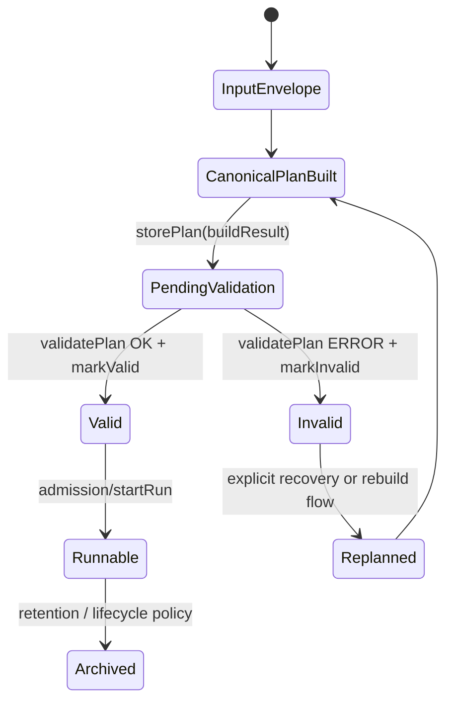
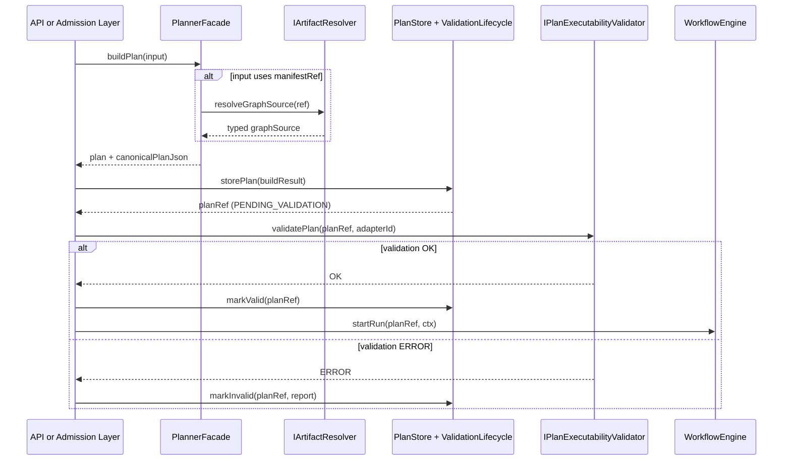
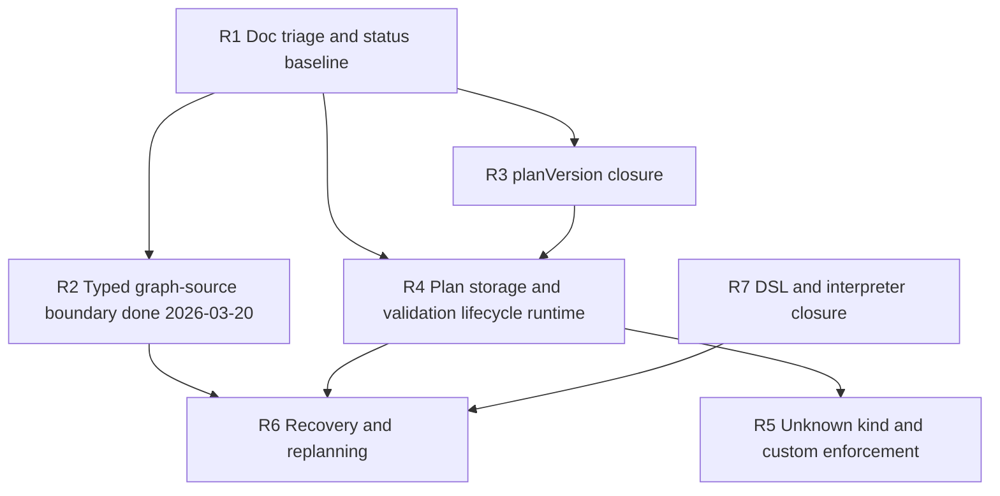

# Planner Target State And Hardening Roadmap

This document is the planner subsystem roadmap proposal that follows the
current-state baseline in
[Planner Current State Assessment](../status/planner-current-state-assessment-20260320.md).

It is **not** the repository roadmap of record. It is a planner-specific
roadmap proposal that must remain subordinate to:

- [Roadmap Of Record](../roadmap/index.md)
- [Current Status](../../architecture/system-delivery-status.md)
- [Gap Execution Plans](../gaps/GAP_EXECUTION_PLANS.md)

## Governing Baseline

This roadmap is constrained by:

- [Planner Current State Assessment](../status/planner-current-state-assessment-20260320.md)
- [Planner Local Doc Triage](../status/planner-local-doc-triage-20260320.md)
- [Planner Contracts](../../contracts/planner/index.md)
- [ADR-0035 - Planner Public Contract Evolution Protocol](../../adr/ADR-0035-planner-public-contract-evolution-protocol.md)
- [ADR-0012 - Plan Integrity Ownership](../../adr/ADR-0012-plan-integrity-ownership.md)
- [ADR-0017 - ExecutionPlan Schema Versioning](../../adr/ADR-0017_ExecutionPlan_Schema_Versioning.md)
- [Phase 2 Architectural Debt Roadmap](phase2-arch-debt-roadmap-20260315.md)
- [Stage 1.1 - Planner Contract, Canonical Ownership, and Documentation Placement](../../../packages/@dvt/planner/docs/planning/Stage-1.1-Planner-Canonicalization.md)

## Planning Rules

This roadmap uses the following precedence rules:

1. Accepted ADRs beat proposals.
2. Current code beats stale proposal snapshots.
3. The status artifact is the current truth; this roadmap is the target-state
   proposal.
4. Planner public contracts remain in `@dvt/contracts`; this roadmap does not
   reopen that decision.

## Drift Constraints That Affect Planning

### Accepted ADRs already overrule one proposed retry direction

`docs/planning/dvt-top-5-gaps-corrected-20260319.md` proposes moving
`logicalAttemptId` authority into the engine. The active governance baseline
still points at [ADR-0016](../../adr/ADR-0016-logicalAttemptId-adapter-ownership.md),
which says the adapter/runtime owns `logicalAttemptId`.

Roadmap consequence:

- any retry or recovery slice that assumes engine-owned `logicalAttemptId`
  **must not start** unless a new ADR explicitly supersedes ADR-0016.

### Stage 1.1 governance is ahead of some of its own historical snapshots

The Stage 1.1 proposal is still correct as a governance source, but its older
"current duplication" snapshot no longer matches the tree exactly because the
planner-local public contract duplication is already gone.

Roadmap consequence:

- Stage 1.1 follow-up work should focus on the **remaining** gaps
  (docs placement, runtime lifecycle, enforcement), not on re-solving already
  removed duplication.

### `planVersion` is no longer a greenfield problem

Current code already contains a governed version registry, a verifier runtime
matrix, and an engine policy surface. The open work is **alignment and closure**,
not "invent plan-version governance from zero."

Roadmap consequence:

- the plan-version slice should finish unification instead of starting a new
  parallel design track.

## Target State

The target planner subsystem is:

- contract-canonical at the shared-kernel boundary;
- pure and deterministic in its compilation core;
- explicit about plan storage and validation lifecycle;
- typed at the graph-source boundary rather than hard-coding one manifest shape;
- fail-closed for unsupported kinds and unregistered custom policy namespaces;
- integrated with runtime validation before execution starts;
- usable for business recovery and replanning flows.

### Target Component View

```mermaid
flowchart LR
    Caller[API or admission layer]
    Facade[PlannerFacade]
    Resolver[IArtifactResolver]
    Core[Planner core]
    Store[IPlanValidationLifecycleStore / PlanStore]
    Validator[IPlanExecutabilityValidator]
    Verifier[@dvt/plan-verifier]
    Engine[Engine startRun]
    Recovery[RecoverRun use case]
    Interpreter[@dvt/plan-interpreter]
    DSL[@dvt/dsl]

    Caller --> Facade
    Facade --> Resolver
    Facade --> Core
    Core --> Verifier
    Core --> Store
    Store --> Validator
    Validator --> Engine
    Recovery --> Facade
    Recovery --> Store
    Engine --> Interpreter
    Engine --> DSL
```

### Target Plan Lifecycle



### Target Validation And Start Sequence



## Delta From Current State

| Target area                           | Current status                    | Target status                                                                     |
| ------------------------------------- | --------------------------------- | --------------------------------------------------------------------------------- |
| Public contract ownership             | Closed enough                     | Keep as-is; no ownership rework                                                   |
| Typed graph-source boundary           | Closed `2026-03-20`               | Keep `graphSource` / `manifestRef` canonical and retire compatibility paths later |
| `planVersion` governance              | Partial                           | One aligned registry plus emitted version plus runtime matrix                     |
| Plan storage and validation lifecycle | Contract-only                     | Real runtime implementation                                                       |
| Unknown kind handling                 | Governed but fail-open in planner | Fail-closed by default                                                            |
| `custom` namespace governance         | Contract-only                     | Planner-enforced registration and validation                                      |
| Recovery / replanning                 | Proposal-only                     | Operator-grade derived-run flow                                                   |
| DSL governance                        | Package exists, no accepted spec  | Accepted spec or explicit de-scope                                                |
| Planner docs placement                | Split                             | Repo-level subsystem docs become primary                                          |

## Roadmap Slices

### R1. Planner Status Consolidation And Doc Triage

Goal:

- make planner current-state truth explicit
- classify planner-local docs as promote / retain-local / archive
- assign owners and target dates to the remaining planner slices

Why first:

- it prevents the next implementation slices from inheriting stale assumptions

### R2. Typed Graph-Source Boundary (`S10`, redefined)

Goal:

- replace the weak DBT-specific admission surface with a typed graph-source
  boundary that keeps the planner core generic

Must include:

- a public boundary interface for graph-source ingestion or graph derivation
- planner core consumption of a normalized graph-source shape or `GraphNode[]`
- DBT support moved behind one implementation of that interface rather than
  treated as the semantic public boundary
- preservation of `manifestRef` as the canonical production path without making
  DBT artifact structure the long-term public planner contract

Status:

- closed `2026-03-20`
- delivered via `PlannerGraphSourceV1`, `graphSource`, facade-side raw
  manifest normalization, and `IArtifactResolver.resolveGraphSource(...)`
- remaining related debt is migration debt, not missing boundary shape:
  `manifest` and direct `nodes` still exist as compatibility inputs

Why next:

- it is already identified in the Phase 2 roadmap as a small, low-risk slice
- it improves correctness at the earliest public boundary
- it removes an architectural contradiction: "generic core + dbt extension"
  cannot stay true while DBT remains the planner's public typed boundary

### R3. Unified `planVersion` Closure

Goal:

- make contracts, planner emission, verifier, engine, and adapters point at the
  same plan-version authority

Must include:

- planner emission uses the governed version registry
- one canonical compatibility note or ADR for `planVersion`
- removal of the last inline `planVersion: '2.3'` emission point

### R4. Plan Storage And Validation Lifecycle Runtime

Goal:

- implement the contracts that already exist for:
  - storing canonical plans
  - tracking `PENDING_VALIDATION` / `VALID` / `INVALID`
  - handing validated plans into start-run admission

Must include:

- `PostgresPlanStore` or equivalent persisted plan store
- concrete lifecycle implementation
- API/admission wiring

### R5. Unknown Kind And `custom` Enforcement

Goal:

- close the gap between governed contracts and actual planner/runtime behavior

Must include:

- fail-closed unknown kind enforcement unless a bridge entry exists
- planner-time enforcement of `ICustomPolicyNamespaceRegistry`
- runtime rejection path for unsupported or unauthorized custom namespaces

### R6. Recovery And Replanning Product Slice

Goal:

- let operators create a derived run from a failed or cancelled source run

Dependencies:

- R2 typed graph-source or typed normalized boundary
- R4 plan storage and validation lifecycle runtime
- retry-authority governance must remain consistent with ADR-0016 unless a new
  ADR changes it

Must include:

- `RecoverRun` use case
- source-run query and validation
- planner selection / subgraph regeneration
- lineage fields carried in runtime context

### R7. Satellite Closure: DSL And Plan Interpreter

Goal:

- stop leaving the two execution-facing satellites half-governed

Must include:

- accepted DSL spec or explicit de-scope / replacement decision
- stronger normative reference for `@dvt/plan-interpreter`

## Recommended Execution Order

| Wave | Slices | Why                                                             |
| ---- | ------ | --------------------------------------------------------------- |
| 0    | `R1`   | establish one planner baseline and remove stale assumptions     |
| 1    | `R7`   | close adjacent governance debt while the boundary work is fresh |
| 2    | `R3`   | unify version governance before more consumers depend on drift  |
| 3    | `R4`   | make stored-plan and validated-start lifecycle real             |
| 4    | `R5`   | turn contract-level governance into runtime enforcement         |
| 5    | `R6`   | ship recovery only after the lifecycle and boundary are stable  |

## Proposed Owners And Target Dates

These dates are planning targets, not merge guarantees. They exist to remove
the "partial without timing" problem from the planner roadmap.

| Slice | Proposed owner                                  | Target date  | Notes                                                                                   |
| ----- | ----------------------------------------------- | ------------ | --------------------------------------------------------------------------------------- |
| `R1`  | Architecture / Planner / Docs                   | `2026-03-20` | Current branch scope: quantified status baseline, local-doc triage, system-status link  |
| `R2`  | Architecture / Planner / Contracts              | `2026-03-20` | Delivered: typed graph-source boundary in contracts/planner; compatibility paths remain |
| `R7`  | Architecture / Planner / DSL / Engine           | `2026-04-03` | Close governance debt around `@dvt/dsl` and `@dvt/plan-interpreter`                     |
| `R3`  | Architecture / Planner / Contracts / Engine     | `2026-04-10` | Unify emitted `planVersion`, registry, and runtime matrix                               |
| `R4`  | Architecture / Planner / API / State / Engine   | `2026-04-24` | Persisted plan store plus validation lifecycle runtime                                  |
| `R5`  | Architecture / Planner / Contracts / Engine     | `2026-05-01` | Fail-closed unknown kind and `custom` namespace enforcement                             |
| `R6`  | Product / Architecture / Planner / API / Engine | `2026-05-15` | Recovery and replanning after lifecycle/runtime closure                                 |

### Dependency Graph



## Guardrails

The roadmap must **not** do any of the following:

- recreate public planner contracts inside `@dvt/planner`
- treat `manifest` and `nodes` as permanent equal-citizen public inputs
- move `logicalAttemptId` authority into the engine without an ADR that
  supersedes ADR-0016
- expand the DSL grammar before an accepted spec exists
- present plan-storage contracts as if they were already runtime-complete

## Exit Criteria For Calling The Planner "Closed Enough"

The planner bounded context should only be described as operationally closed
when all of the following are true:

- typed graph-source boundary exists
- planner-emitted plan version comes from the governed registry
- validated persisted plan lifecycle is implemented
- unknown-kind and custom-policy enforcement are fail-closed by default
- recovery / replanning exists as a product flow
- planner subsystem docs no longer depend on planner-local notes as the primary
  reader path

Until then, the accurate description remains:

> planner core is strong; planner lifecycle and productization remain open.
