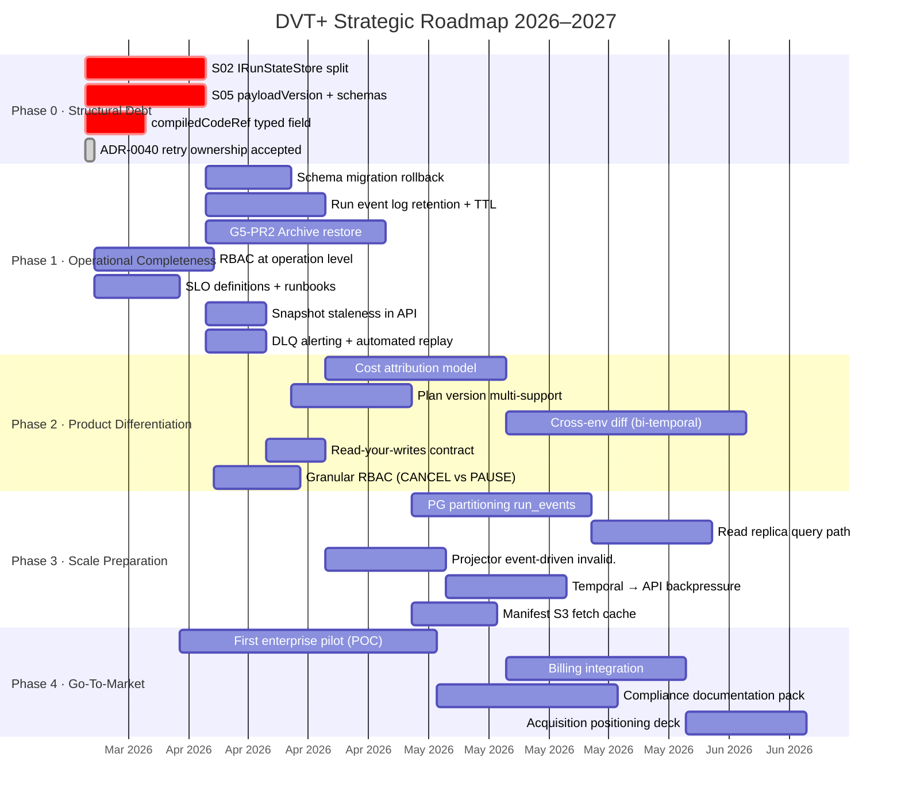
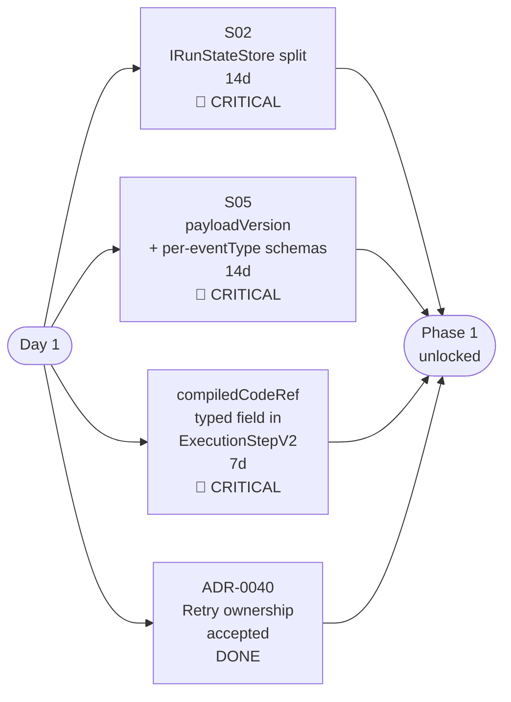
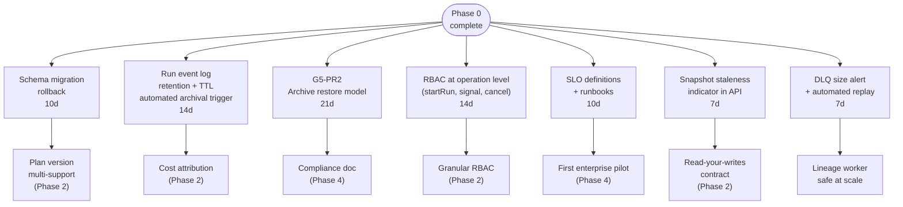
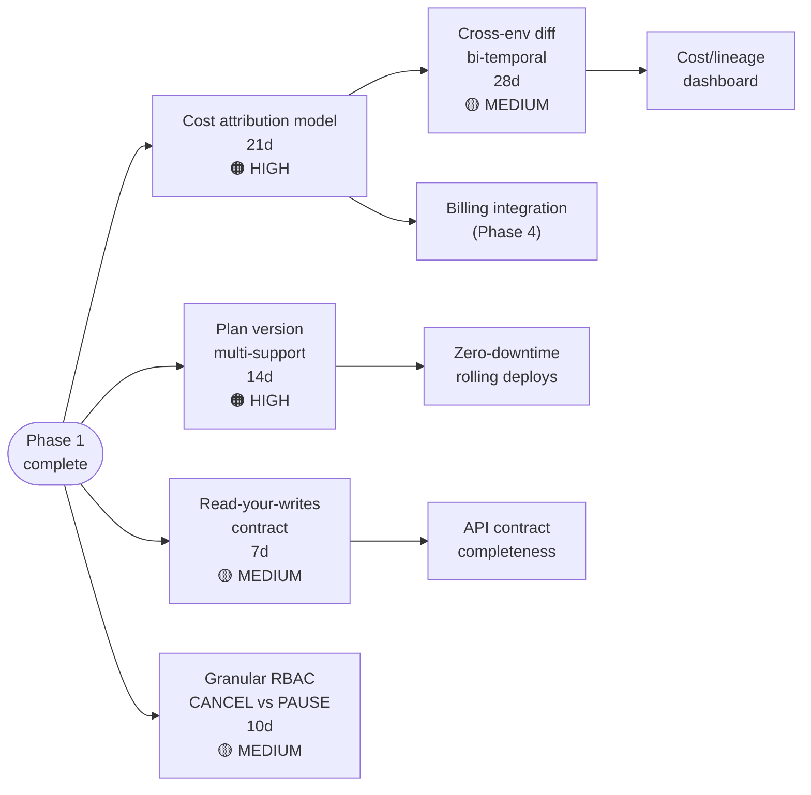
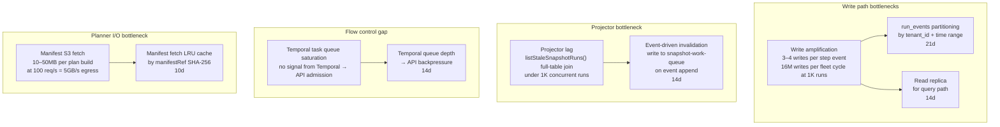
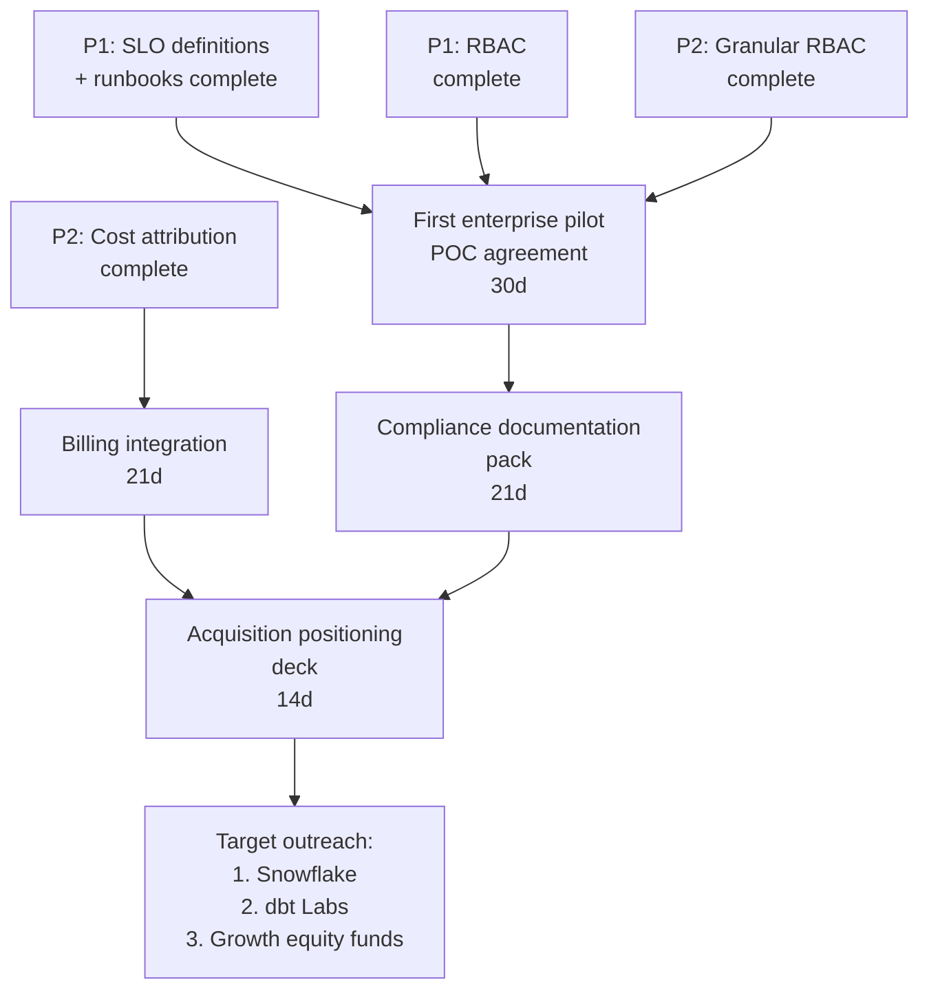
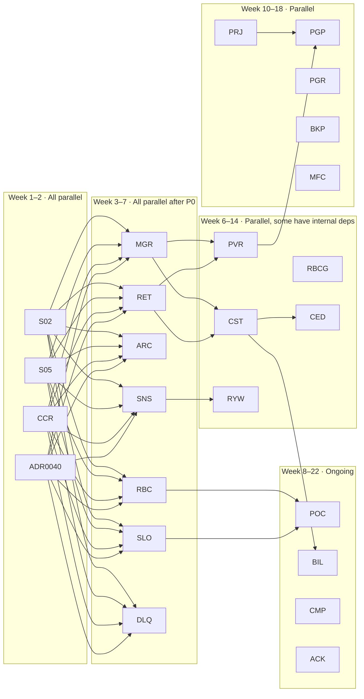
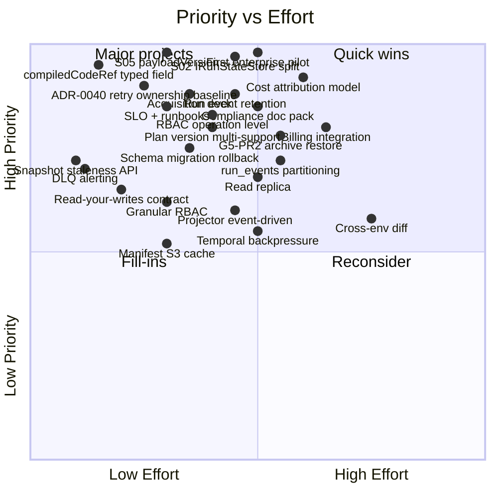

---
title: Strategic Product Roadmap - DVT+ (2026-2027)
status: Archived
owner: Architecture / Product
last_reviewed: 2026-04-09
planning_type: reference
---

# Strategic Product Roadmap - DVT+ (2026-2027)

> Archived snapshot preserved for historical traceability. The active strategic surface now lives in
> [Strategic Product Roadmap](../../roadmap/strategic-product-roadmap.md).

Derived from the principal architect review of 2026-03-24.
Covers structural debt, operational completeness, product differentiation,
scale preparation, and go-to-market readiness. Not a wishlist — every item
here blocks either correctness, the first enterprise sale, or competitive
positioning.

This document is strategic and multi-consumer.
It is not the execution queue.
Operational status lives in
[Planning Control Tower](../../state/planning-control-tower.md) and the
`agent-lane-*.yaml` registry.

## Workboard Coverage

Items already ticketed in the workboard and therefore operational:

- `S02`, `S03`, `S05`, `S07`, `S08`, `S09`, `S11`, `S12`, `S13`, `S14`
- `S15`, `S15-F1`, `S16`, `S17`
- `F1`, `F4`, `F5`
- `RC-A1`, `RC-A2`, `RC-A4`, `RC-A5`, `RC-A6`
- `RC-B1`, `RC-B2`, `RC-B5`
- `RC-D1`, `RC-D1A`, `RC-D2`, `RC-D3`
- `G4-PR3`, `G4-PR4`, `G4-PR5`
- `G5-PR2`, `G5-PR4`
- `A1`, `A2`
- `R3`, `R4`, `R5`, `R6`, `R7`

Roadmap items that are new and not yet ticketed in the lane registry:

| Roadmap item                        | Priority | Depends on                                              | Strategic intent                                   | Recommended next step                                            |
| ----------------------------------- | -------- | ------------------------------------------------------- | -------------------------------------------------- | ---------------------------------------------------------------- |
| Schema migration rollback           | P1       | `S02`                                                   | Restoreability for Postgres DDL failures           | Break into a concrete migration/recovery slice before execution. |
| Run event log retention + TTL       | P1       | `S02`                                                   | Bound storage growth and automate archival trigger | Create an operational storage/retention slice.                   |
| RBAC at operation level             | P1       | `ADR-0040`                                              | Tenant-aware enforcement for start/signal/cancel   | Split into a dedicated API/admission slice.                      |
| SLO definitions + runbooks          | P1       | `RC-D1`, `RC-A1`                                        | Make enterprise operations supportable             | Create an ops readiness slice with owners and alerts.            |
| Snapshot staleness in API           | P1       | `S05`                                                   | Expose freshness to callers                        | Add a focused API/runtime slice.                                 |
| DLQ alerting + automated replay     | P1       | `S05`, `RC-B5`                                          | Surface and reduce lineage backlogs                | Add a traceability/operations slice.                             |
| Cost attribution model              | P2       | `S05`, `S02`, `Run event log retention + TTL`           | Support billing and finance-facing reporting       | Create a product/data slice after payload versioning is stable.  |
| Read-your-writes contract           | P2       | `Snapshot staleness in API`                             | Bound read-after-write staleness                   | Create a runtime/API slice with measurable SLO.                  |
| Granular RBAC (CANCEL vs PAUSE)     | P2       | `RBAC at operation level`                               | Separate privileged operations                     | Extend the RBAC slice once the base policy exists.               |
| run_events partitioning             | P2       | `S02`, `S05`                                            | Reduce storage and write-path pressure             | Create a DB scaling slice with EXPLAIN-backed acceptance.        |
| Read replica query path             | P2       | `run_events partitioning`                               | Offload read traffic from primary                  | Create a DB/query-path slice after partitioning analysis.        |
| Projector event-driven invalidation | P2       | `Read-your-writes contract`                             | Remove polling bottleneck                          | Create a projector/runtime slice with queue semantics.           |
| Temporal -> API backpressure        | P2       | `Projector event-driven invalidation`                   | Prevent over-acceptance under worker saturation    | Create an admission-control slice tied to queue depth telemetry. |
| Manifest S3 fetch cache             | P2       | `RC-B2`                                                 | Reduce planner egress and build latency            | Create a planner/runtime cache slice.                            |
| First enterprise pilot              | P3       | `SLO definitions + runbooks`, `RBAC at operation level` | Validate product-market fit                        | Track as go-to-market work, not as code execution.               |
| Billing integration                 | P3       | `Cost attribution model`                                | Monetize usage-based reporting                     | Track as product/ops work once cost attribution exists.          |
| Compliance documentation pack       | P3       | `First enterprise pilot`                                | Prepare for regulated customer review              | Track as docs/ops work, outside the technical queue.             |
| Acquisition positioning deck        | P3       | `Billing integration`, `Compliance documentation pack`  | Support exit positioning and narrative             | Track as GTM work, not as implementation work.                   |

Items already represented in the lane registry should not be duplicated here as
new tasks.
This file should describe sequence and intent, not create a second execution queue.

## Independent Agent Lanes

Use these lanes when assigning parallel IA work. Each lane is intended to be
owned by one agent at a time and to minimize cross-lane coupling.

Detailed per-agent workfiles:

- [Lane A](../../state/agent-lane-a.yaml)
- [Lane B](../../state/agent-lane-b.yaml)
- [Lane C](../../state/agent-lane-c.yaml)
- [Lane D](../../state/agent-lane-d.yaml)

### Lane A · Contracts And State-Store Boundary

| Task                                     | Priority | Depends on | Why this lane exists                                    |
| ---------------------------------------- | -------- | ---------- | ------------------------------------------------------- |
| `S02` state-store split                  | P0       | `RC-A6`    | Removes the shared-kernel storage bottleneck.           |
| `RC-A6` outbox dead-letter parity        | P0       | None       | Makes the state-store split mechanically safe.          |
| `S08` plan record and plan store model   | P0       | `ADR-0040` | Closes planner artifact truth and plan-store ownership. |
| Schema migration rollback                | P1       | `S02`      | Makes storage changes recoverable.                      |
| `S13` duplicate `estimateRunRef` cleanup | P1       | None       | Low-risk contract cleanup that can run in parallel.     |

### Lane B · Event Contract And Traceability

| Task                                   | Priority | Depends on     | Why this lane exists                                            |
| -------------------------------------- | -------- | -------------- | --------------------------------------------------------------- |
| `S05` payloadVersion + schemas         | P0       | `S01`          | Establishes versioned event payloads.                           |
| `RC-B1` lineage worker decoupling      | P1       | None           | Removes adapter-internal coupling in traceability.              |
| `RC-B2` compiled-code resolver rollout | P1       | None           | Replaces noop lineage resolver with real wiring.                |
| DLQ alerting + automated replay        | P1       | `S05`, `RC-B5` | Makes event failures observable and recoverable.                |
| Manifest S3 fetch cache                | P2       | `RC-B2`        | Reduces planner runtime cost after traceability wiring is real. |

### Lane C · Runtime Safety And Admission

| Task                                           | Priority | Depends on                  | Why this lane exists                             |
| ---------------------------------------------- | -------- | --------------------------- | ------------------------------------------------ |
| `RC-D2` configurable claim timeout             | P0       | None                        | Hardens outbox lease correctness.                |
| `RC-D3` normalized temporal not-found          | P0       | None                        | Removes provider-specific false negatives.       |
| `RC-D1` degraded health signaling              | P1       | None                        | Exposes runtime degradation to consumers.        |
| `RC-D1A` health compatibility + watchdog tests | P1       | `RC-D1`                     | Locks health-contract behavior.                  |
| RBAC at operation level                        | P1       | `ADR-0040`                  | Gives runtime enforcement a tenant-aware policy. |
| Snapshot staleness in API                      | P1       | `S05`                       | Exposes freshness to callers.                    |
| Read-your-writes contract                      | P2       | `Snapshot staleness in API` | Tightens caller-visible freshness guarantees.    |
| Granular RBAC (CANCEL vs PAUSE)                | P2       | `RBAC at operation level`   | Splits privileged operations cleanly.            |

### Lane D · Scale And Go-To-Market

| Task                                       | Priority | Depends on                                              | Why this lane exists                             |
| ------------------------------------------ | -------- | ------------------------------------------------------- | ------------------------------------------------ |
| Run event log retention + TTL              | P1       | `S02`                                                   | Prevents uncontrolled storage growth.            |
| G5-PR2 archive restore                     | P1       | `S02`                                                   | Completes the archival lifecycle.                |
| `S15` snapshot CAS guard                   | P1       | None                                                    | Protects snapshot correctness under concurrency. |
| `S15-F1` stale snapshot discard visibility | P1       | `S15`                                                   | Makes repair callers aware of no-op discards.    |
| `S14` gateway context preservation         | P1       | None                                                    | Prevents continue-as-new context drift.          |
| Cost attribution model                     | P2       | `S05`, `S02`, `Run event log retention + TTL`           | Supports billing and finance reporting.          |
| run_events partitioning                    | P2       | `S02`, `S05`                                            | Prepares for storage scale.                      |
| Read replica query path                    | P2       | `run_events partitioning`                               | Offloads read traffic.                           |
| Projector event-driven invalidation        | P2       | `Read-your-writes contract`                             | Removes polling bottlenecks.                     |
| Temporal -> API backpressure               | P2       | `Projector event-driven invalidation`                   | Protects admission under worker saturation.      |
| First enterprise pilot                     | P3       | `SLO definitions + runbooks`, `RBAC at operation level` | Validates product-market fit.                    |
| Billing integration                        | P3       | `Cost attribution model`                                | Turns usage into invoicing.                      |
| Compliance documentation pack              | P3       | `First enterprise pilot`                                | Prepares regulated customer onboarding.          |
| Acquisition positioning deck               | P3       | `Billing integration`, `Compliance documentation pack`  | Supports GTM narrative and exit positioning.     |

---

## Context: Why This Roadmap Exists

All G1–G10 gaps are closed. The system has a sound architectural skeleton.
What it does not yet have:

- A correct event payload contract (S05 open)
- A single-responsibility state store (S02 open)
- Retry ownership follow-through on top of `ADR-0040`
- Production operational runbooks
- A cost/billing primitive
- The first paying enterprise customer

This roadmap sequences the work to get from "architecturally sound prototype"
to "sellable enterprise data platform."

---

## Phase Overview

---

## Phase 0 — Structural Debt

**Window**: Weeks 1–2 (2026-03-24 → 2026-04-07)
**Rationale**: These are correctness gaps, not nice-to-haves. Every feature
built on top of them inherits the defect. Nothing in Phase 1 or later should
start until P0 is closed.

### P0 tasks — parallelizable from day 1

### P0 task breakdown

| Task                                                                                                                                                      | Effort | Owner area                             | Blocks                                                      |
| --------------------------------------------------------------------------------------------------------------------------------------------------------- | ------ | -------------------------------------- | ----------------------------------------------------------- |
| **S02** — Split `IRunStateStore` into `IRunEventStore`, `IRunMetadataStore`, `IRunSnapshotStore`, `IOutboxStore`                                          | 14d    | Contracts + Adapters                   | Schema migration rollback, Archive restore, all Phase 1 I/O |
| **S05** — Add `payloadVersion: number` to `EventInput`. Define AJV schema per eventType. Validate at adapter write boundary.                              | 14d    | Contracts + Postgres adapter           | DLQ replay, lineage worker safety, cost attribution         |
| **compiledCodeRef typed** — Promote from `stepTypeConfig: Record<string,unknown>` to typed `compiledCodeRef?: CompiledCodeRef` field on `ExecutionStepV2` | 7d     | Contracts + Planner + Temporal adapter | Silent cast elimination at activity boundary                |

### P0 acceptance criteria

- `IRunStateStore` interface no longer exists; four interfaces exist in its place.
- Every `EventInput` written to the DB carries a `payloadVersion`.
- `ExecutionStepV2.compiledCodeRef` is a first-class typed field with no cast at activity boundary.
- `ADR-0040` is accepted; `engineAttemptId` vs `logicalAttemptId` semantics
  are documented with enforcement test.

---

## Phase 1 — Operational Completeness

**Window**: Weeks 3–7 (2026-04-07 → 2026-05-12)
**Rationale**: Without this phase, the system cannot be handed to an enterprise
customer. "It works" is not sufficient — the customer's ops team needs retention
policies, runbooks, and a restore path.

### P1 dependency graph

### P1 tasks

| Task                                                                                                                         | Effort | Priority | Notes                                                           |
| ---------------------------------------------------------------------------------------------------------------------------- | ------ | -------- | --------------------------------------------------------------- |
| **Schema migration rollback** — transactional migrations (DDL in BEGIN/COMMIT where PG supports it) + down-migration scripts | 10d    | High     | A failed migration on prod today leaves partial schema          |
| **Run event log retention** — TTL config per tenant, automated archival trigger from `run_events` → `run_archive`            | 14d    | High     | `run_events` grows unbounded today; 18-month cliff              |
| **G5-PR2 Archive restore model** — deferred deletion + restore path from `run_archive` to live event log                     | 21d    | High     | Archive feature is operationally incomplete without restore     |
| **RBAC at operation level** — define roles (viewer, operator, admin) per tenant; enforce at signal/cancel API boundary       | 14d    | High     | Required for enterprise multi-user scenarios                    |
| **SLO definitions + runbooks** — P99 latency targets for plan build, run start, step execution; incident playbooks           | 10d    | High     | Without SLOs, enterprise SLA contract is impossible             |
| **Snapshot staleness indicator** — add `snapshotAgeMs` to `GET /runs/:runId` response; add `x-snapshot-age-ms` header        | 7d     | Medium   | Callers cannot currently distinguish stale data from idle state |
| **DLQ alerting + automated replay** — Prometheus/Datadog alert on `lineage_dead_letter` row count; scheduled replay job      | 7d     | Medium   | DLQ grows silently under sustained sink failure                 |

### P1 acceptance criteria

- A failed Postgres migration can be rolled back without manual SQL intervention.
- `run_events` older than configured TTL are automatically moved to `run_archive`.
- Archive restore path is tested end-to-end (archive → restore → event replay produces identical snapshot).
- Signal endpoint returns 403 for unauthorized roles.
- `GET /runs/:runId` response includes `snapshotAgeMs`.
- Alert fires when `lineage_dead_letter` exceeds 1000 rows.

---

## Phase 2 — Product Differentiation

**Window**: Weeks 6–14 (parallel start with late P1)
**Rationale**: These are the features that make DVT+ a product, not just
an engine. Cost attribution is the non-negotiable one — without it, you
cannot sell to CFOs or finance-regulated environments.

### P2 dependency graph

### P2 tasks

| Task                                                                                                                                                                                            | Effort | Priority | Notes                                                             |
| ----------------------------------------------------------------------------------------------------------------------------------------------------------------------------------------------- | ------ | -------- | ----------------------------------------------------------------- |
| **Cost attribution model** — add `executionDurationMs`, `warehouseSize`, `creditEstimate` to `StepCompleted` payload (requires S05). Per-tenant billing period rollup query.                    | 21d    | High     | Core product differentiator. Blocked on S05 payloadVersion.       |
| **Plan version multi-support** — change `SUPPORTED_EXECUTION_PLAN_VERSIONS` to a range check `[N-1, N]`. Implement compatibility shim for minor version differences.                            | 14d    | High     | Rolling deploys today cause 100% plan rejection on version bump   |
| **Read-your-writes contract** — define maximum staleness SLO (e.g., 30s). Implement `snapshotAgeMs` check at `GET /runs/:runId` — if stale, trigger synchronous event replay for that run only. | 7d     | Medium   | Closes the "callers cannot trust the response" gap                |
| **Granular RBAC** — differentiate CANCEL (admin-only), PAUSE/RESUME (operator+), RETRY (operator+) signal permissions per tenant role                                                           | 10d    | Medium   | Required for shared-team enterprise scenarios                     |
| **Cross-env diff** — given two `planId` values (e.g., staging and prod), compute which steps differ, which are new, which are removed. Requires bi-temporal query model.                        | 28d    | Medium   | Powerful enterprise feature; blocked on cost model for full value |

### P2 acceptance criteria

- `StepCompleted` event carries `executionDurationMs` and `creditEstimate` in versioned payload.
- Billing report API returns per-tenant credit consumption for a date range.
- Deploying planner v2.4 while engine runs v2.3 does not cause plan rejection.
- `GET /runs/:runId` triggers synchronous mini-replay if snapshot is older than configured SLO.
- CANCEL signal from operator-role user returns 403.
- `GET /plans/diff?a=:planId&b=:planId` returns structured diff of steps.

---

## Phase 3 — Scale Preparation

**Window**: Weeks 10–18
**Rationale**: The system will hit concrete walls at 1000 concurrent runs
without these changes. These are not premature — they are the known bottlenecks
from write amplification analysis and query path review.

### P3 bottleneck map

### P3 tasks

| Task                                                                                                                                                                    | Effort | Priority | Notes                                                     |
| ----------------------------------------------------------------------------------------------------------------------------------------------------------------------- | ------ | -------- | --------------------------------------------------------- |
| **`run_events` partitioning** — RANGE partition by `(tenant_id, created_at)` monthly. Automate partition creation. Add BRIN index on `run_seq`.                         | 21d    | High     | First operational wall at ~12–18 months                   |
| **Read replica for query path** — route `GET /runs`, `GET /runs/:runId/events`, `listStaleSnapshotRuns` to read replica. Write path stays on primary.                   | 14d    | High     | Eliminates query load on write primary                    |
| **Projector event-driven invalidation** — on `appendAndEnqueueTx`, write a work-queue entry for the affected `run_id`. Projector consumes from work-queue, not polling. | 14d    | Medium   | Eliminates lag between event emission and snapshot update |
| **Temporal → API backpressure** — add Temporal task queue depth metric to admission guard. If queue depth > threshold, reduce `maxInFlight` accepted by API.            | 14d    | Medium   | Prevents over-acceptance under Temporal worker saturation |
| **Manifest S3 fetch LRU cache** — cache resolved manifests by `manifestRef.sha256` in-process (LRU, configurable TTL). Reduces S3 egress on repeated plan builds.       | 10d    | Medium   | Required before high-concurrency planner workloads        |

### P3 acceptance criteria

- `run_events` query with `tenant_id` + `run_id` filter hits partition index, not full table scan. Verified via `EXPLAIN ANALYZE`.
- `GET /runs` reads from replica with < 500ms P99 under 1000 concurrent runs load test.
- Snapshot age never exceeds 2× poll interval under sustained 1000 concurrent run load.
- API admission rate drops automatically when Temporal queue depth exceeds configured threshold.
- Manifest fetch for the same `manifestRef.sha256` hits cache on second request.

---

## Phase 4 — Go-To-Market

**Window**: Weeks 8–22 (starts during P1 completion)
**Rationale**: Technical correctness does not produce revenue. The first paying
enterprise customer is the moat. The acquisition positioning deck is the exit
option. Both require deliberate work, not just code.

### P4 dependency and sequence

### P4 tasks

| Task                                                                                                                                                                                | Effort | Notes                                                                     |
| ----------------------------------------------------------------------------------------------------------------------------------------------------------------------------------- | ------ | ------------------------------------------------------------------------- |
| **First enterprise pilot** — identify 2–3 target customers with dbt + Snowflake + compliance requirements. Structure a 90-day POC with defined success metrics.                     | 30d    | Do not wait for Phase 3. A pilot can run on a single PostgreSQL instance. |
| **Billing integration** — expose per-tenant credit consumption via API. Integrate with Stripe or direct invoicing. Define billing period and rollup granularity.                    | 21d    | Requires P2 cost attribution complete                                     |
| **Compliance documentation pack** — SOC2 readiness checklist, data residency model, audit log export format, tenant isolation proof.                                                | 21d    | Required for any regulated industry customer                              |
| **Acquisition positioning deck** — technical architecture narrative, ARR/pipeline data, competitive differentiation, acquirer-specific value maps (Snowflake, dbt Labs, Databricks) | 14d    | Only meaningful with at least 1 paying customer and P2 cost model         |

---

## Parallelization Summary

---

## Priority Matrix

---

## Risk Triggers (When to Re-Sequence)

| Trigger                                                  | Action                                                                                      |
| -------------------------------------------------------- | ------------------------------------------------------------------------------------------- |
| Enterprise pilot signs before P1 is complete             | Accelerate SLO + RBAC. Defer archive restore.                                               |
| dbt Labs announces enterprise execution layer            | Accelerate cost attribution and compliance pack. Move acquisition deck to Phase 2 timeline. |
| `run_events` table exceeds 100M rows before P3           | Emergency: partition and add read replica immediately. Pause Phase 2 features.              |
| Payload deserialization error in prod (S05 consequence)  | Stop all feature work. S05 becomes P0 incident.                                             |
| Archive restore is requested by a customer before G5-PR2 | Escalate G5-PR2 above all Phase 2 items.                                                    |

---

## What Is Frozen (Do Not Add Complexity)

The following areas are explicitly frozen pending stated blockers:

| Area                                            | Freeze reason                                           | Unfreeze condition                                    |
| ----------------------------------------------- | ------------------------------------------------------- | ----------------------------------------------------- |
| `CustomPolicyNamespaceRegistry` additions       | Zero consumers. Over-engineered.                        | First documented use case with production requirement |
| `EngineRunRef.conductor` type branch            | No implementation. Dead type.                           | Conductor adapter PR opened                           |
| `IExecutionBindingVerifier` per-step invocation | Move to plan dispatch. Not per-step.                    | Refactor to single pre-run call                       |
| Outbox sharding scale-out complexity            | Not demonstrated as bottleneck.                         | Benchmark showing single-worker saturation            |
| Cross-environment diff (Phase 2)                | Requires stable cost model and bi-temporal query design | P2 cost attribution complete                          |

---

## References

- Principal Architect Review: `docs/reviews/DVT+_Architectural_Review_20260324.md`
- System Delivery Status: `docs/architecture/system-delivery-status.md`
- ADR Index: `docs/adr/ADR-Index.md`
- Phase 2 open slices: S02, S03, S04, S05, S07, S08, S11
- Gap tracking: `docs/planning/gaps/GAP_EXECUTION_PLANS.md`
