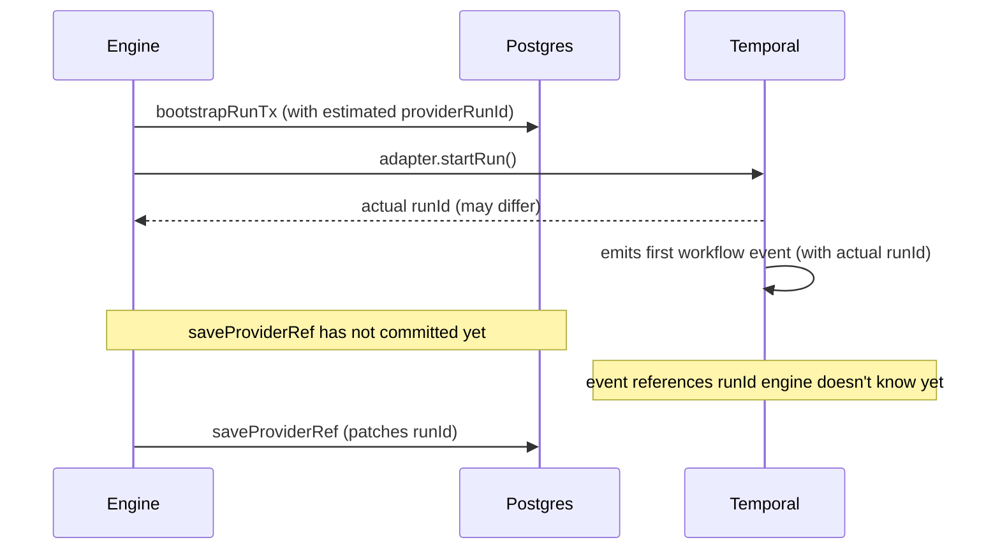
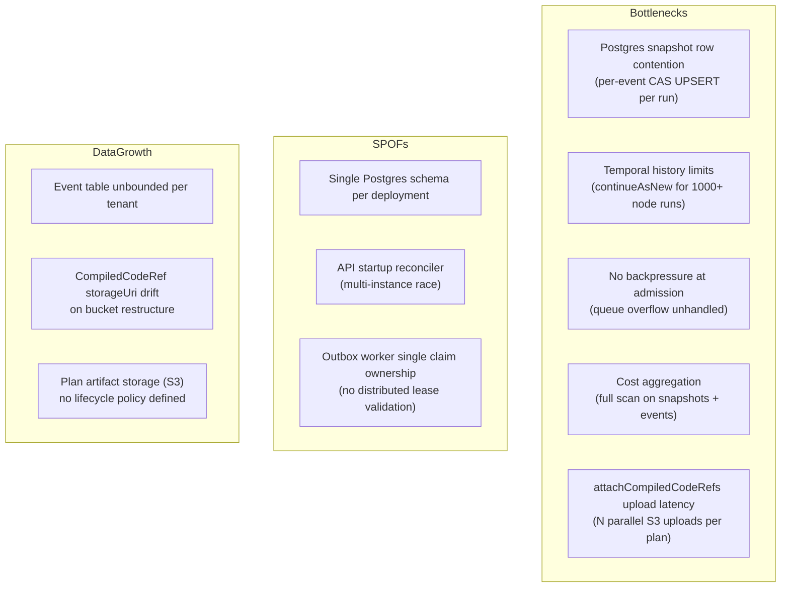
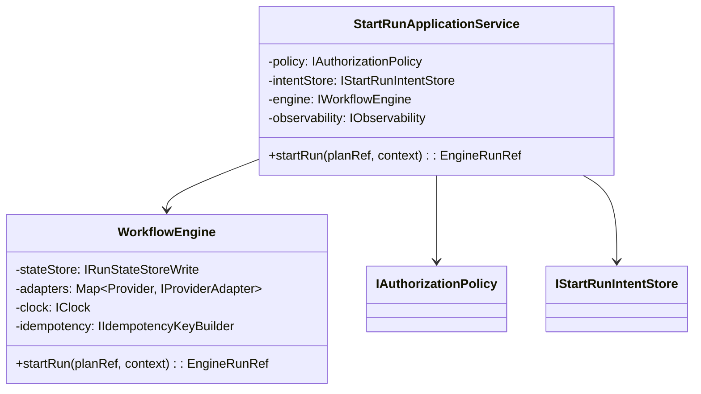
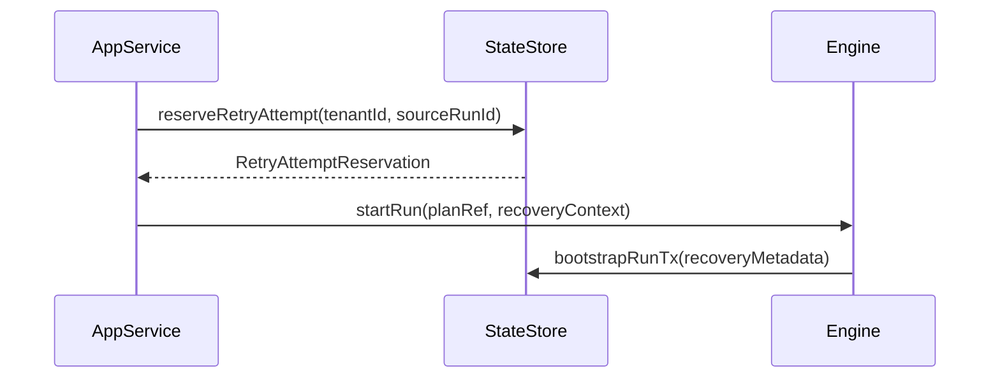
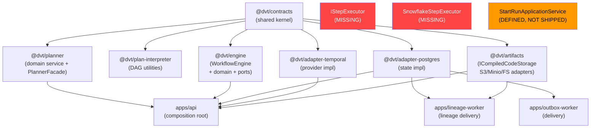

# DVT+ Architectural Review

> **Scope**: Deep technical review of the DVT+ system as of 2026-03-24.
> **Methodology**: Source code read directly — contracts, planner, engine, adapters, artifacts, ADRs.
> **Constraint**: No invented definitions. Review what exists.

---

## 1. Conceptual Soundness

### The Core Claim

> "The UI does not execute. The engine does not decide. The planner does not persist state."

This is a clean principle. The analysis below determines whether the implementation enforces or merely intends it.

---

### What Is Solid

**The planner is a real domain service.** `Planner.buildPlan()` is pure, deterministic, and has no I/O. It takes graph nodes, runs topological sort, applies policies, and assembles an `ExecutionPlanV2` with a content-addressable `planId = sha256(JCS(planCore))`. The CQRS split (`BuildPlanCommand` → `{ plan, canonicalPlanJson }`) is correctly applied. The `PlannerFacade` handles manifest resolution and environment stripping before handing off to the domain service. The boundary between application concerns and domain logic is genuinely clean here.

**`ExecutionPlanV2` is immutable and verifiable.** `planId` is a sha256 of the canonical plan JSON. `inputHashSha256` captures the semantic input independently. A consumer can verify `sha256(canonicalPlanJson) === planId` without trusting the producer. Content-addressed plan artifacts via `manifestRef.sha256` extend this to the graph source. This is correct.

**`@dvt/artifacts` owns compiled code storage as a bounded context.** `ICompiledCodeStorage` has a typed port with idempotent upload, read-back, and existence check. Adapters for S3, Minio, filesystem, and in-memory are implemented. Tenant scoping is enforced at the upload signature (`upload(tenantId, sha256, content)`). `attachCompiledCodeRefs` enriches plan steps post-build with content-addressed SQL refs, with dedup cache and parallel upload.

**Retry lineage authority (ADR-0040)** is the most precise design decision in the codebase. Splitting `engineAttemptId` (provider diagnostic) from `logicalAttemptId` (business lineage) and making the reservation a state-store responsibility is architecturally correct and non-trivial. Most systems collapse these.

**Event sourcing invariants (ADR-0004)** are well-understood and referenced consistently. `runSeq` as sole ordering authority, `applyRunEvent` as sole projection path, snapshot as rebuildable cache. The CAS guard on snapshot writes (S15) and the `bootstrapRunTx` atomicity guarantee are correctness primitives that most teams miss.

**`IProviderAdapter` is a true port.** The adapter receives `ResolvedRunContext` and `PlanRef`. It does not touch state, does not read tenant data beyond what's passed, does not make business decisions. Temporal-specific fields (namespace, taskQueue) are confined inside the `EngineRunRef` discriminated union. The boundary is genuinely clean.

**Bounded context articulation (ADR-0034)** is explicit with enforced one-way dependencies. Seven contexts, communication only via shared contracts, immutable refs, or persisted messages. This is real DDD without cargo-cult.

---

### What Is Fragile

**`WorkflowEngine` is not a domain service — it is a use case orchestrator.**

The engine handles authorization (`policy.assertStartRunAllowed`), rate limiting, intent persistence (`IStartRunIntentStore`), adapter dispatch, crash compensation, observability instrumentation (`withSpan`, metrics, trace context), and idempotency key generation. ADR-0039 §F2 identified this and prescribed extracting `StartRunApplicationService`. That extraction has not shipped. Every test of the engine is testing an application service, and the "engine does not decide" principle is partially violated — the engine currently decides authorization and orchestrates crash recovery.

**`reserveRetryAttempt` is optional on the write interface.**

```typescript
interface IRunStateStoreWrite {
  reserveRetryAttempt?(tenantId: string, sourceRunId: string): Promise<RetryAttemptReservation>;
}
```

The `?` breaks the invariant in ADR-0040 at the type level. Any implementation that omits this method silently violates the guarantee that `logicalAttemptId` is engine-resolved. The InMemory store implements it. Postgres implements it. But the contract allows a future store to skip it with no compile-time error.

**`attachCompiledCodeRefs` is fail-open.**

```typescript
onUploadFailure?: (stepId: string, error: Error) => void;
// "Fail-open: the step is returned unchanged."
```

A step can enter the execution plan without a `compiledCodeRef` if the artifact upload fails. The Temporal activity will receive a step with no SQL reference. The activity must handle this case. If it doesn't, it fails at runtime after the run has already started — after state has been committed. The fail-open policy is documented but the downstream impact on runtime execution is not defined in the contracts.

**`compiledCodeRef` lives inside `stepTypeConfig: Record<string, unknown>`.**

```typescript
return {
  ...step,
  stepTypeConfig: { ...step.stepTypeConfig, compiledCodeRef },
};
```

`compiledCodeRef` is not a typed field on `ExecutionStepV2`. It is embedded in the opaque config blob. The Temporal activity must know to look for it there and parse it as `CompiledCodeRef`. There is no compile-time guarantee that the activity correctly extracts it. The contracts layer defines `CompiledCodeRef` but does not define where in `stepTypeConfig` it lives. This is an implicit coupling across the planner/engine boundary.

**`observability` on `ExecutionPlanV2` is an open map included in the canonical plan hash.**

```typescript
observability?: {
  tags?: Record<string, string>;
  extra?: Record<string, unknown>;
  [k: string]: unknown;  // ← open
};
```

The `planId = sha256(JCS(planCore))` where `planCore` includes `observability`. Any observability field change — adding a tag, changing a value — produces a new `planId`. This means observability data is load-bearing in plan identity. It should not be. Observability should be excluded from the hash or the open index signature must be removed.

**The `manifest` compatibility path accepts `Record<string, unknown>` with no JSON Schema validation.**

`ManifestGraphDeriver` defensively parses the raw manifest (checking `resource_type`, `depends_on.nodes`). But there is no validation that the input conforms to the dbt manifest JSON Schema before parsing. A truncated or malformed manifest will produce an empty or partial graph with no structural error. The `assertNonEmpty` guard catches the empty case but not the partial case.

**`@dvt/planner-contracts` is an empty placeholder.**

The package has one file (`index.ts`) with a single interface re-export. It is listed as a package but has no substance. Either it should be removed and the interface moved to `@dvt/contracts`, or it should be built out. As-is, it adds build surface with no value.

**State-store split (ADR-0039 F3) is structurally incomplete.**

The three roles exist. But:

```typescript
type IRunStateStore = IRunStateStoreWrite & IRunStateStoreRead & IRunStateStoreMaintenance;
```

The compatibility alias means read-path consumers can still obtain the write port from any handle. Until callers inject specific role interfaces, the split is documentation. Enforcement requires removing the alias and updating composition roots.

---

### What Is Missing

- **No `IStepExecutor` or Snowflake execution port.** The system orchestrates execution of dbt SQL. `CompiledCodeRef` stores the reference. `ICompiledCodeStorage.read()` retrieves the bytes. But the Temporal activity that executes the SQL against Snowflake has no defined port. Snowflake credentials, connection lifecycle, query timeout, and result handling are not present in any contract.
- **No `payloadVersion` on events (S05 queued).** Every event consumer must handle payload evolution defensively with no schema version signal.
- **No run retention SLA.** Event logs grow unbounded per tenant until explicit archival.
- **No distributed locking for multi-instance API.** Two API instances racing on intent reconciliation will produce double-compensation.
- **No snapshot schema version.** `WorkflowSnapshot` has no `schemaVersion` field. Adding a required step attribute is a silent breaking change on stored snapshots.

---

## 2. Architectural Risk Map

| Risk                                                                                            | Severity | Likelihood | Why                                                                                                                               | Mitigation                                                                                                                                          |
| ----------------------------------------------------------------------------------------------- | -------- | ---------- | --------------------------------------------------------------------------------------------------------------------------------- | --------------------------------------------------------------------------------------------------------------------------------------------------- |
| **`compiledCodeRef` embedded in opaque `stepTypeConfig`** — Temporal activity implicit coupling | High     | High       | No typed field. Activity must know the key name. Contract change → silent runtime break.                                          | Add `compiledCodeRef` as typed optional field on `ExecutionStepV2` OR define a typed accessor function in contracts.                                |
| **`attachCompiledCodeRefs` fail-open** — run starts without SQL ref                             | High     | Medium     | Upload failure → step has no SQL. Activity receives undefined compiledCodeRef. Execution fails after run committed.               | Activity MUST check ref presence and emit `StepFailed` with `MISSING_COMPILED_CODE` before any SQL execution. Codify in the step executor contract. |
| **`observability` in `planId` hash** — tag change = new plan version                            | High     | High       | Open `[k: string]` map is included in JCS hash. Adding a monitoring tag changes `planId`. Breaks plan version stability.          | Exclude `observability` from hash computation. It is not semantic plan content.                                                                     |
| **`WorkflowEngine` authorization creep** — policy logic growing inside domain service           | High     | High       | F2 (StartRunApplicationService) defined in ADR-0039 but not shipped. New policy requirements land in the engine.                  | Merge F2 before any new policy logic. Hard block.                                                                                                   |
| **`reserveRetryAttempt` optional** — retry lineage invariant unenforced at type level           | High     | Medium     | ADR-0040 invariant is not contractual. Any new store implementation can silently omit it.                                         | Remove `?`. Mandatory.                                                                                                                              |
| **No Snowflake execution contract** — SQL execution boundary undefined                          | High     | High       | Temporal activities execute SQL against Snowflake. No `IStepExecutor` port. Credentials, timeouts, error mapping are unspecified. | Define `IStepExecutor` port before any production Snowflake deployment.                                                                             |
| **`WorkflowSnapshot` no schema version** — silent shape breaks on stored data                   | High     | High       | 32 queued tasks, many touching state. Each risks shape drift. Old snapshots are never invalidated automatically.                  | Add `schemaVersion` to `WorkflowSnapshot`. Version bump triggers rebuild.                                                                           |
| **Multi-tenant isolation via query filter only**                                                | Medium   | Medium     | No Postgres RLS, no schema-per-tenant. SQL bug → cross-tenant data leak.                                                          | Add RLS as defense-in-depth. Integration test asserting cross-tenant read rejection.                                                                |
| **Intent reconciler single-instance assumption**                                                | Medium   | High       | Two API instances = concurrent reconciliation over same intent table. No distributed lease.                                       | Apply same claim pattern as outbox worker. Advisory lock or per-instance lease.                                                                     |
| **`payloadVersion` absent on events (S05 queued)**                                              | Medium   | High       | Adding payload fields is unversioned. Consumer parsing breaks without advance notice.                                             | Ship S05 before adding any new payload fields. Hard prerequisite.                                                                                   |
| **`manifest` path accepts raw `Record<string, unknown>`** — partial manifest undetected         | Medium   | Medium     | `ManifestGraphDeriver` parses defensively but a truncated manifest produces a partial graph with no error.                        | Validate against dbt manifest JSON Schema at the `PlannerFacade` boundary before deriving nodes.                                                    |
| **Temporal history limit → `continueAsNew`**                                                    | Medium   | Medium     | S14 fixed gateway context loss. Other workflow state may not survive.                                                             | Enumerate all workflow state. Contract test: N events → `continueAsNew` → assert full state survival.                                               |
| **`planVersion` string with no enforcement (S16 queued)**                                       | Medium   | High       | Any string is valid. Engine cannot detect stale plan refs at dispatch time.                                                       | Ship S16. Require semver or monotonic integer. Reject below registered minimum.                                                                     |
| **Write amplification at concurrent run scale**                                                 | Medium   | High       | 5+ writes per run start + per-event snapshot UPSERT. At 1000 concurrent runs, Postgres WAL is the bottleneck.                     | Asynchronous snapshot materialization. Partition events by tenant. Separate read replica.                                                           |
| **Outbox lag → stale lineage data**                                                             | Medium   | Medium     | If outbox worker lags, lineage data is stale with no signal to callers.                                                           | `outboxLagMs` in health check. Reject new runs if lag exceeds threshold.                                                                            |
| **`@dvt/planner-contracts` empty placeholder**                                                  | Low      | Low        | Package exists with one re-export. Adds build surface, no value.                                                                  | Merge into `@dvt/contracts` or build it out.                                                                                                        |

---

## 3. Engine Abstraction Critique

### Is `IWorkflowEngine` Minimal and Correct?

The public interface is five methods. That is correct. The problem is the `WorkflowEngine` implementation carries 15+ constructor dependencies and application-level concerns. The interface hides this but the object is not a domain service.

`getRunStatus` returns `RunStatusSnapshot`. This is correct if it reads from the snapshot store. If it polls the provider adapter, it introduces provider coupling on the read path. The implementation should be confirmed to always read from state.

### Is Temporal-First Strategy Wise?

Yes for current scale. Temporal provides deterministic execution history, activity retries, and `continueAsNew`. The abstraction via `IProviderAdapter` is the right hedge.

The risk: the Temporal workflow interpreter is stateful (step results, gateway decisions persist across `continueAsNew`) while the engine model assumes stateless dispatch. If the interpreter holds step results in workflow history AND the engine persists them as events, there are two sources of truth for step status. ADR-0004 says events are canonical. The Temporal workflow history is then derived. This must be explicit — the workflow must replay engine events, not maintain independent state.

### Where Determinism Assumptions Could Fail

**`estimateRunRef` race window:**



If `estimateRunRef` is not implemented (it's optional), the `providerRunId` in the bootstrap is a placeholder. The ordering of `saveProviderRef` vs. Temporal's first event emission is not guaranteed. An event can be committed referencing a `providerRunId` the engine has not yet acknowledged.

**`compiledCodeRef` mutability:**

`ICompiledCodeStorage.upload()` is idempotent by sha256. But `storageUri` is a backend-supplied string (S3 key, Minio path). If the backend URI scheme changes (bucket rename, path restructure), stored `CompiledCodeRef.storageUri` values become stale. The sha256 is immutable; the URI is not.

**`observability` in `planId` hash** (see §2 above): adding a monitoring tag produces a new planId. Determinism breaks silently.

---

## 4. Execution Planning Layer Analysis

### What Exists

The planner pipeline is complete end-to-end:

```mermaid
flowchart LR
    dbt_manifest["dbt manifest.json\nor manifestRef URI"]
    facade["PlannerFacade\n(application boundary:\nresolution + validation)"]
    deriver["ManifestGraphDeriver\n(manifest → GraphNodes)"]
    graph_builder["GraphBuilder\n(validate DAG)"]
    selector["NodeSelector\n(selection + upstream/downstream)"]
    topo["TopoSort\n(execution ordering)"]
    assembler["PlanAssembler\n(hash + assemble ExecutionPlanV2)"]
    artifacts["attachCompiledCodeRefs\n(upload SQL → CompiledCodeRef)"]
    plan_ref["PlanRef\n(URI + sha256)"]

    dbt_manifest --> facade
    facade --> deriver
    deriver --> graph_builder
    graph_builder --> selector
    selector --> topo
    topo --> assembler
    assembler --> artifacts
    artifacts --> plan_ref
```



The DAG utilities (`TopoSort`, `GraphBuilder`, `NodeSelector`, `Depth`) are correctly decomposed. Policy resolution (`resolvePolicies`) is deterministic given the same input. The abort hook and timeout guard are practical safety valves for large manifests.

### Real Gaps

**`attachCompiledCodeRefs` is external to `Planner.buildPlan()`.** The planner produces a plan without SQL refs. The caller must call `attachCompiledCodeRefs` separately. If a caller forgets, the plan contains steps with no SQL and the failure is deferred to runtime. This should be part of the plan assembly contract, not a post-processing step.

**`compiledCodeRef` position in `stepTypeConfig` is undocumented in contracts.** The key name `compiledCodeRef` is implicit. Temporal activities and any other consumer must know to look for `step.stepTypeConfig.compiledCodeRef` and parse it as `CompiledCodeRef`. This is an API surface that is not in `@dvt/contracts`.

**No partial execution guarantee.** If a 1000-step run fails at step 800, there is no defined `resumeFrom` semantics. The event log records which steps completed. The snapshot stores step status. But the engine interface has no `resumeRun` method, and the Temporal workflow would need to reconstruct execution state from the event log — which requires reading back all events, not just the latest snapshot.

**Is this layer over-engineered?** No. The decomposition (Facade, Deriver, Builder, Selector, Assembler) maps directly to single responsibilities. The complexity is justified by the problem domain.

**Is it under-specified?** At the execution side, yes. The plan produces `ExecutionStepV2` with `kind` and `stepTypeConfig`. The Temporal activity that consumes the step has no typed contract for what it receives. The gap is between planning (complete) and execution (undefined interface).

---

## 5. State & Metadata Layer Review

### Is Artifact Immutability Realistic?

For content-addressed artifacts (sha256): yes, the hash makes them immutable by definition.

The gap: `ICompiledCodeStorage.upload()` returns a `storageUri` that is backend-controlled. The URI can change (bucket restructure, tenant migration) while the sha256 stays valid. Stored `CompiledCodeRef` values become unreachable. There is no mechanism to repoint refs when URIs change.

`ManifestGraphDeriver` parses `manifest.nodes` but does not validate the dbt manifest JSON Schema. A dbt version upgrade that changes the manifest structure will silently produce a different graph without error.

### Write Amplification Risk

Per `startRun`:

1. Intent `INSERT` — intent durability
2. `run_metadata` INSERT — metadata
3. `run_events` INSERT (≥1 event) — event log
4. `run_snapshots` UPSERT — read model
5. `outbox` INSERT (per event) — delivery queue

Five writes minimum per run start, in a single transaction (items 2–5). At concurrent scale, the snapshot UPSERT per event is the critical path. Each event write for a run contends on the same snapshot row (CAS guard on `last_run_seq`). This is a sequential bottleneck per run.

For a 1000-node dbt run:

- 2000 events (`StepStarted` + `StepCompleted` per node)
- 2000 snapshot UPSERT operations sequentially per run
- 2000 outbox records

The current model will not scale past a few hundred concurrent large runs on a single Postgres instance without asynchronous snapshot materialization.

### Event Sourcing vs. Mutable State Tradeoffs

The hybrid model (event log + snapshot cache) is correct. The risk is undetected snapshot divergence. If `applyRunEvent` has a bug, wrong snapshots are served silently. `rebuildSnapshot` exists but is not automatically triggered on schema or logic changes. There is no background divergence detector.

---

## 7. What Is Overbuilt?

### Observability Instrumentation

The observability layer is production-grade (spans, metrics, traces, fallback throttling, error context objects). This depth is ahead of current operational requirements. New spans and metric labels are being added for scenarios that have not yet occurred in production. Instrument on evidence, not on anticipation.

### ADR Process Volume

44+ ADRs for a pre-production system. The ADR process is rigorous to the point of slowing delivery. Decisions like "move provider selection to composition root" (ADR-0039 F5) do not need formal ADRs. They need a PR. Reserve ADRs for irreversible or load-bearing decisions.

### Plan Validation Lifecycle

`PlanValidationLifecycle.v1.ts`, `PlanExecutabilityValidation.v1.ts`, `ExecutionBindingVerification.v1.ts` exist as contracts files. These define validation phases but the validators are not all implemented. The contract surface is ahead of the implementation.

### `@dvt/planner-contracts`

One file, one re-exported interface. This package adds build complexity with zero value at current state.

---

## 8. What Is Underbuilt?

### Snowflake Execution Contract

This is the largest gap for a dbt+Snowflake execution platform:

```mermaid
classDiagram
    class IStepExecutor {
        <<interface — MISSING>>
        +execute(ref: CompiledCodeRef, ctx: StepExecutionContext): Promise~StepResult~
        +canExecute(stepKind: string): boolean
    }
    class SnowflakeStepExecutor {
        <<MISSING>>
    }
    class IStepExecutor <|.. SnowflakeStepExecutor
```

No `IStepExecutor` port. No Snowflake credentials management per tenant. No connection lifecycle. No query timeout / warehouse sizing policy. No Snowflake error type mapping (transient vs. terminal). No `COPY INTO` / DDL rollback semantics. The system orchestrates execution of dbt SQL but does not define what execution means at the contract level.

### Distributed Consistency Model

No cross-shard consistency model. No read-your-writes guarantee. No discussion of Postgres replication lag on read replicas. A caller that writes an event and immediately reads the snapshot may get stale data with no defined SLA.

### Backpressure at Admission

API → Temporal has no defined saturation response. No circuit breaker at admission. No back-pressure from Temporal queue depth. The outbox has DLQ and retry limits. The admission path has none.

### Run Retention Policy

`PostgresDeliveryBufferPurgeStore` handles outbox retention. `PostgresRunArchiveStore` handles run archival. But the policy for when a run's event log is archived, how long it is retained, and what happens after archival (immutable cold storage vs. deletion) is not in the contracts.

At 1000 tenants × 1000 runs/day × 2000 events/run = 2 billion events/day. Without explicit retention, the event table reaches terabyte scale within months.

### Version Evolution Strategy for Contracts

`@dvt/contracts` is a shared kernel. No consumer-driven contract tests. No backwards-compatible field addition policy. No defined process for deprecating contract fields. The `IWorkflowEngine` naming convention (`v1_1_1`) implies versioning but the mechanism is naming, not enforcement.

### Partial Execution / Resume Semantics

No `resumeRun` method on `IWorkflowEngine`. No `resumeFrom` semantics in the engine interface. Long-running dbt runs that fail mid-execution have no defined recovery path at the engine contract level.

---

## 9. Scalability Outlook (3-Year Horizon)

Assumptions: 1000+ tenants, thousands of concurrent runs, 1000+ node dbt projects, cross-environment diffs, heavy cost dashboards.



### Postgres at Scale

The synchronous snapshot UPSERT per event is the critical bottleneck. A 1000-node run triggers 2000 sequential write contention events on the same snapshot row. Asynchronous materialization (batch rebuild from event log, triggered by `runSeq` watermark) is required before hitting 100 concurrent large runs.

The event table has no partition strategy defined. At 2 billion events/day, unpartitioned queries will degrade. Partition by `tenant_id` hash or date range before reaching 50TB.

### Temporal at Scale

S14 fixed gateway context loss across `continueAsNew`. This confirms the workflow interpreter holds stateful context beyond what's in the event log. At 1000+ nodes, `continueAsNew` will be triggered during normal execution. Full enumeration of all workflow state that must survive `continueAsNew` must be a contract test, not an incident-driven discovery.

### Planner Compute at Scale

`Planner.buildPlan()` is O(V+E) for DAG operations. For a 1000-node manifest, this is negligible CPU. The bottleneck is `attachCompiledCodeRefs` — N parallel S3 uploads per plan build. With dedup cache, same-content steps are uploaded once. But cold plan builds for large manifests will have upload latency proportional to unique SQL blobs.

The `limits.maxNodes` guard exists. The `limits.maxPlanSizeBytes` guard exists. These are configurable. At 1000 tenants with daily builds, the planner is CPU-safe but I/O-bound on artifact storage.

### Cost Attribution

No materialized cost data. Any cost dashboard requires aggregation over the event log or snapshot table. At scale, this requires a separate analytics materialization path (pre-aggregated at step completion, not computed at query time).

---

## 10. Architectural Scorecard

| Dimension                     | Score | Justification                                                                                                                                                                                                                                                                      |
| ----------------------------- | ----- | ---------------------------------------------------------------------------------------------------------------------------------------------------------------------------------------------------------------------------------------------------------------------------------- |
| **Conceptual clarity**        | 8/10  | Bounded contexts are real and documented. Planner, engine, artifacts, delivery separation is genuine. Penalized for `WorkflowEngine` carrying application concerns and `compiledCodeRef` being untyped in contracts.                                                               |
| **Separation of concerns**    | 6/10  | Planner/artifacts boundary is clean. Engine/application boundary is not (F2 unshipped). `stepTypeConfig` as opaque blob creates implicit coupling between planner output and Temporal activity consumption.                                                                        |
| **Replaceability of engine**  | 8/10  | `IProviderAdapter` boundary is clean. Temporal/Conductor/Mock swap is structurally possible. Temporal-specific fields confined to discriminated union. Penalized for `IWorkflowEngine` mixing domain and application concerns.                                                     |
| **Determinism**               | 7/10  | `planId = sha256(JCS(planCore))` is strong. Idempotency via `idempotencyKey` is correct. Penalized for: `observability` open map in hash, `estimateRunRef` optional race window, `compiledCodeRef` storageUri mutability.                                                          |
| **Extensibility**             | 6/10  | `StepKind` is open string (ADR-0006 fail-open). `IStepTypeRegistry` validates known kinds. New step kinds don't require contracts changes. Penalized for closed event type catalog and no plugin execution surface.                                                                |
| **Operational realism**       | 6/10  | Intent durability, outbox DLQ, CAS guard, rollback-capable migrations are correct. Gaps: no backpressure, no retention policy, multi-instance reconciler is unsafe, no divergence detector.                                                                                        |
| **Long-term maintainability** | 6/10  | ADR process is thorough but accumulating faster than delivery. 32 queued tasks, F2 unshipped for weeks. Risk of design-code gap widening. `ICompiledCodeStorage` bridge in planner signals migration debt.                                                                         |
| **SOLID compliance**          | 7/10  | SRP: `WorkflowEngine` violates, `Planner` pipeline is exemplary. OCP: event catalog is closed, step kinds are open. LSP: adapter substitutability is correct. ISP: state store split defined but not enforced. DIP: hexagonal ports applied consistently in planner and artifacts. |
| **DDD fidelity**              | 8/10  | Aggregate roots, value objects, domain services, application services, bounded contexts, ports — all correctly applied in planner. Engine context correct in design, incomplete in execution (F2).                                                                                 |
| **CQRS fidelity**             | 7/10  | `BuildPlanCommand` → read model pattern in planner is correct. State store split defined. `WorkflowSnapshot` as CQRS read model is correct. Gaps: compatibility alias enables bypassing role segregation, no CQRS enforcement at injection point.                                  |

**Overall: 6.9/10** — The planner, artifacts, and contracts layers are well-architected. The execution layer has a structural debt (F2) and a missing execution contract (Snowflake). The determinism model is strong but has three concrete failure modes.

---

## 11. Strategic Recommendations

### 3 Structural Changes

**1. Ship ADR-0039 F2: Extract `StartRunApplicationService`.**

`WorkflowEngine` must become a pure domain service. Authorization, observability instrumentation, and intent persistence are application concerns.



Until this ships, every new authorization requirement lands in the domain service. This is the highest-priority structural debt.

**2. Define `IStepExecutor` port and freeze the `compiledCodeRef` extraction contract.**

Two sub-tasks:

a) Add `compiledCodeRef` as a typed optional field on `ExecutionStepV2` in `@dvt/contracts` (or define a typed accessor). Remove the implicit key-name coupling:

```typescript
// Current (fragile)
step.stepTypeConfig?.compiledCodeRef; // implicit, untyped

// Required
interface DbtExecutionStepConfig {
  compiledCodeRef?: CompiledCodeRef;
  // other dbt-specific fields
}
```

b) Define the execution port:

```typescript
interface IStepExecutor {
  execute(step: ExecutionStepV2, ctx: StepExecutionContext): Promise<StepResult>;
  canExecute(kind: StepKind): boolean;
}
```

**3. Remove `observability` from `planId` hash computation.**

Observability tags are not semantic plan content. Including them in the hash means a monitoring tag change produces a new plan version. Fix in `PlanAssembler`: exclude `observability` from `planCore` before hashing, or move it outside `planCore`.

```typescript
// planCore used for hash (no observability)
const planCore = { metadata: { planVersion, inputHashSha256 }, steps };

// planId
planId = sha256(JCS(planCore));

// ExecutionPlanV2 (observability added after hash)
const plan: ExecutionPlanV2 = {
  ...planCore,
  metadata: { ...planCore.metadata, planId, createdAtIso },
  observability,
};
```

---

### 3 Clarifications Needed

**1. What is the `attachCompiledCodeRefs` call site contract?**

Who calls `attachCompiledCodeRefs`? When? Is it always required? Can the engine start a run from a plan that has no `compiledCodeRef` on its steps? The answer determines whether fail-open is safe or a correctness hazard. Document this as a normative rule in `@dvt/contracts`.

**2. What is the `RETRY_RUN` full state machine?**

ADR-0040 defines the reservation mechanism. It does not define who calls `reserveRetryAttempt`, who constructs the recovery `RunBootstrapInput`, and who calls `engine.startRun()`. Define as a sequence diagram:



**3. What survives `continueAsNew` in the Temporal workflow?**

S14 fixed gateway context. Enumerate all other state the workflow interpreter maintains and assert each field survives `continueAsNew`. Make this a named contract test, not a discovered property.

---

### 3 Things to Freeze Immediately

**1. Freeze `WorkflowSnapshot` shape until `schemaVersion` is implemented.**

No new fields until `schemaVersion` is added and a migration/rebuild strategy is defined. Every field added now is a silent breaking change on stored snapshots.

**2. Freeze new event type additions until S05 (`payloadVersion`) ships.**

S05 is a hard prerequisite for any new payload field. Without it, every addition is unversioned in production.

**3. Freeze multi-instance API deployment until the intent reconciler has distributed lease support.**

Two API instances racing on reconciliation produce double-compensation (`RunFailed` for succeeded runs). Not production-safe until fixed.

---

### 3 Things to Delay

**1. Delay cost attribution depth.**

No cost field on `ExecutionStepV2`. No cost materialization at step completion. Building cost dashboards on unstructured data is waste. Defer until the execution contract is defined and step results are typed.

**2. Delay Conductor adapter beyond stub.**

The `IProviderAdapter` abstraction is correct. Do not generalize it further until there is a real Conductor deployment to validate against. Premature generalization of the provider interface will optimize for a hypothetical second backend.

**3. Delay `PlanValidationLifecycle` / `ExecutionBindingVerification` contract elaboration.**

These contracts are ahead of their implementations. Elaborating validation phases that are not yet implemented adds specification debt. Implement, then specify.

---

## Appendix: True Dependency Map



---

## Appendix: Critical Invariant Gaps

| Invariant                                   | Defined     | Enforced                                  | Risk                                    |
| ------------------------------------------- | ----------- | ----------------------------------------- | --------------------------------------- |
| `logicalAttemptId` engine-resolved          | ADR-0040    | Partial — `?` on interface                | Silent bypass in new implementations    |
| Snapshot rebuildable from event log         | ADR-0039    | Yes — `rebuildSnapshot`                   | None currently                          |
| Event ordering by `runSeq ASC`              | ADR-0004    | Yes — query-level                         | None currently                          |
| Tenant isolation on all reads/writes        | ADR-0031    | SQL filter only                           | No RLS defense-in-depth                 |
| `planId = sha256(JCS(planCore))` stability  | ADR-0002    | Broken — `observability` in hash          | Tag change = new planId                 |
| `compiledCodeRef` present before execution  | ADR-0032    | Not enforced — fail-open                  | Step executes without SQL ref           |
| `compiledCodeRef` typed field in step       | ADR-0032    | Not enforced — in opaque `stepTypeConfig` | Implicit key coupling across boundaries |
| `payloadVersion` on all event payloads      | S05         | **Not implemented**                       | Schema drift undetected                 |
| `WorkflowSnapshot` schema versioned         | ADR-0039 F4 | **Not implemented**                       | Silent shape breaking changes           |
| Intent reconciler safe under multi-instance | ADR-0030    | **Not safe**                              | Data corruption at scale                |
| Snowflake execution boundary defined        | —           | **Not defined**                           | No contract for SQL execution           |
