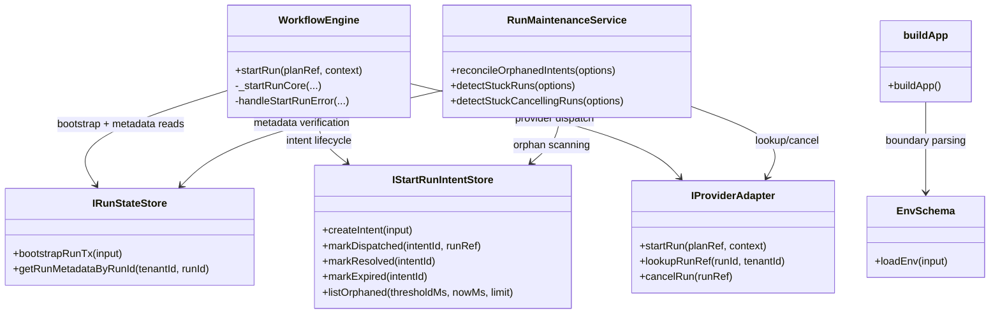
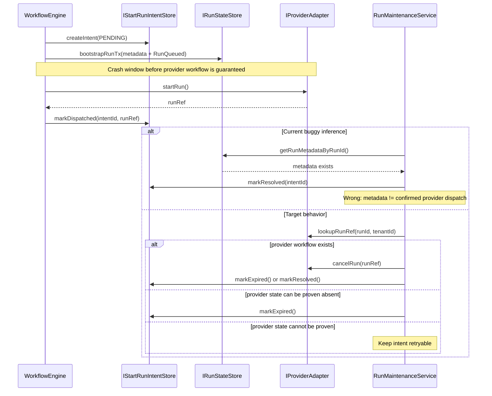
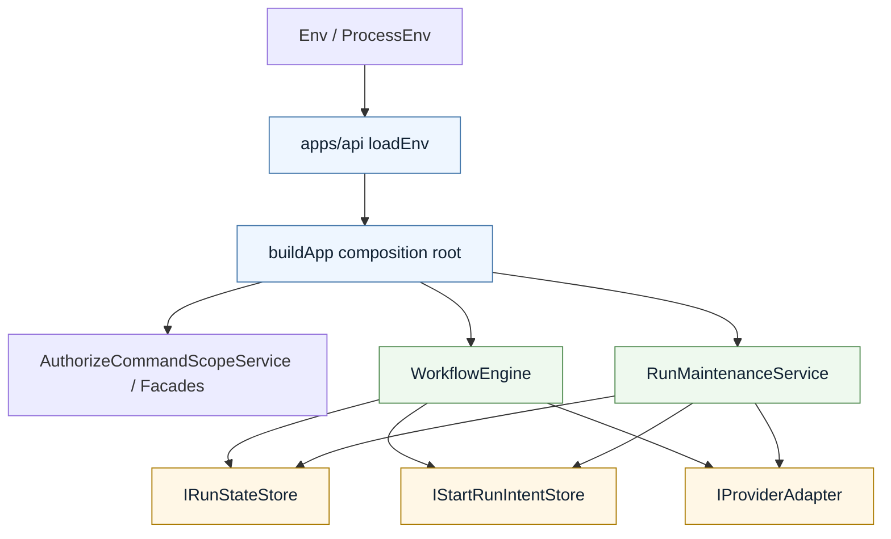

# Think-First Analysis: Harden Intent Reconciliation And API Boolean Flags

## IA Checklist

- [x] Problem summary
- [x] Root cause
- [x] Constraints and invariants (cite ADRs)
- [x] Options considered (including libraries evaluated)
- [x] Selected option and rationale
- [x] Rejected alternatives
- [x] Evidence and links

## Problem Summary

Two review findings on `#459` are materially useful and should be treated as
real correctness issues rather than PR noise:

1. `RunMaintenanceService.reconcileOrphanedIntents()` currently risks treating
   `run_metadata exists` as equivalent to `provider dispatch really happened`.
   Under the pre-bootstrap path, that equivalence is false.
2. `apps/api/src/plugins/env.ts` uses `z.coerce.boolean()` for operational
   flags. In Zod, any non-empty string becomes truthy, so values such as
   `"false"` or `"0"` can enable routes or runtimes that operators intended to
   disable.

Both problems are boundary problems:

- the reconciler is inferring provider truth from write-side metadata
- the API env adapter is inferring boolean truth from generic JS coercion

## Root Cause

### 1. Reconciler root cause

The lifecycle model now has two valid start paths:

- legacy path: `adapter.startRun()` first, then `bootstrapRunTx()`
- pre-bootstrap path: `bootstrapRunTx()` first, then `adapter.startRun()`

That means `run_metadata present` no longer proves that provider dispatch has
already happened. A `PENDING` intent may coexist with bootstrapped metadata
before a workflow exists on the provider side.

The root cause is therefore not "missing retry logic". It is a semantic
conflation between:

- state-store write-side truth
- provider-runtime existence
- intent lifecycle truth

### 2. API env root cause

`loadEnv()` in `apps/api` is implemented as a boundary adapter, but it uses a
generic coercion rule instead of a domain-safe configuration rule. This is
acceptable for numbers like `PORT`, but unsafe for operational/security flags.

The root cause is fail-open boolean parsing at an operational boundary.

## Constraints And Invariants

- [ADR-0003](../../adr/ADR-0003-execution-model.md): DVT owns lifecycle
  semantics. Infrastructure state MUST NOT redefine run semantics.
- [ADR-0004](../../adr/ADR-0004-event-sourcing-strategy.md): write-side state,
  replay, and projections remain explicit and deterministic. Derived behavior
  must not silently blur authority boundaries.
- [ADR-0013](../../adr/ADR-0013-run-state-store-bootstrapRunTx.md):
  `bootstrapRunTx()` atomically persists metadata and first events. Metadata may
  exist before later external calls finish.
- [ADR-0030](../../adr/ADR-0030-pre-dispatch-intent-log.md): intent lifecycle
  is the crash-consistency mechanism for `startRun()`. Reconciliation semantics
  must preserve orphan detection and cleanup guarantees.
- [Reference Architecture](../../architecture/reference-architecture.md):
  infrastructure must stay behind ports/adapters; boundary adapters should
  fail-safe, not guess semantics from convenience coercion.
- [AI Work Protocol](../../guides/ai-work-protocol.md): negative-path tests are
  mandatory for new behavior; a think-first plus pre-implementation brief is
  required before changing code.

## Options Considered

### Option A. Minimal patch

- Remove the `existingMeta -> markResolved()` fast-path for `PENDING` intents.
- Replace only `DVT_ADMIN_ROUTES_ENABLED` with a strict boolean parser.

Pros:

- smallest patch
- low change surface

Cons:

- leaves the same boolean bug on other API flags
- fixes the symptom, not the configuration policy
- does not document the architecture boundary clearly

### Option B. Coherent boundary fix

- For `PENDING` intents, never resolve based on metadata alone.
- Probe provider state first when the adapter can prove existence/absence via
  `lookupRunRef`.
- Only expire or resolve after verified provider state; otherwise keep the
  intent retryable.
- Replace `z.coerce.boolean()` in `apps/api` with the same strict boolean
  semantics already used in
  [`apps/outbox-worker/src/plugins/env.ts`](../../../apps/outbox-worker/src/plugins/env.ts).

Pros:

- aligns reconciliation with ADR-0030 semantics
- fails closed at the API configuration boundary
- reuses an existing repo-local pattern instead of inventing a new one
- improves architecture consistency across apps

Cons:

- requires new negative-path tests
- may expose that optional `lookupRunRef` weakens reconciliation guarantees for
  some adapters

### Option C. Bigger refactor

- Extract an `IntentReconciliationPolicy` service.
- Extract a shared `envBoolean` helper package or shared config module.

Pros:

- strongest SRP/DIP shape
- reusable across apps

Cons:

- too large for a PR-review blocker slice
- mixes bug-fix work with structural refactor work

## Selected Option And Rationale

Select **Option B**.

It is the smallest option that is still architecturally honest:

- it fixes the real correctness bug in `RunMaintenanceService`
- it fixes the operational exposure bug in `apps/api`
- it respects hexagonal boundaries instead of adding more ad-hoc conditionals
- it gives us negative-path coverage where the current suite is weakest

This slice should stay a **Slim** task. It is a bug fix plus boundary hardening,
not a new feature.

## Rejected Alternatives

- Reject Option A because it leaves the API config boundary inconsistent and
  only partially fixes the architectural problem.
- Reject Option C for this turn because it expands scope into a larger design
  refactor not required to close the review blockers.

## Diagram Review

### Review of existing buildApp diagrams

The diagrams in
[`20260314-task4-buildApp-closeout.md`](./20260314-task4-buildApp-closeout.md)
are useful as intent sketches, but they are **not valid class diagrams of the
real system**.

Problems:

- `buildApp` is a function/composition root, not a class.
- `OIDC`, `Providers`, and `Fastify` are shown as if they were direct domain
  classes in the same model.
- the diagram omits real participants such as `Env`, `StartRunAuthorizedFacade`,
  `AuthorizeCommandScopeService`, `WorkflowEngineFactory`, and the storage ports.

Rule going forward:

- use `classDiagram` only for actual types/classes or interface relationships
- use `graph TD` / `flowchart` for composition-root and module wiring
- mark conceptual diagrams as conceptual; do not present them as the canonical
  dependency graph

## Class Diagram: Real Participants For This Slice

### Diagram warning

`buildApp` is shown above as a diagram node for readability. It is not a domain
class and should be treated as a composition-root boundary, not as an aggregate
or OO entity.

## Sequence Diagram: The Real Crash Window

## Hexagonal Diagram: Boundary Ownership

## DDD / SOLID / Hexagonal / OOP Review

| Area                    | Current state        | Assessment                                                                                                                                                                                |
| ----------------------- | -------------------- | ----------------------------------------------------------------------------------------------------------------------------------------------------------------------------------------- |
| DDD aggregate ownership | Partial              | `WorkflowEngine` and `RunMaintenanceService` still share lifecycle semantics indirectly. This slice must avoid letting reconciliation redefine run lifecycle based on metadata shortcuts. |
| SRP                     | Partial              | `RunMaintenanceService` owns three maintenance policies plus event-building support. That is already broad; this slice should reduce semantic leakage, not add more.                      |
| OCP                     | Partial              | API flags are currently unsafe to extend because each new boolean inherits JS coercion behavior. A strict boolean parser improves extension safety.                                       |
| LSP                     | Partial              | Optional `lookupRunRef` means not every adapter can support the same reconciliation guarantees. Code must degrade by retrying, not by assuming absence.                                   |
| ISP                     | Partial              | `IProviderAdapter` already mixes runtime and maintenance capabilities. This slice should not widen it further; just use existing optional capabilities carefully.                         |
| DIP                     | Good                 | Both `WorkflowEngine` and `RunMaintenanceService` depend on ports, not concrete adapters/stores. The fix should preserve this.                                                            |
| Hexagonal architecture  | Good but leaky       | Ports are in place, but the reconciler currently infers external runtime truth from internal metadata. That is a boundary leak.                                                           |
| OOP diagram quality     | Weak in current docs | Some existing docs model functions/modules as classes. This slice should document real type relationships separately from conceptual wiring diagrams.                                     |

## Pre-Implementation Brief

- **Mode**: `Slim`
- **Scope**:
  - fix `PENDING` intent reconciliation semantics
  - harden API boolean parsing with explicit string semantics
  - add negative-path tests for both behaviors
- **Touched files or paths**:
  - `packages/@dvt/engine/src/services/RunMaintenanceService.ts`
  - `packages/@dvt/engine/test/services/RunMaintenanceService.intentReconciliation.test.ts`
  - `apps/api/src/plugins/env.ts`
  - `apps/api/test/plugins/*.test.ts` or a new dedicated env test file
  - possibly `apps/api/test/app.test.ts` if route exposure needs coverage
- **Expected outcome**:
  - `PENDING` intents are not resolved from metadata-only evidence
  - API flags parse `"true"/"1"` as true and `"false"/"0"` as false
  - ambiguous boolean strings fail validation
- **Risks and mitigations**:
  - risk: adapters without `lookupRunRef` may need a conservative fallback
    mitigation: keep intents retryable when absence cannot be proven
  - risk: stricter env parsing may break loose local setups
    mitigation: document accepted boolean literals and add explicit tests
- **Out-of-scope items**:
  - refactoring `RunMaintenanceService` into multiple services
  - changing the public provider contract shape
  - broad `buildApp` modularization beyond what this bug fix needs
- **Validation plan**:
  - `pnpm --filter @dvt/engine test`
  - `pnpm --filter dvt-api test`
  - `pnpm docs:quality:check`
  - `pnpm docs:canonical:check`
- **Test coverage plan**:
  - negative: `PENDING + metadata exists + no verified provider workflow`
  - negative: `PENDING + lookup unsupported`
  - negative: `DVT_ADMIN_ROUTES_ENABLED="false"` stays disabled
  - negative: ambiguous boolean strings such as `"yes"` are rejected
- **Libraries evaluated**:
  - no external library adopted
  - repo-local pattern reused from
    [`apps/outbox-worker/src/plugins/env.ts`](../../../apps/outbox-worker/src/plugins/env.ts)

## Evidence And Links

- [`packages/@dvt/engine/src/services/RunMaintenanceService.ts`](../../../packages/@dvt/engine/src/services/RunMaintenanceService.ts)
- [`packages/@dvt/engine/src/core/WorkflowEngine.ts`](../../../packages/@dvt/engine/src/core/WorkflowEngine.ts)
- [`packages/@dvt/engine/test/services/RunMaintenanceService.intentReconciliation.test.ts`](../../../packages/@dvt/engine/test/services/RunMaintenanceService.intentReconciliation.test.ts)
- [`apps/api/src/plugins/env.ts`](../../../apps/api/src/plugins/env.ts)
- [`apps/outbox-worker/src/plugins/env.ts`](../../../apps/outbox-worker/src/plugins/env.ts)
- [`docs/planning/reviews/architecture-and-governance/20260314-domain-cohesion-review.md`](../reviews/architecture-and-governance/20260314-domain-cohesion-review.md)
