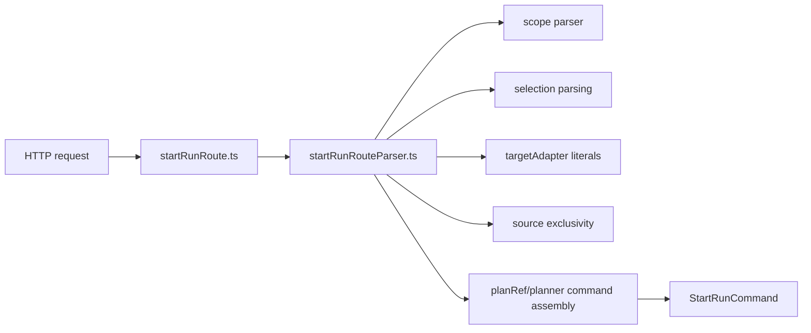
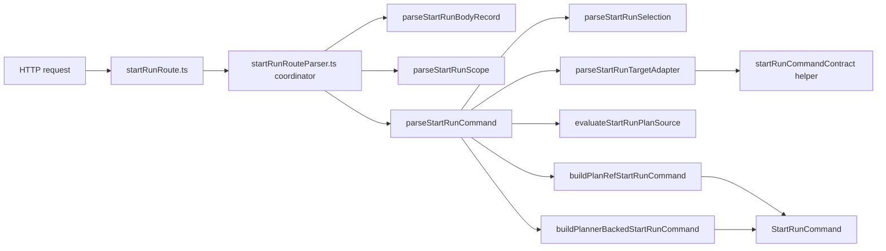

# DHM-WS1 StartRun boundary residual hardening closeout

## Summary

`DHM-WS1` is closed as a residual hardening slice for `POST /runs/start`.
The user-visible API contract did not change. The slice retired remaining
boundary coupling by moving parser decisions into explicit seams and by making
`targetAdapter` validation depend on the command-contract helper instead of
inline literals in the HTTP parser.

## Scope closed in this slice

- `startRunRoute.ts` stays thin and unchanged in responsibility.
- `startRunRouteParser.ts` is now a coordinator only.
- `selection`, `targetAdapter`, `plan-source policy`, and command assembly are
  explicit helper seams with focused tests.
- `targetAdapter` ownership moved to command contract helpers:
  - `SUPPORTED_START_RUN_TARGET_ADAPTERS`
  - `isStartRunTargetAdapter`

## Architecture before and after

### Before

### After

## Rationale

- Removes HTTP-level provider literal coupling from parser internals.
- Lowers blast radius for parser changes by isolating policies in pure helpers.
- Makes regression detection cheaper with small unit tests instead of only
  route-level aggregates.
- Preserves behavior and public route contract.

## Files changed

- `apps/api/src/application/ports/startRunCommandContract.ts`
- `apps/api/src/entrypoints/http/startRunRouteParser.ts`
- `apps/api/src/entrypoints/http/startRunRouteSelectionParser.ts`
- `apps/api/src/entrypoints/http/startRunRouteTargetAdapterParser.ts`
- `apps/api/src/entrypoints/http/startRunRoutePlanSourcePolicy.ts`
- `apps/api/src/entrypoints/http/startRunRouteCommandBuilder.ts`
- `apps/api/test/entrypoints/http/startRunRouteSelectionParser.test.ts`
- `apps/api/test/entrypoints/http/startRunRouteTargetAdapterParser.test.ts`
- `apps/api/test/entrypoints/http/startRunRoutePlanSourcePolicy.test.ts`
- `apps/api/test/entrypoints/http/startRunRouteCommandBuilder.test.ts`

## Validation evidence

- `pnpm --filter dvt-api test -- test/entrypoints/http/startRunRouteSelectionParser.test.ts test/entrypoints/http/startRunRouteTargetAdapterParser.test.ts test/entrypoints/http/startRunRoutePlanSourcePolicy.test.ts test/entrypoints/http/startRunRouteCommandBuilder.test.ts test/entrypoints/http/startRunRouteParserHelpers.test.ts test/entrypoints/http/startRunRoute.test.ts`
  - Passed (56 tests).

## No-debt / no-stub evidence

- No route contract expansion.
- No compatibility shim or temporary parser path.
- No lint/test gate relaxation and no hook bypass introduced in this slice.
