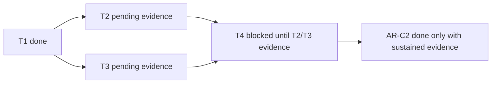

# AR-C2 SLA operational closure checklist

Single closeout checklist artifact for AR-C2 completion.

This artifact is the canonical execution tracker for `AR-C2-T1..T4` and keeps
pending evidence explicit.

## Governing sources

- `AGENTS.md`
- `docs/planning/status/governance-document-rule-inventory.md`
- `docs/guides/ai-work-protocol.md`
- `docs/planning/state/agent-lane-c.yaml`
- `docs/planning/reviews/architecture-and-governance/20260404-ar-c2-fowler-hard-qa-review.md`
- `docs/runbooks/api-runtime-sla-canonical-20260404.md`
- `docs/runbooks/ar-c2-sla-signal-threshold-mapping-20260404.md`
- `docs/runbooks/ar-c2-dashboard-alert-wiring-evidence-20260404.md`

## Current status

- `AR-C2-T1`: done
- `AR-C2-T2`: pending external evidence
- `AR-C2-T3`: pending external evidence
- `AR-C2-T4`: blocked by `T2/T3` evidence

## TODO board (execution)

- [x] `TODO-AR-C2-01` Freeze canonical signal-to-threshold mapping (`AR-C2-T1`)
- [x] `TODO-AR-C2-02` Create reusable dashboard/alert evidence template
- [x] `TODO-AR-C2-03` Keep a single closeout checklist artifact linked from lane + review
- [x] `TODO-AR-C2-04` Verify repository monitor-config evidence availability
- [x] `TODO-AR-C2-09` Seed dashboard/alert evidence matrices for execution
- [ ] `TODO-AR-C2-05` Attach dashboard wiring evidence for all mapped signals (`AR-C2-T2`)
- [ ] `TODO-AR-C2-06` Attach alert-rule/routing evidence for all mapped thresholds (`AR-C2-T3`)
- [ ] `TODO-AR-C2-07` Attach sustained validation evidence and close AR-C2 (`AR-C2-T4`)
- [x] `TODO-AR-C2-08` Re-run QA artifact gate with tracked AR-C2 diffs (`AR-C2-QA-1`)
  - risk tracking: `R-20260404-AR-C2-OPERABILITY-EVIDENCE-GAP` stays `Open`
    until `TODO-AR-C2-05..07` are completed with immutable evidence.

### Execution notes

- `TODO-AR-C2-01` completed via
  `docs/runbooks/ar-c2-sla-signal-threshold-mapping-20260404.md`.
- `TODO-AR-C2-02` completed via
  `docs/runbooks/ar-c2-dashboard-alert-wiring-evidence-20260404.md`.
- `TODO-AR-C2-03` completed via this closeout artifact plus links in
  `docs/planning/state/agent-lane-c.yaml` and
  `docs/planning/reviews/architecture-and-governance/20260404-ar-c2-fowler-hard-qa-review.md`.
- `TODO-AR-C2-04` completed with repository checks for dashboard/alert
  config-as-code references; no governed AR-C2 monitor wiring artifacts were
  found in this workspace, so `TODO-AR-C2-05` and `TODO-AR-C2-06` remain
  blocked by external operational evidence.
- `TODO-AR-C2-09` completed by preloading execution matrices in
  `docs/runbooks/ar-c2-dashboard-alert-wiring-evidence-20260404.md` so
  dashboard/alert evidence can be attached row-by-row without redefining shape.
- `TODO-AR-C2-05..07` cannot be marked done without immutable dashboard/alert
  references and sustained validation windows.
- `TODO-AR-C2-08` execution attempts (2026-04-04):
  - command: `pnpm qa:artifact:check`
  - sandbox result: `No changed files detected. Skipping.`
  - root cause: in this agent sandbox, Node `git` subprocess calls returned
    `EPERM`, causing the QA script to return no changed files.
  - corrective action: hardened `scripts/qa-artifact-check.cjs` to use explicit
    `git` binary resolution and deterministic diff fallback behavior; re-ran
    gate outside sandbox.
  - escalated result: `[qa:artifact:check] OK` (non-skip structural validation).

## Task checklist

- [x] `AR-C2-T1` Freeze canonical signal-to-threshold mapping
- [ ] `AR-C2-T2` Attach dashboard wiring evidence per mapped signal
- [ ] `AR-C2-T3` Attach alert-rule/routing evidence per mapped threshold
- [ ] `AR-C2-T4` Attach sustained validation evidence and finalize AR-C2 lane closure

## Evidence required to move forward

### `AR-C2-T2` dashboard wiring evidence

- panel key from
  `docs/runbooks/ar-c2-sla-signal-threshold-mapping-20260404.md`
- immutable dashboard reference (UID/URL/export hash)
- query expression per panel
- capture timestamp and reviewer

### `AR-C2-T3` alert wiring evidence

- threshold reference from mapping table
- alert rule identifier and expression
- severity and routing target
- source of monitor config truth (file path or immutable external reference)
- capture timestamp and reviewer

### `AR-C2-T4` sustained validation evidence

- observation window(s) and environment
- threshold pass/fail outcomes
- operator actions for breaches (if any)
- lane status update to `done` only if no unresolved blockers remain

## Mermaid diagram

