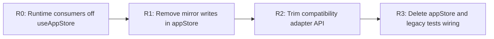

# F-04 QA Hardening Closeout

## Scope

Closeout for findings from:

- `docs/planning/reviews/architecture-and-governance/20260404-f04-frontend-data-boundary-hard-qa-review.md`

## Governing Sources

- `AGENTS.md`
- `docs/planning/status/governance-document-rule-inventory.md`
- `docs/guides/ai-work-protocol.md`
- `docs/planning/proposals/mandatory/frontend-and-ux/f04-frontend-data-boundary-hexagonal-convergence-plan-20260403.md`
- `docs/planning/reviews/architecture-and-governance/20260404-f04-frontend-data-boundary-hard-qa-review.md`

## Closure Summary

- `F04-QA-01` closed: runtime consumers no longer use `useAppStore(...)`; sliced stores are the active boundary.
- `F04-QA-02` closed: `resolveDataSource()` ownership is constrained to composition root and config runtime-mode helpers.
- `F04-QA-03` closed: query keys moved to registry (`queryKeys.ts`) for runtime usage.
- `F04-QA-04` closed: architecture fitness guards added (query key inline ban, legacy store import ban, mode-resolution ownership checks).
- `F04-QA-05` closed: `appStore` `any` and malformed comments removed from touched surface.
- `F04-QA-06` closed: this closeout + deprecation retirement map + user/technical manuals.

## Deprecation Retirement Map

### Target

Retire `appStore` as runtime owner and keep it only as temporary compatibility adapter until removal.

### Checkpoints

1. `R0` (done in this slice): eliminate runtime calls to `useAppStore(...)` from `apps/web/src`.
2. `R1` (next): remove mirror-write behavior from `appStore` actions and read from sliced stores only.
3. `R2` (next): delete `appStore` public selector/action surface not used by tests.
4. `R3` (final): remove `appStore` file and migrate any remaining test harnesses to sliced stores.

### Retirement Diagram

## Validation Evidence

Commands executed:

1. `pnpm --filter @dvt/web typecheck`
2. `pnpm --filter @dvt/web test`
3. `pnpm --filter @dvt/web build`
4. `pnpm verify:prepush`

Result:

- all commands passed.

## No-Debt / No-Stub Evidence

- no rule downgrades or check bypasses were used.
- no placeholder/stub paths were added to fake completion.
- closeout is traceable to concrete QA findings and runtime boundaries.

## Documentation Deliverables Added

- Technical manual:
  - `docs/architecture/frontend/f04-frontend-data-boundary-technical-manual-20260404.md`
- User manual:
  - `docs/guides/f04-frontend-data-boundary-user-manual-20260404.md`

## Final Verdict

Ready
