# F04-W4 decomposition manifest

## Goal

Preserve the baseline and target decomposition traceability for `F04-W4` so
view refactorization does not lose its original rationale or completion
criteria.

## Targeted view inventory

| View                     | Baseline lines | Current lines | Target lines | Planned extracted modules                                                                                                                                                                                                                                                                                                                                                                                                                                                                                                                                                                       | Status                |
| ------------------------ | -------------: | ------------: | -----------: | ----------------------------------------------------------------------------------------------------------------------------------------------------------------------------------------------------------------------------------------------------------------------------------------------------------------------------------------------------------------------------------------------------------------------------------------------------------------------------------------------------------------------------------------------------------------------------------------------- | --------------------- |
| `AdminView.tsx`          |            600 |            85 |           80 | `admin/useAdminViewData.ts`, `admin/adminViewModel.ts`, `admin/copy.ts`, `admin/AdminPlatformTab.tsx`, `admin/AdminPlatformSummaryCards.tsx`, `admin/AdminProbeDetailsCard.tsx`, `admin/AdminCapabilitiesCard.tsx`, `admin/AdminRolesTab.tsx`, `admin/AdminPermissionsTab.tsx`, `admin/AdminAuditTab.tsx`, `admin/AdminStatusBadge.tsx`, `admin/platformTypes.ts`                                                                                                                                                                                                                               | Partially implemented |
| `ArtifactsView.tsx`      |            576 |            59 |           60 | `artifacts/types.ts`, `artifacts/constants.ts`, `artifacts/copy.ts`, `artifacts/utils.ts`, `artifacts/manifestParser.ts`, `artifacts/useLocalManifestImport.ts`, `artifacts/useArtifactsViewModel.ts`, `artifacts/ManifestImportPanel.tsx`, `artifacts/ArtifactsList.tsx`, `artifacts/ArtifactPreviewTabs.tsx`, `artifacts/ArtifactsInfoCard.tsx`                                                                                                                                                                                                                                               | Implemented           |
| `LineageView.tsx`        |            398 |            64 |           80 | `lineage/useLineageViewData.ts`, `lineage/lineageModel.ts`, `lineage/LineageHeader.tsx`, `lineage/LineageBreadcrumb.tsx`, `lineage/LineageGraphPanel.tsx`, `lineage/LineageImpactSummary.tsx`, `lineage/LineageColumnPanel.tsx`, `lineage/copy.ts`                                                                                                                                                                                                                                                                                                                                              | Partially implemented |
| `CostView.tsx`           |            306 |            90 |           60 | `cost/useCostData.ts`, `cost/costViewModel.ts`, `cost/CostCharts.tsx`, `cost/CostDriverList.tsx`, `cost/CostAlertsList.tsx`, `cost/CostCoverageCard.tsx`, `cost/CostStatGrid.tsx`, `cost/copy.ts`                                                                                                                                                                                                                                                                                                                                                                                               | Partially implemented |
| `DiffView.tsx`           |            287 |            35 |           70 | `diff/useDiffData.ts`, `diff/diffViewModel.ts`, `diff/DiffHeader.tsx`, `diff/DiffSummaryCards.tsx`, `diff/GraphDiffPanel.tsx`, `diff/SqlDiffPanel.tsx`, `diff/CatalogDiffPanel.tsx`, `diff/DiffTabs.tsx`, `diff/copy.ts`                                                                                                                                                                                                                                                                                                                                                                        | Partially implemented |
| `RunStates.tsx`          |            270 |             9 |          120 | `runs/RunStateFrame.tsx`, `runs/RunListStateView.tsx`, `runs/RunWorkspaceStateView.tsx`, `runs/RunDetailStateViews.tsx`, `runs/runStatesModel.ts`, `runs/runStatesCopy.ts`                                                                                                                                                                                                                                                                                                                                                                                                                      | Partially implemented |
| `SourceImportWizard.tsx` |            887 |            81 |          160 | `sourceImportWizard/useSourceImportWizard.ts`, `sourceImportWizard/useSourceImportWizardDataLoaders.ts`, `sourceImportWizard/SourceTypeStep.tsx`, `sourceImportWizard/ConnectionStep.tsx`, `sourceImportWizard/SelectionStep.tsx`, `sourceImportWizard/GroupingStep.tsx`, `sourceImportWizard/OptionsStep.tsx`, `sourceImportWizard/ReviewStep.tsx`, `sourceImportWizard/ResultStep.tsx`, `sourceImportWizard/WizardProgress.tsx`, `sourceImportWizard/WizardStepContent.tsx`, `sourceImportWizard/copy.ts`, `sourceImportWizard/constants.ts`, `sourceImportWizard/sourceImportWizardModel.ts` | Partially implemented |

## Repeated-pattern inventory

| Pattern                    | Baseline count | Current treatment                                                 | Target treatment                     |
| -------------------------- | -------------: | ----------------------------------------------------------------- | ------------------------------------ |
| View headers               |              6 | Repeated inline structures across views                           | `components/domain/ViewHeader`       |
| Stat cards                 |             12 | Repeated metric blocks across `AdminView`, `CostView`, `DiffView` | `components/domain/StatCard`         |
| Status indicators          |             3+ | Inline badges and local `StatusBadge` variants                    | `components/domain/StatusIndicator`  |
| Empty/loading/error panels |       7+ views | Inline cards or ad hoc messages                                   | `components/domain/ViewStateOverlay` |

## Ownership map

| Final layer                                    | Responsibility                                       |
| ---------------------------------------------- | ---------------------------------------------------- |
| `components/domain/`                           | shared view vocabulary and presentation composites   |
| `views/<feature>/`                             | feature-specific view subcomponents                  |
| `views/<feature>/use*.ts`                      | feature-level data hooks and orchestration reduction |
| `views/<feature>/*Model.ts` or utility modules | pure transforms, algorithms, parsers                 |

## CostView slice component diagram

The first implemented `F04-W4` slice is `CostView`. Its current decomposition
is the reference shape for the remaining view refactorization work.

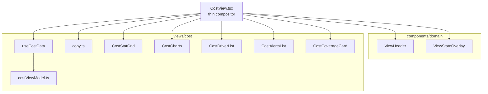

## CostView data-flow diagram

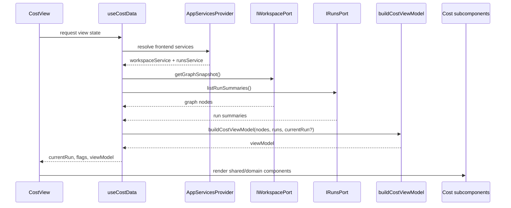

## Test-architecture diagram

The slice now follows a minimum coverage rule: for every three unit/component
tests added to a view-refactor slice, at least one integration test must cover
the composed screen behavior.

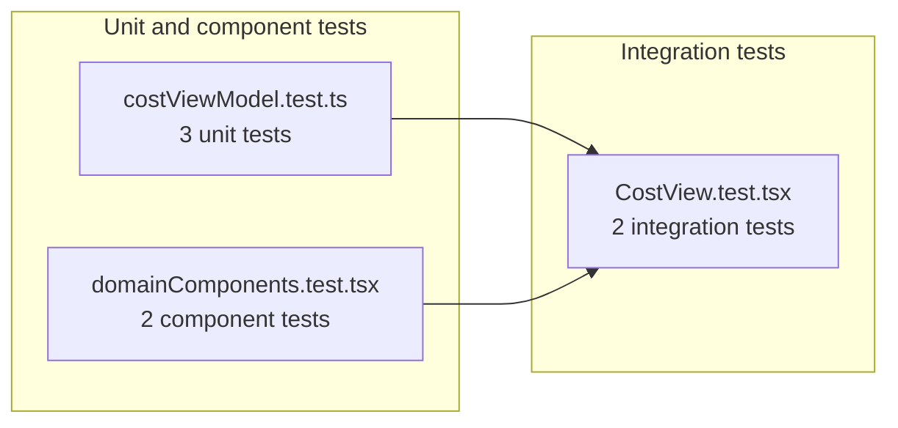

## Test inventory and ratio check

| Layer         | File                                                           | Test count | Purpose                                                 |
| ------------- | -------------------------------------------------------------- | ---------: | ------------------------------------------------------- |
| `unit`        | `apps/web/src/app/views/cost/costViewModel.test.ts`            |          3 | aggregate math, empty-run handling, currency formatting |
| `component`   | `apps/web/src/app/components/domain/domainComponents.test.tsx` |          2 | shared domain composite rendering                       |
| `integration` | `apps/web/src/app/views/CostView.test.tsx`                     |          2 | composed screen rendering and service-failure behavior  |

Current implemented ratio for the `CostView` slice:

- unit/component tests: `5`
- integration tests: `2`
- minimum required by rule `ceil(5 / 3) = 2`
- status: `Compliant`

## SourceImportWizard test inventory and ratio check

| Layer         | File                                                                             | Test count | Purpose                                                                         |
| ------------- | -------------------------------------------------------------------------------- | ---------: | ------------------------------------------------------------------------------- |
| `unit`        | `apps/web/src/app/components/sourceImportWizard/sourceImportWizardModel.test.ts` |          5 | step navigation, grouping, gating and counters                                  |
| `integration` | `apps/web/src/app/components/SourceImportWizard.test.tsx`                        |          2 | composed wizard flow from source type to selection and end-to-end import result |

Current implemented ratio for `SourceImportWizard` slice:

- unit/component tests: `5`
- integration tests: `2`
- minimum required by rule `ceil(5 / 3) = 2`
- status: `Compliant`

## DiffView test inventory and ratio check

| Layer         | File                                                | Test count | Purpose                                               |
| ------------- | --------------------------------------------------- | ---------: | ----------------------------------------------------- |
| `unit`        | `apps/web/src/app/views/diff/diffViewModel.test.ts` |          5 | severity filtering, summary counters, compare presets |
| `integration` | `apps/web/src/app/views/DiffView.test.tsx`          |          2 | composed render and breaking-only filtering behavior  |

Current implemented ratio for `DiffView` slice:

- unit/component tests: `5`
- integration tests: `2`
- minimum required by rule `ceil(5 / 3) = 2`
- status: `Compliant`

## RunStates slice component diagram

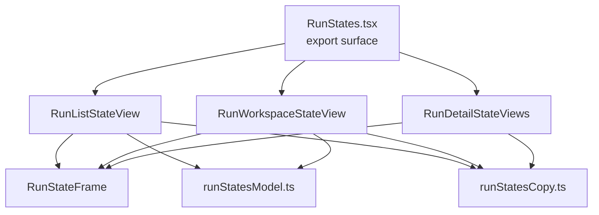

## RunStates data-flow diagram

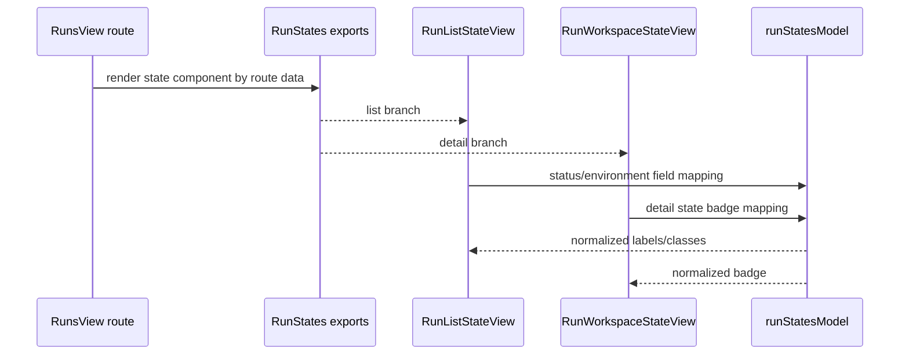

## RunStates test inventory and ratio check

| Layer         | File                                                 | Test count | Purpose                                            |
| ------------- | ---------------------------------------------------- | ---------: | -------------------------------------------------- |
| `unit`        | `apps/web/src/app/views/runs/runStatesModel.test.ts` |          3 | field normalization and badge mapping              |
| `integration` | `apps/web/src/app/views/runs/RunStates.test.tsx`     |          4 | list/detail rendering and error/not-found behavior |

Current implemented ratio for `RunStates` slice:

- unit/component tests: `3`
- integration tests: `4`
- minimum required by rule `ceil(3 / 3) = 1`
- status: `Compliant`

## LineageView slice component diagram

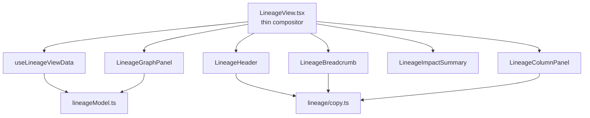

## LineageView data-flow diagram

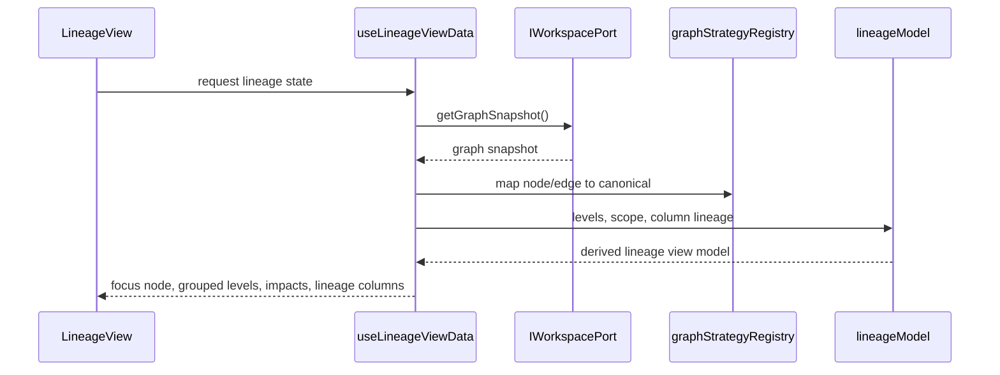

## LineageView test inventory and ratio check

| Layer         | File                                                  | Test count | Purpose                                                                  |
| ------------- | ----------------------------------------------------- | ---------: | ------------------------------------------------------------------------ |
| `unit`        | `apps/web/src/app/views/lineage/lineageModel.test.ts` |          5 | reachability, level assignment, column lineage, style fallback, grouping |
| `integration` | `apps/web/src/app/views/LineageView.test.tsx`         |          2 | composed render and column-level mode behavior                           |

Current implemented ratio for `LineageView` slice:

- unit/component tests: `5`
- integration tests: `2`
- minimum required by rule `ceil(5 / 3) = 2`
- status: `Compliant`

## AdminView slice component diagram

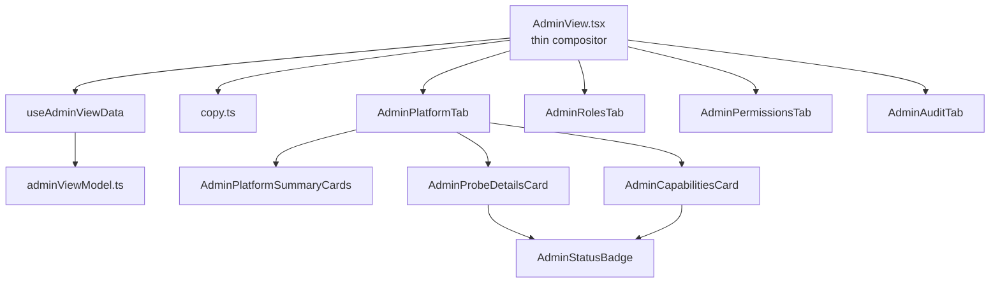

## AdminView data-flow diagram

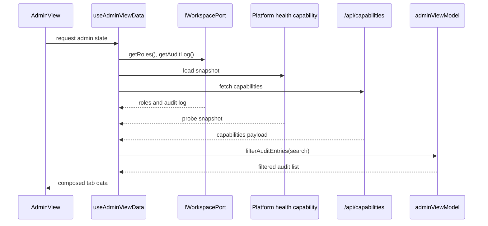

## AdminView test inventory and ratio check

| Layer         | File                                                  | Test count | Purpose                                                                                    |
| ------------- | ----------------------------------------------------- | ---------: | ------------------------------------------------------------------------------------------ |
| `unit`        | `apps/web/src/app/views/admin/adminViewModel.test.ts` |          5 | status mapping, readyz summary, empty states, audit filtering, permission label formatting |
| `integration` | `apps/web/src/app/views/AdminView.test.tsx`           |          2 | composed render with platform/roles and audit filtering behavior                           |

Current implemented ratio for `AdminView` slice:

- unit/component tests: `5`
- integration tests: `2`
- minimum required by rule `ceil(5 / 3) = 2`
- status: `Compliant`

## ArtifactsView slice component diagram

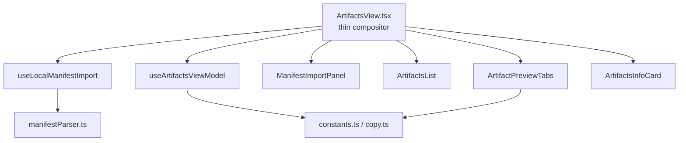

## ArtifactsView data-flow diagram

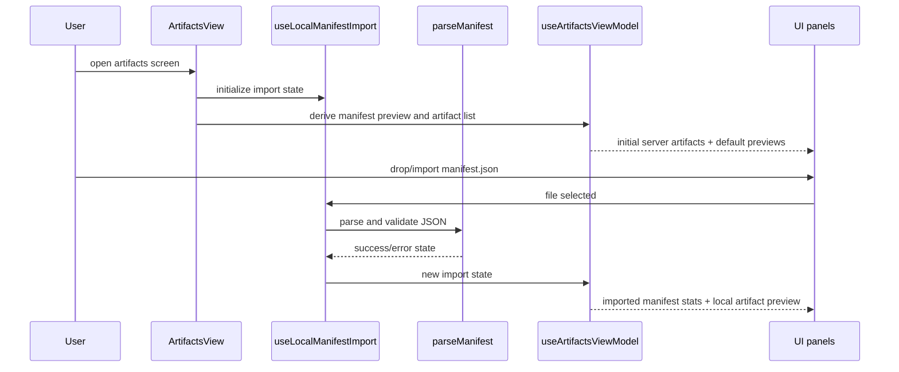

## ArtifactsView test inventory and ratio check

| Layer         | File                                                      | Test count | Purpose                                                 |
| ------------- | --------------------------------------------------------- | ---------: | ------------------------------------------------------- |
| `unit`        | `apps/web/src/app/views/artifacts/manifestParser.test.ts` |          3 | manifest validation, node extraction, edge generation   |
| `integration` | `apps/web/src/app/views/ArtifactsView.test.tsx`           |          1 | composed render for import area, artifacts and previews |

Current implemented ratio for `ArtifactsView` slice:

- unit/component tests: `3`
- integration tests: `1`
- minimum required by rule `ceil(3 / 3) = 1`
- status: `Compliant`

## Before/after traceability rule

Every `F04-W4` implementation slice must update this manifest with:

- actual post-refactor line count
- extracted file list
- final status
- deferred items, if any

## Definition of Done

- [ ] Each targeted view has baseline and target traceability.
- [ ] Each implementation slice updates this manifest.
- [ ] Post-refactor line counts are recorded.
- [ ] Extracted modules are mapped to their final ownership layer.
- [ ] Each implemented slice includes Mermaid component and flow diagrams.
- [ ] Each implemented slice records its unit/component vs integration test ratio.
- [ ] Each implemented slice satisfies the minimum rule `3 unit/component : 1 integration`.
