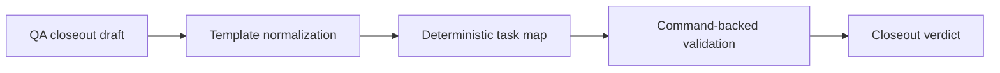
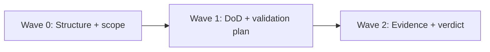

# 20260404 QA Closeout Plan Tareas Criticas MVP

## Summary

This artifact defines a QA execution plan for critical MVP tasks and follows
`docs/planning/templates/qa/TEMPLATE_QA_ARTIFACT_EXAMPLE.md` as baseline shape.

Canonical execution tracking remains in:

- `docs/planning/state/agent-lane-b.yaml`
- `docs/planning/reviews/engine/20260404-s19f1-snapshot-optimization-plan-review.md`

## Governing Sources

- `docs/planning/status/governance-document-rule-inventory.md`
- `AGENTS.md`
- `docs/guides/ai-work-protocol.md`
- `docs/planning/templates/qa/TEMPLATE_QA_ARTIFACT_EXAMPLE.md`
- `docs/planning/templates/qa/TEMPLATE_QA_CURRENT_TASK_CHECK_PROMPT.md`

## Findings

### High

- Title: Prior closeout draft was structurally invalid as QA artifact
  Why it matters: invalid structure blocks `qa:artifact:check` and prevents governed closeout.
  Evidence: previous file state failed required sections and malformed Mermaid blocks.
  Risk: CI/prepush failures and non-auditable QA posture.
  Recommendation: keep this document in strict template shape with required sections and executable checklist.

### Medium

- Title: Task list lacked deterministic DoD mapping
  Why it matters: without per-task DoD and rationale, execution tracking drifts.
  Evidence: prior draft mixed duplicated headings and incomplete task metadata.
  Risk: partial closures presented as complete.
  Recommendation: bind each task to one objective, dependencies, rationale, and DoD.

### Low

- Title: Ownership and scope boundaries were ambiguous
  Why it matters: cross-slice work can get mixed with unrelated tasks.
  Evidence: prior draft mixed multiple scopes without explicit in-scope labels.
  Risk: review noise and commit contamination.
  Recommendation: keep explicit task ownership and scope labels.

## Alignment

- Doc vs code: this artifact is planning-only; no runtime code claims.
- Promise vs implementation: defines execution QA path, not implementation closure.
- Tests vs claims: validation steps are listed; no test execution claimed in this document.
- Current truth vs planned truth: current state is planning-ready, execution pending.
- Documentation update status: closeout artifact normalized to governed QA template.
- Evidence and risk-doc status when applicable: to be evaluated per implementation slice and ARC trigger.

## Architecture Assessment

- SRP: preserved at artifact level (one task per purpose).
- DDD: not directly modified in this planning slice.
- Hexagonal: not directly modified in this planning slice.
- CQRS if relevant: not directly modified in this planning slice.
- Complexity: reduced by normalized structure.
- Modularity: explicit task partitioning by topic.

## Test Assessment

- Negative paths present: not applicable (planning artifact only).
- Negative paths missing: execution tasks must add them per slice.
- Regression status: not verified.
- Determinism: artifact structure deterministic.
- Local suite vs meaningful global confidence: not applicable in this document.
- Global system view applied: yes, at planning/checklist level.
- Harness or shared fixture need: to be decided in each implementation task.
- Test grouping by type (`unit` / `integration` / `contract` / `e2e` / regression) and rationale: required in downstream execution artifacts.

## Quality Gates

- Commands executed: none yet in this normalization step.
- What passed: not verified.
- What failed: not verified.
- What could not be verified: runtime/test outcomes for referenced MVP tasks.

## Unblock Roadmap

### Wave 0 - Truth and documentation baseline

Tasks: `MVP-QA-1`, `MVP-QA-2`

Target:

- QA artifact structure is valid and checkable;
- task scope and ownership are explicit.

### Wave 1 - Boundary and ownership hardening

Tasks: `MVP-QA-3`, `MVP-QA-4`

Target:

- each task has deterministic DoD and rationale;
- dependency order is explicit.

### Wave 2 - Runtime and regression closure

Tasks: `MVP-QA-5`, `MVP-QA-6`

Target:

- validation evidence is command-backed;
- closure verdict is auditable.

## Action Artifact

### Markdown Artifact Path Suggestion

- `docs/planning/closeouts/20260404-plan-qa-tareas-mvp.md`

### Task Checklist

- [ ] `MVP-QA-1` Normalize QA artifact structure
- [ ] `MVP-QA-2` Map critical MVP tasks to explicit scope and owner
- [ ] `MVP-QA-3` Define per-task DoD and dependency chain
- [ ] `MVP-QA-4` Add per-task QA validation expectations
- [ ] `MVP-QA-5` Execute slice validations and capture evidence
- [ ] `MVP-QA-6` Publish closeout verdict with synchronized planning surfaces

### Task Details

#### `MVP-QA-1` Normalize QA artifact structure

- Objective: ensure the closeout file passes QA artifact structural checks.
- Scope: this document only.
- Recommended owner: Docs + QA owner.
- Dependencies: None.
- Documentation impact: direct.
- Evidence / risk-doc impact: none.
- Comment with rationale: structure validity is a prerequisite for any governed execution.
- Definition of Done:
  - required sections exist;
  - Mermaid blocks are syntactically valid;
  - no duplicated malformed sections remain.

#### `MVP-QA-2` Map critical MVP tasks to explicit scope and owner

- Objective: establish clear accountability for each critical task.
- Scope: planning metadata and task inventory references.
- Recommended owner: Product + lane owners.
- Dependencies: `MVP-QA-1`.
- Documentation impact: updates in planning/task surfaces.
- Evidence / risk-doc impact: none.
- Comment with rationale: ownership ambiguity delays closure.
- Definition of Done:
  - each task has an owner and explicit scope label.

#### `MVP-QA-3` Define per-task DoD and dependency chain

- Objective: make execution order and closure conditions deterministic.
- Scope: selected critical MVP tasks.
- Recommended owner: Lane owners.
- Dependencies: `MVP-QA-2`.
- Documentation impact: review/closeout task details.
- Evidence / risk-doc impact: none.
- Comment with rationale: deterministic DoD prevents soft closures.
- Definition of Done:
  - every task has measurable DoD;
  - dependency sequence is explicit.

#### `MVP-QA-4` Add per-task QA validation expectations

- Objective: define the command-level validation baseline for each task.
- Scope: task-level QA plans.
- Recommended owner: QA owner.
- Dependencies: `MVP-QA-3`.
- Documentation impact: validation sections in related artifacts.
- Evidence / risk-doc impact: may require evidence docs per slice.
- Comment with rationale: no task should close without executable validation plan.
- Definition of Done:
  - each task lists required commands and acceptance criteria.

#### `MVP-QA-5` Execute slice validations and capture evidence

- Objective: run validations for implementation slices and record results.
- Scope: touched packages and repo gates.
- Recommended owner: Slice owner.
- Dependencies: `MVP-QA-4`.
- Documentation impact: evidence/closeout updates.
- Evidence / risk-doc impact: direct when ARC applies.
- Comment with rationale: evidence converts claims into auditable truth.
- Definition of Done:
  - commands executed;
  - pass/fail results documented;
  - non-verified items explicitly listed.

#### `MVP-QA-6` Publish closeout verdict with synchronized planning surfaces

- Objective: finalize one governed verdict per task set.
- Scope: closeout + lane/review status surfaces.
- Recommended owner: Product + lane owners.
- Dependencies: `MVP-QA-5`.
- Documentation impact: synchronized status updates.
- Evidence / risk-doc impact: references updated.
- Comment with rationale: completion requires status and evidence consistency.
- Definition of Done:
  - one final verdict is published;
  - planning surfaces reflect the same verdict.

## Mermaid Diagram

### Current-state dependency map

### Unblock sequence

## Validation Baseline For Each Execution Slice

1. touched-package or touched-route checks for the affected scope
2. `pnpm docs:sync` when docs structure changes
3. `pnpm docs:workboard:generate` when planning state changes
4. evidence and risk-doc validation when governance requires them
5. `pnpm verify:prepush`

## Final Verdict

Ready with follow-ups
