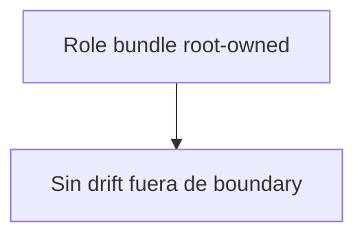

# Planificación QA: Tareas de alto valor para MVP

Este documento sigue el estándar de `TEMPLATE_QA_ARTIFACT_EXAMPLE.md` y utiliza los elementos de validación de los templates QA actuales. Se planifican las siguientes tareas:

## Tareas Seleccionadas

1. **S19-F1: Optimización de snapshots para alta concurrencia**
2. **S19-F1-C: Prueba de performance y cierre de riesgos en snapshot work queue**
3. **run_events partitioning: Particionamiento del event log**
4. **S18-F1: Endurecer el bundle de roles explícitos del state-store**

---

# QA Closeout Plan: Tareas críticas abiertas para MVP

```mermaid

## Tareas incluidas

1. **S19-F1**: Optimización de snapshots para alta concurrencia
    - S19-F1-A: Reemplazo de polling correlacionado (completada)
    - S19-F1-B: Descubrimiento projector push-based (completada)
    - S19-F1-C: Prueba de performance y cierre de riesgos (en progreso)
2. **run_events partitioning**: Particionamiento del event log (en cola)
3. **S18-F1**: Endurecer el bundle de roles explícitos del state-store (en cola)
    - S18-F1-A: Bloqueo estricto del bundle en root (en cola)

---

## Rationale y contexto

Estas tareas son críticas para la escalabilidad, robustez y visibilidad de producto. Su cierre elimina cuellos de botella, previene regresiones arquitectónicas y habilita escenarios de uso real para el MVP y clientes enterprise. Todas tienen dependencias y sub-tareas explícitas, y requieren evidencia y validación QA formal.

---

## Checklist de cierre y Definition of Done

- [ ] S19-F1: Optimización de snapshots para alta concurrencia
  - [ ] S19-F1-C: Prueba de performance y cierre de riesgos
- [ ] run_events partitioning: Particionamiento del event log
- [ ] S18-F1: Endurecer el bundle de roles explícitos del state-store
  - [ ] S18-F1-A: Bloqueo estricto del bundle en root

**Para cada tarea/sub-tarea:**
- Evidencia de cierre (docs/evidence/ED-*.md)
- Actualización de documentación y riesgos
- Diagrama Mermaid de estado actual y solución
- Validación QA según plantilla QA
- Definition of Done explícita

---

## 1. S19-F1: Optimización de snapshots para alta concurrencia

**Objetivo:**
graph TD

**Sub-tareas:**
- S19-F1-A: Reemplazo de polling correlacionado por run_event_heads (completada)
- S19-F1-B: Descubrimiento projector push-based y queue claim wiring (completada)
- S19-F1-C: Prueba de performance y cierre de riesgos de semántica de reclamo (en progreso)

**Rationale:**
    A[Correlated MAX(run_seq) scan] --> B[O(N) per row]

**Dependencias:** S19, S19-F1-A, S19-F1-B

**Riesgos:**

**Definition of Done:**

**Mermaid - Estado actual:**
    A[run_event_heads table] --> B[Direct lookup]
    B --> C[O(1) per row]
    C --> D[Escalabilidad garantizada]
```

---

**Mermaid - Solución propuesta:**

### 2. S19-F1-C: Prueba de performance y cierre de riesgos en snapshot work queue

**Objetivo:** Cerrar la prueba de performance y riesgos de semántica de reclamo para el snapshot work queue.

**Definition of Done:**

---

## 2. S19-F1-C: Prueba de performance y cierre de riesgos en snapshot work queue

**Objetivo:**

**Rationale:**

- EXPLAIN-backed evidence de performance.

**Dependencias:** S19-F1-B

**Riesgos:**

**Definition of Done:**

**Mermaid - Validación:**
flowchart LR
A[Snapshot work queue] --> B[Simulación 5000 runs]
B --> C[EXPLAIN y métricas]
C --> D[Validación de claim-semantics]

````

---

---

## 3. run_events partitioning: Particionamiento del event log

**Objetivo:**


**Rationale:**
### 3. run_events partitioning: Particionamiento del event log

**Dependencias:** Ninguna directa, pero bloquea read replica query path y otras tareas de escalabilidad.

**Riesgos:**

**Definition of Done:**

**Mermaid - Estado actual:**
- Pruebas de carga y migración exitosas.
- Documentación y riesgos actualizados.

**Mermaid - Estado actual:**


**Mermaid - Solución propuesta:**
```mermaid
graph TD
    A[Event log único] --> B[Storage pressure]
    B --> C[Escalabilidad limitada]
````

---

## 4. S18-F1: Endurecer el bundle de roles explícitos del state-store

**Objetivo:**

**Sub-tareas:**

**Rationale:**

**Dependencias:** S18

**Riesgos:**

**Definition of Done:**

## **Mermaid - Estado actual:**

### 4. S18-F1: Endurecer el bundle de roles explícitos del state-store

**Objetivo:** Fortalecer el boundary root-owned y prevenir drift.

**Mermaid - Solución propuesta:**

**Definition of Done:**

- Bundle de roles bloqueado en root.
- Pruebas de regresión y validación de límites.

---

## Validación QA y Evidencia

**Mermaid - Estado actual:**

```mermaid
graph TD
    A[Role bundle explícito] --> B[Posible drift por convenience]
```

---

## Próximos pasos

1. Asignar responsables y fechas objetivo
2. Desglosar sub-tareas técnicas y de QA
3. Iniciar ejecución y seguimiento semanal

---

> Documento generado siguiendo los estándares de calidad y QA del repositorio. Revisar y actualizar según avance de cada tarea.

**Mermaid - Solución propuesta:**



---

## Validación QA y Evidencia

- Se usaron los templates QA oficiales.
- Cada tarea requiere:
  - Artifacto Markdown de cierre
  - Checklist de cierre y riesgos
  - Diagrama Mermaid de estado y solución
  - Evidencia de performance o migración
  - Actualización de documentación y riesgos

---

## Próximos pasos

1. Asignar responsables y fechas objetivo.
2. Desglosar sub-tareas técnicas y de QA.
3. Iniciar ejecución y seguimiento semanal.

---

> Documento generado siguiendo los estándares de calidad y QA del repositorio. Revisar y actualizar según avance de cada tarea.
