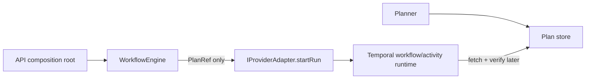
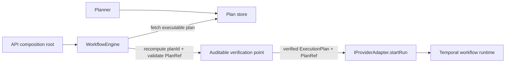

# Closeout: Engine entry-point plan integrity centralization

## Think-First Analysis

### Problem summary

Plan integrity verification is currently split across the engine start boundary
and adapter/runtime execution paths. The engine accepts a `PlanRef`, but the
effective proof that the executed plan matches planner output is deferred to
adapter-owned fetch and verification. That creates decentralized verification
ownership, duplicate fetch risk, and no single auditable engine-side proof
before dispatch.

### Root cause

The repository evolved two different trust boundaries at once:

- the engine owns start-run admission, authorization, and dispatch;
- the adapter/runtime still owns plan materialization and integrity checks.

That split means the lifecycle boundary that decides to dispatch a run does not
also hold the canonical proof that the plan identity is valid. The runtime then
re-fetches and re-validates the plan later, which keeps integrity concerns
distributed instead of centralized.

### Constraints and invariants

- `ADR-0003`: execution authority stays in DVT-owned boundaries; integrity
  checks must remain explicit and deterministic.
- `ADR-0014`: the adapter remains run-driven, but the engine may harden the
  dispatch payload it sends to the adapter.
- `ADR-0017`: version compatibility checks remain mandatory and must fail
  closed.
- Planner identity remains `planId = sha256(JCS(planCore))`; executable JSON is
  not itself the canonical `planId` preimage.
- The change must preserve plan immutability and avoid presenting dual
  verification paths as equally authoritative.

### Options considered

1. Keep adapter-owned verification and add more metrics.
   Rejected because it leaves decentralized ownership intact and does not
   produce an engine-side proof before dispatch.
2. Verify in both engine and adapter.
   Rejected because it preserves drift risk, duplicate fetch cost, and
   ambiguity about which verification is authoritative.
3. Verify executable bytes against `planRef.sha256` only in the engine, then
   still dispatch `PlanRef`.
   Rejected because the adapter/runtime would still need to fetch its own
   payload later and the executed artifact could drift after admission.
4. Engine fetches the executable plan, verifies planner identity by
   recomputing `planId` from the resolved plan core, validates metadata
   alignment, and dispatches the resolved plan to the adapter.
   Selected because it creates one authoritative pre-dispatch proof, removes
   adapter-owned integrity responsibility, and lets the adapter execute the
   exact validated plan object.

### Selected option and rationale

The engine start path will resolve the executable plan before adapter dispatch,
recompute canonical planner identity from the resolved plan, validate metadata
against `PlanRef`, and pass the verified `ExecutionPlan` to the adapter. This
keeps the adapter run-driven while moving plan integrity ownership to the
engine entry point.

### Rejected alternatives

- Persisting with adapter-owned verification because it leaves R6 and ownership
  drift unresolved.
- Embedding only raw bytes in workflow input because the meaningful invariant is
  planner identity (`planId`), not the hash of the stored executable JSON.
- Leaving Temporal activities as a second verification authority because that
  would contradict the centralization goal.

## Pre-Implementation Brief

- Mode: `Full`
- Scope:
  centralize plan verification in engine start-run flow; update adapter
  contract to accept verified execution plans; remove Temporal runtime plan
  fetch/integrity ownership; update ADR, rationale, evidence, and status docs.
- Touched files or paths:
  `docs/adr/ADR-0012-plan-integrity-ownership.md`,
  `docs/planning/closeouts/20260407-engine-entrypoint-plan-integrity-closeout.md`,
  `docs/planning/status/canonical-doc-code-matrix.md`,
  `docs/architecture/system-delivery-status.md`,
  `docs/evidence/**`,
  `docs/risk-register/**`,
  `packages/@dvt/engine/**`,
  `packages/@dvt/adapter-temporal/**`,
  `apps/api/**`,
  and any tests that encode the old ownership rule.
- Expected outcome:
  the engine proves plan identity before dispatch, adapters no longer own plan
  integrity verification, and Temporal workflows run the engine-verified plan
  instance.
- Risks and mitigations:
  Temporal payload growth is the main operational tradeoff; tests and docs must
  make that tradeoff explicit. Contract drift risk is mitigated by updating ADR,
  engine surface comments, and package/API tests together.
- Out-of-scope items:
  planner identity algorithm changes, plan-store schema redesign, and
  cross-provider portability beyond Temporal and mock surfaces already present.
- Validation plan:
  package-level build/type/test for `@dvt/engine`, `@dvt/adapter-temporal`, and
  `dvt-api`, then `pnpm docs:sync` and `pnpm verify:prepush`.
- Test coverage plan:
  add negative coverage for plan-id mismatch and metadata mismatch in engine
  resolution, regression coverage that adapter dispatch does not occur on failed
  verification, and Temporal workflow coverage that no runtime fetch step is
  required.
- Libraries evaluated:
  None added. Existing repo utilities are sufficient: contracts parsing, JCS
  canonicalization, and SHA-256 helpers.

## Current-state Diagram

## Target-state Diagram

## Rationale

This change improves the architecture if and only if ownership really moves.
That means:

- the engine becomes the sole authoritative verifier before dispatch;
- the adapter contract no longer claims plan-integrity ownership;
- Temporal execution consumes the already-verified plan rather than creating a
  second authoritative verification path.

Without those three properties the system would gain latency and complexity
without reducing risk. With them, the start-run boundary becomes the single
audit point that proves the executed plan matches planner identity.

## Validation Evidence

- `pnpm --filter @dvt/contracts build` passed after aligning the versioned
  adapter contract with the canonical `ExecutionPlan` export.
- `pnpm --filter @dvt/engine test` passed after engine-side verification moved
  ahead of adapter dispatch.
- `pnpm --filter @dvt/adapter-temporal test` passed after Temporal workflow
  input switched to the verified `ExecutionPlan` payload.
- `pnpm --filter dvt-api test` passed after API composition wired `planFetcher`
  into the engine entry point.
- `pnpm docs:sync` passed and regenerated the governed ADR index plus planning
  lane views.
- `pnpm verify:prepush` passed. In this environment, the `--changed-only`
  subchecks inside the pre-push gate reported `No changed files detected`, so
  the authoritative validation evidence for the behavioral slice remains the
  package build/test commands listed above plus the successful gate execution.
