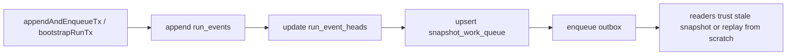
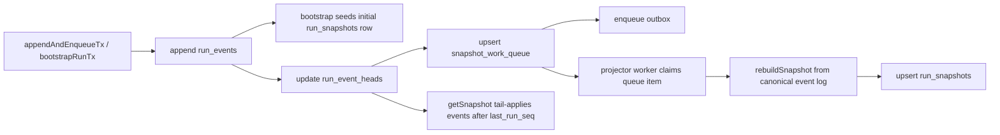

# Closeout: Background Snapshot Pre-Warming For Active Runs

## Think-First Analysis

- Problem summary:
  Active-run reads need background snapshot pre-warming, but removing inline
  snapshot mutation from all writes creates two regressions:
  newly bootstrapped runs can return `null` from `getSnapshot()`, and later
  appends can leave readers observing stale persisted snapshots until the
  projector catches up.
- Root cause:
  Queue production already existed at append time, but the read path still
  trusted any same-schema persisted snapshot as fresh. The missing piece was a
  hybrid model: keep a synchronous bootstrap seed, move steady-state rebuilds
  to the queue-backed path, and make `getSnapshot()` aware of event-tail lag.
- Constraints and invariants:
  `AGENTS.md`; `docs/planning/status/governance-document-rule-inventory.md`;
  `docs/guides/ai-work-protocol.md`; `docs/adr/ADR-0004-event-sourcing-strategy.md`;
  `docs/adr/ADR-0015-getRunStatus-read-model-separation.md`;
  `docs/architecture/reference-architecture.md`;
  `docs/architecture/engine/adapters/state-store/postgres/StateStoreAdapter.md`;
  `packages/@dvt/adapter-postgres/DESIGN.md`.
- Options considered:
  1. Keep inline snapshot updates on every append.
  2. Remove inline snapshot updates entirely and rely only on queued rebuilds.
  3. Seed bootstrap snapshots synchronously, keep append-time queue production,
     and make `getSnapshot()` apply only the unapplied event tail in memory.
- Selected option and rationale:
  Option 3. It preserves correctness for newly started and actively mutating
  runs, removes full replay from the hot path for the common stale case, and
  still leaves durable snapshot persistence to the queue-backed projector.
- Rejected alternatives:
  Option 1 keeps steady-state append cost coupled to projection work.
  Option 2 widens the stale or null snapshot window and breaks consumers that
  currently rely on `getSnapshot()` to be the authoritative hot-read boundary.

## Current State Diagram

## Solution Rationale Diagram

## Pre-Implementation Brief

- Mode:
  Slim
- Scope:
  Restore bootstrap snapshot seeding, keep steady-state snapshot persistence
  queue-driven, and make the adapter hot-read path incrementally fresh without
  full replay.
- Touched files or paths:
  `packages/@dvt/adapter-postgres/src/PostgresRunSnapshotStore.ts`,
  `packages/@dvt/adapter-postgres/src/PostgresRunStateCoordinator.ts`,
  `packages/@dvt/adapter-postgres/src/PostgresStateStoreRuntimeComposer.ts`,
  `packages/@dvt/adapter-postgres/test/PostgresRunSnapshotStore.test.ts`,
  `packages/@dvt/adapter-postgres/test/PostgresRunStateCoordinator.test.ts`,
  `packages/@dvt/adapter-postgres/test/smoke.test.ts`,
  `docs/architecture/engine/adapters/state-store/postgres/StateStoreAdapter.md`,
  `packages/@dvt/adapter-postgres/DESIGN.md`,
  `docs/planning/closeouts/20260407-snapshot-prewarm-active-runs-closeout.md`.
- Expected outcome:
  Newly bootstrapped runs always have a materialized snapshot, active runs stay
  correct while the worker lags, and snapshot persistence still converges via
  `snapshot_work_queue`.
- Risks and mitigations:
  Risk: read-time freshness logic could silently reintroduce full replay or
  inline persistence.
  Mitigation: restrict catch-up to events with `run_seq > last_run_seq`, avoid
  writing `run_snapshots` from `getSnapshot()`, and add unit/integration tests
  that assert both fresh reads and pending queue work.
- Out-of-scope:
  API-level staleness presentation changes, projector worker scheduling policy
  changes, in-memory store behavior changes, and contract-surface changes.
- Validation plan:
  `pnpm --filter @dvt/adapter-postgres test`
  `pnpm verify:prepush`
- Test coverage plan:
  Cover:
  1. bootstrap snapshot seeding;
  2. append-time queue production without inline append projection;
  3. `getSnapshot()` tail catch-up before queued rebuild completion;
  4. cancellation-state correctness before and after durable rebuild.
- Libraries evaluated:
  None evaluated; this slice uses existing repo infrastructure.

## Implementation

- Restored `snapshotStore.updateWithClient(...)` in
  `bootstrapRunTx()` only, so new runs seed a `PENDING` snapshot in the same
  transaction as metadata and first-event append.
- Left steady-state `appendAndEnqueueTx()` queue-backed: append still updates
  `run_event_heads`, `snapshot_work_queue`, and outbox rows without inline
  snapshot persistence.
- Updated `PostgresRunSnapshotStore.getSnapshot()` to read the persisted
  snapshot plus latest event sequence and apply only the unapplied event tail
  in memory when `last_run_seq` lags.
- Added and updated tests to prove bootstrap seeding, append-path non-mutation,
  fresh reads during worker lag, and durable convergence after
  `rebuildSnapshot()` plus `completeSnapshotWork()`.
- Updated adapter docs/design pages to describe the hybrid freshness model.

## Validation Evidence

- `pnpm --filter @dvt/adapter-postgres typecheck`
  Failed before this slice was reached because the package `pretypecheck` hook
  builds `@dvt/state-store`, which currently errors with
  `TS2307: Cannot find module '@dvt/engine'`.
- `pnpm --filter @dvt/adapter-postgres test`
  Failed for the same pre-existing `@dvt/state-store` build blocker in the
  package `pretest` hook.
- `pnpm exec tsc --noEmit -p packages/@dvt/adapter-postgres/tsconfig.json`
  Passed.
- `pnpm exec vitest run --config vitest.config.ts test/PostgresRunStateCoordinator.test.ts test/PostgresRunSnapshotStore.test.ts`
  Run from `packages/@dvt/adapter-postgres`; passed (`19` tests).
- `pnpm exec vitest run --config vitest.config.ts`
  Run from `packages/@dvt/adapter-postgres`; passed (`18` files, `120` tests;
  integration-only suites remained skipped by environment guards).
- `pnpm exec vitest run --config vitest.config.ts test/smoke.test.ts`
  Run from `packages/@dvt/adapter-postgres`; suite executed and skipped all
  tests because `DVT_PG_INTEGRATION` was not enabled in this environment.
- `pnpm docs:sync`
  Passed.
- `pnpm verify:prepush`
  Passed.

## No-Debt / No-Stub Evidence

- No stub, placeholder, or fake success path was introduced.
- No hooks, lint rules, type rules, or tests were bypassed.
- The only failed governed package commands were blocked by a pre-existing
  upstream workspace build issue outside the changed files, and that blocker is
  recorded explicitly above.
