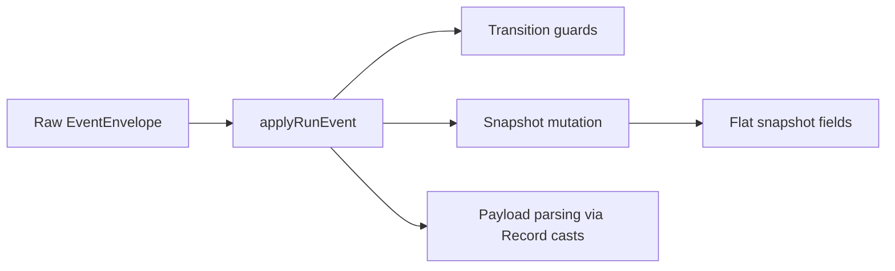
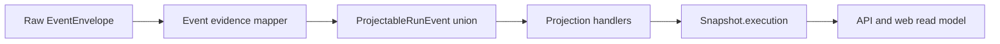

# Closeout: TF-C2-B read-surface evidence

## Think-First Analysis

### Problem summary

The transformation-flow proposal set requires `GET /runs/:runId` and
`GET /runs/:runId/events` to expose executor identity, sink materialization
evidence, and failed-step diagnostics, but the shipped runtime read contract
still returns only coarse run status fields.

### Root cause

The frontend result UX was prepared ahead of the runtime read-model contract.
`RunStatusSnapshot` and the shared event schemas never absorbed the
transformation outcome fields, so the engine projector, API use case, and
event record validator all stop before caller-visible evidence can cross the
boundary. The first implementation pass also widened the snapshot with flat
fields and parsed ad hoc payload fragments inside `applyRunEvent`, which turns
the projector into a mixed responsibility boundary and makes every new evidence
field a multi-file conditional edit.

### Constraints and invariants

- `AGENTS.md`: inventory-first startup, doc-driven public-behavior changes,
  no hidden debt, and mandatory validation evidence.
- `docs/guides/ai-work-protocol.md`: this slice is `Full` because it changes
  public runtime read contracts and shared artifacts.
- `docs/adr/ADR-0004-event-sourcing-strategy.md`: state reads must remain
  deterministic projections derived from events.
- `docs/adr/ADR-0015-getRunStatus-read-model-separation.md`: the default run
  read path must stay provider-independent and read from projected state, not
  live adapter calls.
- `docs/planning/proposals/mandatory/runtime-and-contracts/transformation-flow-architecture-and-contracts-20260405.md`:
  TF-C2-B requires caller-visible executor identity, rows written, sink target,
  failure step attribution, and timestamps on runtime read surfaces.

### Options considered

1. Keep the flat snapshot fields and continue patching projector branches when
   new execution evidence appears.
2. Replace the flat read-surface fields with a nested `execution` model and
   introduce a mapper that normalizes raw envelopes into projector-friendly
   domain events before mutation.
3. Patch only the API DTO and fabricate evidence fields from ad hoc event scans.
4. Delay the slice until the PostgreSQL executor is fully wired and keep the
   current read contract unchanged.

### Selected option and rationale

Choose option 2.

TF-C2-B is a read-surface contract slice, not a UI-only mapper tweak. The
fields must exist in shared contracts and in the projector so API and frontend
consume the same canonical shape without violating ADR-0004 or ADR-0015. The
development branch explicitly allows a breaking API change here, so the slice
will replace the flat `currentStepId`, `failedStepId`, `errorReason`, and
`materialization` fields with a nested `execution` object instead of preserving
an already weak shape.

### Rejected alternatives

- Option 1 was rejected because it keeps the divergent-change problem in place:
  every new evidence field would still add more payload parsing and more branch
  edits in the projector.
- Option 3 was rejected because it would create route-local inference logic and
  duplicate state semantics outside the projector.
- Option 4 was rejected because the dependency on TF-C2-A blocks real executor
  production, not the contract work needed to make result evidence transportable
  and testable now.

## Current-state and target-state diagrams

### Current state

### Target state

## Pre-Implementation Brief

- Mode: Full
- Scope:
  - `docs/planning/closeouts/20260408-tf-c2-b-read-surface-evidence-closeout.md`
  - `docs/planning/state/agent-lane-c.yaml`
  - `packages/@dvt/contracts/src/types/contracts.ts`
  - `packages/@dvt/contracts/src/schemas.ts`
  - `packages/@dvt/contracts/test/validation.test.ts`
  - `packages/@dvt/run-domain/src/applyRunEvent.ts`
  - `packages/@dvt/run-domain/src/mapEventEnvelopeToProjectableEvent.ts`
  - `packages/@dvt/run-domain/test/applyRunEvent.test.ts`
  - `packages/@dvt/engine/src/ports/IRunStateStore.ts`
  - `packages/@dvt/engine/src/core/SnapshotProjector.ts`
  - `packages/@dvt/engine/test/types/engine-types.test.ts`
  - `apps/api/src/application/ports/runtime.ts`
  - `apps/api/src/application/services/getRunStatusUseCase.ts`
  - `apps/api/test/application/services/getRunStatusUseCase.test.ts`
  - `apps/api/test/application/services/getRunEventsUseCase.test.ts`
  - `apps/api/test/entrypoints/http/getRunRoute.test.ts`
  - `apps/api/test/entrypoints/http/getRunEventsRoute.test.ts`
  - `apps/web/src/app/ports/runs.ts`
  - `apps/web/src/app/services/runs/runsService.api.ts`
  - `apps/web/src/app/views/runs/RunWorkspaceStateView.tsx`
  - web tests covering run snapshot consumption
- Expected outcome:
  - shared run snapshot contract carries an `execution` evidence object instead
    of flat outcome fields
  - projector derives active step, failure diagnostics, and materialization
    evidence from normalized domain events instead of parsing payload records
  - API and web run status consumers use `execution.*` without live provider
    dependency
  - run events validation accepts evidence-bearing success and failure payloads
- Risks and mitigations:
  - Risk: breaking read-surface contract fans out across `@dvt/contracts`,
    engine, API, and web
  - Mitigation: update shared contracts first and keep API DTO types as picks of
    `RunStatusSnapshot`
  - Risk: mapper drift could reintroduce payload parsing into the projector
  - Mitigation: keep all evidence extraction in one mapper module and test it
    through projector behavior
  - Risk: event payload widening could break existing parsers
  - Mitigation: make new payload fields optional and preserve all current valid
    shapes
- Out of scope:
  - real PostgreSQL executor emission logic for materialization evidence
  - frontend rendering changes beyond the already wired consumer fields
  - provenance linkage beyond the event and snapshot fields needed for TF-C2-B
- Validation plan:
  - `pnpm docs:sync`
  - `pnpm docs:workboard:generate`
  - `pnpm --filter @dvt/contracts test`
  - `pnpm --filter @dvt/run-domain test`
  - `pnpm --filter @dvt/engine test`
  - `pnpm --filter dvt-api test`
  - `pnpm --filter @dvt/web typecheck`
  - `pnpm --filter @dvt/web test`
  - `pnpm verify:prepush`
- Test coverage plan:
  - parse run status snapshots with TF-C2-B optional fields
  - parse step-completed and step-failed events carrying evidence payloads
  - projector records `execution.activeStepId`, `execution.failure`, and
    `execution.materialization`
  - API get-run returns projected `execution` data
  - run events route and use case preserve evidence-bearing payloads

## Implementation Summary

- Shared contracts now carry a nested `execution` evidence object on
  `RunStatusSnapshot` and evidence-bearing payload shapes on `StepCompleted`
  and `StepFailed`.
- The shared run-domain mapper normalizes raw envelopes into projectable events,
  and the projector mutates snapshot state through focused handlers rather than
  parsing payload records inline.
- API and web run-status consumers now forward the projected `execution` object
  directly from snapshot state, preserving ADR-0015 read-model separation while
  allowing the development branch to break the earlier flat DTO.
- The slice intentionally stops at contract and projection readiness; real
  payload production remains dependent on the executor work sequenced under
  `TF-C2-A` and provenance closure from `TF-B1-B`.

## Validation Run

- `pnpm --filter @dvt/contracts build`
- `pnpm --filter @dvt/contracts test`
- `pnpm --filter @dvt/run-domain test`
- `pnpm --filter @dvt/engine test`
- `pnpm --filter dvt-api typecheck`
- `pnpm --filter dvt-api test`
- `pnpm --filter @dvt/web typecheck`
- `pnpm --filter @dvt/web test`
- `pnpm verify:prepush`
