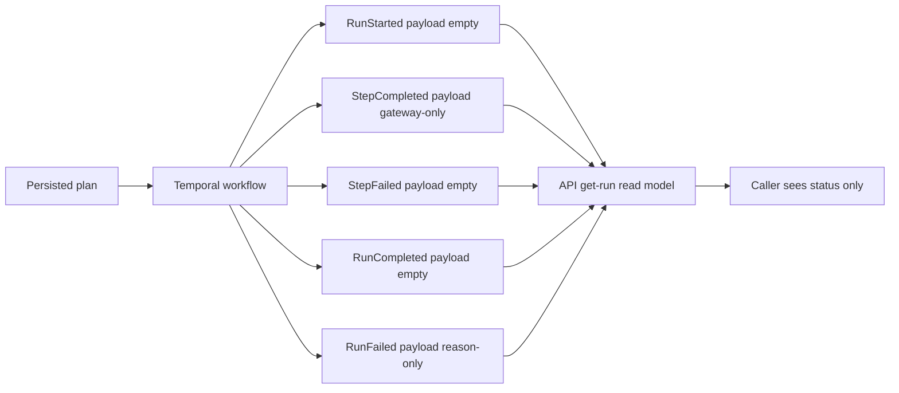
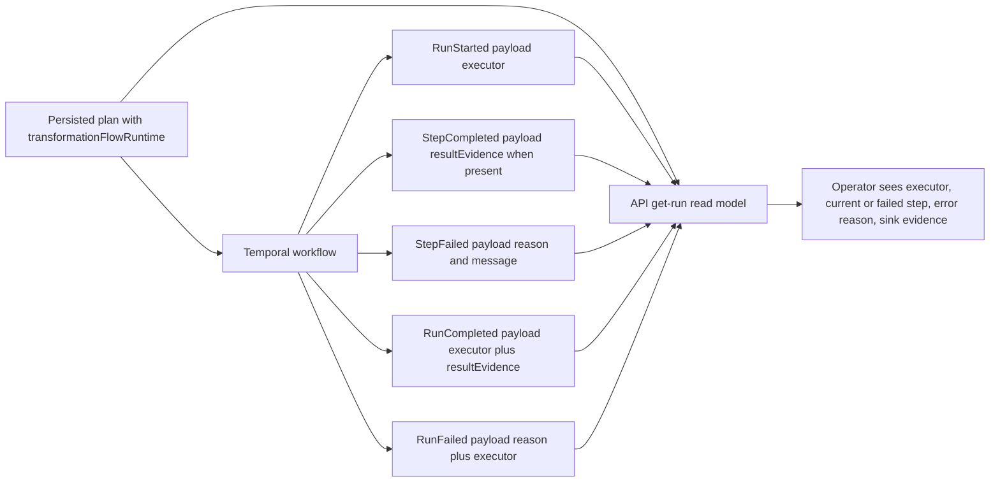

# Closeout: TF-C2-B run read evidence

## Think-First Analysis

### Problem summary

The transformation-flow vertical already requires caller-visible run outcome
evidence, but the current runtime path still emits sparse lifecycle payloads.
`GET /runs/:runId` therefore returns only the base run snapshot, while
`GET /runs/:runId/events` cannot carry structured materialization evidence or
step-attributed diagnostics.

### Root cause

Three layers are currently out of sync:

1. the TF architecture proposal expects executor identity, sink evidence, and
   failed-step diagnostics on the read surfaces
2. the normative `RunEvents` contract still treats those event payloads as
   generic or empty
3. the Temporal workflow emits `RunCompleted`, `RunFailed`, and `StepFailed`
   without the structured evidence needed by the API read model

### Constraints and invariants

- `AGENTS.md`: inventory-first startup, doc-driven contract changes, no hidden
  debt, no stubs, mandatory closeout evidence, and mandatory validation
  baseline
- `docs/guides/ai-work-protocol.md`: this is `Full` mode work because the slice
  changes a caller-visible runtime contract and spans docs, contracts, adapter,
  and API read models
- `ADR-0003`: DVT owns execution semantics; provider runtimes do not own the
  meaning of success, failure, or caller-visible diagnostics
- `ADR-0004`: events remain append-only authority and derived read models must
  be replayable from the event stream
- `ADR-0005` and `ADR-0006`: runtime payload changes must be formalized in the
  canonical contract and validated at boundaries
- `ADR-0010`: run-event payloads are governed envelopes and must not drift by
  adapter-local convention
- `ADR-0015`: `getRunStatus` remains a read model over authoritative data; the
  engine snapshot stays minimal and the API may enrich separately
- `docs/architecture/engine/contracts/engine/RunEvents.v2.0.md`: event
  payloads must be defined at the normative engine contract, not left implicit
  in UI code

### Current-state diagram

### Selected design

Keep the engine `RunStatusSnapshot` minimal, but enrich the API run read model
from two governed sources:

1. the persisted plan, which carries the bound transformation executor identity
2. the event log, which carries structured result evidence and failure
   diagnostics

This preserves ADR-0015 while making the caller-visible contract explicit.

### Target-state diagram

### Rejected alternatives

1. Put materialization evidence directly into `RunStatusSnapshot`
   - rejected because it collapses the base engine read model and the
     caller-enriched API read model into one surface, violating ADR-0015
2. Infer executor identity only from emitted step kinds
   - rejected because the runtime read surface should use the plan-bound
     execution identity rather than a heuristic over internal steps
3. Leave `/runs/:runId/events` unstructured and let the UI guess
   - rejected because it pushes contract ownership into presentation code and
     would drift from the normative event schema

## Pre-Implementation Brief

- Mode: Full
- Scope:
  - `docs/architecture/engine/contracts/engine/RunEvents.v2.0.md`
  - `docs/planning/proposals/mandatory/runtime-and-contracts/transformation-flow-architecture-and-contracts-20260405.md`
  - `packages/@dvt/contracts/**`
  - `packages/@dvt/adapter-temporal/**`
  - `apps/api/src/application/services/getRunStatusUseCase.ts`
  - `apps/api/src/application/services/getRunEventsUseCase.ts`
  - `apps/api/src/application/ports/runtime.ts`
  - `apps/api/src/app.ts`
  - `docs/planning/state/agent-lane-c.yaml`
  - `docs/planning/state/agent-lane-e.yaml`
- Expected outcome:
  - `RunEvents` formally allows structured result-evidence and failure payloads
  - Temporal emits executor identity, sink evidence, and failure diagnostics
    into the event stream
  - `GET /runs/:runId` returns executor identity, current or failed step id,
    error reason, and materialization evidence without bloating the base engine
    snapshot
  - `GET /runs/:runId/events` exposes the same evidence via governed event
    payloads
- Risks and mitigations:
  - Risk: executor identity is unavailable on persisted plans created before the
    preview profile contract
  - Mitigation: read executor from plan-bound observability metadata when
    present and fail soft to `undefined` for older plans
  - Risk: StepCompleted gateway payload rules regress
  - Mitigation: keep `gatewayDecision` valid and extend the payload shape
    additively with contract tests
  - Risk: API overfits to Temporal internals
  - Mitigation: derive from canonical event payloads and plan records only
- Out of scope:
  - implementing the PostgreSQL executor write path itself
  - async snapshot materialization redesign
  - final provenance chain closure from result back to Git artifacts
- Validation plan:
  - `pnpm docs:sync`
  - `pnpm docs:status:generate`
  - `pnpm docs:workboard:generate`
  - `pnpm --filter @dvt/contracts test`
  - `pnpm --filter @dvt/adapter-temporal test`
  - `pnpm --filter dvt-api test`
  - `pnpm --filter dvt-api typecheck`
  - `pnpm verify:prepush`
