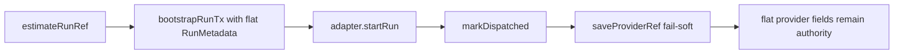
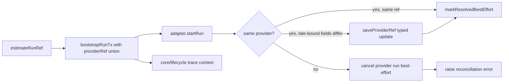

# Closeout: Provider-ref contract hardening

## Think-First Analysis

### Problem summary

The current start-run and run-metadata seams still model provider identity as a
flat bag of optional fields plus an optional `saveProviderRef(...)` mutation
after bootstrap. That allows impossible provider states to type-check and keeps
provider-ref reconciliation outside the event-led runtime authority.

### Root cause

The repository introduced `saveProviderRef(...)` as a small operational patch
for the `estimateRunRef()` bootstrap path, but never promoted provider
identity to a single canonical model. `EngineRunRef` became a discriminated
union while `RunMetadata`, `ProviderRefUpdate`, tests, and repositories stayed
flat. The result is duplicated modeling, a fail-soft metadata side channel, and
core importing a trace-context type that still lives under start-run services.

### Constraints and invariants

- `AGENTS.md`: inventory-first startup, doc-driven contract changes, no hidden
  debt, and mandatory validation evidence.
- `docs/guides/ai-work-protocol.md`: this slice is `Full` because it changes
  shared contracts, start-run protocol rules, and architectural status docs.
- `docs/adr/ADR-0004-event-sourcing-strategy.md`: runtime truth must remain
  deterministic and explicit; operational patches must not quietly become
  semantic authority.
- `docs/adr/ADR-0014-run-driven-adapter-model.md`: adapters own provider IO
  behind a run-driven boundary; `startRun()` returns the provider run identity.
- `docs/adr/ADR-0015-getRunStatus-read-model-separation.md`: metadata and
  snapshots remain the engine-owned read surfaces; provider status lookup does
  not redefine canonical stored truth.
- `docs/adr/ADR-0031-adapter-tenant-isolation.md`: run metadata and any
  provider-ref persistence stay tenant-scoped.
- `docs/adr/ADR-0039-hexagonal-port-hardening-and-solid-remediation.md`:
  ownership seams must be explicit and cross-layer type drift should be removed.

### Options considered

1. Keep `RunMetadata` flat and only make `ProviderRefUpdate` discriminated.
2. Replace the flat provider bag with a nested discriminated `providerRef`,
   restore `saveProviderRef(...)` as a typed validated seam, and reconcile
   same-provider late-bound fields after bootstrap.
3. Keep the reconciliation path but move it behind a new `ProviderRefUpdated`
   event in the same slice.

### Selected option and rationale

Choose option 2.

The repository already has the correct provider identity model:
`EngineRunRef`. Reusing that shape in `RunMetadata` removes impossible states at
the type boundary, lets consumers reason through one canonical object, and
keeps provider reconciliation typed. A validated `saveProviderRef(...)` seam is
still useful for same-provider late-bound identifiers, but it must reject
cross-provider drift and stop being a flat fail-soft patch flow.

### Rejected alternatives

- Option 1 was rejected because it keeps the duplicated provider modeling and
  still tolerates bag-style invalid states inside persisted metadata.
- Option 3 was rejected because it is larger than needed for the current
  repository truth. The active implementations do not need a provider-ref event
  to reconcile same-provider late-bound identifiers safely.

## Current-state and target-state diagrams

### Current state

### Target state

## Pre-Implementation Brief

- Mode: Full
- Scope:
  - `docs/planning/closeouts/20260409-provider-ref-contract-hardening-closeout.md`
  - `docs/architecture/engine/contracts/engine/StartRunProtocol.v1.md`
  - `docs/architecture/domain-execution.md`
  - `docs/architecture/system-delivery-status.md`
  - `packages/@dvt/contracts/src/engine/IRunStateStore.v1.ts`
  - `packages/@dvt/engine/src/ports/IRunStateStore.ts`
  - `packages/@dvt/engine/src/services/startRun/StartRunEventFactory.ts`
  - `packages/@dvt/engine/src/services/startRun/StartRunExecutionService.ts`
  - `packages/@dvt/engine/src/services/startRun/StartRunTypes.ts`
  - `packages/@dvt/engine/src/core/lifecycle/coreRuntime.ts`
  - `packages/@dvt/engine/src/core/WorkflowEngine.ts`
  - `packages/@dvt/engine/src/core/WorkflowEngineCoreService.ts`
  - `packages/@dvt/engine/src/application/StartRunApplicationService.ts`
  - `packages/@dvt/engine/src/state/InMemoryRunStateStore.ts`
  - `packages/@dvt/engine/src/state/InMemoryTxStore.ts`
  - `packages/@dvt/adapter-postgres/src/PostgresRunMetadataRepository.ts`
  - `apps/api/src/application/services/runMetadataToEngineRunRef.ts`
  - affected engine, adapter-postgres, and api tests
- Expected outcome:
  - `RunMetadata` carries one canonical `providerRef: EngineRunRef`
  - impossible provider field combinations are no longer type-valid or
    persistable
  - `saveProviderRef(...)` becomes a discriminated validated update seam
  - `estimateRunRef()` may reconcile same-provider late-bound fields after
    bootstrap
  - `StartRunTraceContext` moves to a shared engine seam consumed by core and
    start-run services
- Risks and mitigations:
  - Risk: contract fan-out across engine, API, and Postgres repository
  - Mitigation: change the shared contract first and then update consumers to
    read `providerRef.*`
  - Risk: provider mismatch path becomes a reconciliation error
  - Mitigation: cancel the provider run best-effort and reject
    cross-provider updates instead of accepting hidden patch drift
  - Risk: stale docs continue to teach flat or unvalidated `saveProviderRef(...)`
  - Mitigation: update canonical start-run protocol and execution status docs
- Out of scope:
  - introducing a new `ProviderRefUpdated` event contract
  - widening public API DTOs beyond the metadata shape they already consume
  - non-provider runtime slices unrelated to start-run identity or trace context
- Validation plan:
  - `pnpm --filter @dvt/contracts build`
  - `pnpm --filter @dvt/contracts test`
  - `pnpm --filter @dvt/engine test`
  - `pnpm --filter @dvt/adapter-postgres test`
  - `pnpm --filter dvt-api test`
  - `pnpm docs:sync`
  - `pnpm verify:prepush`
- Test coverage plan:
  - reconcile same-provider providerRef mismatches when `estimateRunRef()` is present
  - reject cross-provider providerRef mismatches when `estimateRunRef()` is present
  - preserve valid temporal optional fields through `providerRef`
  - ensure invalid cross-provider mixes are no longer representable in tests
  - prove API mapping round-trips from `RunMetadata.providerRef`
  - prove start-run trace context compiles from the shared seam
