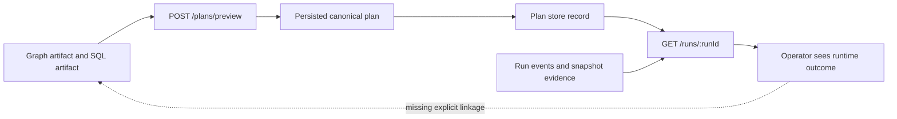
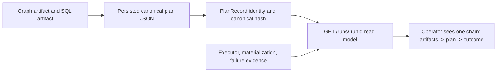

# Closeout: TF-B1-B provenance evidence linkage

## Think-First Analysis

### Problem summary

The transformation-flow vertical already persists authoring provenance at
preview time and already exposes runtime outcome evidence on run reads, but the
operator still cannot inspect one caller-visible chain from Git-tracked inputs
to persisted plan identity to run outcome.

Today:

1. `POST /plans/preview` returns `graphArtifact`, `sqlArtifact`, and persisted
   plan identity.
2. `GET /runs/:runId` returns runtime outcome evidence such as executor,
   materialization, and failure diagnostics.
3. `GET /runs/:runId/events` exposes timeline artifact refs emitted by runtime
   step events.

Those surfaces are individually truthful, but they do not publish one explicit
linkage contract that answers:

- which authoring artifacts produced this run
- which persisted plan record this run executed
- which runtime outcome and failure evidence belong to that same chain

### Root cause

The preview-time provenance is stored implicitly inside the persisted canonical
plan through `observability.extra.transformationFlowProvenance`, while the run
read model only derives executor, active step, failure, and materialization.

Three layers are therefore out of sync:

1. the transformation-flow proposal requires provenance to remain visible from
   result back to Git artifacts
2. the persisted plan already carries enough information to satisfy that rule
3. the caller-visible run snapshot does not project that plan-bound provenance
   back out

### Constraints and invariants

- `AGENTS.md`: inventory-first startup, doc-driven first for behavior and
  planning changes, no hidden debt, no stubs, and real validation evidence
- `docs/guides/ai-work-protocol.md`: `Full` mode because the slice changes
  caller-visible run-detail behavior and planning posture
- `ADR-0003`: execution meaning belongs to DVT, not to provider-specific or UI
  heuristics
- `ADR-0004`: replayable event and state authority must remain append-only; the
  slice must derive read truth rather than invent new persistence
- `ADR-0005` and `ADR-0006`: contract and validation changes must be explicit
  and executable
- `ADR-0015`: the engine status snapshot stays minimal; API read models may
  enrich from persisted authority
- `Transformation Flow Architecture And Contracts 2026-04-05`: the vertical
  must preserve provenance from authoring artifacts through persisted plan and
  into run result inspection
- `Transformation Flow Delivery Plan 2026-04-05`: Phase 5 requires the
  provenance chain to remain visible from result back to Git artifacts

### Current-state diagram

### Selected design

Keep persistence unchanged and derive the caller-visible provenance chain from
existing authoritative artifacts:

1. `PlanRecord` identity remains the persisted-plan authority.
2. The canonical plan JSON inside `PlanRecord` remains the authoring-provenance
   authority for `graphArtifact` and `sqlArtifact`.
3. The existing run read evidence model remains the outcome authority for
   executor, materialization, and failure diagnostics.
4. `GET /runs/:runId` adds one explicit provenance object that links those
   inputs to the already-governed outcome fields.
5. The web run-detail view renders that plan-and-authoring provenance alongside
   the existing outcome and timeline sections.

This keeps TF-B1-B narrow:

- no new storage columns
- no new endpoint
- no event-contract rewrite
- no UI inference from ad hoc timeline heuristics

### Target-state diagram

### Rejected alternatives

1. Add new plan-store columns for graph and SQL provenance
   - rejected because the canonical plan already carries the needed provenance
     and TF-B1-B does not require a persistence redesign
2. Infer Git provenance from runtime step events only
   - rejected because runtime step artifacts are execution-time evidence, not
     the source-of-authoring chain frozen at preview time
3. Add a separate provenance endpoint
   - rejected because `GET /runs/:runId` is already the snapshot authority for
     run detail and can carry this linkage without route sprawl

## Pre-Implementation Brief

- Mode: Full
- Scope:
  - `docs/planning/proposals/mandatory/runtime-and-contracts/transformation-flow-architecture-and-contracts-20260405.md`
  - `docs/architecture/components/web/runs/frontend-runtime-contract-technical-manual.md`
  - `docs/architecture/components/web/runs/frontend-backend-mvp-contract.md`
  - `docs/architecture/system-delivery-status.md`
  - `docs/planning/state/agent-lane-b.yaml`
  - `docs/planning/state/domain-status-board.md`
  - `apps/api/src/application/ports/runtime.ts`
  - `apps/api/src/application/services/runReadEvidenceModel.ts`
  - `apps/api/src/application/services/getRunStatusUseCase.ts`
  - `apps/api/test/application/services/getRunStatusUseCase.test.ts`
  - `apps/api/test/entrypoints/http/getRunRoute.test.ts`
  - `apps/web/src/app/ports/runs.ts`
  - `apps/web/src/app/services/runs/runsService.api.ts`
  - `apps/web/src/app/services/runs/runsService.mock.ts`
  - `apps/web/src/app/services/runs/runsService.test.ts`
  - `apps/web/src/app/views/runs/RunWorkspaceStateView.tsx`
  - `apps/web/src/app/views/runs/runStatesCopy.ts`
  - `apps/web/src/app/views/runs/RunStates.test.tsx`
- Expected outcome:
  - `GET /runs/:runId` returns persisted-plan identity plus authoring artifact
    provenance in one explicit object
  - API provenance derivation uses persisted canonical plan JSON and does not
    require new storage
  - web run detail renders the plan-and-authoring chain next to the governed
    outcome evidence
  - lane and status docs stop describing TF-B1-B as a missing executable
    contract
- Risks and mitigations:
  - Risk: older or non-transformation plans may not contain
    `transformationFlowProvenance`
  - Mitigation: emit persisted plan identity whenever available and include
    authoring artifacts only when present
  - Risk: UI may mix authoring provenance with execution artifact refs
  - Mitigation: keep separate sections for plan-and-authoring provenance and
    execution-time artifact refs
  - Risk: API starts depending on ad hoc plan JSON parsing
  - Mitigation: parse only the governed `observability.extra` keys already
    written by preview-time binding
- Out of scope:
  - changing plan-store schema
  - changing `GET /runs/:runId/events`
  - broadening `PlanRecord` shared-kernel shape
  - final closure of unrelated TF-C2-B documentation drift already isolated in
    a stash
- Validation plan:
  - `pnpm --filter dvt-api typecheck`
  - `pnpm --filter dvt-api test`
  - `pnpm --filter @dvt/web typecheck`
  - `pnpm --filter @dvt/web test`
  - `pnpm docs:workboard:generate`
  - `pnpm docs:planning:generated:check`
  - `pnpm exec markdownlint-cli2 "docs/planning/closeouts/20260412-tf-b1-b-provenance-evidence-linkage-closeout.md" "docs/planning/proposals/mandatory/runtime-and-contracts/transformation-flow-architecture-and-contracts-20260405.md" "docs/architecture/components/web/runs/frontend-runtime-contract-technical-manual.md" "docs/architecture/components/web/runs/frontend-backend-mvp-contract.md" "docs/architecture/system-delivery-status.md" "docs/planning/state/domain-status-board.md"`
  - `pnpm verify:prepush`
