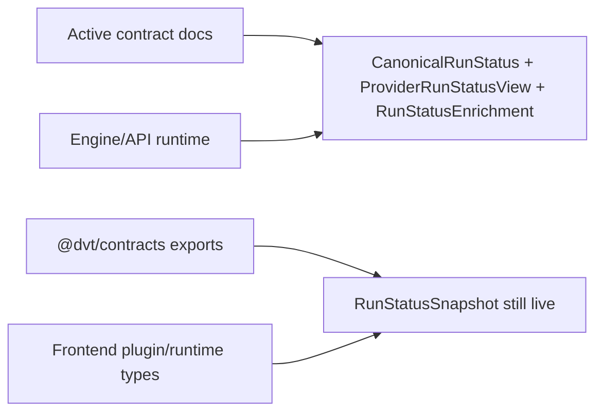
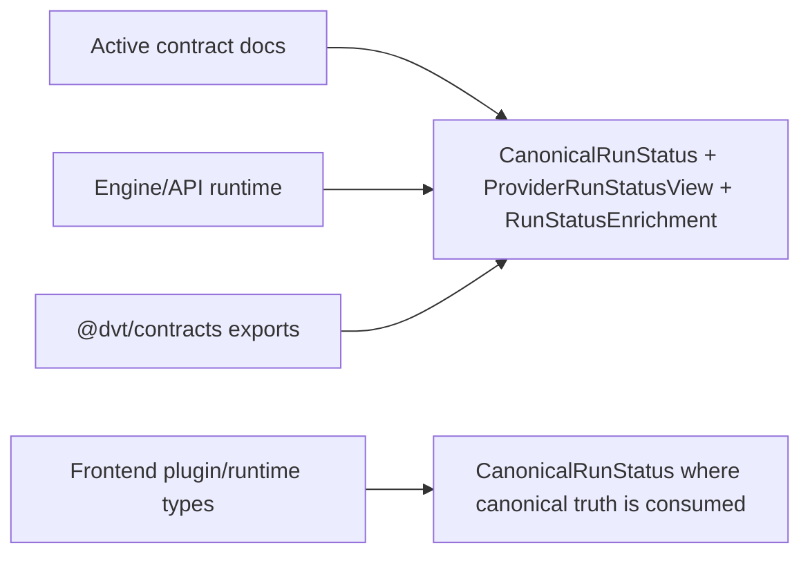

# Closeout: AR-A12-B status model split

## Think-First Analysis

### Problem summary

The active engine-runtime contract pack already documents the split between
canonical status, provider-live diagnostics, and engine-owned enrichment, but
the shared contracts package and a small set of frontend surfaces still publish
`RunStatusSnapshot` as if it were a live governed type.

### Root cause

`AR-A12-B` landed first in normative docs and in the engine runtime boundary,
but the shared validation/export surface kept the legacy type and parser alive
as a convenience alias. That left the repo in an unstable in-between state:

- active contract docs say the split is real;
- engine code and adapter contracts use the split;
- `@dvt/contracts` still exports a fourth status object carrying the old name;
- frontend plugin/runtime surfaces still consume the old alias even when they
  only need canonical status.

### Constraints and invariants

- `AGENTS.md`: inventory-first startup, docs/contracts/code/tests alignment,
  no hidden debt, no fake completion, required closeout evidence.
- `docs/guides/ai-work-protocol.md`: this is a `Full` slice because it changes
  the active contract surface and planning posture.
- `docs/adr/ADR-0003-execution-model.md`: DVT owns lifecycle semantics;
  adapters must not define canonical status meaning.
- `docs/adr/ADR-0015-getRunStatus-read-model-separation.md`: canonical status
  is event-log-backed truth; enrichment is separate and must fail closed.
- `docs/planning/proposals/mandatory/runtime-and-contracts/ar-a12-b-status-model-split-plan-20260411.md`:
  the active contract line must expose exactly `CanonicalRunStatus`,
  `ProviderRunStatusView`, and `RunStatusEnrichment`.
- `docs/planning/reviews/architecture-and-governance/20260411-ar-a12-b-status-model-split-fowler-review.md`:
  provider status naming must no longer masquerade as canonical lifecycle truth.

### Options considered

1. Keep `RunStatusSnapshot` as a deprecated compatibility alias in
   `@dvt/contracts`.
2. Remove `RunStatusSnapshot` from the active shared contract surface and cut
   all live consumers over to `CanonicalRunStatus`.
3. Leave shared contracts untouched and close the slice only as documentation.

### Selected option and rationale

Choose option 2.

Keeping the alias would preserve the exact ambiguity that `AR-A12-B` exists to
remove. The repo is pre-stable and already executes breaking contract cleanup
in place on the active `v1` line. The clean closure is to make the shared type
system match the normative contract pack and rename the remaining live
consumers to the explicit canonical model.

### Rejected alternatives

- Option 1 was rejected because a deprecated alias in the live shared contract
  surface still advertises a fourth semantic model and weakens the authority
  split.
- Option 3 was rejected because the slice would remain only partially true:
  docs would say one thing while the shared contract package exported another.

## Current-state and target-state diagrams

### Current state

### Target state

## Pre-Implementation Brief

- Mode: Full
- Scope:
  - remove `RunStatusSnapshot` from the active shared contract surface
  - cut live frontend/plugin consumers over to `CanonicalRunStatus`
  - update active docs and planning surfaces that still present the legacy
    status model as live truth
- Touched files or paths:
  - `docs/planning/closeouts/20260413-ar-a12-b-status-model-split-closeout.md`
  - `docs/planning/state/agent-lane-a.yaml`
  - `docs/planning/reviews/review-status-board.md`
  - selected active docs under `docs/architecture/**`, `docs/planning/**`,
    and `apps/web/*.md`
  - `packages/@dvt/contracts/src/types/contracts.ts`
  - `packages/@dvt/contracts/src/schemas.ts`
  - `packages/@dvt/contracts/src/validation.ts`
  - `packages/@dvt/contracts/test/validation.test.ts`
  - `packages/cli/validate-contracts.cjs`
  - `packages/@dvt/engine/src/contracts/types.ts`
  - frontend runtime/plugin type consumers under `apps/web/src/app/**`
- Expected outcome:
  - `RunStatusSnapshot` is no longer part of the active shared contract line
  - active consumers use explicit canonical status naming
  - active docs no longer describe `RunStatusSnapshot` as live contract truth
  - Lane A can move `AR-A12-B` from in-progress to done with evidence
- Risks and mitigations:
  - Risk: removing the shared alias may fan out into frontend and tooling
    compilation failures
  - Mitigation: change shared contracts first, then update all live consumers in
    the same slice
  - Risk: historical or archive docs still mention the old name
  - Mitigation: update only active surfaces; historical references remain
    historical context
- Out-of-scope items:
  - retrospective rewrite of archived reviews, evidence, or superseded docs
  - new runtime semantics beyond the status-model split
  - broader frontend UX changes unrelated to status-type authority
- Validation plan:
  - `pnpm docs:sync`
  - `pnpm docs:workboard:generate`
  - `pnpm --filter @dvt/contracts test`
  - `pnpm --filter @dvt/engine test`
  - `pnpm --filter @dvt/web typecheck`
  - `pnpm --filter @dvt/web test`
  - `pnpm verify:prepush`
- Test coverage plan:
  - contracts validators reject or accept canonical status through
    `parseCanonicalRunStatus`, not the legacy alias
  - CLI validation bundle checks canonical status instead of
    `RunStatusSnapshot`
  - frontend typecheck proves plugin and canvas overlay surfaces use
    `CanonicalRunStatus`
- Libraries evaluated:
  - None evaluated - contract cleanup slice

## Final Closeout

### Implementation summary

`AR-A12-B` is now true in the active code and docs surface.

- removed `RunStatusSnapshot`, `RunStatusSnapshotSchema`, and
  `parseRunStatusSnapshot()` from the active `@dvt/contracts` line
- removed `AdapterScopedSubstatus` from active public contract re-exports so
  provider-scoped status tokens remain diagnostic-only strings on
  `ProviderRunStatusView`
- updated both CLI contract validators to check `CanonicalRunStatus`
  instead of the legacy snapshot alias
- cut the active frontend plugin and canvas-overlay types over to
  `CanonicalRunStatus`
- renamed the recovery-service helper to `resolveCanonicalRunStatus()` so
  engine naming no longer implies a legacy snapshot authority
- updated active architecture, execution-model, frontend, review-board,
  and lane-state docs so they describe canonical status,
  provider-live diagnostics, and enrichment as separate authority planes

### Validation evidence

The following commands were run and passed:

- `pnpm docs:sync`
- `pnpm docs:workboard:generate`
- `pnpm --filter @dvt/contracts test`
- `pnpm --filter @dvt/engine test`
- `pnpm --filter @dvt/web typecheck`
- `pnpm --filter @dvt/web test`
- `pnpm verify:prepush`

`pnpm verify:prepush` completed successfully. Its internal changed-file
filters reported no changed files detected for some scoped checks, so the
task also includes the explicit package-level validation commands above as the
real touched-scope proof.

### No-debt / no-stub statement

- no compatibility alias or provider-scoped status helper was retained in the
  active shared contract surface
- no lint, type, test, or docs-governance rules were disabled
- no hooks were bypassed
- no stub, placeholder, fake adapter, or fake success path was introduced
