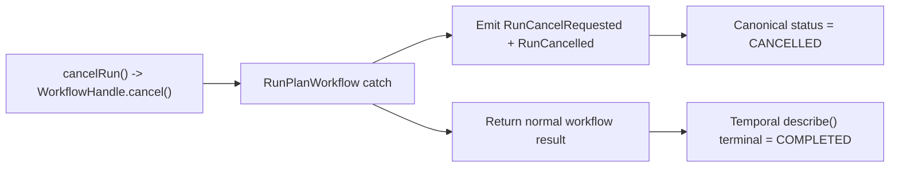
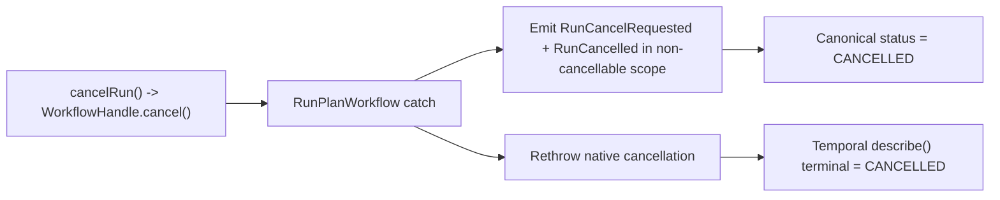

# Closeout: AR-C6 provider-status convergence

## Think-First Analysis

### Problem summary

`AR-C6` already moved `TemporalAdapter.cancelRun()` onto
`WorkflowHandle.cancel()` and kept runtime-owned cancellation events in the
workflow, but the native-cancel path still leaves one operational mismatch:
Temporal `describe()` can settle on provider status `COMPLETED` even after the
canonical event log has reached `RunCancelled`.

### Root cause

The workflow currently catches native Temporal cancellation, persists
`RunCancelRequested` and `RunCancelled` through non-cancellable local
activities, and then returns a normal workflow result.

That preserves canonical event ordering but tells Temporal that workflow
execution completed normally. The adapter then reads `handle.describe()` and
surfaces the provider-native terminal token from Temporal, which may become
`COMPLETED` instead of `CANCELLED`.

### Constraints and invariants

- `AGENTS.md`: inventory-first startup, docs/code/tests/planning alignment,
  required validation evidence, no hidden debt, no fake completion.
- `docs/guides/ai-work-protocol.md`: this is a `Full` slice because it changes
  an active runtime behavior, active docs, and planning posture.
- `docs/adr/ADR-0007_RunCancellation.md`: runtime owns `RunCancelRequested`
  and `RunCancelled`; engine must not synthesize terminal cancellation.
- `docs/adr/ADR-0003-execution-model.md`: DVT owns lifecycle semantics;
  provider engines do not define canonical truth.
- `docs/architecture/components/engine/contracts/engine/ExecutionSemantics.v1.md`:
  canonical status remains event-log-backed; provider status is enrichment only.
- `docs/architecture/components/engine/contracts/engine/IProviderAdapter.v1.md`:
  `getProviderStatusView()` is provider-live diagnostics only, but it must
  still remain provider-native rather than fabricating a DVT token.
- `docs/planning/proposals/mandatory/runtime-and-contracts/ar-c6-temporal-cancel-semantics-plan-20260410.md`:
  native cancel should be provider-native, and the remaining gap is runtime
  convergence on provider-live versus persisted terminal status.

### Options considered

1. Leave the mismatch documented as a permanent provider-status limitation.
2. Map Temporal `COMPLETED` to synthetic `CANCELLED` in the adapter after the
   fact.
3. Preserve canonical event persistence, then rethrow the native cancellation
   so Temporal records the workflow execution as cancelled.

### Selected option and rationale

Choose option 3.

Option 1 leaves the exact remaining `AR-C6` gap open. Option 2 would falsify
the provider-live boundary by inventing a non-provider terminal token in the
adapter. Re-throwing the native cancellation after non-cancellable event
finalization keeps runtime-owned canonical events intact and lets Temporal
report the provider-native terminal state that actually corresponds to native
workflow cancellation.

### Rejected alternatives

- Option 1 was rejected because the repo already narrowed `AR-C6` to this
  remaining convergence issue.
- Option 2 was rejected because adapter diagnostics must not overwrite the
  provider's own status model with a synthetic correction.

## Current-state and target-state diagrams

### Current state

### Target state

## Pre-Implementation Brief

- Mode: Full
- Scope:
  - native-cancel finalization path in
    `packages/@dvt/adapter-temporal/src/workflows/RunPlanWorkflow.ts`
  - Temporal adapter integration or unit tests that currently accept
    `COMPLETED` for native cancellation
  - active Temporal policy docs, ARC evidence or risk material, and Lane C
    closure surfaces for `AR-C6`
- Expected outcome:
  - native `cancelRun()` persists ordered canonical cancellation events and
    eventually yields provider-live status `CANCELLED`
  - cooperative `signal(CANCEL)` remains a distinct path
  - `AR-C6` can close without leaving the provider-live terminal mismatch as an
    open runtime gap
- Risks and mitigations:
  - Risk: rethrowing cancellation after local activities could regress event
    persistence
  - Mitigation: keep terminal emission in `CancellationScope.nonCancellable()`
    and add integration coverage that asserts both provider terminal status and
    event ordering
  - Risk: tests may still be encoding the old mixed terminal status behavior
  - Mitigation: split native-cancel expectations from cooperative-signal
    expectations explicitly
- Out-of-scope items:
  - redesign of the canonical signal taxonomy
  - non-Temporal adapter behavior
  - changes to caller-visible canonical run status semantics
  - broad retention or stuck-cancellation SLA work
- Validation plan:
  - `pnpm --filter @dvt/adapter-temporal test`
  - `pnpm test:adapter-temporal:integration`
  - `pnpm --filter @dvt/engine test`
  - `pnpm docs:sync`
  - `pnpm docs:workboard:generate`
  - `pnpm docs:status:generate`
  - `pnpm verify:prepush`
- Test coverage plan:
  - unit coverage keeps proving `cancelRun()` uses native Temporal cancellation
  - integration coverage proves native cancellation reaches provider terminal
    `CANCELLED`
  - integration coverage still proves canonical event ordering
    `RunCancelRequested -> RunCancelled`
  - cooperative `signal(CANCEL)` remains covered as a distinct path
- Libraries evaluated:
  - None evaluated - Temporal workflow semantics slice inside existing stack

## Implementation Summary

- `RunPlanWorkflow` no longer treats native Temporal cancellation as a normal
  success-path return. It now persists `RunCancelRequested` and
  `RunCancelled` inside `CancellationScope.nonCancellable(...)` and then
  rethrows the original cancellation so Temporal records the workflow as
  provider-native `CANCELLED`.
- Time-skipping integration coverage now splits cooperative `signal(CANCEL)`
  from native `cancelRun()` semantics explicitly:
  - cooperative signal remains a workflow-owned cancel path and may still end
    with provider token `COMPLETED`
  - native cancel now converges provider-live terminal status on `CANCELLED`
    while preserving canonical event ordering
- Active Temporal policy, status, evidence, risk, and Lane C planning surfaces
  now describe the two cancellation paths consistently and mark `AR-C6` as
  closed.

## Changes Made

| File                                                                                 | Change                                                                                       | Why                                                                                                         |
| ------------------------------------------------------------------------------------ | -------------------------------------------------------------------------------------------- | ----------------------------------------------------------------------------------------------------------- |
| `packages/@dvt/adapter-temporal/src/workflows/RunPlanWorkflow.ts`                    | changed native-cancel finalization to rethrow after non-cancellable event persistence        | make Temporal provider-live terminal status converge on `CANCELLED` without losing canonical event ordering |
| `packages/@dvt/adapter-temporal/test/integration.time-skipping.test.ts`              | tightened native-cancel expectations and split signal-vs-native provider terminal assertions | prove the runtime keeps ordered canonical cancellation while distinguishing provider semantics correctly    |
| `docs/architecture/components/engine/adapters/temporal/EnginePolicies.md`            | updated native and cooperative cancel semantics                                              | align active adapter policy docs with shipped behavior                                                      |
| `docs/architecture/system-delivery-status.md`                                        | updated delivery-status narrative for native Temporal cancellation                           | keep status truth aligned with the implemented runtime slice                                                |
| `docs/evidence/ED-20260413-temporal-native-cancel-provider-status-convergence.md`    | added ARC-2 evidence doc                                                                     | provide required governed proof for the adapter change                                                      |
| `docs/risk-register/quality/R-20260410-TEMPORAL-NATIVE-CANCEL-TERMINAL-CLEANUP.yaml` | closed the remaining native-cancel convergence risk                                          | record that the mismatch is resolved and restate the residual regression risk                               |
| `docs/planning/state/agent-lane-c.yaml`                                              | marked `AR-C6` as `done`                                                                     | make the canonical planning registry match the accepted runtime closure                                     |
| `docs/planning/state/domain-status-board.md`                                         | removed `AR-C6` from active runtime blockers                                                 | align domain status with the closed lane task                                                               |
| `docs/planning/roadmap/roadmap-by-domain.md`                                         | removed the near-term `AR-C6` follow-through wording                                         | stop treating cancel convergence as still-open roadmap work                                                 |
| `docs/planning/closeouts/20260413-ar-c6-provider-status-convergence-closeout.md`     | recorded analysis, implementation, and validation evidence                                   | preserve governed closeout traceability                                                                     |

## Validation Evidence

| Command                                                   | Result |
| --------------------------------------------------------- | ------ |
| `pnpm --filter @dvt/adapter-temporal test`                | PASS   |
| `pnpm --filter @dvt/adapter-temporal ci:test:integration` | PASS   |
| `pnpm --filter @dvt/adapter-temporal build`               | PASS   |
| `pnpm --filter @dvt/engine test`                          | PASS   |
| `pnpm docs:sync`                                          | PASS   |
| `pnpm docs:workboard:generate`                            | PASS   |
| `pnpm docs:status:generate`                               | PASS   |

## Informational command runs

- `$env:GIT_BASE='origin/main'; $env:GIT_HEAD='HEAD'; node tools/ci/arc-check.mjs`
  completed, but because the slice is still uncommitted the script evaluated
  `origin/main...HEAD`, saw no changed files, and reported `ARC-0`. This was
  not counted as effective ARC validation for the worktree diff.
- `pnpm verify:prepush` completed, but the repo's changed-only checks did not
  evaluate this uncommitted slice. It is recorded as an operational command
  run, not as the primary validation evidence for the AR-C6 diff.

## Debt Introduced

None. No runtime rule was relaxed, no provider-status mapping was faked in the
adapter, and no hooks or checks were bypassed.

## Residuals

- Provider-live status remains enrichment only. Canonical run status continues
  to come from the event log and projector-backed read model.
- Cooperative `signal(CANCEL)` still intentionally differs from native
  provider cancellation and may finish with provider token `COMPLETED`.
- `docs/planning/state/agent-lane-c.yaml` also carries a separate local edit on
  `AR-C2-T2` that predates this closeout pass; this slice did not modify or
  revert that unrelated planning change.
