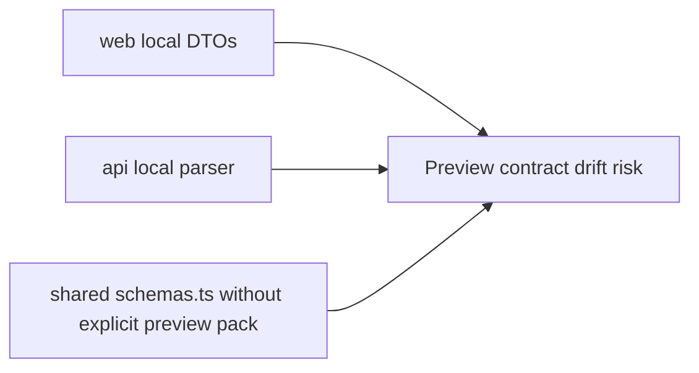
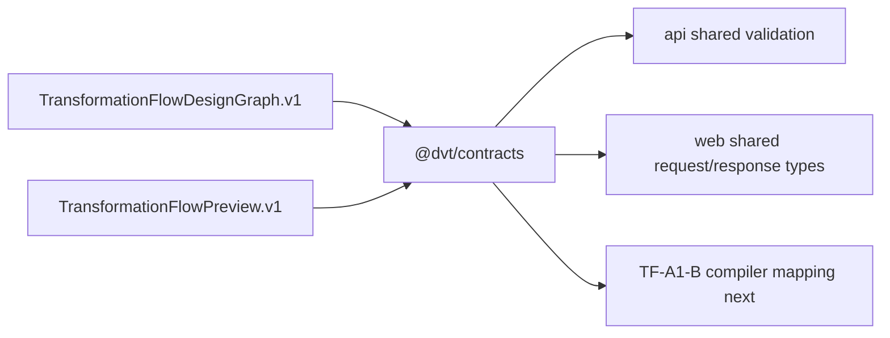

# Closeout: TF-A1-A preview contract freeze

## Think-First Analysis

### Problem summary

The SQL-first transformation vertical already had a documented shape, but the
actual preview contract was still split across local DTOs in `web`, route-local
parsers in `api`, and an oversized shared `schemas.ts` surface that did not own
the preview-persist envelope explicitly.

### Root cause

The active shared contract pack governed generic execution plans, but it did
not yet publish the first-class SQL-first authoring graph, the Git-first
preview provenance envelope, or the persisted preview response boundary. As a
result, `web` and `api` recreated pieces of the contract locally and risked
drifting from each other.

### Constraints and invariants

- `AGENTS.md`: inventory-first startup, docs/code/tests/planning alignment,
  ARC-2 for contract changes, no hidden debt, and mandatory validation evidence.
- `docs/guides/ai-work-protocol.md`: this is a `Full` slice because it adds new
  contract artifacts, active docs, and planning posture.
- `docs/adr/ADR-0005-contract-formalization-tooling.md`: canonical contracts
  need machine-verifiable schemas and runtime validation.
- `docs/adr/ADR-0006-contract-tooling-governance.md`: the repository owns the
  contract tooling line and validation flow.
- `docs/adr/ADR-0012-plan-integrity-ownership.md`: persisted plan boundaries
  must be explicit and integrity-preserving.
- `docs/adr/ADR-0018_Shared_Kernel_Ownership_Governance.md`: shared-kernel
  contract ownership belongs in `@dvt/contracts`, not in route-local copies.
- `docs/planning/proposals/mandatory/runtime-and-contracts/transformation-flow-architecture-and-contracts-20260405.md`:
  the first vertical is fixed to `source -> sql_transform -> sink`, explicit
  `previewProfile`, Git-first artifacts, and persisted preview handoff into
  `PlanRef`.

### Options considered

1. Keep the preview contract split across `web`, `api`, and shared helpers.
2. Keep everything in `schemas.ts` and extend the monolith with more preview logic.
3. Publish dedicated SQL-first planner contract files for graph and preview
   ownership, then keep `schemas.ts` as the composition layer for runtime
   validation.

### Selected option and rationale

Choose option 3.

Option 1 preserves the exact drift that `TF-A1-A` is supposed to remove. Option
2 centralizes more logic in an already oversized file and makes the contract
pack harder to reason about. A dedicated contract split lets the domain
invariants live in named planner artifacts while preserving compatibility
through shared Zod schemas and parse helpers.

### Rejected alternatives

- Option 1 was rejected because it leaves the SQL-first vertical dependent on
  UI-local and route-local assumptions.
- Option 2 was rejected because `schemas.ts` is already a monolith and should
  become a composition facade, not the birthplace of every new boundary.

## Current-state and target-state diagrams

### Current state

### Target state

## Pre-Implementation Brief

- Mode: Full
- Scope:
  - new planner contract files for the SQL-first design graph and preview
    boundary inside `packages/@dvt/contracts`
  - shared schema and validation exports for preview request and response
  - `api` preview profile and provenance adoption
  - `web` preview DTO and graph-source adoption
  - contract doc, evidence, risk, and Lane A planning surfaces
- Expected outcome:
  - `DesignGraphDraft`, `GitArtifactRef`, and `PlanPreviewProvenance` become
    governed shared artifacts
  - `PlanPreviewRequest` and persisted preview response become explicit shared
    contracts
  - `api` and `web` consume the same validation and type line for the touched
    paths
- Risks and mitigations:
  - Risk: `schemas.ts` keeps growing as a monolith
  - Mitigation: move graph and preview ownership into dedicated planner files
    and leave `schemas.ts` as composition
  - Risk: downstream consumers still rely on old DTO copies
  - Mitigation: wire the touched `api` and `web` paths to the shared contracts
    and record residual adoption drift separately
- Out-of-scope items:
  - deterministic compiler mapping from design graph to plan steps
  - planner admission and persistence internals beyond the caller-visible
    preview boundary
  - second-phase dbt preview profiles
- Validation plan:
  - `pnpm --filter @dvt/contracts build`
  - `pnpm --filter @dvt/contracts test`
  - `pnpm --filter dvt-api build`
  - `pnpm --filter dvt-api test -- test/entrypoints/http/planRoutes.test.ts`
  - `pnpm --filter @dvt/web typecheck`
  - `pnpm --filter @dvt/web build`
  - `pnpm --filter @dvt/web test -- src/app/services/plans/plansService.test.ts src/app/views/canvas/useCanvasExecutionActions.test.tsx`
  - `pnpm docs:workboard:generate`
  - `pnpm docs:sync`
  - `pnpm docs:status:generate`
  - `GIT_BASE=origin/main GIT_HEAD=HEAD node tools/ci/arc-check.mjs`
  - `pnpm verify:prepush`
- Test coverage plan:
  - valid design-graph draft parse
  - invalid edge-chain rejection
  - missing SQL-first provenance rejection on request and response
  - `api` preview route tests remain green
  - `web` service and canvas tests remain green on the shared preview surface
- Libraries evaluated:
  - None evaluated - existing Zod-based contract tooling already governs this slice

## Implementation Summary

- `@dvt/contracts` now ships the SQL-first graph and preview boundary in two
  dedicated planner files:
  - `TransformationFlowDesignGraph.v1.ts`
  - `TransformationFlowPreview.v1.ts`
- `schemas.ts` now composes the caller-visible request and persisted response
  schemas from those dedicated contracts instead of owning the domain shape
  inline.
- `validation.ts` now exposes parser helpers for the new graph, provenance,
  preview request, and preview response surfaces.
- `apps/api` now imports preview profile and provenance validation from the
  shared contract pack.
- `apps/web` now consumes the shared preview DTOs and no longer keeps a private
  copy of the design-graph draft vocabulary.
- Active planner contract docs and Lane A planning state now describe `TF-A1-A`
  as shipped work instead of proposal-only intent.

## Changes Made

| File                                                                                 | Change                                                                    | Why                                                                                          |
| ------------------------------------------------------------------------------------ | ------------------------------------------------------------------------- | -------------------------------------------------------------------------------------------- |
| `packages/@dvt/contracts/src/contracts/planner/TransformationFlowDesignGraph.v1.ts`  | added governed graph, provenance, and SQL-first invariants                | move authoring-domain ownership out of local consumers and out of the monolithic schema file |
| `packages/@dvt/contracts/src/contracts/planner/TransformationFlowPreview.v1.ts`      | added explicit preview request and persisted response contract line       | freeze the caller-visible preview boundary for the first vertical                            |
| `packages/@dvt/contracts/src/schemas.ts`                                             | composed request and response schemas from the new planner contracts      | keep runtime validation aligned with the new shared ownership split                          |
| `packages/@dvt/contracts/src/validation.ts`                                          | added parse helpers for graph, provenance, request, and response          | make API and UI boundaries consume the same governed validation                              |
| `packages/@dvt/contracts/test/validation.test.ts`                                    | added positive and negative-path tests for graph and preview validation   | prove invariants and required provenance behave as governed                                  |
| `apps/api/src/entrypoints/http/previewProfilePolicy.ts`                              | switched to shared preview profile constants and type                     | remove route-local preview profile ownership                                                 |
| `apps/api/src/entrypoints/http/previewProvenanceParser.ts`                           | switched to shared provenance parser                                      | remove route-local Git artifact parsing drift                                                |
| `apps/web/src/app/ports/plans.ts`                                                    | switched preview input and provenance types to shared contracts           | stop maintaining private DTO copies in the UI layer                                          |
| `apps/web/src/app/services/plans/plansService.api.ts`                                | validated preview responses against the shared persisted preview contract | align UI service consumption with the governed response shape                                |
| `apps/web/src/app/services/plans/plansService.test.ts`                               | updated mocks and failure expectations to the shared preview contract     | keep the UI service test surface honest                                                      |
| `apps/web/src/app/views/canvas/previewGraphSource.ts`                                | removed the local `DesignGraphDraft` vocabulary copy                      | make the canvas authoring surface consume the shared graph contract                          |
| `docs/contracts/planner/TransformationFlowPreview.v1.md`                             | added repo-local reader for the new planner contract pair                 | make the shipped boundary discoverable from docs                                             |
| `docs/evidence/ED-20260413-tf-a1-a-preview-contract-freeze.md`                       | added ARC-2 evidence                                                      | provide governed proof for the contract change                                               |
| `docs/risk-register/quality/R-20260413-TF-A1-A-PREVIEW-CONTRACT-ADOPTION-DRIFT.yaml` | added residual adoption risk                                              | track remaining drift until `TF-A1-B` and `TF-C1` finish                                     |
| `docs/planning/state/agent-lane-a.yaml`                                              | marked `TF-A1-A` done and moved `TF-A1` to in-progress                    | keep the canonical lane registry aligned with the shipped slice                              |

## Validation Evidence

| Command                                                                                                                              | Result |
| ------------------------------------------------------------------------------------------------------------------------------------ | ------ |
| `pnpm --filter @dvt/contracts build`                                                                                                 | PASS   |
| `pnpm --filter @dvt/contracts test`                                                                                                  | PASS   |
| `pnpm --filter dvt-api build`                                                                                                        | PASS   |
| `pnpm --filter dvt-api test -- test/entrypoints/http/planRoutes.test.ts`                                                             | PASS   |
| `pnpm --filter @dvt/web typecheck`                                                                                                   | PASS   |
| `pnpm --filter @dvt/web build`                                                                                                       | PASS   |
| `pnpm --filter @dvt/web test -- src/app/services/plans/plansService.test.ts src/app/views/canvas/useCanvasExecutionActions.test.tsx` | PASS   |
| `pnpm docs:workboard:generate`                                                                                                       | PASS   |
| `pnpm docs:sync`                                                                                                                     | PASS   |
| `pnpm docs:status:generate`                                                                                                          | PASS   |
| `GIT_BASE=origin/main GIT_HEAD=HEAD node tools/ci/arc-check.mjs`                                                                     | PASS   |
| `pnpm verify:prepush`                                                                                                                | PASS   |

## Debt Introduced

None. No contract rules were relaxed, no hooks or checks were bypassed, and the
shared preview surface is real rather than a placeholder.

## Residuals

- `schemas.ts` remains a large composition surface; this slice stops growing
  the monolith for graph and preview ownership, but it does not yet decompose
  unrelated runtime and record schemas.
- `TF-A1-B` remains the next Lane A slice for freezing the deterministic
  compiler mapping.
- `TF-C1` remains responsible for the remaining route-level preview and persist
  closure beyond the caller-visible contract freeze.
