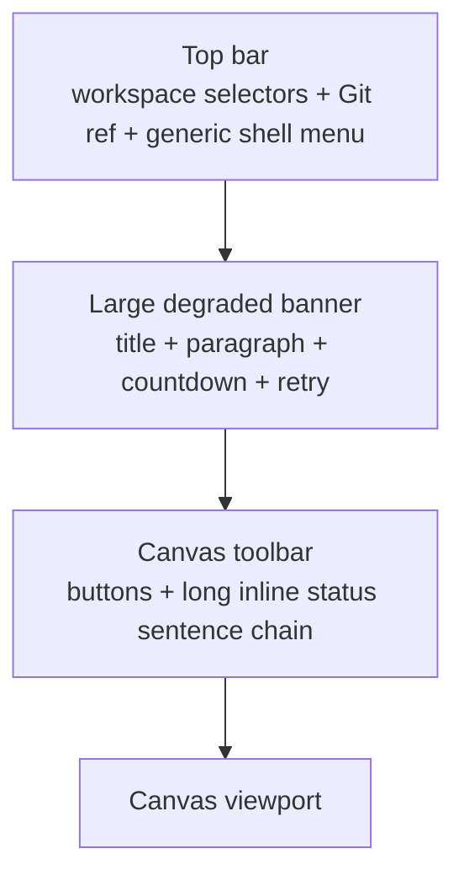
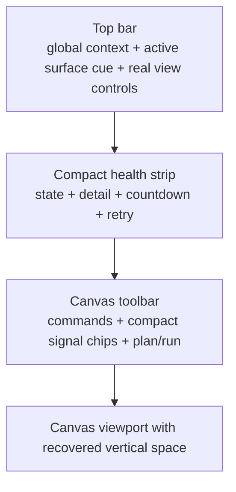

# Closeout: Shell Chrome Signal Compaction

## Think-First Analysis

### Problem summary

The current shell over-communicates in the wrong places. The top bar still
contains a generic shell menu with fake account and notification entries, the
`Canvas` route toolbar spends a large part of its width on verbose inline
status prose, and the global degraded or offline banner expands into a tall
announcement block that steals vertical space from the main workbench.

### Root cause

The shell primitives were wired for completeness before the current operator
workbench grammar was fully locked. As a result:

- global shell chrome carries placeholder actions that do not represent real
  product behavior;
- route-local status is rendered as full sentences inside the toolbar instead
  of compact operational signals;
- degraded health feedback uses a card-like alert treatment rather than the
  compact status-first banner required by the active visual contract.

### Constraints and invariants

- `AGENTS.md`: governance inventory first, think-first before edits, no fake
  completion, evidence-backed closeout.
- `docs/guides/ai-work-protocol.md`: this is a docs-first shell behavior slice
  and needs written rationale before implementation.
- `docs/planning/state/agent-lane-e.yaml`: `F-01` and `F-03` govern shell
  cleanup and real platform-health presentation.
- `docs/architecture/components/web/workbench-ui-contract-and-component-inventory.md`:
  the top bar owns global context, the route toolbar owns route-local commands,
  and the bottom drawer is supporting context only.
- `docs/architecture/components/web/screen-layout-and-cross-surface-behavior-rules.md`:
  `Canvas` stays graph-first and must not sacrifice workspace area to shell
  chrome or review-style copy.
- `docs/architecture/components/web/iconography-and-design-tokens-contract.md`:
  shell health is status-first and compact; route actions use icon plus label;
  dense surfaces should rely on strong hierarchy instead of long helper text.

### Current-state diagram

### Options considered

- Keep the current layout and only restyle colors.
  - Rejected because the main issue is signal density and ownership, not hue.
- Hide the health banner entirely and rely on the top-bar chip.
  - Rejected because degraded and offline state must remain explicit at shell
    level.
- Compact the shell by removing fake menu items, shrinking health to one status
  row, and converting toolbar prose into short chips.
  - Accepted because it preserves real feedback while recovering working space.
- Move route-local status into the top bar.
  - Rejected because route-local state belongs to the active workbench toolbar,
    not to global shell context.
- Libraries evaluated: None. Existing primitives already cover the required UI.

### Selected option and rationale

Implement a compact shell pass that keeps the top bar focused on global context,
turns the menu into a real view-controls menu, compresses degraded or offline
health into a short shell-status strip, and rewrites the `Canvas` toolbar
status line as compact chips with full meaning preserved through concise labels
and titles.

### Target-state diagram

### Rejected alternatives

- Add new placeholder top-bar features such as fake search or fake inbox.
  Rejected because the repo forbids fake or stubbed behavior.
- Remove status detail entirely from `Canvas`.
  Rejected because operators still need quick validation and plan-readiness
  feedback near `Plan` and `Run`.

## Pre-Implementation Brief

- Mode: Full
- Scope:
  - `apps/web/src/app/components/TopAppBar.tsx`
  - `apps/web/src/app/components/ShellHealthBanner.tsx`
  - `apps/web/src/app/components/shell/*`
  - `apps/web/src/app/views/canvas/CanvasToolbar.tsx`
  - route and shell tests that assert current copy or banner structure
  - Lane E planning references for `F-01`
- Expected outcome:
  - the top bar contains only real shell context and real shell controls
  - the degraded or offline banner becomes compact and keeps retry plus cadence
  - the `Canvas` toolbar becomes command-first with short operational chips
  - the main workbench regains visible vertical space
- Risks and mitigations:
  - Risk: regress health-state discoverability
  - Mitigation: keep state label, detail, countdown, and retry all visible
  - Risk: regress toolbar clarity by over-compressing copy
  - Mitigation: keep concise chips plus full titles for long summaries
  - Risk: planning drift between active architecture docs and Lane E task text
  - Mitigation: update `agent-lane-e.yaml` and the draft shell guide together
- Out of scope:
  - left-navigation rebuild
  - route or plugin capability changes
  - new top-level shell features such as command palette or user accounts
- Validation plan:
  - `pnpm --filter @dvt/web test -- --runInBand` is not supported; run targeted
    `vitest` files via package filter
  - `pnpm --filter @dvt/web typecheck`
  - `pnpm --filter @dvt/web build`
  - `pnpm docs:workboard:generate`
  - `pnpm docs:sync`
  - `pnpm verify:prepush`
- Test coverage plan:
  - shell health states in `Root.test.tsx`
  - shell copy contract in `copy.test.ts`
  - compact toolbar semantics in `CanvasToolbar.test.tsx`
- Libraries evaluated:
  - None evaluated -- existing shell primitives and tokens are sufficient

## Changes made

| File                                                                                                                                                                                 | Change                                                                                                                                                            | Why                                                                                 |
| ------------------------------------------------------------------------------------------------------------------------------------------------------------------------------------ | ----------------------------------------------------------------------------------------------------------------------------------------------------------------- | ----------------------------------------------------------------------------------- |
| `apps/web/src/app/components/TopAppBar.tsx`                                                                                                                                          | Added an active-surface cue in the top bar and kept the global shell layout focused on workspace context, health, and view controls.                              | Make the top bar carry real context instead of generic chrome noise.                |
| `apps/web/src/app/components/shell/ShellMenu.tsx`, `apps/web/src/app/components/shell/copy.ts`, `apps/web/src/app/components/shell/chrome.ts`                                        | Replaced the generic shell menu with a real view-controls menu, removed fake account and notification items, and updated copy tokens plus top-bar chrome classes. | Remove fake affordances and tighten the shell contract.                             |
| `apps/web/src/app/components/ShellHealthBanner.tsx`                                                                                                                                  | Rebuilt the degraded and offline treatment as a compact status strip with headline, detail, countdown, and retry action.                                          | Recover vertical space while preserving explicit health feedback.                   |
| `apps/web/src/app/views/canvas/CanvasToolbar.tsx`                                                                                                                                    | Removed the redundant toolbar header label, converted the verbose status sentence chain into compact signal chips, and kept plan or run actions command-first.    | Make the Canvas toolbar scan faster and stop consuming width with low-signal prose. |
| `apps/web/src/app/Root.test.tsx`, `apps/web/src/app/views/Canvas.test.tsx`, `apps/web/src/app/views/canvas/CanvasToolbar.test.tsx`, `apps/web/src/app/components/shell/copy.test.ts` | Updated shell and Canvas tests to assert the compact copy and toolbar behavior.                                                                                   | Keep the changed shell grammar covered by tests.                                    |
| `docs/planning/state/agent-lane-e.yaml`, `docs/planning/state/lane-e-shell-baseline-target-guide.md`, `docs/planning/closeouts/20260414-shell-chrome-signal-compaction-closeout.md`  | Brought Lane E planning text into line with the active workbench contracts and recorded the rationale plus evidence for this slice.                               | Avoid leaving planning and implementation in conflict for the shell cleanup work.   |

## Docs synced

- [x] `docs/planning/state/execution-workboard.md` and `docs/planning/state/open-task-route.md` regenerated from the updated Lane E YAML.
- [x] `docs/planning/state/agent-lane-e.md` regenerated during `docs:sync`.
- [x] `docs/planning/closeouts/20260414-shell-chrome-signal-compaction-closeout.md` records the governing rationale and validation evidence for this slice.

## Test evidence

| Command                                                                                                                                                                                                                                                                                                                                                                                               | Result |
| ----------------------------------------------------------------------------------------------------------------------------------------------------------------------------------------------------------------------------------------------------------------------------------------------------------------------------------------------------------------------------------------------------- | ------ |
| `pnpm exec vitest run --config vitest.config.ts src/app/Root.test.tsx src/app/views/canvas/CanvasToolbar.test.tsx src/app/components/shell/copy.test.ts`                                                                                                                                                                                                                                              | Passed |
| `pnpm exec tsc -p tsconfig.json --noEmit` (from `apps/web`)                                                                                                                                                                                                                                                                                                                                           | Passed |
| `pnpm exec eslint src/app/Root.test.tsx src/app/components/TopAppBar.tsx src/app/components/ShellHealthBanner.tsx src/app/components/shell/ShellMenu.tsx src/app/components/shell/chrome.ts src/app/components/shell/copy.ts src/app/components/shell/copy.test.ts src/app/views/Canvas.test.tsx src/app/views/canvas/CanvasToolbar.tsx src/app/views/canvas/CanvasToolbar.test.tsx --max-warnings 0` | Passed |
| `pnpm exec vite build` (from `apps/web`)                                                                                                                                                                                                                                                                                                                                                              | Passed |
| `pnpm exec vitest run --config vitest.config.ts` (from `apps/web`)                                                                                                                                                                                                                                                                                                                                    | Passed |
| `pnpm docs:workboard:generate`                                                                                                                                                                                                                                                                                                                                                                        | Passed |
| `pnpm docs:sync`                                                                                                                                                                                                                                                                                                                                                                                      | Passed |
| `pnpm verify:prepush`                                                                                                                                                                                                                                                                                                                                                                                 | Passed |

## Debt introduced

None.
