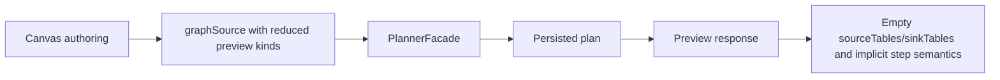
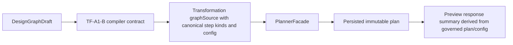

# Closeout: TF-A1-B compiler mapping freeze

## Think-First Analysis

### Problem summary

`TF-A1-A` froze the SQL-first design graph and the caller-visible preview
boundary, but the graph-to-step compiler mapping is still implicit in the live
system. The frontend emits a transformation `graphSource`, the planner accepts
it, and the preview route persists a plan, yet the ordered step kinds, the
required `stepTypeConfig` fields, and the preview summary contents are not
governed as one explicit contract line.

### Root cause

The repository already has the pieces of the vertical, but they stop one level
too early:

- the design intent is governed as `DesignGraphDraft`
- the planner ingress is governed as `GenericGraphSourceV1`
- the runtime executes Postgres transformation step kinds

What is missing is the canonical mapping between those three layers. The live
frontend still emits a reduced `graphSource` that loses source/sink binding and
SQL payload detail, while the API preview response still fills transformation
summary fields with placeholders instead of data derived from the governed
compiler output.

### Constraints and invariants

- `AGENTS.md`: inventory-first startup, doc-driven first, no hidden debt,
  no stubs, no bypassed hooks, and mandatory touched-scope validation plus
  `pnpm verify:prepush`.
- `docs/guides/ai-work-protocol.md`: this is a `Full` slice because it changes
  contracts, planner/API/Web behavior, docs, and planning posture.
- `docs/adr/ADR-0003-execution-model.md`: execution semantics remain DVT-owned;
  the compiler must map authoring intent into governed runtime steps rather
  than delegating meaning to provider-local heuristics.
- `docs/adr/ADR-0005-contract-formalization-tooling.md`: the step mapping and
  config shape must be expressed as machine-verifiable contracts.
- `docs/adr/ADR-0006-contract-tooling-governance.md`: repository-owned contract
  validation remains authoritative.
- `docs/adr/ADR-0012-plan-integrity-ownership.md`: persisted plans must carry
  immutable canonical identity and must not depend on hidden caller-local state.
- `docs/adr/ADR-0018_Shared_Kernel_Ownership_Governance.md`: the cross-package
  compiler vocabulary belongs in `@dvt/contracts`.
- `docs/planning/proposals/mandatory/runtime-and-contracts/transformation-flow-architecture-and-contracts-20260405.md`:
  v1 is fixed to `source -> sql_transform -> sink`, ordered steps
  `PREPARE_POSTGRES_TRANSFORM -> POSTGRES_SQL_TRANSFORM -> CAPTURE_MATERIALIZATION_EVIDENCE`,
  one provider per plan, and persisted preview before run start.
- `docs/planning/proposals/mandatory/runtime-and-contracts/transformation-flow-delivery-plan-20260405.md`:
  `TF-A1-B` must freeze graph-to-step mapping before `TF-C1-B` and later
  execution/UI slices rely on it.

### Options considered

1. Leave the compiler mapping implicit and keep the frontend emitting a reduced
   generic graph.
2. Teach the API preview route to recover the full graph semantics by loading
   saved Git/workspace artifacts during preview.
3. Freeze a typed SQL-first compiler contract in `@dvt/contracts`, make the
   frontend emit the canonical step kinds plus required config, and have the
   API derive preview summaries from that governed plan shape.
4. Add a brand-new planner-only transformation compiler abstraction that
   duplicates the graph mapping outside the existing `GenericGraphSourceV1`
   boundary.

### Selected option and rationale

Choose option 3.

It preserves the current public planner ingress (`graphSource`) while removing
the ambiguity inside it. The frontend already has the authoring data needed to
build the compiler-ready step configs, the planner already preserves per-node
`stepTypeConfig`, and the runtime already understands the Postgres
transformation step kinds. Freezing that mapping at the shared contract line is
smaller, safer, and more DDD-consistent than teaching the API to rehydrate
hidden authoring state or inventing a second planner ingress.

### Rejected alternatives

- Option 1 was rejected because it keeps the exact drift `TF-A1-B` exists to
  remove.
- Option 2 was rejected because preview would start depending on external file
  lookup and hidden state instead of the request contract it is supposed to
  validate and persist.
- Option 4 was rejected because it adds a second compiler story beside the
  existing planner boundary without reducing complexity for downstream
  consumers.

## Current-state and target-state diagrams

### Current state

### Target state

## Pre-Implementation Brief

- Mode: Full
- Scope:
  - publish the canonical SQL-first compiler mapping contract and step-config
    vocabulary in `packages/@dvt/contracts`
  - update planner-facing docs to include the compiler line
  - make the Canvas preview request emit the canonical step kinds and required
    config for the SQL-first profile
  - make the preview API summary path derive `sourceTables` and `sinkTables`
    from the governed transformation plan/config instead of placeholders
  - add regression tests in contracts, API, and web
  - update Lane A planning state and closeout/evidence surfaces
- Touched files or paths:
  - `packages/@dvt/contracts/src/contracts/planner/**`
  - `packages/@dvt/contracts/src/{schemas.ts,validation.ts,index.ts}`
  - `packages/@dvt/contracts/test/**`
  - `apps/web/src/app/views/canvas/previewGraphSource.ts`
  - `apps/web/src/app/views/canvas/useCanvasExecutionActions.ts`
  - `apps/web/src/app/services/plans/**`
  - `apps/api/src/entrypoints/http/planRoutes.ts`
  - `apps/api/test/entrypoints/http/planRoutes.test.ts`
  - `docs/contracts/planner/**`
  - `docs/architecture/components/planner/index.md`
  - `docs/architecture/system-delivery-status.md`
  - `docs/planning/roadmap/roadmap-by-domain.md`
  - `docs/planning/state/domain-status-board.md`
  - `docs/planning/state/agent-lane-a.yaml`
- Expected outcome:
  - the SQL-first preview path emits three governed runtime step kinds with
    deterministic dependencies and required `stepTypeConfig`
  - the persisted plan shape carries enough canonical data for runtime and
    preview summary consumers
  - preview summaries return real source/sink tables for
    `transformation-sql-first-v1`
- Risks and mitigations:
  - Risk: introduce a second local compiler story beside `graphSource`
  - Mitigation: keep `graphSource` as the single planner ingress and freeze the
    mapping inside that contract
  - Risk: over-couple runtime step config to UI-only fields
  - Mitigation: only emit fields already required by runtime, summary, or
    provenance
  - Risk: planner/runtime consumers diverge on step kind vocabulary
  - Mitigation: publish shared constants and validation in `@dvt/contracts`
- Out-of-scope items:
  - dbt phase-2 executor mode (`TF-C3`)
  - route-level plan-store internals already covered by `TF-C1`
  - runtime retry policy or cancellation semantics outside the transformation
    compiler mapping
- Validation plan:
  - `pnpm --filter @dvt/contracts build`
  - `pnpm --filter @dvt/contracts test`
  - `pnpm --filter dvt-api build`
  - `pnpm --filter dvt-api test -- test/entrypoints/http/planRoutes.test.ts`
  - `pnpm --filter @dvt/web typecheck`
  - `pnpm --filter @dvt/web test -- src/app/services/plans/plansService.test.ts src/app/views/canvas/useCanvasExecutionActions.test.tsx`
  - `pnpm docs:workboard:generate`
  - `pnpm docs:sync`
  - `pnpm docs:status:generate`
  - `GIT_BASE=origin/main GIT_HEAD=HEAD node tools/ci/arc-check.mjs`
  - `pnpm verify:prepush`
- Test coverage plan:
  - positive and negative validation for transformation compiler step configs
  - preview request parse for the canonical SQL-first graphSource
  - preview response summary extraction from a real transformation plan
  - canvas preview request serialization with canonical step kinds
  - rejection of malformed or incomplete SQL-first mapping data
- Libraries evaluated:
  - None evaluated - existing contracts/planner tooling already provides the
    correct extension seams

## Implementation Summary

- Added `TransformationFlowCompiler.v1.ts` to the shared planner contract pack
  so the first SQL-first vertical has one governed compiler mapping instead of
  route-local preview conventions.
- Froze the canonical step chain and step-config ownership around
  `PREPARE_POSTGRES_TRANSFORM -> POSTGRES_SQL_TRANSFORM ->
CAPTURE_MATERIALIZATION_EVIDENCE`, and published that vocabulary through the
  shared contract registry, schemas, validation helpers, and step registry.
- Updated the Canvas preview serializer so `web` now emits the canonical
  compiler-ready `graphSource` with real SQL payload, artifact provenance, and
  source or sink binding data instead of reduced preview-only step kinds.
- Updated the preview route so `api` validates the SQL-first request through the
  shared contract parser and derives `planSummary` from the persisted plan
  shape via `summarizeTransformationSqlFirstPlan(...)` instead of placeholder
  tables.
- Added contract, API, and web regression coverage for positive and negative
  SQL-first compiler mapping behavior.
- Published the repo-local compiler contract reader and updated planner,
  roadmap, status, and Lane A surfaces so the transformation contract freeze is
  recorded as shipped rather than as queued work.

## Validation Run

- `pnpm docs:sync` - PASS
- `pnpm docs:workboard:generate` - PASS
- `pnpm docs:status:generate` - PASS
- `pnpm docs:workboard:check` - PASS
- `pnpm docs:gov:links:changed` - PASS
- `pnpm docs:gov:locations` - PASS
- `pnpm docs:arc:evidence:check` - PASS
- `pnpm exec markdownlint-cli2 docs/contracts/planner/TransformationFlowCompiler.v1.md docs/contracts/planner/TransformationFlowPreview.v1.md docs/architecture/components/planner/index.md docs/architecture/system-delivery-status.md docs/planning/roadmap/roadmap-by-domain.md docs/planning/state/domain-status-board.md docs/planning/closeouts/index.md docs/planning/closeouts/20260414-tf-a1-b-compiler-mapping-closeout.md docs/evidence/ED-20260414-tf-a1-b-compiler-mapping-freeze.md --config .markdownlint-cli2.jsonc` - PASS
- `pnpm exec eslint --max-warnings 0 apps/api/src/entrypoints/http/planRoutes.ts apps/api/test/entrypoints/http/planRoutes.test.ts apps/web/src/app/services/plans/plansService.test.ts apps/web/src/app/views/canvas/previewGraphSource.ts apps/web/src/app/views/canvas/useCanvasExecutionActions.ts apps/web/src/app/views/canvas/useCanvasExecutionActions.test.tsx packages/@dvt/contracts/src/contracts/planner/StepKindRegistry.v1.ts packages/@dvt/contracts/src/contracts/planner/TransformationFlowPreview.v1.ts packages/@dvt/contracts/src/contracts/planner/TransformationFlowCompiler.v1.ts packages/@dvt/contracts/src/index.ts packages/@dvt/contracts/src/schemas.ts packages/@dvt/contracts/src/step-registry/StepTypeRegistry.ts packages/@dvt/contracts/src/validation.ts packages/@dvt/contracts/test/validation.test.ts` - PASS
- `pnpm --filter @dvt/contracts build` - PASS
- `pnpm --filter @dvt/contracts test -- validation.test.ts step-registry.test.ts` - PASS
- `pnpm --filter dvt-api build` - PASS
- `pnpm --filter dvt-api test -- planRoutes.test.ts` - PASS
- `pnpm --filter @dvt/web typecheck` - PASS
- `pnpm --filter @dvt/web test -- useCanvasExecutionActions.test.tsx plansService.test.ts` - PASS
- `pnpm --filter @dvt/web build` - PASS
- `GIT_BASE=origin/main GIT_HEAD=HEAD node tools/ci/arc-check.mjs` - PASS structurally, but returned `ARC-0` because the slice is still uncommitted; ARC-2 evidence and risk artifacts were added proactively because governed `@dvt/contracts` files are touched in the worktree
- `pnpm verify:prepush` - PASS, with the known repo limitation that changed-only helpers compare `origin/main...HEAD` and therefore do not see an uncommitted worktree; the direct slice validations above were run on the edited files

## Residual risk posture

The main residual is downstream adoption drift while remaining consumers and
future executor modes continue to build on the frozen SQL-first mapping. That
residual is tracked explicitly in the TF-A1-B risk entry instead of being
hidden inside the contract pack itself.
