# Closeout: TF-C3 production plugin host composition

## Think-First Analysis

### Problem summary

The earlier `TF-C3` slices were useful but incomplete:

- protected runtime admitted `runExecutionContextRef`
- the Temporal adapter exposed a fail-closed DBT seam

What the repo still lacked was the real composition root that owned:

- worker lifecycle
- artifact-backed runtime readers
- DBT runtime host wiring
- worker health/readiness/metrics

That gap made the path technically plausible but operationally incomplete.

### Current-state model after this slice

```mermaid
flowchart TD
  API["apps/api protected runtime"] --> Adapter["TemporalAdapter"]
  Adapter --> Temporal["Temporal workflow runtime"]

  Worker["apps/temporal-worker"] --> Host["TemporalWorkerHost"]
  Worker --> State["PostgresStateStoreAdapter + bridge"]
  Worker --> Ctx["ArtifactBackedRunExecutionContextReader"]
  Worker --> Bundle["ArtifactBackedDbtProjectBundleReader"]
  Worker --> Runner["DbtCliPluginRunner"]
  Worker --> Ops["/healthz /readyz /metrics"]

  Host --> DbtStep["DbtStepActivity"]
  DbtStep --> Ctx
  DbtStep --> Runner
  Runner --> Bundle
```

### Root cause closed here

The missing problem was never "how do we call DBT from a step activity". The
repo already had that seam.

The missing problem was "where does the real worker runtime get composed and
owned". This slice closes that by moving the DBT path onto:

- shared artifact readers in `@dvt/artifacts`
- a canonical standalone worker app
- an adapter-owned DBT CLI host

## Pre-Implementation Brief

- Mode: Full
- Scope:
  - `@dvt/artifacts` runtime readers
  - `apps/api` resolver convergence
  - `@dvt/adapter-temporal` DBT CLI host and registry wiring
  - `apps/temporal-worker` bootstrap, ops, lifecycle, and tests
  - operator runbook and planning truth surfaces
- Expected outcome:
  - the repo contains one truthful place where DBT runtime is composed
  - DBT stays adapter/plugin-owned rather than kernel-owned
  - worker lifecycle and plugin lifecycle are explicit and testable
- Out of scope:
  - marketplace packaging
  - full sandbox implementation
  - environment rollout/canary proof outside the repo

## Implementation Summary

- Added `ArtifactBackedRunExecutionContextReader` and
  `ArtifactBackedDbtProjectBundleReader` to `@dvt/artifacts`, with governed
  `file://` and `s3://` handling.
- Hardened `pluginContexts.dbt.projectBundleRef` from a mutable URI string into
  a content-addressed bundle ref carrying `kind` and `sha256`, and verified the
  bundle bytes before DBT execution.
- Removed read-scoped S3 client construction from artifact runtime reads so the
  DBT/runtime hot path no longer creates a fresh SDK client per artifact fetch.
- Reduced `apps/api` to a thin wrapper that maps shared artifact-reader errors
  onto the existing `RunExecutionContextRejectedError` boundary.
- Added `DbtCliPluginRunner` in `@dvt/adapter-temporal` so DBT execution now
  materializes bundle bytes, maps DBT step kinds to CLI subcommands, runs the
  configured DBT binary, and returns governed `StepResult` values.
- Hardened activity composition so DBT handlers are always rebuilt from real
  runtime deps instead of silently reusing dep-less entries from the default
  registry.
- Created `apps/temporal-worker` as the canonical worker composition root with
  validated env loading, Temporal connection lifecycle, Postgres state-store
  wiring, dedicated runtime monitor, clean shutdown, and operational endpoints.
- Added a canonical runbook for the new worker topology.

## Validation Run

- `pnpm install`
- `pnpm --filter @dvt/artifacts build`
- `pnpm --filter @dvt/artifacts test`
- `pnpm --filter @dvt/adapter-temporal build`
- `pnpm --filter @dvt/adapter-temporal test`
- `pnpm --filter @dvt/adapter-temporal exec vitest run test/DbtCliPluginRunner.test.ts test/activities.test.ts`
- `pnpm --filter dvt-temporal-worker typecheck`
- `pnpm --filter dvt-temporal-worker build`
- `pnpm --filter dvt-temporal-worker test`
- `pnpm --filter dvt-api typecheck`
- `pnpm --filter dvt-api exec vitest run --config vitest.config.ts test/infrastructure/startRun/ArtifactBackedRunExecutionContextResolver.test.ts test/modules.test.ts`
- `pnpm --filter dvt-api test`
- `pnpm exec eslint --max-warnings 0 apps/api/src/infrastructure/startRun/ArtifactBackedRunExecutionContextResolver.ts packages/@dvt/artifacts/src/**/*.ts packages/@dvt/artifacts/test/runExecutionContextReaders.test.ts packages/@dvt/adapter-temporal/src/**/*.ts packages/@dvt/adapter-temporal/test/activities.test.ts packages/@dvt/adapter-temporal/test/DbtCliPluginRunner.test.ts apps/temporal-worker/src/**/*.ts apps/temporal-worker/test/**/*.ts`
- `$env:GIT_BASE='origin/main'; $env:GIT_HEAD='HEAD'; node tools/ci/arc-check.mjs`

## Residuals

- `TF-C3` remains open because rollout acceptance and environment-level canary
  evidence still sit outside this implementation slice.
- DBT still runs as a local CLI process behind the worker host in v1; sandbox
  hardening remains a follow-on.
- The code topology is now real and in-repo; the remaining gap is operational
  proof, not missing composition.
