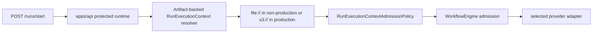

# Closeout: TF-C3 run-execution-context resolver slice

## Think-First Analysis

### Problem summary

`TF-C3` is the phase-2 transformation task that adds dbt behind the same
`preview -> persist -> run` contract already closed for the SQL-first
PostgreSQL path, but without promoting dbt semantics into the engine kernel.

The first hard blocker is not UI or planner selection. It is protected-runtime
composition. The codebase already ships:

- the governed `runExecutionContextRef` boundary in `@dvt/contracts`,
- engine admission checks through
  `RunExecutionContextAdmissionPolicy`, and
- an artifacts-owned read-side seam via `IRunExecutionContextReader`.

But `apps/api` still builds the protected runtime without a concrete
`runExecutionContextResolver`, so any real `runExecutionContextRef` is rejected
before adapter dispatch.

### Current-state diagram

### Target slice for this change

### Root cause

The April 3 boundary slice intentionally stopped at contract, parser, and
engine-admission hardening. Its accepted evidence and open risk entry both left
the same follow-up behind: wire a production resolver in composition roots.

That omission was acceptable while `runExecutionContextRef` existed only as a
governed boundary seam. It becomes a real blocker for `TF-C3`, because a
plugin-backed dbt path needs immutable run-scoped artifact references without
opening a second product loop or bypassing the existing start-run boundary.

### Constraints and invariants

- `AGENTS.md`: inventory-first, repo truth over convenience, no hidden debt,
  no fake completeness, and full validation evidence before closeout.
- `docs/guides/ai-work-protocol.md`: this slice needs design clarification
  first, so rationale and diagrams must exist before implementation.
- `docs/planning/proposals/mandatory/runtime-and-contracts/transformation-flow-delivery-plan-20260405.md`:
  phase 6 must keep dbt behind the same outer `design -> plan -> run -> result`
  contract.
- `docs/planning/proposals/mandatory/runtime-and-contracts/transformation-flow-product-decisions-20260405.md`:
  phase 2 adds dbt behind the same outer loop, not as a second product path.
- `docs/planning/execution-model/dvt-execution-model.md` and
  `docs/architecture/components/engine/contracts/extensions/PluginSandbox.v1.md`:
  extension or plugin runtime behavior must stay outside kernel authority and
  behind an explicit capability or isolation boundary.
- `docs/evidence/ED-20260403-s08-5-b-run-execution-context-boundary.md` and
  `docs/risk-register/quality/R-20260403-RUN-EXECUTION-CONTEXT-BOUNDARY.yaml`:
  the open follow-up is explicit composition-root resolver wiring behind the
  artifacts-owned seam.
- Keep this slice inside `apps/api` composition and infrastructure. Do not
  reopen `@dvt/contracts`, `@dvt/engine`, or Temporal runtime design unless the
  existing seam proves insufficient.

### Selected option and rationale

Implement an artifact-backed resolver in `apps/api` and wire it into the
protected runtime.

The resolver should reuse the same operational discipline already accepted for
manifest artifacts:

- `file://` allowed only outside production,
- `s3://` supported for production-grade artifact resolution,
- immutable byte verification through `sha256`, and
- contract parsing through the canonical `parseRunExecutionContext(...)`
  helper.

This closes the real blocker for `TF-C3` without pretending that dbt execution
itself is already done. Runtime consumption of the resolved plugin context and
plugin-backed dbt dispatch remain explicit follow-up work after this slice.

## Pre-Implementation Brief

- Mode: Narrow implementation slice
- Scope:
  - `docs/planning/closeouts/20260414-tf-c3-run-execution-context-resolver-closeout.md`
  - `docs/planning/state/agent-lane-c.yaml`
  - `apps/api/src/modules/buildProtectedRuntimeModule.ts`
  - new `apps/api` runtime resolver and tests
- Expected outcome:
  - protected runtime composes a concrete `runExecutionContextResolver`
  - immutable run execution context artifacts can be resolved from governed
    locators
  - `TF-C3` moves from queued planning to real in-progress execution
- Risks and mitigations:
  - Risk: introduce a second artifact-resolution policy that drifts from the
    existing manifest path
  - Mitigation: mirror the same `file://`/`s3://` and `sha256` rules already
    accepted for manifest artifacts
  - Risk: overclaim dbt-mode readiness
  - Mitigation: keep provider-runtime or plugin-runtime consumption of resolved
    dbt context explicitly out of scope for this slice
  - Risk: let planning language imply dbt belongs in engine kernel semantics
  - Mitigation: reword active planning surfaces to say plugin-backed dbt path,
    not kernel-integrated dbt executor
- Out of scope:
  - dbt preview-profile expansion
  - passing resolved dbt plugin context into a plugin host or Temporal activity
    path
  - new executor-selection behavior on read surfaces

## Implementation Summary

- Added
  `apps/api/src/infrastructure/startRun/ArtifactBackedRunExecutionContextResolver.ts`
  as the concrete protected-runtime resolver for immutable run execution
  context artifacts.
- Reused the same artifact policy already accepted for manifest resolution:
  `file://` only outside production, `s3://` in production paths, `sha256`
  integrity verification, and canonical contract parsing before the engine sees
  the payload.
- Wired that resolver into
  `apps/api/src/modules/buildProtectedRuntimeModule.ts` so protected start-run
  admission no longer fails purely because composition omitted the resolver.
- Added targeted coverage for resolver behavior and a regression guard on the
  protected-runtime composition path.
- Moved `TF-C3` and `TF-C3-A` from `queued` to `in_progress` in Lane C and
  updated the open risk entry so planning no longer points at a follow-up that
  is already implemented.
- Clarified the planning posture so dbt remains a plugin-backed execution path
  or adapter-owned runtime mode, not a new semantic responsibility of the
  engine kernel.

## Validation Run

- `pnpm exec eslint --max-warnings 0 apps/api/src/infrastructure/startRun/ArtifactBackedRunExecutionContextResolver.ts apps/api/src/modules/buildProtectedRuntimeModule.ts apps/api/test/infrastructure/startRun/ArtifactBackedRunExecutionContextResolver.test.ts apps/api/test/modules.test.ts`
- `pnpm --filter dvt-api typecheck`
- `pnpm --filter dvt-api exec vitest run --config vitest.config.ts test/infrastructure/startRun/ArtifactBackedRunExecutionContextResolver.test.ts test/modules.test.ts`
- `pnpm docs:status:generate`
- `pnpm docs:workboard:generate`
- `pnpm docs:sync`
- `pnpm docs:gov:links:changed`
- `pnpm verify:prepush`

## Residuals

- `TF-C3` remains open. This slice only closes the composition-root admission
  prerequisite.
- Protected runtime still does not project the resolved dbt plugin context into
  a plugin host, Temporal, or any other provider execution path.
- Preview-profile and caller-visible executor-selection expansion for dbt stay
  sequenced after this slice.
