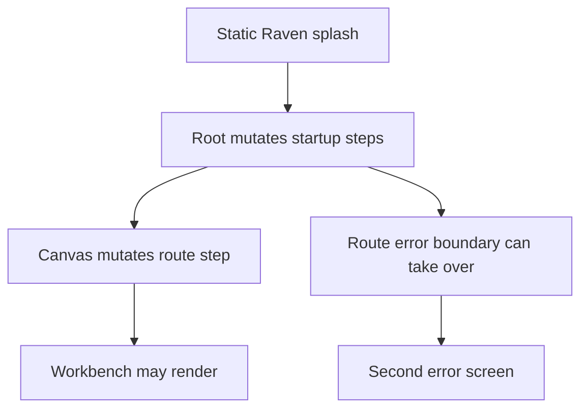
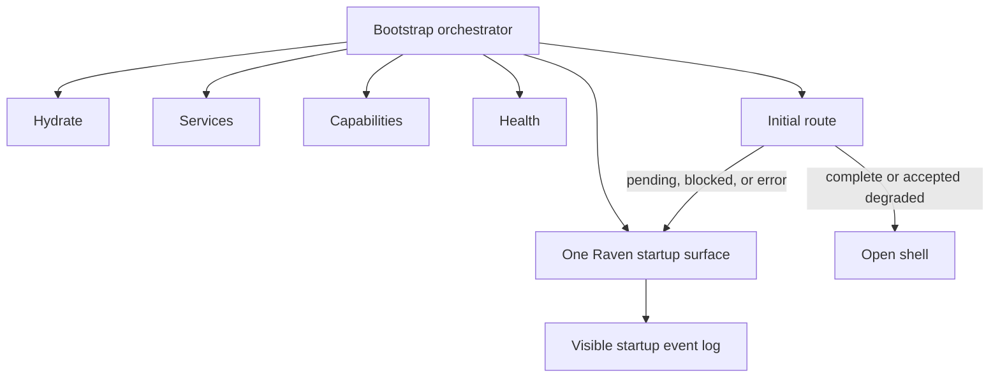

# Closeout: Unified Raven startup bootstrap

## Think-First Analysis

### Problem summary

The web shell startup is currently fragmented across multiple surfaces:

1. the static Raven splash in `index.html`;
2. route-owned loading and blocked states inside `Root` and `Canvas`;
3. a separate route error boundary when startup faults occur.

That produces exactly the operator-hostile behavior reported in this slice:

- multiple loading or error screens for one startup;
- raw startup errors while providers, capabilities, and health queries are still settling;
- readiness failures that can still reveal a route workbench behind a degraded or blocked backend;
- no trustworthy startup log for a product that is supposed to observe itself.

### Root cause

Startup ownership is distributed instead of orchestrated.

The current bootstrap seam only models `pending`, `complete`, and `error`, and it is driven by
different layers with no shared definition of:

- which steps are critical;
- which failures are degraded but acceptable;
- which states must block first-route handoff;
- when the Raven surface should remain visible versus when the shell may open.

As a result, `index.html`, `Root`, `Canvas`, and `AppRouteErrorBoundary` can all speak for startup
at different times without one governing state machine.

### Constraints and invariants

- `AGENTS.md`: inventory-first startup, doc-driven behavior changes, no hidden debt, no fake
  success paths, and full validation with `pnpm verify:prepush`.
- `docs/guides/ai-work-protocol.md`: think-first and pre-implementation material must exist before
  code edits; planning-affecting tasks must update canonical planning surfaces.
- `docs/planning/state/planning-control-tower.md`: active Lane E work must update the lane registry
  and regenerate planning-derived views.
- `docs/planning/state/lane-e-shell-baseline-target-guide.md`: shell evolution must stay explicit
  about current state, target state, rationale, and diagrams.
- `docs/architecture/components/web/workbench-ui-contract-and-component-inventory.md`: the shell
  stays persistent, stateful, and explicit about `loading`, `empty`, `error`, `degraded`, and
  `read-only` states.
- `docs/architecture/components/web/screen-layout-and-cross-surface-behavior-rules.md`: shell
  health belongs to the shell, route-local blocked states must not pretend the route is operable,
  and no route should overload the operator with mixed ownership.
- `docs/architecture/components/web/frontend-runtime-modes-user-manual.md`: in `api` mode, route
  behavior must follow backend-backed runtime truth and distinguish `degraded` from `offline` and
  `blocked`.

### Options considered

1. Keep the current Raven splash and just improve the wording.
   Rejected: copy alone cannot fix distributed startup ownership or route handoff bugs.

2. Remove the Raven splash quickly and rely only on route-level loading states.
   Rejected: that hides startup sequencing and produces a jarring shell-first experience while core
   providers and health state are still settling.

3. Introduce one bootstrap orchestrator that owns startup steps, terminal policies, and the event
   log while routes report their initial operability into that seam.
   Selected: this preserves the Raven screen, makes startup observable, and prevents misleading
   route reveal.

### Selected option and rationale

Promote the existing Raven bootstrap screen into a real startup orchestrator.

The orchestrator should:

1. keep one Raven surface on screen from first paint until the initial route is truly operable;
2. expose ordered startup steps `hydrate -> services -> capabilities -> health -> route`;
3. record a visible startup event log with the latest outcome per step;
4. distinguish `degraded` from `blocked` and `error`;
5. let route ownership decide whether the initial route may open, while preventing stacked fallback
   screens.

Current problematic ownership:

Target ownership:

## Pre-Implementation Brief

- Mode: Slim
- Scope:
  - `docs/planning/state/lane-e-shell-baseline-target-guide.md`
  - `docs/planning/state/agent-lane-e.yaml`
  - `docs/planning/closeouts/20260414-unified-raven-startup-bootstrap-closeout.md`
  - `apps/web/index.html`
  - `apps/web/src/app/bootstrap/appBootstrapScreen.ts`
  - `apps/web/src/app/AppProviders.tsx`
  - `apps/web/src/app/Root.tsx`
  - `apps/web/src/app/views/Canvas.tsx`
  - `apps/web/src/app/AppRouteErrorBoundary.tsx`
  - startup-related tests under `apps/web/src/app/**`
- Expected outcome:
  - one Raven startup surface remains visible until critical startup settles;
  - the startup screen shows ordered module progress and a visible event log;
  - route blocked states do not reveal misleading workbench content;
  - degraded startup remains truthful without degenerating into raw error surfaces.
- Risks and mitigations:
  - Risk: repeated React effects can spam the startup log.
    Mitigation: dedupe bootstrap events in the orchestrator and update only on real step changes.
  - Risk: route tests currently assume `complete` is enough to dismiss startup.
    Mitigation: rewrite tests around the new `degraded/blocked/error` policy and explicit route
    operability.
  - Risk: provider readiness may still be implicit.
    Mitigation: make app-level services an explicit startup step instead of assuming hydration means
    services are ready.
- Out of scope:
  - redesigning route-local workbench states outside first-load handoff;
  - changing backend health endpoint semantics;
  - adding a separate diagnostics route for startup history.
- Validation plan:
  - targeted ESLint on changed startup files
  - targeted Vitest for bootstrap, root, and canvas startup behavior
  - `pnpm docs:sync`
  - `pnpm docs:workboard:generate`
  - `pnpm --filter @dvt/web typecheck`
  - `pnpm --filter @dvt/web test`
  - `pnpm verify:prepush`
- Test coverage plan:
  - startup remains visible while a critical step is still pending
  - degraded startup steps log correctly without dismissing blocked routes
  - blocked canvas startup does not reveal the board
  - route errors update the Raven screen instead of stacking a second startup error screen
  - app services mark the new `services` step complete only when the provider layer mounts
- Libraries evaluated:
  - None evaluated. The slice is a policy rewrite of existing startup primitives, not a new
    third-party integration.

## Implementation Summary

- Promoted `apps/web/src/app/bootstrap/appBootstrapScreen.ts` from a three-state checklist into the
  startup orchestrator for `hydrate`, `services`, `capabilities`, `health`, and `route`.
- Extended startup semantics from `pending|complete|error` to
  `pending|complete|degraded|blocked|error`, added aggregate screen-state handling, and added a
  visible startup event log rendered under the Raven image.
- Updated `apps/web/index.html` so the original Raven startup screen now includes the new
  `services` step plus a persistent startup log area and styles for degraded and blocked outcomes.
- Updated `apps/web/src/app/AppProviders.tsx` to mark app-service composition as its own startup
  step when the provider and query client mount.
- Updated `apps/web/src/app/Root.tsx` so startup health and capabilities now degrade truthfully
  instead of hard-erroring, and so `Canvas` route ownership is handed off explicitly instead of
  dismissing startup early.
- Updated `apps/web/src/app/views/Canvas.tsx` so API-mode readiness failures report `blocked`
  startup and keep the Raven surface active instead of revealing a misleading board.
- Updated startup tests in `AppProviders.test.tsx`, `appBootstrapScreen.test.ts`,
  `Canvas.test.tsx`, and kept `Root.test.tsx`/`routes.test.tsx` as integration guards for the shell
  and route fallback seams.

## Validation Run

- `pnpm docs:workboard:generate` - PASS
- `pnpm docs:sync` - PASS
- `pnpm exec eslint apps/web/src/app/AppProviders.tsx apps/web/src/app/AppProviders.test.tsx apps/web/src/app/Root.tsx apps/web/src/app/bootstrap/appBootstrapScreen.ts apps/web/src/app/bootstrap/appBootstrapScreen.test.ts apps/web/src/app/views/Canvas.tsx apps/web/src/app/views/Canvas.test.tsx --max-warnings 0` - PASS
- `pnpm --filter @dvt/web exec vitest run --config vitest.config.ts src/app/bootstrap/appBootstrapScreen.test.ts src/app/AppProviders.test.tsx src/app/Root.test.tsx src/app/views/Canvas.test.tsx src/app/routes.test.tsx` - PASS
- `pnpm --filter @dvt/web typecheck` - PASS
- `pnpm --filter @dvt/web test` - PASS
- `pnpm dev:app:test` - PASS
- `pnpm verify:prepush` - PASS

## Residuals

- The startup log is currently session-local to the Raven bootstrap surface. It is not yet persisted
  or replayed in a later diagnostics surface.
- This slice keeps route-level workbench loading states after bootstrap handoff; it only governs the
  first-load shell reveal and startup truthfulness.
