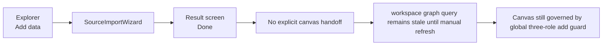
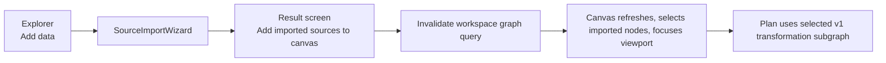

# Closeout: TF-E1 selection-scoped authoring MVP

## Think-First Analysis

### Problem summary

The current `Canvas` flow exposes `Add data`, but imported sources do not flow
back into a deliberate authoring experience. At the same time, the UI still
applies a global three-role authoring restriction even though the v1 preview
contract only needs one valid selected transformation subgraph.

### Root cause

Two different concerns were coupled too early:

- authoring surface rules for the whole `Canvas`
- v1 preview and run rules for `transformation-sql-first-v1`

That coupling shows up in three places:

- `SourceImportWizard` completes registration without a canvas-owned post-import
  handoff;
- the graph snapshot query is the real source of truth, but the import flow does
  not invalidate or refocus the route after registration;
- `transformationAuthoringGuard` blocks node addition at the whole-canvas level
  even though `validateTransformationGraph` already supports selection-scoped
  planning.

### Constraints and invariants

- `AGENTS.md`: inventory-first startup, no hidden debt, no fake completion,
  mandatory closeout.
- `docs/guides/ai-work-protocol.md`: write think-first and implementation brief
  before code; finish with package validation plus `pnpm verify:prepush`.
- `docs/planning/state/planning-control-tower.md`: Lane E planning posture must
  stay aligned with the implementation change.
- `docs/architecture/components/web/workbench-ui-contract-and-component-inventory.md`:
  `Canvas` is the authoring workbench, the explorer is the add-entry surface,
  and route-local commands stay in the route toolbar.
- `docs/architecture/components/web/screen-layout-and-cross-surface-behavior-rules.md`:
  `Canvas` stays graph-first; review and execution contracts must not overload
  the entire route.
- `docs/planning/proposals/mandatory/runtime-and-contracts/transformation-flow-architecture-and-contracts-20260405.md`:
  the persisted v1 preview contract remains the governed `source ->
sql_transform -> sink` subgraph. This slice must not silently widen the
  planner contract.

### Current-state diagram

### Options considered

- Keep the whole-canvas three-role guard and only refresh after import.
  - Rejected because it still treats authoring as globally constrained instead
    of keeping the restriction where it belongs: the v1 preview subgraph.
- Remove all planning constraints and make preview accept arbitrary graphs.
  - Rejected because that would break the governed `transformation-sql-first-v1`
    contract and widen the planner boundary without doc or contract work.
- Broaden authoring while keeping preview selection-scoped to the v1 contract.
  - Accepted because it decouples authoring from execution correctly and fits
    the current planner and runtime boundary.

### Selected option and rationale

Implement an MVP that keeps the v1 plan contract unchanged but removes the
whole-canvas authoring restriction and makes `Import source` a real `Canvas`
handoff:

- imported sources update the graph source of truth;
- the graph query is invalidated and refetched;
- newly imported nodes become selected and the viewport focuses them;
- `Plan` remains governed by the selected valid three-node subgraph.

### Target-state diagram

## Pre-Implementation Brief

- Mode: Slim
- Scope:
  - `apps/web/src/app/ports/workspace.ts`
  - `apps/web/src/app/services/workspace/workspaceService.mock.ts`
  - `apps/web/src/app/services/workspace/workspaceService.test.ts`
  - `apps/web/src/app/components/SourceImportWizard.tsx`
  - `apps/web/src/app/components/SourceImportWizard.test.tsx`
  - `apps/web/src/app/views/canvas/CanvasShell.tsx`
  - `apps/web/src/app/views/canvas/CanvasShell.test.tsx`
  - `apps/web/src/app/views/canvas/CanvasViewport.tsx`
  - `apps/web/src/app/views/canvas/CanvasViewport.test.tsx`
  - `apps/web/src/app/views/canvas/canvasShell.types.ts`
  - `apps/web/src/app/views/canvas/useCanvasController.ts`
  - `apps/web/src/app/views/canvas/useCanvasController.test.*`
  - `apps/web/src/app/views/Canvas.test.tsx`
- Expected outcome:
  - source import completes with a canvas-owned handoff
  - newly imported source node ids are available to the route
  - the graph snapshot refreshes automatically after import
  - imported nodes are selected and focused in the viewport
  - the whole-canvas three-role add restriction no longer blocks authoring
  - preview and run still depend on a valid selected v1 subgraph
- Risks and mitigations:
  - Risk: stale query state leaves the canvas unchanged after import
  - Mitigation: invalidate the exact workspace graph query key from the route
  - Risk: viewport jumps on every selection change
  - Mitigation: use an explicit one-shot import-focus signal rather than generic
    selection-driven focusing
  - Risk: doc drift with the v1 transformation contract
  - Mitigation: keep preview validation and planner contract selection-scoped,
    not widened
- Out of scope:
  - generic `Project nodes` picker
  - backend API support for source import in `api` mode
  - widening the planner contract beyond `transformation-sql-first-v1`
- Validation plan:
  - `pnpm exec eslint ... --max-warnings 0` on touched web files
  - `pnpm --filter @dvt/web typecheck`
  - `pnpm --filter @dvt/web test`
  - `pnpm --filter @dvt/web build`
  - `pnpm docs:sync`
  - `pnpm verify:prepush`
- Test coverage plan:
  - import result includes imported node ids
  - wizard completion triggers canvas callback
  - controller invalidates the graph query and stores a focus request
  - viewport focuses imported nodes only for explicit import-focus events
  - selection-scoped planning remains valid while wider canvas authoring exists
- Libraries evaluated:
  - None evaluated -- existing React Query, React Flow, and workspace adapters
    already cover the required seams

## Implementation Summary

- `ImportSourcesResult` now carries `importedNodeIds`, and the mock workspace
  adapter returns those ids from `importSources`.
- `SourceImportWizard` now ends with `Add imported sources to canvas` when the
  import produced source nodes that can be focused on the route.
- `CanvasShell`, `CanvasViewport`, and `useCanvasController` now own the
  post-import handoff:
  - invalidate the workspace graph query
  - clear the current plan
  - select imported node ids
  - open the inspector when it is hidden
  - fit the viewport to the imported nodes exactly once
- `transformationAuthoringGuard` no longer constrains the whole canvas to three
  roles; broader authoring remains allowed.
- `validateTransformationGraph` and `useCanvasExecutionActions` remain the v1
  contract boundary and are now covered explicitly for selection-scoped planning
  inside a larger graph.
- Route and shell tests were updated so the governed top bar, connection
  indicator, import handoff, and selection-scoped preview contract all reflect
  the current implementation.
