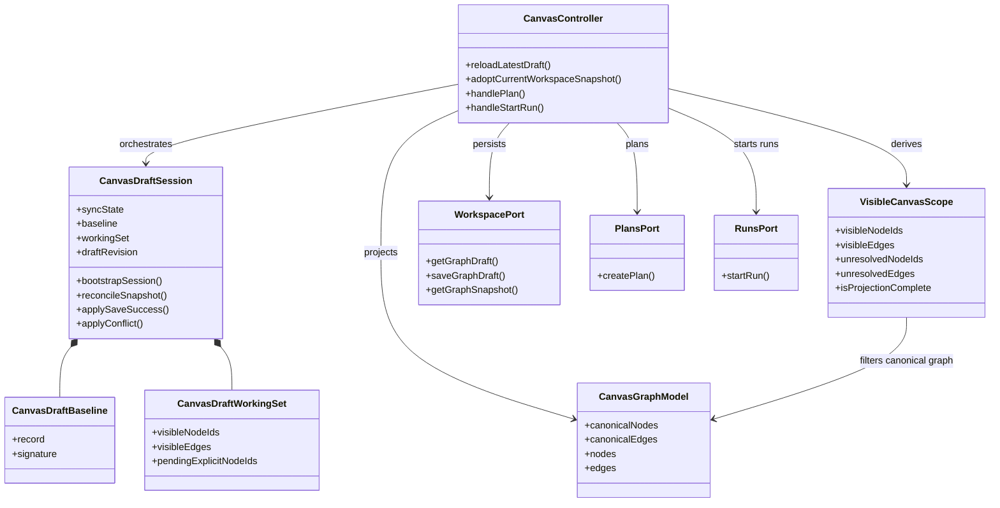
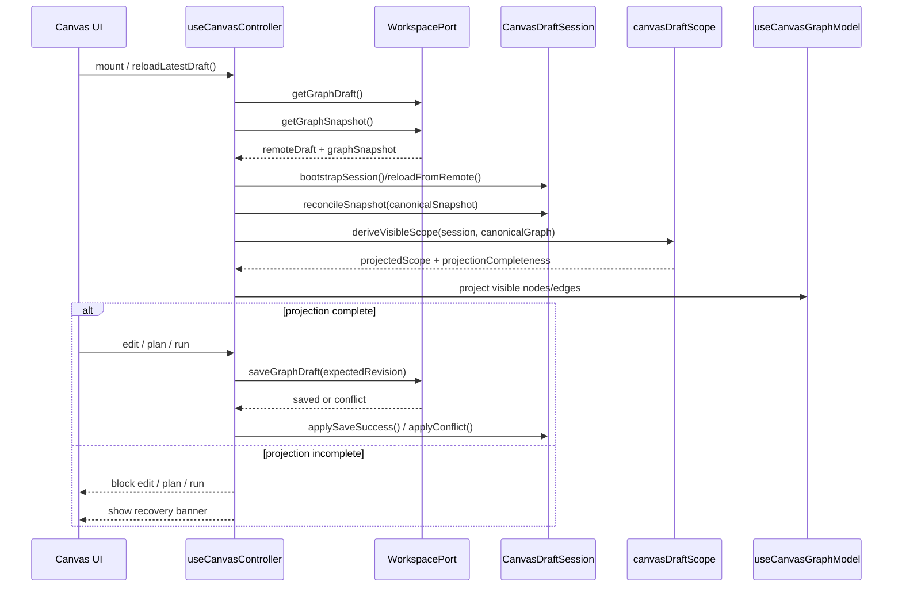

# TF-E2 Canvas draft aggregate alignment closeout

## Phase 1. Think-First Analysis

### Problem summary

The Canvas draft-persistence slice has converged on compare-and-swap, explicit
conflict handling, and a working-set model, but the runtime still behaves too
much like a transaction script centered on `useCanvasController.ts`.

That leaves one architectural defect open:

- the controller still decides when a remote draft is safe to project, edit,
  validate, and re-save
- the draft session still collapses authoritative remote draft content into the
  currently available workspace snapshot too early
- React Flow and the canonical graph snapshot can still become de facto
  authorities over the persisted draft during bootstrap or reload

In Fowler terms, the route still has too much domain policy in the application
service and not enough in an explicit domain model plus projection seam.

### Root cause

The current slice has the right concepts but the wrong ownership split.

1. `useCanvasController.ts` still mixes:
   - application orchestration
   - remote draft lifecycle policy
   - save eligibility rules
   - degraded recovery decisions
2. `canvasDraftSession.ts` still treats the current workspace snapshot as if it
   were always a complete basis for the remote draft, so bootstrap/reload can
   prune draft members that the canonical snapshot has not materialized yet.
3. `useCanvasGraphModel.ts` is correctly a projection, but the surrounding
   runtime still lets that projection influence persistence too early.

The result is an unsafe projection-first bias. Mature systems do the opposite:
they keep the persisted baseline authoritative, treat UI graphs as projections,
and refuse writes when the projection is incomplete.

### Constraints and invariants

Governing ADR and contract constraints:

- `ADR-0003`:
  DVT owns authoritative lifecycle semantics; the UI must not become the source
  of truth for execution or persisted draft behavior.
- `ADR-0004`:
  authoritative state and read projections must stay separated; a projection may
  lag, but it must not silently overwrite the source of truth.
- `ADR-0034`:
  bounded-context communication stays explicit; Canvas may orchestrate the
  workspace boundary, but it should not absorb persistence policy implicitly in
  view code.

Slice-level constraints from canonical planning material:

- `TF-A2` defines reject-on-stale CAS semantics, not silent merge.
- `TF-E2` requires React Flow to remain a projection, not the source of truth.
- degraded or incompatible persistence states must fail closed with explicit UX,
  not optimistic fake success.

### Options considered

#### Option A. Keep the controller-centered design and add more guards

Add extra booleans in `useCanvasController.ts` for bootstrap/reload races,
stale-projection suppression, and save gating.

Pros:

- smallest short-term diff

Cons:

- continues the transaction-script drift
- keeps domain policy scattered through effects and callbacks
- makes future node/edge/property authoring harder to reason about

#### Option B. Full state-machine rewrite around XState or an equivalent library

Replace the draft flow with an explicit external state machine runtime.

Pros:

- explicit transitions
- strong modeling of async recovery paths

Cons:

- larger dependency and migration cost
- too large for the active TF-E2 slice
- solves orchestration shape before stabilizing the aggregate semantics

#### Option C. Fowler-style refinement with an explicit draft aggregate seam

Keep React Query and the existing controller facade, but move the key draft
rules into pure domain modules:

- `canvasDraftSession.ts` owns authoritative working-set transitions
- `canvasDraftScope.ts` owns projection and execution scope derivation
- `useCanvasController.ts` becomes an application service that orchestrates
  queries, persistence commands, and UI state

Pros:

- aligns with Fowler's Application Service + Domain Model split
- matches mature systems that preserve server baseline authority and treat UI as
  projection
- fits the existing codebase without a framework rewrite

Cons:

- does not remove all controller weight in one pass
- still relies on disciplined hook composition rather than a dedicated runtime
  state-machine library

### Selected option and rationale

Option C.

It is the smallest move that materially improves the architecture. The
controller remains the application service, but the authoritative draft
lifecycle becomes explicit and pure. The implementation target is:

- preserve authoritative remote draft members even when the current workspace
  snapshot is temporarily incomplete
- derive projection completeness explicitly instead of assuming it
- block write paths, `Plan`, and `Run` when the projection cannot represent the
  full authoritative draft safely
- keep React Flow and execution validation operating only on the projected scope

This is how mature systems usually behave:

- persisted baseline stays authoritative
- local graph/UI state is a projection
- incomplete projections fail closed instead of silently reconciling away data

### Rejected alternatives

- hidden optimistic merge of missing graph members into local save payloads:
  rejected because it weakens CAS and hides inconsistency
- automatic deletion of draft members absent from the current snapshot:
  rejected because snapshot lag and graph refresh races are real; automatic
  pruning turns transient lag into durable data loss
- introducing a new frontend-local persistence contract:
  rejected because `TF-A2` and `TF-E2` explicitly disallow it

## Phase 2. Pre-Implementation Brief

- Mode: `Full`
- Scope:
  - refine Canvas draft lifecycle ownership
  - add explicit projection-gap modeling
  - block mutation/plan/run when the current projection is incomplete
  - document the target architecture with DDD class and sequence diagrams
- Touched paths:
  - `apps/web/src/app/views/canvas/useCanvasController.ts`
  - `apps/web/src/app/views/canvas/canvasDraftSession.ts`
  - `apps/web/src/app/views/canvas/canvasDraftScope.ts`
  - `apps/web/src/app/views/Canvas.tsx`
  - focused tests under `apps/web/src/app/views/canvas/**`
  - this closeout and lane-E planning state
- Expected outcome:
  - controller acts as application service only
  - authoritative draft content is not pruned by a lagging snapshot
  - autosave and execution paths fail closed on incomplete projection
  - the architecture is documented in one governed slice with diagrams
- Risks and mitigations:
  - risk: blocking too much of the UI during projection lag
    mitigation: scope the block to edit/plan/run and keep read inspection
  - risk: regression in import/drop behavior
    mitigation: keep working-set mutation pure and add regression tests
  - risk: duplicated concepts between session and scope modules
    mitigation: keep aggregate state in session and projection state in scope
- Out of scope:
  - Inspector property editing
  - backend contract changes
  - replacing React Query or React Flow
- Validation plan:
  - `pnpm --filter @dvt/web typecheck`
  - focused `eslint` on touched Canvas files
  - focused Canvas unit/integration tests
  - `pnpm docs:sync`
  - `pnpm docs:workboard:generate`
  - `pnpm verify:prepush`
- Test coverage plan:
  - pure tests for preserved remote members during bootstrap/reconcile
  - pure tests for projection-gap detection
  - controller tests proving save suppression and blocked plan/run under
    incomplete projection
  - controller tests proving remote draft recovery stays authoritative once the
    snapshot catches up
- Libraries evaluated:
  - `XState`: not adopted; too large for this slice
  - `TanStack Query`: retained as the server-state orchestration layer

## Phase 3. Normative Baseline Verification

Verified against the governing baseline:

- `ADR-0003`: the runtime keeps authoritative lifecycle/persistence decisions
  outside React Flow and route-local view state
- `ADR-0004`: the implementation preserves the distinction between authoritative
  draft state and projected graph state
- `ADR-0034`: the controller remains an application seam over the workspace
  boundary instead of inventing a new persistence boundary
- `TF-A2`: CAS/reject-on-stale posture remains intact
- `TF-E2`: React Flow stays a projection, and degraded persistence states stay
  explicit

## Architecture Review

### Fowler-oriented assessment

Current Canvas shape is better than the earlier monolith, but the central hook
still behaves like an oversized application service. That is acceptable only if
domain rules continue moving out of it.

The right split for this slice is:

- application service:
  `useCanvasController.ts`
- aggregate-like domain model:
  `canvasDraftSession.ts`
- read/projection model:
  `canvasDraftScope.ts` + `useCanvasGraphModel.ts`
- infrastructure ports:
  `workspaceService`, `plansService`, `runsService`

That is the closest Fowler-aligned structure already compatible with the
existing repo.

### Alignment target with mature systems

The mature-system invariant for this slice is:

1. remote persisted draft is authoritative
2. workspace graph snapshot is a dependent read model
3. React Flow state is a UI projection
4. write paths are disabled when the UI cannot represent the authoritative
   draft without loss

That is the architectural adjustment implemented in this slice.

### DDD Class Diagram

### Sequence Diagram

## Implementation Summary

- `apps/web/src/app/views/canvas/canvasDraftSession.ts`
  - stopped pruning authoritative remote draft members during bootstrap or
    snapshot reconciliation
  - kept the working set authoritative and let projection decide what the
    current workspace snapshot can render safely
- `apps/web/src/app/views/canvas/canvasDraftScope.ts`
  - added explicit projection-gap modeling through
    `unresolvedNodeIds`, `unresolvedEdges`, and `isProjectionComplete`
  - kept execution scope derived from the projected visible subset only
- `apps/web/src/app/views/canvas/useCanvasController.ts`
  - now treats incomplete projection as a blocked recovery posture alongside
    `conflict` and `missing_remote`
  - pauses edit, autosave, `Plan`, and `Run` until the workspace snapshot can
    represent the full authoritative draft again
- `apps/web/src/app/views/Canvas.tsx` and `apps/web/src/app/views/canvas/copy.ts`
  - added explicit route UX for projection-gap recovery with `Reload latest
draft` and `Adopt current workspace snapshot`
- regression coverage
  - `apps/web/src/app/views/canvas/canvasDraftSession.test.ts`
  - `apps/web/src/app/views/canvas/canvasDraftScope.test.ts`
  - `apps/web/src/app/views/canvas/useCanvasController.core.test.tsx`
  - `apps/web/src/app/views/Canvas.test.tsx`

## Validation

- `pnpm --filter @dvt/web typecheck` passed
- `pnpm exec eslint apps/web/src/app/views/canvas/canvasDraftSession.ts apps/web/src/app/views/canvas/canvasDraftScope.ts apps/web/src/app/views/canvas/canvasDraftSession.test.ts apps/web/src/app/views/canvas/canvasDraftScope.test.ts apps/web/src/app/views/canvas/useCanvasController.ts apps/web/src/app/views/canvas/useCanvasController.core.test.tsx apps/web/src/app/views/Canvas.tsx apps/web/src/app/views/Canvas.test.tsx apps/web/src/app/views/canvas/copy.ts --max-warnings 0` passed
- `pnpm --filter @dvt/web test -- src/app/views/canvas/canvasDraftSession.test.ts src/app/views/canvas/canvasDraftScope.test.ts src/app/views/canvas/useCanvasController.core.test.tsx src/app/views/Canvas.test.tsx` passed
- `pnpm docs:sync` passed
- `pnpm docs:workboard:generate` passed
- `pnpm verify:prepush` passed
