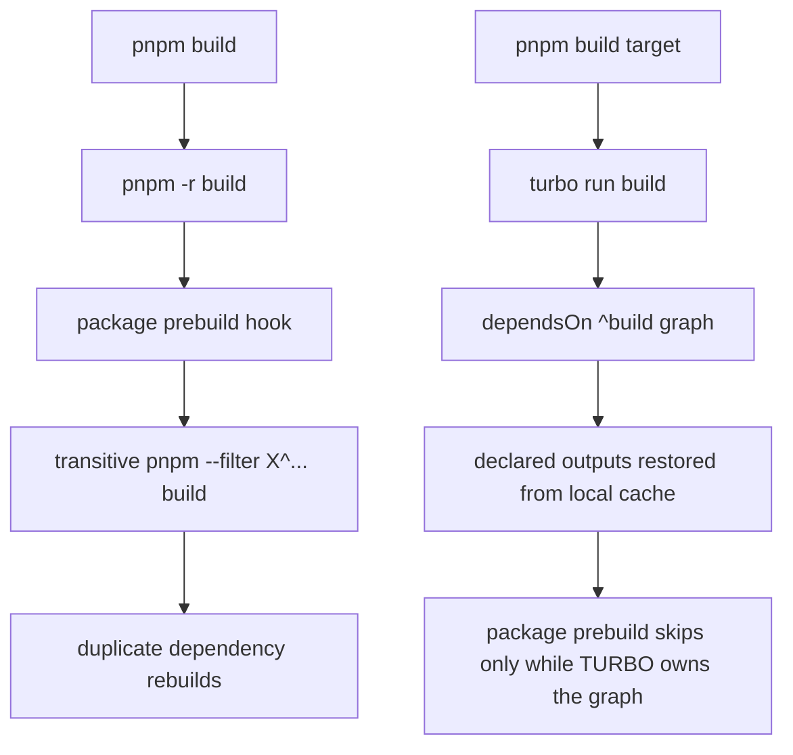

# Closeout: RC-C2 turbo build orchestrator

## Think-First

### Problem summary

The repository already reduced warm-build waste with the `DVT_CI` short-circuit
slice, but `pnpm -r build` still has no cache-aware orchestrator of its own.
The workspace graph is therefore rebuilt through package scripts, not through a
single declarative build graph with reusable outputs.

The current cost is not only TypeScript compile time. The larger problem is
that transitive dependency builds are still encoded as implicit `prebuild`
fallbacks in multiple packages and apps, so the root build path cannot use a
shared cache to avoid repeated work across unchanged workspaces.

### Root cause

The repository's build graph is currently owned by package lifecycle hooks
instead of a repository-level build orchestrator. That solved the fresh-worktree
baseline problem recorded on 2026-03-16, but it also means:

- root `build` has no local task cache
- build invalidation is not tracked against shared root config files
- per-package `prebuild` hooks still decide dependency compilation even when a
  top-level orchestrator could own that graph explicitly

### Constraints and invariants

- `AGENTS.md` requires governed startup, no hidden debt, and truthful
  validation/closeout evidence.
- `docs/guides/ai-work-protocol.md` requires think-first and
  pre-implementation material before code/config changes land.
- `docs/planning/state/planning-control-tower.md` requires Lane C planning
  surfaces to stay aligned when an active work item changes.
- `docs/planning/closeouts/20260316-workspace-build-baseline-closeout.md`
  established the current invariant that direct package `build` commands on a
  fresh worktree should still resolve their real workspace dependencies instead
  of assuming prior root builds.
- `docs/planning/closeouts/20260418-local-build-hook-warm-cache-p0-closeout.md`
  intentionally stopped before a larger build-orchestration change and left
  `turbo` as a follow-up, not as an accidental side effect of the P0 slice.
- Official Turborepo documentation confirms three facts this slice depends on:
  task ordering can be declared with `dependsOn: ["^build"]`, build artifacts
  only restore on cache hit when `outputs` are declared, and `TURBO_HASH` is
  exposed inside running tasks for orchestration-aware hook behavior.

### Options considered

- Keep the current `pnpm -r build` model and rely only on the `DVT_CI` warm
  path.
- Introduce `turbo` and delete all `prebuild` hooks, relying entirely on root
  orchestration.
- Introduce `turbo` for the root `build` task and make `prebuild` hooks skip
  only when the package is already being orchestrated by `turbo`.
- Prioritize TypeScript `references` before adding a workspace orchestrator.

Libraries evaluated:

- Turborepo official documentation and task model
- existing repo-local hook helpers under `scripts/`

### Selected option and rationale

Introduce `turbo` for the root `build` task and make the affected `prebuild`
hooks orchestration-aware instead of deleting them outright.

That keeps the slice small and measurable while preserving the 2026-03-16
direct-build invariant for package-level commands. Root `pnpm build` gains a
cache-aware task graph, but `pnpm --filter <pkg> build` still keeps its
dependency fallback when no orchestrator is present.

### Rejected alternatives

- Keep the current model: rejected because it leaves the repository without any
  build-task cache and preserves the core duplication that this follow-up is
  supposed to remove.
- Delete `prebuild` hooks entirely: rejected for this slice because it would
  regress direct package builds on fresh worktrees and reopen the baseline
  issue fixed on 2026-03-16.
- TypeScript `references` first: rejected because the measured waste is still
  dominated by graph orchestration, not by compiler-internal incremental reuse
  alone.

### Current state and target

## Pre-Implementation Brief

- Mode: `Full`
- Scope:
  - add `turbo` as the root build orchestrator for `build` only
  - add a root `turbo.json` with the minimal build graph and cache outputs
  - add an orchestration-aware helper for `prebuild` hooks
  - update the 11 redundant `prebuild` hooks so direct package builds still
    work outside `turbo`
  - align docs, Lane C planning, and ARC evidence/risk surfaces for the slice
- Touched files or paths:
  - `package.json`
  - `pnpm-lock.yaml`
  - `.gitignore`
  - `turbo.json`
  - `scripts/skip-prebuild-if-orchestrated.cjs`
  - `apps/web/turbo.json`
  - `apps/web/vite.config.ts`
  - `apps/web/src/app/bootstrap/appBootstrapScreen.ts`
  - `apps/web/src/app/bootstrap/appBootstrapScreen.test.ts`
  - `scripts/README.md`
  - `docs/guides/testing-and-ci-capabilities.md`
  - `apps/api/package.json`
  - `apps/lineage-worker/package.json`
  - `apps/outbox-worker/package.json`
  - `apps/projector-worker/package.json`
  - `apps/temporal-worker/package.json`
  - `packages/@dvt/adapter-postgres/package.json`
  - `packages/@dvt/adapter-temporal/package.json`
  - `packages/@dvt/delivery/package.json`
  - `packages/@dvt/engine/package.json`
  - `packages/@dvt/run-domain/package.json`
  - `packages/@dvt/traceability-service/package.json`
  - `docs/planning/state/agent-lane-c.yaml`
  - ARC evidence/risk docs for the adapter/engine path touches
- Expected outcome:
  - root `pnpm build` uses `turbo run build`
  - unchanged workspace builds can restore cached outputs locally
  - direct package `build` commands still retain their existing fallback
    dependency builds when not run under `turbo`
  - the slice does not expand into `typecheck`, `test`, remote cache, or
    TypeScript project references
- Risks and mitigations:
  - risk: root shared config changes could be omitted from the `turbo` hash
  - mitigation: declare the relevant root `tsconfig` and helper files under
    `globalDependencies`
  - risk: direct package builds could regress if `prebuild` is removed too
    aggressively
  - mitigation: skip `prebuild` only when `TURBO_HASH` proves `turbo` already
    owns the task graph
  - risk: adapter-temporal runtime-dependency preparation could be weakened
  - mitigation: limit the orchestration-aware skip to `prebuild`; keep the
    explicit integration-preparation commands intact
- Out-of-scope items:
  - migrating `typecheck`, `test`, or docs tasks to `turbo`
  - remote cache setup
  - TypeScript `references` rollout
  - switching heavy packages to `tsup`/`swc`
- Validation plan:
  - `pnpm build`
  - `pnpm --filter @dvt/web typecheck`
  - `pnpm --filter @dvt/web test`
  - `cmd /c "set VITE_APP_BUILD_DATE=2026-04-18T10:20:00.000Z&& pnpm --filter @dvt/web build"`
  - `pnpm exec turbo run build --filter=@dvt/web --force`
  - `pnpm exec turbo run build --filter=@dvt/web`
  - `pnpm --filter @dvt/web build`
  - targeted direct package builds for the touched `prebuild` workspaces
  - `pnpm docs:status:generate`
  - `pnpm docs:sync`
  - `pnpm docs:workboard:generate`
  - `pnpm docs:arc:evidence:check`
  - `pnpm verify:prepush`
- Test coverage plan:
  - this slice changes build orchestration, so validation will cover both
    orchestrated root builds and direct package `build` entrypoints
  - record the known `dvt-outbox-worker` build baseline explicitly if it still
    remains the first blocker under the new root path
- Libraries evaluated:
  - Turborepo official docs selected
  - no alternate orchestrator adopted in this slice

## Implementation Log

- Added `turbo` `2.9.6` as a root dev dependency and replaced the root
  `build` entrypoint with `turbo run build`.
- Added `turbo.json` with the minimal `build` graph, `dependsOn: ["^build"]`,
  cacheable `outputs`, and the root shared files that must invalidate build
  tasks.
- Added `apps/web/turbo.json` so the web build hash includes package-local
  `.env*` files and `VITE_*` variables that Vite injects into the bundle.
- Removed the synthetic `@dvt/web` build timestamp so the Turbo cache does not
  replay stale bundle metadata as if it were a fresh build, and hid the
  bootstrap build-date line when no explicit metadata is injected.
- Moved `VITE_APP_BUILD_DATE` onto the same `loadEnv(...)` path as the other
  web `VITE_*` values, while preserving one-shot shell-env injection as an
  explicit fallback.
- Added `scripts/skip-prebuild-if-orchestrated.cjs` so `prebuild` hooks skip
  only when `DVT_CI` or a real `TURBO_HASH` proves an orchestrator already owns
  the graph.
- Updated the affected app/library `prebuild` hooks to use the new helper while
  keeping direct package `build` commands safe outside `turbo`.
- Updated `Test Suite` full-root build steps to call `pnpm build`, so merge
  gates now exercise the same Turbo-backed root build path used locally instead
  of the retired `pnpm -r build` route.
- Updated the shared test-scope routing so `turbo.json` and
  `scripts/skip-prebuild-if-orchestrated.cjs` both classify as `root_config`,
  preventing Turbo-graph or orchestration-helper PRs from skipping the
  Turbo-backed `Test Suite` lane.
- Updated the shared workflow-scope policy so `turbo.json` classifies as both
  `any_code` and `workspace_global`, keeping the `CI - Code Quality`
  affected-workspace matrix aligned with the same root Turbo graph changes.
- Updated operator docs so the repo documents both the Turbo-backed root build
  path and the direct-package fallback invariant that must remain true.

## Validation

- `pnpm build`:
  passed on the current mainline integration baseline, so the Turbo-backed root
  build path is green both locally and in the `Test Suite` full-root lanes.
- `computeBooleanScope(...)` over `turbo.json` in workflow scope and
  `computeWorkspaceMatrix(['turbo.json'])`:
  passed, returning `any_code=true` and a full affected-workspace matrix.
- `computeBooleanScope(...)` over `turbo.json` and
  `scripts/skip-prebuild-if-orchestrated.cjs`:
  passed, returning `any_test=true` and `root_config=true` for both files.
- `pnpm --filter @dvt/web typecheck`: passed
- `pnpm --filter @dvt/web test`:
  passed, including the bootstrap metadata coverage that now hides the build
  date row unless `VITE_APP_BUILD_DATE` is injected explicitly.
- `pnpm --filter @dvt/web build` with a temporary
  `apps/web/.env.production.local` carrying `VITE_APP_BUILD_DATE`:
  passed, and the built bundle contained the injected ISO timestamp.
- `cmd /c "set VITE_APP_BUILD_DATE=2026-04-18T10:20:00.000Z&& pnpm --filter
@dvt/web build"`:
  passed, and the built bundle contained the injected ISO timestamp.
- `pnpm exec turbo run build --filter=dvt-api`:
  passed; repeated execution restored the entire filtered graph from the local
  Turbo cache.
- `pnpm exec turbo run build --filter=@dvt/web --force`:
  passed.
- `pnpm exec turbo run build --filter=@dvt/web`:
  passed; after mutating a temporary `apps/web/.env.production.local`, the web
  task reran as a cache miss and the emitted bundle switched from
  `tenant-3010` to `tenant-4010`, confirming the package-local env inputs now
  participate in the Turbo hash.
- `pnpm --filter @dvt/web build`: passed
- `pnpm --filter dvt-api build`: passed
- `pnpm --filter dvt-lineage-worker build`: passed
- `pnpm --filter dvt-outbox-worker build`:
  passed on the current mainline integration baseline; the earlier `TS2532`
  blocker was resolved independently after the original Turbo slice landed
- `pnpm --filter dvt-projector-worker build`: passed
- `pnpm --filter dvt-temporal-worker build`: passed
- `pnpm --filter @dvt/adapter-postgres build`: passed
- `pnpm --filter @dvt/adapter-temporal build`: passed
- `pnpm --filter @dvt/delivery build`: passed
- `pnpm --filter @dvt/engine build`: passed
- `pnpm --filter @dvt/run-domain build`: passed
- `pnpm --filter @dvt/traceability-service build`: passed
- `pnpm docs:status:generate`: passed
- `pnpm docs:sync`: passed
- `pnpm docs:workboard:generate`: passed
- `pnpm docs:arc:evidence:check`: passed
- `pnpm docs:gov:locations`: passed
- `pnpm verify:prepush`: passed

## Outcome

Root `pnpm build` is now cache-aware through `turbo`, direct package `build`
commands still retain the package-local dependency fallback that the
2026-03-16 baseline required, and the `Test Suite` merge gate now exercises the
same Turbo-backed root build path instead of the retired `pnpm -r build`
variant. The `@dvt/web` target now invalidates correctly on package-local env
changes, including explicit build metadata, without degrading the bootstrap
metadata UX to `Build unknown`.

## Debt And Stub Check

- No new debt entry was introduced outside the explicit residual-risk record for
  Turbo cache/orchestration drift.
- No rule, hook, or quality gate was disabled or relaxed.
- No stub, placeholder, or fake implementation was added.
