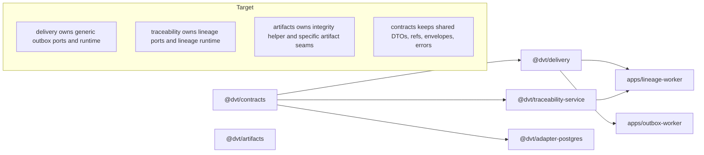

# Closeout: RC-G1-C owner-package migration

## Think-First

### Problem summary

`RC-G1-B` removed engine-owned behavioral ports from the active shared-kernel
surface, but the remaining delivery, lineage, and artifact boundaries are still
physically mixed inside `@dvt/contracts`.

That leaves three forms of ownership drift in the live repo state:

- delivery-owned outbox behavior is still defined and re-exported by
  `@dvt/contracts`
- lineage-owned runtime and contracts are split between `@dvt/contracts`,
  `@dvt/delivery`, and `@dvt/traceability-service`
- the generic artifact-store port family and integrity helper still present the
  shared kernel as the owner of artifact behavior

### Root cause

The repository already froze the semantic taxonomy in the active
`RC-G1` proposal, but the physical package graph still reflects historical
convenience:

- shared serializable shapes and owner-local behavioral ports were authored in
  the same files
- owner packages such as `@dvt/delivery` and `@dvt/traceability-service`
  re-exported contracts from `@dvt/contracts` instead of becoming the canonical
  source of truth
- lineage-specific runtime logic accumulated under `@dvt/delivery` even though
  the bounded-context owner is traceability
- the artifact boundary already evolved toward owner-local specific ports in
  `@dvt/artifacts`, but the generic shared-kernel abstraction was never retired

### Constraints and invariants

- `AGENTS.md` requires docs-first execution, no hidden debt, no compatibility
  shortcuts disguised as completion, and concrete validation evidence.
- `docs/guides/ai-work-protocol.md` requires the think-first and
  pre-implementation brief to exist before code moves start.
- `docs/planning/state/planning-control-tower.md` requires the active lane
  tracker and proposal to stay synchronized when an active work item changes.
- `docs/planning/proposals/mandatory/runtime-and-contracts/contracts-domain-ownership-migration-plan-20260327.md`
  already freezes the binary taxonomy: contracts either `stay shared` or
  `move to owner`.
- `ADR-0018` requires serializable cross-package shapes to remain in
  `@dvt/contracts` and behavioral ports to live in the owning domain package.
- `ADR-0034` requires bounded contexts to communicate through shared contracts,
  refs, messages, or composition roots rather than ownerless convenience
  barrels.
- `@dvt/contracts`, `@dvt/adapter-postgres`, and the touched `@dvt/engine`
  helpers are ARC-2 paths, so evidence and risk updates are mandatory before
  PR closeout.

### Options considered

- Keep the current mixed ownership and add more lint guidance only.
- Execute one umbrella cutover that moves delivery, lineage, and artifact
  surfaces in a single unsequenced patch.
- Execute the migration as three sequenced owner-package cuts: delivery,
  lineage or traceability, then artifacts or hardening.

Libraries evaluated:

- None. This slice is an ownership migration inside the existing bounded
  contexts, not a library adoption problem.

### Selected option and rationale

Execute `RC-G1-C` as three sequenced owner-package cuts that preserve the
frozen taxonomy while keeping serializable shared DTOs in `@dvt/contracts`.

This is the smallest truthful implementation shape because:

- delivery can become the canonical owner of generic outbox behavior without
  waiting on the lineage move
- traceability can then take full ownership of lineage runtime and contracts
  without leaving a compatibility alias inside `@dvt/delivery`
- artifacts can retire the obsolete generic port family after the live runtime
  callers are already cut over to owner-local surfaces

### Rejected alternatives

- Lint-only hardening was rejected because the behavioral ports would still be
  physically hosted in the wrong package and the package graph would continue to
  lie about ownership.
- A one-shot umbrella move was rejected because it would mix three different
  bounded-context corrections into one rollback unit and make residual import
  closure harder to prove.
- Recreating the generic artifact-store port under `@dvt/artifacts` was
  rejected because the current owner package already exposes more specific
  artifact boundaries and the generic contract no longer represents the live
  design.

### Current state and target

## Pre-Implementation Brief

- Mode: `Full`
- Scope:
  - move delivery-owned behavioral ports from `@dvt/contracts` to
    `@dvt/delivery`
  - move lineage-owned behavioral ports and lineage runtime from
    `@dvt/contracts` plus `@dvt/delivery` to `@dvt/traceability-service`
  - retire the generic shared-kernel artifact-store contract and move
    `validateArtifactIntegrity` into `@dvt/artifacts`
  - update governed downstream consumers, export maps, lint guards, planning,
    evidence, and risk surfaces
- Touched files or paths:
  - `packages/@dvt/contracts/**`
  - `packages/@dvt/delivery/**`
  - `packages/@dvt/traceability-service/**`
  - `packages/@dvt/artifacts/**`
  - `packages/@dvt/adapter-postgres/**`
  - `packages/@dvt/engine/src/state/**`
  - `apps/outbox-worker/**`
  - `apps/lineage-worker/**`
  - `eslint.config.cjs`
  - `docs/planning/proposals/mandatory/runtime-and-contracts/contracts-domain-ownership-migration-plan-20260327.md`
  - `docs/planning/state/agent-lane-a.yaml`
  - `docs/evidence/**`
  - `docs/risk-register/quality/R-20260402-RC-G1-CONTRACT-OWNERSHIP-EXECUTION-DRIFT.yaml`
- Expected outcome:
  - `@dvt/delivery` is the canonical import surface for generic delivery
    behavior ports
  - `@dvt/traceability-service` is the canonical import surface for lineage
    behavior ports and lineage runtime
  - `@dvt/contracts` stops exporting delivery-owned ports, lineage-owned ports,
    and the generic artifact-store contract
  - governed packages cannot reintroduce those imports from `@dvt/contracts`
- Risks and mitigations:
  - risk: shared and owner-local exports could coexist and hide residual drift
  - mitigation: remove legacy root exports and add `no-restricted-imports`
    guards in the governed consumers
  - risk: lineage runtime could remain split between delivery and traceability
  - mitigation: move the runtime classes physically into
    `@dvt/traceability-service` and cut all production imports in the same
    slice
  - risk: artifact integrity behavior could change while moving helpers
  - mitigation: keep `ArtifactStoreError` unchanged and preserve negative-path
    tests for digest and size mismatch
- Out-of-scope items:
  - planner-private ownership migration under `RC-G1-D`
  - broader shared error-contract relocation beyond the already-scoped
    `ArtifactStoreError` decision
  - new wrapper packages or compatibility barrels
- Validation plan:
  - `pnpm --filter @dvt/delivery build`
  - `pnpm --filter @dvt/delivery test`
  - `pnpm --filter @dvt/traceability-service build`
  - `pnpm --filter @dvt/traceability-service test`
  - `pnpm --filter @dvt/artifacts build`
  - `pnpm --filter @dvt/artifacts test`
  - `pnpm --filter @dvt/adapter-postgres build`
  - `pnpm --filter @dvt/adapter-postgres test`
  - `pnpm --filter dvt-outbox-worker typecheck`
  - `pnpm --filter dvt-outbox-worker test`
  - `pnpm --filter dvt-lineage-worker typecheck`
  - `pnpm --filter dvt-lineage-worker test`
  - `$env:GIT_BASE='origin/main'; $env:GIT_HEAD='HEAD'; node tools/ci/arc-check.mjs`
  - `pnpm docs:status:generate`
  - `pnpm docs:sync`
  - `pnpm docs:workboard:generate`
  - `pnpm verify:prepush`
- Test coverage plan:
  - keep the existing delivery retry and dead-letter behavior coverage
  - keep lineage retry, dead-letter, auto-replay, and fail-open observer
    coverage after the runtime move
  - preserve artifact integrity negative-path coverage for digest and size
    mismatch
  - add import-guard coverage through governed ESLint restrictions
- Libraries evaluated:
  - None evaluated; this is an owner-package migration inside the existing
    repository architecture

## Implementation Results

- Delivery ownership cutover:
  - added `packages/@dvt/delivery/src/contracts.ts` as the canonical home for
    `IOutboxStorage`, `IEventBus`, `OutboxWorkerObserver`,
    `OutboxTickResult`, `OutboxClaimSelection`,
    `OutboxFailureDisposition`, and `MAX_OUTBOX_ATTEMPTS`
  - removed the delivery-owned behavioral surface from
    `packages/@dvt/contracts/src/contracts/engine/IOutboxStorage.v1.ts`
    and from the owner-of-behavior position in the root `@dvt/contracts`
    barrel; the root barrel still re-exports `IOutboxStorage.v1` as a DTO-only
    shared seam, not as the canonical owner-local delivery contract surface
  - cut `@dvt/adapter-postgres`, `@dvt/adapter-temporal`,
    `@dvt/engine`, and `apps/outbox-worker` over to `@dvt/delivery`
- Lineage and traceability ownership cutover:
  - expanded `packages/@dvt/traceability-service/src/lineage/contracts.ts`
    to own lineage runtime contracts and retry policy
  - moved `LineageWorkerRuntime` and `LineageOutboxObserver` into
    `@dvt/traceability-service`
  - cut `@dvt/adapter-postgres`, `apps/lineage-worker`, and lineage tests
    over to `@dvt/traceability-service`
  - removed the shared-kernel lineage behavioral-port export and kept
    `@dvt/delivery` focused on generic outbox behavior only
- Artifacts retirement and hardening:
  - retired `packages/@dvt/contracts/src/ports/artifact-store.ts`
  - moved `validateArtifactIntegrity` into
    `packages/@dvt/artifacts/src/runtime/validateArtifactIntegrity.ts`
  - kept `ArtifactStoreError` in `@dvt/contracts` and preserved negative-path
    tests for digest and size mismatch
- Regression hardening:
  - extended `eslint.config.cjs` so governed delivery, traceability,
    adapter, engine, and worker paths fail if delivery-owned,
    lineage-owned, or retired artifact-store imports reappear through
    `@dvt/contracts`

## Validation Results

- `pnpm --filter @dvt/contracts build`
  - Passed.
- `pnpm --filter @dvt/contracts test`
  - Passed.
- `pnpm --filter @dvt/delivery build`
  - Passed.
- `pnpm --filter @dvt/delivery test`
  - Passed.
- `pnpm --filter @dvt/traceability-service build`
  - Passed.
- `pnpm --filter @dvt/traceability-service test`
  - Passed.
- `pnpm --filter @dvt/artifacts build`
  - Passed.
- `pnpm --filter @dvt/artifacts test`
  - Passed.
- `pnpm --filter @dvt/adapter-postgres build`
  - Passed.
- `pnpm --filter @dvt/adapter-postgres test`
  - Passed.
- `pnpm --filter @dvt/adapter-temporal build`
  - Passed.
- `pnpm --filter @dvt/adapter-temporal test`
  - Passed.
- `pnpm --filter @dvt/engine build`
  - Passed.
- `pnpm --filter @dvt/engine test`
  - Passed.
- `pnpm --filter dvt-outbox-worker typecheck`
  - Passed.
- `pnpm --filter dvt-outbox-worker test`
  - Passed.
- `pnpm --filter dvt-lineage-worker typecheck`
  - Passed.
- `pnpm --filter dvt-lineage-worker test`
  - Passed.
- `pnpm exec eslint "packages/@dvt/contracts/src/**/*.ts" "packages/@dvt/contracts/test/**/*.ts" "packages/@dvt/delivery/src/**/*.ts" "packages/@dvt/delivery/test/**/*.ts" "packages/@dvt/traceability-service/src/**/*.ts" "packages/@dvt/traceability-service/test/**/*.ts" "packages/@dvt/artifacts/src/**/*.ts" "packages/@dvt/artifacts/test/**/*.ts" "packages/@dvt/adapter-postgres/src/**/*.ts" "packages/@dvt/adapter-postgres/test/**/*.ts" "packages/@dvt/adapter-temporal/src/**/*.ts" "packages/@dvt/engine/src/**/*.ts" "apps/outbox-worker/src/**/*.ts" "apps/outbox-worker/test/**/*.ts" "apps/lineage-worker/src/**/*.ts" "apps/lineage-worker/test/**/*.ts" --ignore-pattern vitest.config.ts --max-warnings 0`
  - Passed.
- `$env:GIT_BASE='origin/main'; $env:GIT_HEAD='HEAD'; node tools/ci/arc-check.mjs`
  - Executed successfully, but returned `ARC-0` because it inspects
    `origin/main...HEAD` rather than the uncommitted worktree.
  - ARC-2 evidence and the risk update were still added because this slice
    touches `packages/@dvt/contracts/**` and `packages/@dvt/adapter-postgres/**`.
- `pnpm docs:status:generate`
  - Passed.
- `pnpm docs:sync`
  - Passed.
- `pnpm docs:workboard:generate`
  - Passed.
- `pnpm docs:arc:evidence:check`
  - Passed.
- `pnpm exec markdownlint-cli2 "docs/planning/proposals/mandatory/runtime-and-contracts/contracts-domain-ownership-migration-plan-20260327.md" "docs/planning/closeouts/20260419-rc-g1-c-owner-package-migration-closeout.md" "docs/evidence/ED-20260419-rc-g1-c-owner-package-migration.md"`
  - Passed.
- `pnpm verify:prepush`
  - Passed.
  - The changed-only checks inside `verify:prepush` reported no committed diff,
    so the targeted package lint/type/test validation above is the real
    worktree evidence for this uncommitted slice.

## Completion Status

- `RC-G1-C` is closed.
- Remaining live `RC-G1` execution is `RC-G1-D`.
- Post-merge documentation truth-sync is closed separately under
  `RC-G1-C-TRUTH-SYNC`.

## No-Debt Evidence

- No compatibility barrels or dual-export stopgaps were added.
- No hooks were bypassed and no validation rules were relaxed.
- No TODO/FIXME placeholders, stubs, or fake implementations were introduced.
