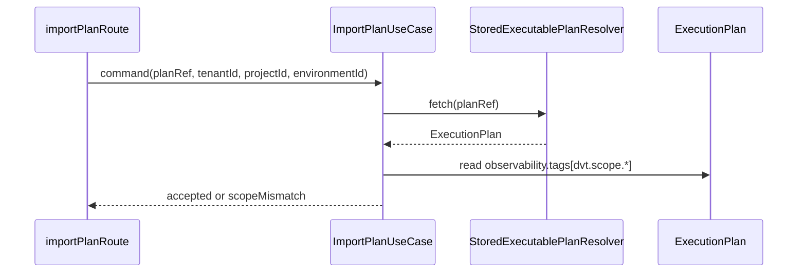
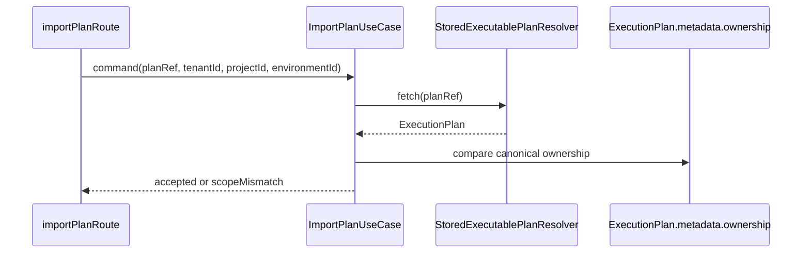

# Closeout: TF-A1-C13 import ownership canonicalization

## Think-First Analysis

### Problem summary

`ImportPlanUseCase` still treats `plan.observability.tags['dvt.scope.*']` as
the effective ownership boundary for imported plans. That means telemetry data
is acting as authorization truth.

The surrounding backend has already moved toward Fowler-style remote facades
and explicit application boundaries, but import still depends on a secondary
signal that was introduced for diagnosis rather than policy.

### Root cause

Preview currently writes scope only into plan observability tags. The canonical
`ExecutionPlan` metadata does not carry first-class ownership, and persisted
plan records do not expose tenant, project, or environment as top-level plan
identity fields.

Because import fetches only the resolved `ExecutionPlan`, the easiest local
check became tag decoding inside the application service. That was expedient,
but it left ownership implicit and transport-shaped.

### Governing constraints

- `AGENTS.md`: inventory-first execution, no hidden debt, no stub policy, and
  validation-backed completion.
- `docs/guides/ai-work-protocol.md`: think-first analysis and
  pre-implementation brief must exist before code changes for an architectural
  slice.
- `docs/architecture/reference-architecture.md`: HTTP routes remain thin
  adapters over explicit application services and owner-local seams.
- `docs/adr/ADR-0012-plan-integrity-ownership.md`: plan authority must stay
  explicit and auditable at the plan boundary.
- `docs/adr/ADR-0034-bounded-context-boundaries-and-communication-rules.md`:
  cross-boundary contracts must not smuggle meaning through incidental fields.
- `docs/planning/reviews/architecture-and-governance/20260419-plan-route-boundary-remediation-review.md`:
  this slice must replace tag-derived import ownership with canonical plan
  metadata or an explicit ownership-policy port.
- Planner canonicalization invariants from `packages/@dvt/planner/src/domain/Planner.ts`
  and `packages/@dvt/planner/src/domain/PlanAssembler.ts`: `planId` remains
  derived from `planCore`, so post-hash metadata may be added only if it does
  not become part of the canonical core hash.

### Current state

### Options considered

1. Keep decoding `observability.tags` inside `ImportPlanUseCase`.
2. Move the same tag decoding behind a new ownership-policy port and leave plan
   contracts unchanged.
3. Introduce first-class optional ownership metadata on `ExecutionPlan`,
   populate it where preview creates persisted plans, and make import enforce
   ownership from that metadata instead of telemetry tags.

### Selected option and rationale

Option 3.

It is the smallest change that actually upgrades the boundary. Ownership
becomes explicit in the canonical plan contract, import reads first-class plan
metadata instead of observability, and the planner/store shape does not need a
new table or top-level persistence column for this slice because the canonical
plan JSON is already the persisted authority.

It also preserves determinism: ownership lives in post-hash plan metadata, not
in the canonical plan core used for `planId`.

### Rejected alternatives

- Option 1 was rejected because telemetry must not stay the ownership source of
  truth.
- Option 2 was rejected because moving tag decoding behind a port would improve
  SRP locally but would not actually canonicalize ownership. The drift would be
  hidden, not removed.

## Pre-Implementation Brief

- Mode: Full
- Scope:
  - `packages/@dvt/contracts/src/contracts/planner/ExecutionPlan.v1.ts`
  - `packages/@dvt/contracts/src/schema-packs/execution-plan.ts`
  - planner envelope and assembly paths under `packages/@dvt/planner/src/`
  - `apps/api/src/application/services/PreviewPlanUseCase.ts`
  - `apps/api/src/application/services/ImportPlanUseCase.ts`
  - focused API and contracts tests/fixtures
  - `docs/planning/state/agent-lane-a.yaml`
  - this closeout
- Expected outcome:
  - preview-generated plans carry first-class ownership metadata
  - import enforces ownership from canonical plan metadata
  - observability tags may remain for diagnostics, but they are no longer the
    effective domain boundary
  - negative tests prove mismatched tags do not control import authorization
- Risks and mitigations:
  - Risk: contract drift across planner, API, and fixtures.
    Mitigation: change the canonical `ExecutionPlan` schema first and update
    touched fixtures plus validation suites in the same slice.
  - Risk: accidental `planId` drift if ownership is folded into plan core.
    Mitigation: keep ownership in post-hash metadata only and preserve existing
    planner determinism checks.
  - Risk: compile-generated plans without ownership become invalid.
    Mitigation: keep ownership optional in the contract and let import reject
    plans that do not declare ownership.
- Out of scope:
  - new plan-store columns or storage-schema changes
  - compile-boundary vocabulary cleanup (`TF-A1-C14`)
  - importer support for ownershipless plans
- Validation plan:
  - `pnpm exec eslint --max-warnings 0 apps/api/src/application/services/ImportPlanUseCase.ts apps/api/src/application/services/PreviewPlanUseCase.ts apps/api/test/entrypoints/http/importPlanRoute.test.ts apps/api/test/entrypoints/http/planRouteFixtures.ts packages/@dvt/contracts/src/contracts/planner/ExecutionPlan.v1.ts packages/@dvt/contracts/src/schema-packs/execution-plan.ts packages/@dvt/contracts/test/fixtures/planner-contract.fixtures.ts packages/@dvt/contracts/test/validation/execution-plan.ts packages/@dvt/planner/src/application/PlannerEnvelopeMapper.ts packages/@dvt/planner/src/domain/types.ts packages/@dvt/planner/src/domain/PlanAssembler.ts packages/@dvt/planner/test/unit/planner-facade.test.ts`
  - `pnpm --filter @dvt/contracts test -- test/validation.test.ts test/planner.contract.test.ts test/plan-store-records-shape-sync.test.ts`
  - `pnpm --filter @dvt/planner test -- test/unit/planner-facade.test.ts test/unit/determinism.test.ts`
  - `pnpm --filter dvt-api typecheck`
  - `pnpm --filter dvt-api test -- test/entrypoints/http/importPlanRoute.test.ts`
  - `pnpm docs:workboard:generate`
  - `pnpm docs:sync`
  - `pnpm verify:prepush`
- Test coverage plan:
  - import accepts when metadata ownership matches scope even if tags differ
  - import rejects when ownership metadata mismatches even if tags match
  - contracts validation accepts owned and ownershipless plans as intended
  - planner determinism remains green because ownership is outside plan core
- Libraries evaluated:
  - None evaluated. This slice is a contract and boundary correction inside the
    governed repository architecture.

## Target state

## Implementation Summary

- Added first-class optional `ownership` metadata to the canonical
  `ExecutionPlan` and planner input envelope so tenant/project/environment
  ownership is part of the persisted plan contract instead of being inferred
  from telemetry tags.
- Updated planner assembly plus API planner-envelope construction so preview,
  planner-backed start-run, and scoped compile flows propagate ownership into
  post-hash plan metadata without changing `planId` determinism.
- Reworked `ImportPlanUseCase` and import-route tests to enforce canonical
  ownership metadata. Negative coverage now proves that matching
  `observability.tags` do not authorize import when ownership metadata
  disagrees, and mismatched tags do not block import when metadata agrees.

## Validation Run

- `pnpm exec eslint --max-warnings 0 apps/api/src/application/services/ImportPlanUseCase.ts apps/api/src/application/services/PlannerBackedStartRunUseCase.ts apps/api/src/application/services/PreviewPlanUseCase.ts apps/api/src/application/services/externalCompilePlannerEnvelopeMapper.ts apps/api/src/application/services/resolveCanonicalPlannerInputEnvelope.ts apps/api/test/entrypoints/http/importPlanRoute.test.ts apps/api/test/entrypoints/http/planRouteFixtures.ts apps/api/test/entrypoints/http/previewPlanRoute.outcomes.test.ts packages/@dvt/contracts/src/contracts/planner/ExecutionPlan.v1.ts packages/@dvt/contracts/src/index.ts packages/@dvt/contracts/src/schema-packs/execution-plan.ts packages/@dvt/contracts/src/schema-packs/planner-build.ts packages/@dvt/contracts/test/fixtures/planner-contract.fixtures.ts packages/@dvt/contracts/test/planner.contract.test.ts packages/@dvt/contracts/test/validation/execution-plan.ts packages/@dvt/planner/src/application/PlannerEnvelopeMapper.ts packages/@dvt/planner/src/domain/PlanAssembler.ts packages/@dvt/planner/src/domain/types.ts packages/@dvt/planner/test/unit/determinism.test.ts`
  - Passed.
- `pnpm --filter @dvt/contracts test -- test/validation.test.ts test/planner.contract.test.ts test/plan-store-records-shape-sync.test.ts`
  - Passed.
- `pnpm --filter @dvt/planner test -- test/unit/planner-facade.test.ts test/unit/determinism.test.ts`
  - Passed.
- `pnpm --filter dvt-api typecheck`
  - Passed.
- `pnpm --filter dvt-api test -- test/entrypoints/http/importPlanRoute.test.ts test/entrypoints/http/previewPlanRoute.outcomes.test.ts`
  - Passed.
- `pnpm --filter dvt-api test:arch`
  - Passed.
- `pnpm docs:workboard:generate`
  - Passed.
- `pnpm docs:sync`
  - Passed.
- `pnpm verify:prepush`
  - Passed.

## No-Debt / No-Stub Evidence

- No rule was disabled or relaxed.
- No hook was bypassed.
- No stub, placeholder, or fake success path was introduced.
- Observability tags remain optional diagnostic metadata only; the ownership
  decision now flows through first-class plan metadata.
