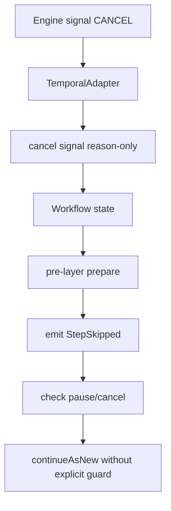
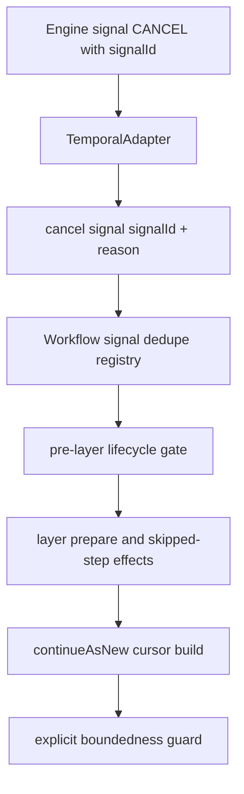

# Closeout: AR-D plan-pointer follow-up hardening

## Think-First Analysis

### Problem summary

The active `AR-D-PLAN-POINTER` line improved the runtime boundary by replacing
full-plan workflow input with `PlanRef` plus a compact cursor and by splitting
the workflow into narrower seams.

That improvement is real, but three contract-level drifts remain:

- `CANCEL` still travels through Temporal without the canonical `signalId`
- `continueAsNew` still rolls over an inline cursor without an explicit payload
  guard
- pre-layer lifecycle is still evaluated after skipped-step side effects are
  prepared

Together those gaps keep the slice below the maturity bar defined by the
proposal and the signal/cancellation ADRs.

### Root cause

The first cut optimized structure and start payload size first:

- split the God workflow file
- move segment resolution behind an activity seam
- remove `ExecutionPlan` from workflow start input

That left residual policy hardening unfinished:

- `CANCEL` kept its old provider-specific argument shape
- rollover state remained "compact but unchecked"
- the layer loop preserved the old sequencing even after decomposition

This is not a formatting issue. It is leftover policy ownership drift.

### Governing constraints

- `AGENTS.md`: inventory-first execution, no hidden debt, no stub policy,
  validation-backed completion
- `docs/guides/ai-work-protocol.md`: think-first analysis, pre-implementation
  brief, and governed closeout before and after implementation
- `docs/planning/proposals/mandatory/runtime-and-contracts/ar-d-plan-pointer-workflow-input-hardening-plan-20260420.md`:
  workflow input and rollover must stay bounded and must not drift back toward
  durable whole-run state
- `docs/adr/ADR-0003-execution-model.md`: lifecycle authority stays inside DVT,
  not in UI or provider accident
- `docs/adr/ADR-0007_RunCancellation.md`: `CANCEL` is runtime-owned lifecycle
  and must stay idempotent
- `docs/adr/ADR-0008_Signal_Idempotency.md`: signal semantics require stable
  `signalId` handling
- `docs/adr/ADR-0014-run-driven-adapter-model.md`: adapter owns runtime dispatch
  seams, but not contract drift
- `docs/architecture/components/engine/contracts/engine/SignalsAndAuth.v1.md`:
  canonical signal tuple is `(tenantId, runId, signalId)` for idempotent
  handling

### Options considered

#### Option 1. Leave the review findings as follow-up debt

Rejected.

That would keep a known contractual mismatch in the active workflow seam and
would continue shipping a rollover path with no explicit boundedness check.

#### Option 2. Apply a bounded hardening cut in the active line

Selected.

Implement the residual fix as one slice:

- transport `signalId` for `CANCEL` into the workflow signal handler
- deduplicate `CANCEL` with the same control-signal registry already used for
  `PAUSE` and `RESUME`
- add explicit continue-as-new payload boundedness checks at the cursor seam
- evaluate pre-layer lifecycle before skipped-step emission and layer
  preparation

This closes the contractual drift without forcing the larger externalized-state
design into the same slice.

#### Option 3. Jump straight to externalized cursor-state references

Rejected for this slice.

That is the next maturity move, but it is materially larger:

- new state ownership
- new retrieval seam
- wider replay and cutover surface

It should not be smuggled into a fix slice that is supposed to harden the
current line.

### Current-state vs target-state diagrams

## Pre-Implementation Brief

- Mode: Full
- Scope:
  - `packages/@dvt/adapter-temporal/src/TemporalAdapter.ts`
  - `packages/@dvt/adapter-temporal/src/workflows/runPlanWorkflow.signals.ts`
  - `packages/@dvt/adapter-temporal/src/workflows/runPlanWorkflow.layers.ts`
  - `packages/@dvt/adapter-temporal/src/workflows/workflowCursorHelpers.ts`
  - `packages/@dvt/adapter-temporal/src/workflows/runPlanWorkflow.types.ts`
  - `packages/@dvt/adapter-temporal/test/TemporalAdapter.control.test.ts`
  - `packages/@dvt/adapter-temporal/test/workflow-continue-as-new.test.ts`
  - one new focused workflow layer-order test if required
  - this closeout
- Expected outcome:
  - `CANCEL` uses the same canonical signal identity path as the other control
    signals
  - rollover input fails closed when the cursor exceeds the governed limit
  - pause/cancel lifecycle is evaluated before skipped-step side effects for a
    layer
- Risks and mitigations:
  - Risk: changing the cancel signal payload breaks runtime wiring.
    Mitigation: cover adapter dispatch and workflow execution behavior with
    focused tests before implementation.
  - Risk: boundedness guard creates a new failure mode in large runs.
    Mitigation: make the failure explicit and deterministic instead of silently
    risking oversized Temporal payloads.
  - Risk: lifecycle reordering changes event order unexpectedly.
    Mitigation: add an order-focused test around the layer seam and keep the
    change local to pre-layer gating.
- Out of scope:
  - externalizing cursor state behind a reference seam
  - broader engine-side policy-matrix work
  - new replay compatibility lines for drained-deploy slices
- Validation plan:
  - `pnpm exec eslint --max-warnings 0 packages/@dvt/adapter-temporal/src/TemporalAdapter.ts packages/@dvt/adapter-temporal/src/workflows/runPlanWorkflow.signals.ts packages/@dvt/adapter-temporal/src/workflows/runPlanWorkflow.layers.ts packages/@dvt/adapter-temporal/src/workflows/workflowCursorHelpers.ts packages/@dvt/adapter-temporal/src/workflows/runPlanWorkflow.types.ts packages/@dvt/adapter-temporal/test/TemporalAdapter.control.test.ts packages/@dvt/adapter-temporal/test/workflow-continue-as-new.test.ts`
  - `pnpm --filter @dvt/adapter-temporal typecheck:test`
  - `pnpm --filter @dvt/adapter-temporal test -- TemporalAdapter.control.test.ts workflow-continue-as-new.test.ts`
  - `pnpm --filter @dvt/adapter-temporal test`
  - `pnpm docs:sync`
  - `pnpm exec markdownlint-cli2 docs/planning/closeouts/20260420-ar-d-plan-pointer-follow-up-hardening-closeout.md --ignore-path .markdownlintignore --config .markdownlint-cli2.jsonc`
  - `pnpm verify:prepush`
- Test coverage plan:
  - duplicate `CANCEL` delivery with the same `signalId` is ignored as one
    logical control signal
  - `CANCEL` dispatch preserves `reason` while transporting `signalId`
  - continue-as-new input throws on oversized cursor state instead of silently
    serializing it
  - pre-layer lifecycle is checked before skipped-step emission
- Libraries evaluated:
  - None evaluated. This is a local hardening slice inside the Temporal adapter
    seam.

## Implementation Summary

- Hardened `CANCEL` to use the same canonical control-signal identity path as
  `PAUSE` and `RESUME`:
  - `TemporalAdapter.signal()` now forwards `signalId` plus optional `reason`
  - the workflow `cancel` signal now accepts `signalId` and deduplicates
    through the shared `processedControlSignalIds` registry
  - duplicate `CANCEL` delivery preserves the first logical reason instead of
    reapplying a provider-special case
- Added an explicit boundedness guard at the continue-as-new cursor seam:
  - `maxContinueAsNewPayloadBytes` is now resolved as Temporal runtime policy,
    frozen into `RunPlanWorkflowInput`, and parsed by the workflow instead of
    living as a helper-local literal
  - `buildContinueAsNewInput(...)` now fails closed with
    `TEMPORAL_CONTINUE_AS_NEW_PAYLOAD_TOO_LARGE` when the serialized rollover
    input exceeds that governed payload budget
- Reordered the layer loop so pre-layer pause/cancel lifecycle is evaluated
  before skipped-step side effects and layer preparation
- Added focused regression tests for:
  - cancel signal dispatch shape
  - cancel signal deduplication inside workflow handlers
  - pre-layer lifecycle ordering
  - oversized continue-as-new cursor rejection
- Updated the active `AR-D-PLAN-POINTER` proposal note and Lane D task state so
  planning truth reflects the landed hardening work instead of staying at
  `queued / 0%`

## Validation Run

- `pnpm --filter @dvt/adapter-temporal exec vitest run test/TemporalAdapter.control.test.ts test/workflow-continue-as-new.test.ts test/runPlanWorkflow.signals.test.ts test/runPlanWorkflow.layers.order.test.ts`
  - Passed after the red-green cycle.
- `pnpm exec eslint --max-warnings 0 packages/@dvt/adapter-temporal/src/TemporalAdapter.ts packages/@dvt/adapter-temporal/src/workflows/runPlanWorkflow.signals.ts packages/@dvt/adapter-temporal/src/workflows/runPlanWorkflow.layers.ts packages/@dvt/adapter-temporal/src/workflows/workflowCursorHelpers.ts packages/@dvt/adapter-temporal/test/TemporalAdapter.control.test.ts packages/@dvt/adapter-temporal/test/workflow-continue-as-new.test.ts packages/@dvt/adapter-temporal/test/runPlanWorkflow.signals.test.ts packages/@dvt/adapter-temporal/test/runPlanWorkflow.layers.order.test.ts`
  - Passed.
- `pnpm --filter @dvt/adapter-temporal typecheck:test`
  - Passed.
- `pnpm --filter @dvt/adapter-temporal test`
  - Passed. `20` test files, `175` tests green.
- `pnpm docs:workboard:generate`
  - Passed.
- `pnpm docs:status:generate`
  - Passed.
- `pnpm docs:sync`
  - Passed.
- `pnpm exec markdownlint-cli2 docs/planning/closeouts/20260420-ar-d-plan-pointer-follow-up-hardening-closeout.md docs/planning/proposals/mandatory/runtime-and-contracts/ar-d-plan-pointer-workflow-input-hardening-plan-20260420.md docs/planning/state/agent-lane-d.md docs/planning/state/execution-workboard.md docs/planning/state/open-task-route.md docs/planning/status/generated-code-state.md --ignore-path .markdownlintignore --config .markdownlint-cli2.jsonc`
  - Passed.
- `pnpm verify:prepush`
  - Passed in this environment, but the repo's `changed-only` detectors reported
    `No changed files detected` and skipped their diff-scoped checks. The
    package-level lint, typecheck, tests, docs generation, and markdownlint
    commands above are the actual slice evidence.

## No-Debt / No-Stub Evidence

- No rule was disabled or relaxed.
- No hook was bypassed.
- No stub, placeholder, or fake success path was introduced.
- The boundedness fix fails closed instead of silently truncating runtime
  state.
- The workflow still uses a single active `runPlanWorkflow` line; no legacy
  compatibility branch was reintroduced.
